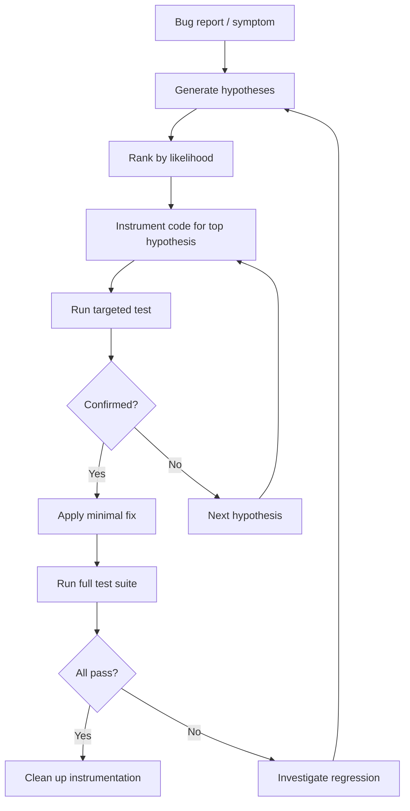
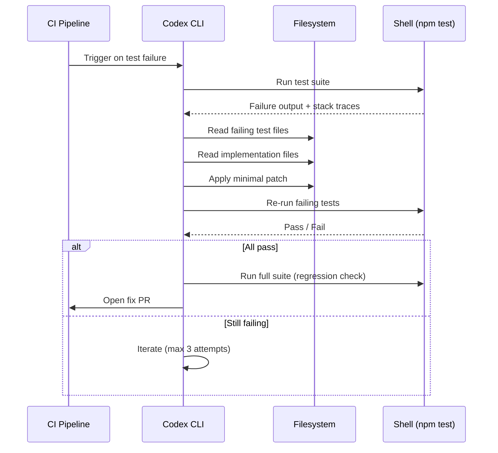

# Debugging with Codex CLI: Systematic Bug-Hunting Patterns for GPT-5.5


---

Debugging is one of the highest-leverage uses of Codex CLI, yet most practitioners treat it as an afterthought — pasting a stack trace and hoping for the best. With GPT-5.5's improved planning, 60% fewer hallucinations, and stronger multi-step tool coordination[^1], the CLI can now orchestrate full reproduce-diagnose-fix-verify loops that rival a senior engineer's systematic approach. This article codifies six battle-tested debugging patterns, from interactive TUI workflows to fully automated `codex exec` pipelines.

## Why Debugging Is Codex CLI's Sweet Spot

Debugging demands precisely the capabilities where agentic coding tools excel: reading large swathes of unfamiliar code, correlating error messages with source, forming hypotheses, and iterating through fixes until tests pass. The Terminal-Bench 2.0 benchmark — which measures complex command-line workflows requiring planning, iteration, and tool coordination — shows GPT-5.5 at 82.7%, up from ~74% on GPT-5.4[^2]. That 8.7 percentage point improvement translates directly into more reliable fix loops.

Crucially, Codex CLI's architecture supports a tight feedback loop: the agent reads code, runs shell commands, inspects output, applies patches, and re-runs verification — all within a single session[^3]. Unlike IDE copilots that suggest inline completions, Codex CLI can *drive* the entire debugging workflow.

## Pattern 1: The Screenshot-to-Fix Pipeline

GPT-5.5 is a vision-capable model. When debugging visual regressions or UI bugs, skip the prose description and attach a screenshot directly.

```bash
codex -i screenshot-broken-layout.png \
  "The sidebar overlaps the main content on mobile viewports. \
   Find the CSS causing this layout break, fix it, and verify \
   the fix by running the Playwright visual regression test."
```

The `-i` flag accepts PNG, JPEG, GIF, and WebP files[^4]. Codex reads the image alongside your text prompt, identifies the visual discrepancy, locates the responsible styles, and applies the minimal patch. For iOS or Android development, the XcodeBuildMCP or agent-device MCP servers can capture simulator screenshots programmatically, enabling a fully automated reproduce-and-fix loop[^5].

**When to use:** Visual regressions, layout bugs, design implementation mismatches, UI state errors visible in screenshots.

## Pattern 2: The Stack-Trace Diagnosis

The most common debugging workflow starts with a stack trace. Rather than pasting it into a chat window, pipe it directly:

```bash
# Pipe test failure output into Codex
npm test 2>&1 | codex exec "Analyse this test failure. Identify the root \
  cause, fix the code, and re-run the failing test to confirm the fix."
```

Or from within an interactive session, use the `!` shell escape to capture the error context:

```
> !pytest tests/test_payment.py -x 2>&1 | tail -50
> Fix the root cause of this failure. Do not suppress the error — address the underlying logic bug.
```

GPT-5.5's reduced hallucination rate is particularly valuable here[^1]. The model is less likely to propose plausible-looking but incorrect fixes — a problem that compounded in GPT-5.4 sessions, where the agent would sometimes "fix" a test by weakening its assertions rather than correcting the code under test.

**Pro tip:** Include the constraint "Do not modify test assertions unless they are genuinely incorrect" in your AGENTS.md to prevent assertion-weakening as a default strategy.

## Pattern 3: The Hypothesis-Driven Debug Skill

For complex, non-obvious bugs, a structured hypothesis-driven approach outperforms ad-hoc exploration. The community `debug-mode` skill[^6] implements this pattern, but you can replicate the core workflow with a simple prompt structure:

```
I'm seeing [symptom]. The bug is in [scope/module].

1. List 3-5 hypotheses for the root cause, ordered by likelihood.
2. For each hypothesis, describe a minimal test or instrumentation
   that would confirm or eliminate it.
3. Execute the tests in order, stopping when you find the cause.
4. Apply the minimal fix and verify with the full test suite.
```

This pattern leverages GPT-5.5's improved planning capability. The model generates a diagnostic plan, instruments the code with temporary logging, runs the instrumented tests, analyses the output, and converges on the root cause — all without manual intervention.



**When to use:** Race conditions, intermittent failures, cross-module interaction bugs, performance regressions where the root cause is unclear.

## Pattern 4: The Git Bisect Orchestrator

For regressions introduced by a known-bad commit range, Codex CLI can drive a `git bisect` session — combining binary search with intelligent analysis of each candidate commit:

```bash
codex exec "There is a regression in the payment processing module. \
  The last known good commit is abc1234 and the current HEAD is broken. \
  Use git bisect with 'npm test -- --grep payment' as the test command \
  to find the exact commit that introduced the bug. Once found, analyse \
  the diff and apply a targeted fix."
```

The key insight is that Codex runs `git bisect start`, `git bisect good`, `git bisect bad`, and `git bisect run` as shell commands, then reads the bisect output to identify the offending commit. With `full-auto` approval mode, this runs entirely hands-free[^7].

For longer bisect ranges, use reasoning effort `medium` to keep costs proportional to the diagnostic value:

```bash
codex exec --reasoning-effort medium \
  "Git bisect between v2.3.0 and HEAD using 'make test-unit' as the oracle. \
   Report the first bad commit and explain what it broke."
```

**When to use:** Regressions with a clear "it worked before" boundary, test suites that can serve as a bisect oracle, long commit histories where manual bisection is tedious.

## Pattern 5: The Log Analysis Pipeline

Production bugs often arrive as log files rather than reproducible test cases. Codex CLI's ability to read large files and correlate patterns makes it effective for log-based diagnosis:

```bash
codex exec --reasoning-effort high \
  "Read the attached log file at ./logs/error-2026-04-25.log. \
   Identify the sequence of events leading to the OOM kill at 14:23:07. \
   Trace back to the root cause, find the leaking resource in the codebase, \
   and propose a fix with a test that reproduces the leak under controlled conditions."
```

For very large logs, use the `--add-dir` flag to expose the logs directory without copying content into the prompt:

```bash
codex --add-dir ./logs "Analyse the error patterns across all log files \
  from today. Correlate timestamps to identify the cascade failure sequence."
```

GPT-5.5's 400K token context window in Codex[^8] is sufficient for most log analysis tasks. For logs exceeding this, prefilter with standard Unix tools:

```bash
grep -A5 "ERROR\|FATAL" production.log | codex exec \
  "Categorise these errors by root cause and frequency. \
   Identify the top 3 issues and suggest fixes."
```

## Pattern 6: The Automated Reproduce-Fix-Verify Pipeline

For CI/CD integration, the most powerful pattern chains reproduction, diagnosis, fix, and verification into a single `codex exec` invocation:

```bash
codex exec \
  --approval-mode full-auto \
  --sandbox-mode full-network \
  "The test suite is failing on CI. Run 'npm test' to reproduce the failures. \
   For each failing test:
   1. Read the test to understand what it expects
   2. Read the implementation code it exercises
   3. Identify the bug in the implementation (not in the test)
   4. Apply the minimal fix
   5. Re-run the specific test to confirm the fix
   After fixing all failures, run the full suite to check for regressions."
```

This maps directly to the OpenAI Cookbook's autofix pattern[^9], which uses `codex-action@v1` to trigger on CI failures. The critical design decision is *test-outside*: the agent runs the test, reads the output, fixes the code, and re-runs the test — but the test itself serves as the external oracle, preventing the agent from silently accepting broken behaviour[^3].



## Configuring Codex CLI for Debugging Workflows

### AGENTS.md Template for Debug-Heavy Repositories

```markdown
# Debugging Guidelines

## Constraints
- Never weaken test assertions to make tests pass
- Never delete or skip failing tests
- Limit instrumentation (console.log, print) to temporary debug markers
- Clean up all debug instrumentation before committing
- Maximum 8 fix iterations before escalating to a human

## Verification
- Run the specific failing test first, then the full suite
- If fixing a regression, add a regression test covering the exact scenario
- Check for performance impact: `time npm test` before and after

## Build and Test Commands
- Unit tests: `npm test`
- Integration tests: `npm run test:integration`
- Lint: `npm run lint`
- Type check: `npx tsc --noEmit`
```

### config.toml Debugging Profile

```toml
# ~/.codex/config.toml — debugging profile
[model]
default = "gpt-5.5"
reasoning_effort = "high"  # Debugging benefits from deeper reasoning

[shell_environment_policy]
inherit = "core"
include = ["NODE_ENV", "DEBUG", "RUST_LOG", "PYTHONDONTWRITEBYTECODE"]

[features]
suggest_after_edit = true  # Prompt to run tests after each edit
```

For cost-conscious debugging on large codebases, consider routing initial triage to `o4-mini` and escalating to GPT-5.5 only when the root cause is unclear:

```bash
# Quick triage with o4-mini
codex -m o4-mini "Read the test failure and identify the likely cause"

# Deep analysis with GPT-5.5 if needed
codex -m gpt-5.5 --reasoning-effort high "Fix this complex race condition"
```

## Reasoning Effort Tuning for Debugging Tasks

GPT-5.5 supports four reasoning effort levels accessible via `Alt+,` (lower) and `Alt+.` (raise) in the TUI[^10]. The right level depends on the debugging task:

| Task | Recommended Effort | Rationale |
|---|---|---|
| Typo / obvious syntax error | Low | Minimal reasoning needed |
| Failing test with clear stack trace | Medium | Standard diagnosis |
| Cross-module interaction bug | High | Needs broad code reading |
| Race condition / concurrency bug | Extra High | Complex causal reasoning |
| Performance regression | High | Requires profiling analysis |

## Known Limitations

Debugging with Codex CLI is not a silver bullet. Several limitations warrant caution:

- **Environment-dependent bugs**: Codex runs in its sandbox, which may not reproduce bugs that depend on specific OS configurations, hardware, or network conditions[^11]. Use `--sandbox-mode full-network` when the bug involves external services.
- **Stateful bugs**: Bugs that require specific database state, cache contents, or session history are harder to reproduce. Provide seed data or use the Neon/Supabase MCP servers for branch-based database isolation.
- **Flaky tests**: Intermittent failures may not reproduce on demand. Instruct Codex to run the test multiple times: "Run this test 10 times and report the failure rate."
- **Assertion weakening**: Without explicit AGENTS.md constraints, the model may "fix" tests by making assertions less strict. Always review diffs for assertion changes[^12].

## Citations

[^1]: [Introducing GPT-5.5](https://openai.com/index/introducing-gpt-5-5/) — OpenAI, April 2026. Reports 60% hallucination reduction and improved multi-step tool coordination.
[^2]: [GPT-5.5 vs Claude Opus 4.7: Benchmark Breakdown](https://mindwiredai.com/2026/04/24/gpt-5-5-is-here-benchmarks-pricing-and-who-should-actually-upgrade-april-2026/) — MindWired AI, April 2026. Terminal-Bench 2.0 scores.
[^3]: [Codex CLI Features](https://developers.openai.com/codex/cli/features) — OpenAI Developer Docs. Shell command execution, image input, and session management.
[^4]: [How to Use Image Input with Codex CLI](https://inventivehq.com/knowledge-base/openai/how-to-use-image-input) — Inventive HQ. Supported image formats and input methods.
[^5]: [Debug in iOS Simulator](https://developers.openai.com/codex/use-cases/ios-simulator-bug-debugging) — OpenAI Developer Docs. XcodeBuildMCP reproduce-debug-verify workflow.
[^6]: [claude-code-debug-mode](https://github.com/doraemonkeys/claude-code-debug-mode) — GitHub. Hypothesis-driven debugging skill compatible with Codex CLI via SKILL.md.
[^7]: [Agent Approvals and Security](https://developers.openai.com/codex/agent-approvals-security) — OpenAI Developer Docs. Approval modes including full-auto.
[^8]: [GPT-5.5 Million-Token Context Window](https://codex.danielvaughan.com/2026/04/25/gpt-5-5-million-token-context-window-codex-cli-long-context-workflows/) — Codex Blog. 400K Codex window vs 1M API split.
[^9]: [Use Codex CLI to Automatically Fix CI Failures](https://developers.openai.com/cookbook/examples/codex/autofix-github-actions) — OpenAI Cookbook. Autofix pattern with codex-action@v1.
[^10]: [Codex CLI Changelog v0.124](https://developers.openai.com/codex/changelog) — OpenAI. TUI reasoning controls Alt+, and Alt+. shortcuts.
[^11]: [Sandbox Concepts](https://developers.openai.com/codex/concepts/sandboxing) — OpenAI Developer Docs. Sandbox modes and network access.
[^12]: [Best Practices](https://developers.openai.com/codex/learn/best-practices) — OpenAI Developer Docs. Testing and review verification loops.
