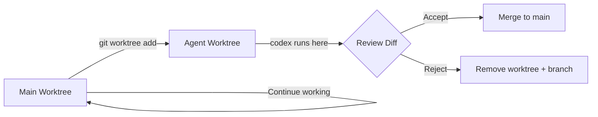
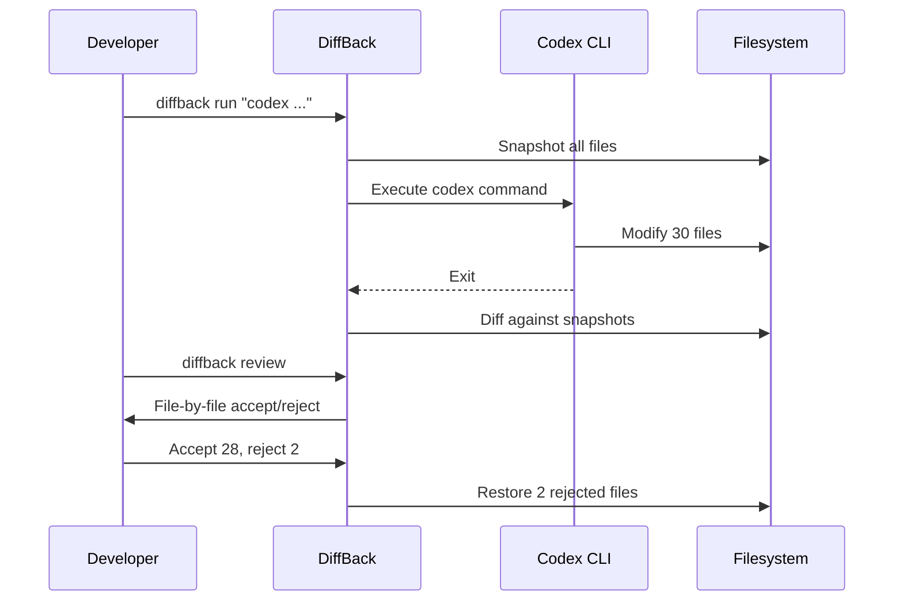
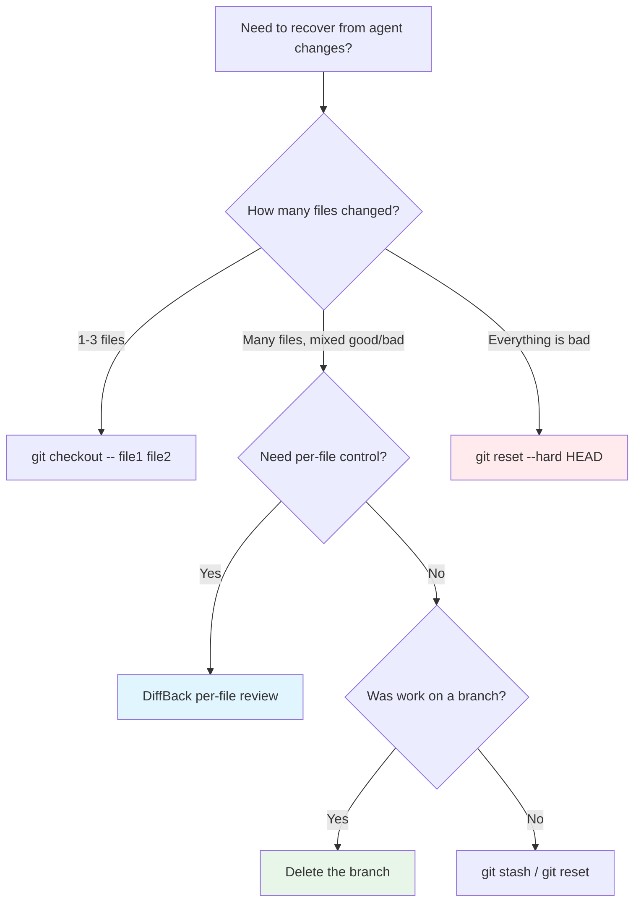

# Error Recovery and Rollback Patterns for Codex CLI: Git Safety Nets for Agentic Workflows


---

Coding agents move fast. A single Codex CLI session can touch thirty files in under a minute, and when something goes wrong — a broken refactor, a hallucinated import, a test suite that now fails in ways you did not expect — you need a recovery strategy that is faster than the agent that created the mess.

As of v0.125, Codex CLI does not ship a production-ready built-in undo mechanism[^1]. An experimental `/undo` command existed briefly but was removed after causing more problems than it solved[^2]. The `/rewind` checkpoint proposal (Issue #11626) remains open with 92 upvotes, requesting synchronised rollback of both conversation context and file changes[^3]. Until that ships, **Git is your undo button** — but only if you use it deliberately.

This article codifies the recovery patterns that experienced Codex CLI users rely on daily, from lightweight pre-flight stashes to full worktree isolation and third-party snapshot tools.

## The Problem: Agent Speed Exceeds Human Review Speed

In a traditional coding workflow, mistakes accumulate one file at a time. You notice the error, hit undo, and carry on. Agentic workflows break this model in three ways:

1. **Blast radius** — a single agent turn can modify, create, and delete files across the entire repository
2. **Interleaved changes** — useful modifications and harmful ones coexist in the same turn
3. **Context coupling** — reverting file changes without also resetting the conversation leaves the agent confused about repository state

GitButler's engineering team formalised this as seven properties of "agent-safe Git": task isolation, clear branch boundaries, explicit commit selection, easy review, recoverable mistakes, cross-branch safety, and traceability[^4]. Every pattern below addresses one or more of these properties.

## Pattern 1: The Pre-Flight Stash

The simplest safety net. Before handing control to Codex, snapshot your uncommitted work:

```bash
# Stash everything, including untracked files
git stash push --include-untracked -m "pre-codex-$(date +%Y%m%dT%H%M%S)"

# Run Codex
codex "refactor the auth module to use JWT middleware"

# If the result is bad, hard-reset and restore
git checkout -- .
git clean -fd
git stash pop
```

This works for interactive sessions where you want a quick escape hatch. The timestamp in the stash message makes it easy to find later via `git stash list`[^5].

**Limitation:** The stash only captures your pre-existing uncommitted changes. If Codex creates new files that you want to remove, you need `git clean -fd` as well. And if Codex made some good changes mixed with bad ones, you lose everything — there is no per-file granularity.

## Pattern 2: The Throwaway Branch

For higher-stakes work, isolate the agent's changes on a dedicated branch:

```bash
# Create and switch to a throwaway branch
git checkout -b codex/refactor-auth-$(date +%s)

# Run Codex — all changes land on this branch
codex "refactor the auth module to use JWT middleware"

# Review the diff against main
git diff main...HEAD

# If good, merge back
git checkout main
git merge codex/refactor-auth-*

# If bad, simply delete the branch
git checkout main
git branch -D codex/refactor-auth-*
```

This pattern provides complete isolation with zero risk to your main branch[^6]. Simon Willison recommends treating AI-assisted coding identically to manual coding: branch, commit selectively, and use `git revert` when needed[^7].

## Pattern 3: Git Worktree Isolation

For parallel agent sessions or when you want to keep working while Codex runs:

```bash
# Create an isolated worktree
git worktree add ../codex-workspace codex/task-42

# Run Codex in the isolated worktree
cd ../codex-workspace
codex "implement the caching layer for the user service"

# Review from your main worktree — no context switch needed
cd ../main-repo
git diff main...codex/task-42

# Clean up if the work is rejected
git worktree remove ../codex-workspace
git branch -D codex/task-42
```

The Codex App uses worktrees natively — each agent thread gets its own Git worktree, created automatically when a task starts[^8]. The CLI does not create worktrees automatically, but the manual approach above achieves the same isolation[^9].



## Pattern 4: Hooks-Based Automatic Checkpointing

With Codex CLI v0.124+ hooks now stable[^10], you can automate checkpointing before every tool execution:

```toml
# ~/.codex/config.toml
[hooks.pre_tool_use.git_checkpoint]
command = "bash"
args = ["-c", """
  if [ "$CODEX_TOOL_NAME" = "apply_patch" ] || [ "$CODEX_TOOL_NAME" = "shell" ]; then
    git stash push --include-untracked -m "codex-checkpoint-$(date +%s)" 2>/dev/null
    git stash pop --quiet 2>/dev/null
    git add -A && git commit --allow-empty -m "codex-auto-checkpoint" --no-verify 2>/dev/null || true
  fi
"""]
```

This creates a commit before each file-modifying operation, giving you a fine-grained `git log` to bisect through if something goes wrong. The `--no-verify` flag skips pre-commit hooks to avoid interfering with the agent's flow.

**Warning:** This generates many small commits. Squash them before merging:

```bash
# Squash all codex checkpoints into one commit
git rebase -i $(git log --oneline | grep -v "codex-auto-checkpoint" | head -1 | awk '{print $1}')
```

## Pattern 5: DiffBack — Per-File Accept/Reject

DiffBack is a community tool that wraps any agent command, snapshots files before execution, and presents an interactive per-file review interface[^11]:

```bash
npm install -g diffback

# Wrap your Codex session
diffback run "codex 'migrate all API routes from Express to Fastify'"

# After Codex finishes, review each changed file
diffback review

# Selectively revert specific files
diffback revert <session-id> --file src/routes/broken-route.ts
```

DiffBack stores original file snapshots in `~/.diffback/snapshots/` and session metadata as JSON[^11]. This solves the interleaved-changes problem: you keep the good refactoring in `src/middleware/` while reverting the broken changes in `src/routes/`.



## Pattern 6: Entire CLI — Session-Aware Checkpointing

Entire CLI hooks into your Git workflow to capture AI agent sessions alongside commits[^12]. It creates checkpoints on a separate `entire/checkpoints/v1` branch, keeping your working branch clean:

```bash
# Install
npm install -g @entireio/cli

# Sessions are automatically captured when you commit
# Each session links to its associated commits
entire sessions list
entire sessions inspect <session-id>
```

This approach pairs well with Codex CLI because it provides traceability — you can see which agent session produced which commits and roll back at the session level rather than the commit level[^12].

## Pattern 7: The Safe-Execute Wrapper Script

For CI/CD pipelines and `codex exec` workflows, wrap the agent in a checkpoint-and-validate script:

```bash
#!/usr/bin/env bash
set -euo pipefail

TASK="$1"
BRANCH="codex/exec-$(date +%s)"
STASH_NAME="pre-codex-exec-$(date +%Y%m%dT%H%M%S)"

# Checkpoint
git stash push --include-untracked -m "$STASH_NAME"
git checkout -b "$BRANCH"
git stash pop || true

# Execute
codex exec "$TASK" \
  --approval-mode full-auto \
  -m o4-mini

# Validate
if ! npm test 2>/dev/null; then
  echo "::error::Tests failed after codex exec — rolling back"
  git checkout main
  git branch -D "$BRANCH"
  git stash pop 2>/dev/null || true
  exit 1
fi

# Success — merge
git checkout main
git merge --no-ff "$BRANCH" -m "codex: $TASK"
git branch -d "$BRANCH"
```

This pattern is used in GitHub Actions workflows with `codex-action@v1`, where the action creates a branch, runs the agent, validates tests, and only merges if validation passes[^13].

## Decision Framework: Which Pattern When?



| Pattern | Granularity | Overhead | Best For |
|---------|-------------|----------|----------|
| Pre-flight stash | All-or-nothing | Minimal | Quick interactive sessions |
| Throwaway branch | All-or-nothing | Low | Medium-risk refactors |
| Git worktree | Full isolation | Medium | Parallel agent sessions |
| Hooks checkpoint | Per-operation | Medium | Debugging which turn broke things |
| DiffBack | Per-file | Low | Mixed good/bad changes |
| Entire CLI | Per-session | Low | Audit and traceability |
| Safe-execute wrapper | Branch + validate | Medium | CI/CD pipelines |

## What Is Coming: The /rewind Proposal

The community's most-requested recovery feature is `/rewind` (Issue #11626)[^3], which would:

1. Display recent checkpoints with timestamps, prompt snippets, and affected files
2. Revert Codex-generated edits after the chosen checkpoint
3. Preview file changes before applying the rewind
4. Allow editing the restored prompt before resubmitting
5. Only revert AI-generated edits, preserving unrelated local changes

A related issue (#12558) for "Claude Code-style /rewind with checkpoint restore + context summarise modes" was marked as completed[^3], suggesting OpenAI is actively working on this capability. Until it ships in a stable release, the Git-based patterns above remain the reliable path.

## Practical Recommendations

1. **Always work on a branch** when running Codex in `full-auto` or `auto-edit` mode. The two seconds it takes to `git checkout -b` saves hours of manual untangling.

2. **Commit before and after** each agent session. Even a quick `git commit -am "checkpoint"` gives you a clean reset point.

3. **Use `suggest` mode for exploratory work**. You review every change before it lands, eliminating the need for after-the-fact rollback entirely[^14].

4. **Install DiffBack for mixed-quality outputs**. When the agent gets 90% right and 10% wrong, per-file rollback is dramatically faster than re-running the entire session.

5. **Add the safe-execute wrapper to CI**. Never let `codex exec` merge directly to main without validation.

6. **Review `git diff` before approving**. Codex streams progress to stderr during execution — pair this with a `git diff --stat` after each turn to catch problems early[^15].

## Citations

[^1]: [Codex CLI Features — OpenAI Developers](https://developers.openai.com/codex/cli/features) — no built-in undo in feature list as of v0.125
[^2]: [Feature request: bring back Undo / Redo for Codex-applied file changes — GitHub Issue #16784](https://github.com/openai/codex/issues/16784)
[^3]: [CLI: Add /rewind checkpoint restore — GitHub Issue #11626](https://github.com/openai/codex/issues/11626) — 92 upvotes, open as of April 2026
[^4]: [Agent-safe Git with GitButler — Butler's Log](https://blog.gitbutler.com/agentic-safety) — seven properties of agent-safe Git
[^5]: [Git Is Your Undo Button for AI Mistakes — 31 Days of Vibe Coding](https://31daysofvibecoding.com/2026/01/09/git-is-your-undo-button/)
[^6]: [Using Git with coding agents — Simon Willison's Agentic Engineering Patterns](https://simonwillison.net/guides/agentic-engineering-patterns/using-git-with-coding-agents/)
[^7]: [Ask HN: How Do you undo or checkout changes from Codex CLI and others? — Hacker News](https://news.ycombinator.com/item?id=45999169)
[^8]: [Codex App Worktrees Explained — Verdent Guides](https://www.verdent.ai/guides/codex-app-worktrees-explained)
[^9]: [Worktrees — Codex App — OpenAI Developers](https://developers.openai.com/codex/app/worktrees)
[^10]: [Codex CLI v0.124.0 Changelog — OpenAI Developers](https://developers.openai.com/codex/changelog) — hooks graduated to stable
[^11]: [DiffBack — GitHub](https://github.com/A386official/diffback) — per-file accept/reject for AI agent changes
[^12]: [Entire CLI — GitHub](https://github.com/entireio/cli) — session-aware Git checkpointing
[^13]: [GitHub Action — Codex — OpenAI Developers](https://developers.openai.com/codex/github-action)
[^14]: [Agent approvals & security — Codex — OpenAI Developers](https://developers.openai.com/codex/agent-approvals-security)
[^15]: [Non-interactive mode — Codex — OpenAI Developers](https://developers.openai.com/codex/noninteractive) — codex exec streams to stderr
