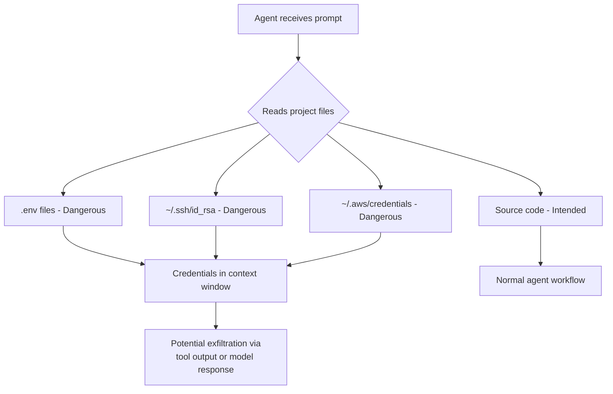
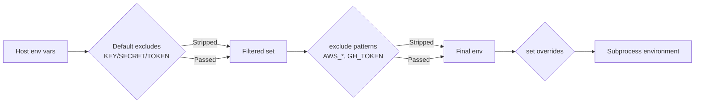

# Codex CLI Filesystem Security: Deny-Read Policies, Glob Patterns, and Credential Protection


---

Every developer workstation is a treasure trove of secrets: `.env` files, SSH keys, cloud credentials in `~/.aws`, API tokens scattered through shell profiles. When you hand an autonomous coding agent read access to your filesystem, those secrets become attack surface. Codex CLI v0.125 shipped deny-read glob policies, managed deny-read requirements, and isolated `codex exec` runs[^1] — giving teams the tools to enforce least-privilege file access at every layer of the configuration stack.

This article walks through the full filesystem security model, from individual developer hardening to enterprise-wide policy enforcement.

## The Threat: Why Read Access Matters

Codex CLI's default `read-only` sandbox mode prevents writes but still allows the agent to read files across the filesystem[^2]. That design makes sense for code comprehension — the agent needs to read source files to be useful. But read access to credential files is a different matter entirely.

Research from Bitwarden demonstrated that coding agents routinely inherit access to `.env` files, `~/.aws/credentials`, SSH keys, and shell history containing tokens[^3]. A prompt injection in a dependency's README or a malicious MCP server response could instruct the agent to read and exfiltrate these files. The CVE-2025-61260 vulnerability in Codex CLI showed that implicitly trusted project configurations could execute arbitrary commands without user approval[^4], making credential exfiltration a concrete rather than theoretical risk.



## Layer 1: User-Level Deny-Read Policies

The `permissions.<name>.filesystem` table in `config.toml` lets you define named permission profiles with granular path-level access control[^5]. The critical addition in v0.125 is `"none"` as an access level, which denies read access entirely for matching paths or glob patterns[^1].

### Basic Configuration

```toml
# ~/.codex/config.toml
default_permissions = "workspace"

[permissions.workspace.filesystem]
":project_roots" = { "." = "write", "**/*.env" = "none", "**/.env.*" = "none" }
"/Users/daniel/.ssh" = "none"
"/Users/daniel/.aws" = "none"
"/Users/daniel/.config/gh" = "none"
glob_scan_max_depth = 3
```

The `:project_roots` special token scopes rules relative to detected project roots[^5]. Glob patterns like `**/*.env` match recursively within those roots. Absolute paths like `/Users/daniel/.ssh` apply system-wide regardless of the working directory.

### Understanding `glob_scan_max_depth`

On platforms that snapshot glob matches before sandbox startup (notably macOS Seatbelt), unbounded `**` patterns must be pre-expanded[^5]. The `glob_scan_max_depth` key caps how deep the expansion goes. Setting it to `3` means `**/*.env` expands to `*.env`, `*/*.env`, `*/*/*.env`, and `*/*/*/*.env`. For deeply nested monorepos, increase this value — but be aware that higher values increase sandbox startup time.

### Multiple Permission Profiles

You can define separate profiles for different workflows:

```toml
default_permissions = "standard"

[permissions.standard.filesystem]
":project_roots" = { "." = "write", "**/*.env" = "none" }
glob_scan_max_depth = 3

[permissions.audit.filesystem]
":project_roots" = { "." = "read" }
"/var/log" = "read"
glob_scan_max_depth = 2

[permissions.ci.filesystem]
":project_roots" = { "." = "write" }
":minimal" = "read"
glob_scan_max_depth = 1
```

Permission profiles persist across TUI sessions, user turns, MCP sandbox state, and shell escalation as of v0.125[^1], meaning the agent cannot silently switch to a more permissive profile mid-session.

## Layer 2: Shell Environment Policy

Deny-read policies protect files on disc, but credentials often live in environment variables. The `shell_environment_policy` table controls what the agent's subprocesses can see[^6]:

```toml
[shell_environment_policy]
inherit = "core"
ignore_default_excludes = false
exclude = ["AWS_*", "AZURE_*", "GH_TOKEN", "GITHUB_TOKEN", "NPM_TOKEN"]
set = { PATH = "/usr/local/bin:/usr/bin:/bin" }
```

The automatic `KEY/SECRET/TOKEN` filter runs first when `ignore_default_excludes = false`[^6], stripping any variable whose name contains those substrings. The `exclude` array adds glob-pattern overrides on top. Together, these two mechanisms ensure that even if the agent spawns a shell, it cannot access cloud credentials through the environment.



## Layer 3: Sandbox Mode Selection

Filesystem policies operate within the broader sandbox architecture. The three modes provide different baseline guarantees[^2]:

| Mode | Filesystem | Network | Use Case |
|------|-----------|---------|----------|
| `read-only` | Read anywhere (unless deny-read) | Blocked | Safe exploration |
| `workspace-write` | Write in project, read elsewhere (unless deny-read) | Opt-in | Active development |
| `danger-full-access` | Unrestricted | Unrestricted | Only in pre-isolated environments |

Deny-read policies layer on top of these modes. A `workspace-write` sandbox with `"**/*.env" = "none"` means the agent can write source files but cannot read any `.env` file, even within the writable workspace.

Platform-specific enforcement varies[^2]:

- **macOS**: Seatbelt policies via `sandbox-exec` with curated profiles matching your selected mode
- **Linux**: `bwrap` plus `seccomp` by default; WSL2 inherits Linux semantics
- **Windows**: Native sandbox runs as "unelevated" or "elevated"; WSL2 provides alternative isolation

```toml
# Hardened workspace-write for active development
sandbox_mode = "workspace-write"
approval_policy = "on-request"

[sandbox_workspace_write]
network_access = false
writable_roots = []
exclude_slash_tmp = true
exclude_tmpdir_env_var = true
```

Setting `exclude_slash_tmp = true` prevents the agent from using `/tmp` as a staging area for exfiltrated data — a technique observed in sandbox escape research[^7].

## Layer 4: Enterprise Managed Requirements

Individual developer configuration is insufficient at scale. The `requirements.toml` mechanism lets administrators enforce deny-read policies that users cannot weaken[^8].

### Enforcement Hierarchy

Requirements are applied in strict precedence order[^8]:

1. **Cloud-managed requirements** — ChatGPT Business/Enterprise admin console
2. **macOS MDM** — `com.openai.codex:requirements_toml_base64` preference domain
3. **System requirements** — `/etc/codex/requirements.toml` (Unix) or `%ProgramData%\OpenAI\Codex\requirements.toml` (Windows)

### Deny-Read Requirements

```toml
# /etc/codex/requirements.toml (enterprise-managed)

[permissions.filesystem]
deny_read = [
  "/home/*/.ssh",
  "/home/*/.aws",
  "/home/*/.config/gh",
  "/home/*/.gnupg",
  "./**/*.env",
  "./**/*.pem",
  "./**/*.key",
  "./**/secrets.*",
]

allowed_sandbox_modes = ["read-only", "workspace-write"]
allowed_approval_policies = ["on-request"]
```

When deny-read requirements are present, Codex constrains the local sandbox mode to `read-only` or `workspace-write` so it can enforce them[^8]. A developer cannot override this by setting `danger-full-access` locally.

### Host-Specific Sandbox Policies

For organisations with mixed environments — developer laptops alongside CI runners — the `remote_sandbox_config` table applies different policies by hostname[^8]:

```toml
allowed_sandbox_modes = ["read-only"]

[[remote_sandbox_config]]
hostname_patterns = ["*.devbox.example.com", "runner-??.ci.example.com"]
allowed_sandbox_modes = ["read-only", "workspace-write"]
```

## Layer 5: Isolated `codex exec` Runs

The v0.125 release introduced isolated `codex exec` runs that ignore user configuration and project rules[^1]. This is critical for CI/CD pipelines where you want deterministic, policy-compliant behaviour regardless of what a repository's `.codex/config.toml` might contain.

```bash
# CI pipeline: isolated exec ignores local config
codex exec \
  --sandbox workspace-write \
  --json \
  "Review this PR for security issues and output a JSON report" \
  2>/dev/null
```

In isolated mode, the system `requirements.toml` still applies, but project-level and user-level configuration layers are stripped. This prevents a malicious repository from shipping a `.codex/config.toml` that weakens sandbox policies — the exact attack vector that CVE-2025-61260 exploited[^4].

## Putting It All Together: A Hardened Configuration

Here is a complete `config.toml` that implements defence in depth for a senior developer's workstation:

```toml
# ~/.codex/config.toml — hardened profile
sandbox_mode = "workspace-write"
approval_policy = "on-request"
default_permissions = "hardened"
allow_login_shell = false

[sandbox_workspace_write]
network_access = false
writable_roots = []
exclude_slash_tmp = true
exclude_tmpdir_env_var = true

[permissions.hardened.filesystem]
":project_roots" = {
  "." = "write",
  "**/*.env" = "none",
  "**/.env.*" = "none",
  "**/*.pem" = "none",
  "**/*.key" = "none",
  "**/secrets.*" = "none",
  "**/.secrets" = "none",
}
"/home/daniel/.ssh" = "none"
"/home/daniel/.aws" = "none"
"/home/daniel/.config/gh" = "none"
"/home/daniel/.gnupg" = "none"
glob_scan_max_depth = 4

[permissions.hardened.network]
enabled = false

[shell_environment_policy]
inherit = "core"
ignore_default_excludes = false
exclude = ["AWS_*", "AZURE_*", "GCP_*", "GH_TOKEN", "GITHUB_TOKEN",
           "NPM_TOKEN", "DOCKER_*", "OPENAI_API_KEY"]
```

## Verifying Your Sandbox

Codex provides sandbox testing commands to verify policy enforcement before trusting it in production[^2]:

```bash
# macOS: test sandbox with denial logging
codex sandbox macos --log-denials cat ~/.ssh/id_rsa

# Linux: test sandbox enforcement
codex sandbox linux cat /home/daniel/.aws/credentials
```

If the sandbox is correctly configured, these commands should fail with a permission denied error. The `--log-denials` flag on macOS logs every blocked access attempt, making it straightforward to audit what the agent attempted to read.

## Limitations and Caveats

**Glob depth trade-offs**: Shallow `glob_scan_max_depth` values miss deeply nested secrets; deep values slow sandbox startup. Profile your repository structure and set accordingly.

**No content-based filtering**: Deny-read operates on path patterns, not file contents. A credential stored in `config.yaml` rather than `.env` won't be caught unless you add the pattern explicitly.

**MCP server bypass**: ⚠️ MCP servers run outside the Codex sandbox. A malicious or misconfigured MCP server could read denied files on behalf of the agent. Use the MCP server allowlist in `requirements.toml` to constrain which servers are permitted[^8].

**`danger-full-access` overrides everything**: If a user can set `danger-full-access`, deny-read policies in their `config.toml` are bypassed. Enterprise teams should enforce `allowed_sandbox_modes` via `requirements.toml` to prevent this[^8].

## Citations

[^1]: [Codex CLI v0.125.0 Release Notes](https://developers.openai.com/codex/changelog) — Filesystem deny-read glob policies, permission profile persistence, isolated codex exec runs (April 24, 2026)
[^2]: [Codex Agent Approvals & Security Documentation](https://developers.openai.com/codex/agent-approvals-security) — Sandbox modes, platform enforcement, protected paths
[^3]: [Bitwarden — "Your coding agent can read your .env file"](https://bitwarden.com/blog/secure-ai-agent-access-with-secrets-manager/) — Agent credential exposure analysis
[^4]: [SecurityWeek — "Vulnerability in OpenAI Coding Agent Could Facilitate Attacks"](https://www.securityweek.com/vulnerability-in-openai-coding-agent-could-facilitate-attacks-on-developers/) — CVE-2025-61260 coverage
[^5]: [Codex Configuration Reference](https://developers.openai.com/codex/config-reference) — `permissions.<name>.filesystem` table, glob_scan_max_depth, :project_roots token
[^6]: [Codex Advanced Configuration](https://developers.openai.com/codex/config-advanced) — shell_environment_policy, inherit modes, automatic KEY/SECRET/TOKEN filter
[^7]: [Cymulate — "The Race to Ship AI Tools Left Security Behind: Sandbox Escape"](https://cymulate.com/blog/the-race-to-ship-ai-tools-left-security-behind-part-1-sandbox-escape/) — Sandbox escape techniques and /tmp staging
[^8]: [Codex Managed Configuration for Enterprises](https://developers.openai.com/codex/enterprise/managed-configuration) — requirements.toml, deny_read enforcement, host-specific policies, MCP server allowlists
