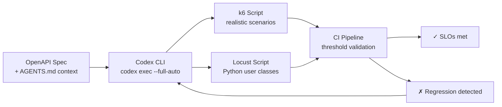
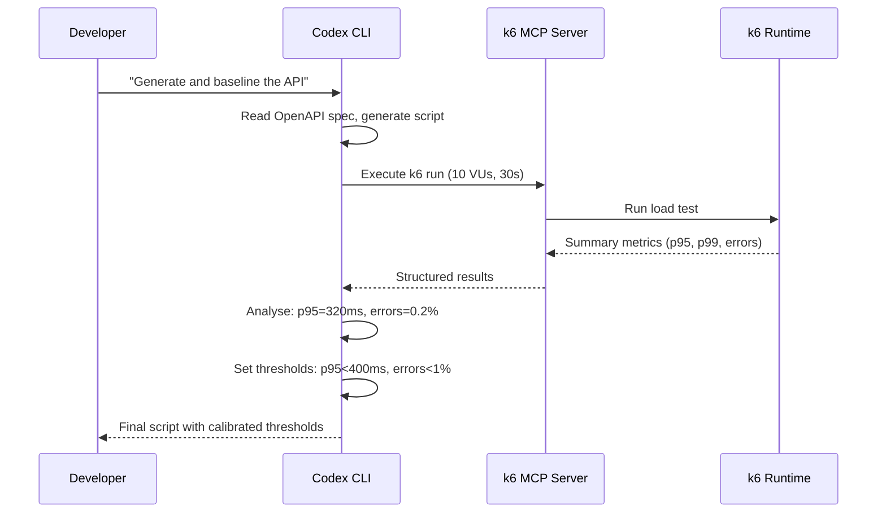

# Codex CLI for Load Test Generation: k6, Locust, and OpenAPI-Driven Performance Validation


---

Performance testing is the practice most teams acknowledge as essential and then skip until production falls over. Writing load test scripts by hand is tedious — you need to understand the API surface, construct realistic payloads, configure virtual user ramp profiles, and set meaningful thresholds. Codex CLI can automate the bulk of this work: generating k6 or Locust scripts from OpenAPI specifications, wiring them into CI/CD pipelines, and even self-correcting when tests fail validation. This article covers the complete workflow from spec to SLO-verified pipeline.

## Why Agent-Generated Load Tests

Traditional load test generation tools like `openapi-generator` and Grafana's `openapi-to-k6` produce syntactically valid scripts from OpenAPI schemas[^1][^2]. They handle endpoint enumeration and basic payload structure, but they cannot:

- Infer realistic user journeys from business context
- Set meaningful thresholds based on SLO targets
- Generate correlated multi-step flows (login → browse → checkout)
- Adapt ramp profiles to deployment topology

An LLM-powered generator bridges these gaps. Codex CLI reads the OpenAPI spec, understands the domain semantics from your `AGENTS.md` and codebase, and produces scripts that test what actually matters — not just what the schema defines[^3].



## Generating k6 Scripts from OpenAPI

The simplest pattern pipes your OpenAPI spec directly into `codex exec`:

```bash
codex exec --full-auto \
  --model gpt-5.5 \
  "Generate a k6 load test script from the OpenAPI spec at ./api/openapi.yaml.
   Include:
   - A realistic user journey: authenticate, list resources, create one, verify it
   - Ramp from 0 to 50 VUs over 2 minutes, sustain for 5 minutes, ramp down
   - Thresholds: p95 < 500ms, error rate < 1%
   - Use the test environment base URL from env var K6_BASE_URL
   Output only the k6 JavaScript file content."
```

Codex reads the spec, identifies the authentication endpoint, constructs correlated requests with extracted tokens, and produces a script with proper `check()` assertions and `thresholds` configuration[^4].

### Adding Domain Context

For more realistic scenarios, point Codex at your `AGENTS.md` and existing test fixtures:

```bash
codex exec --full-auto \
  "Read ./api/openapi.yaml and ./test/fixtures/sample-payloads.json.
   Generate a k6 script that simulates a peak-hour shopping flow:
   1. User authenticates (POST /auth/token)
   2. Browses catalogue (GET /products?category=electronics, paginated)
   3. Adds 2-3 items to basket (POST /basket/items)
   4. Checks out (POST /orders)
   5. Polls order status (GET /orders/{id})
   Use realistic delays between steps (1-3s think time).
   Set thresholds from our SLOs in AGENTS.md."
```

The key advantage over template-based generators is the multi-step correlation — Codex extracts the `orderId` from the checkout response and uses it in the status poll, something `openapi-generator` cannot infer[^1].

## Generating Locust Scripts

For teams using Python-based infrastructure, Locust is often the preferred framework[^5]. The generation pattern is identical:

```bash
codex exec --full-auto \
  "Generate a Locust load test from ./api/openapi.yaml.
   Create a UserBehaviour class with weighted tasks:
   - browse_products (weight 5): GET /products with random category
   - create_order (weight 1): full checkout flow with authentication
   - check_status (weight 3): GET /orders/{id} for recent orders
   Include a locustfile.py with configurable host and user counts.
   Add response time assertions using self.environment.events."
```

Locust scripts benefit particularly from LLM generation because the `TaskSet` weighting requires domain knowledge about realistic traffic distribution — something an LLM can reason about from API documentation and business context[^5].

## The k6 MCP Server Integration

The k6 MCP server bridges Codex CLI directly to your local k6 installation, enabling the agent to not only generate scripts but execute them and analyse results within the same session[^6].

### Configuration

```toml
# ~/.codex/config.toml

[mcp_servers.k6]
command = "npx"
args = ["-y", "@grafana/k6-mcp-server"]
```

Or add it via the CLI:

```bash
codex mcp add k6 -- npx -y @grafana/k6-mcp-server
```

### Interactive Load Test Development

With the MCP server active, you can run an iterative load testing session:

```
You: Generate a k6 script for the /api/v2 endpoints, run it with 10 VUs
     for 30 seconds, and adjust thresholds based on the baseline results.
```

Codex generates the script, executes it through the MCP server, reads the summary metrics, and adjusts thresholds to match the observed baseline plus a margin. This closed-loop pattern — generate, run, analyse, refine — is precisely the kind of tight feedback cycle where agentic tools excel[^6][^7].



## CI/CD Integration

### GitHub Actions

Generate and run load tests on every deployment to staging:


```yaml
name: Performance validation

on:
  deployment_status:
    types: [success]

jobs:
  load-test:
    if: github.event.deployment_status.state == 'success'
    runs-on: ubuntu-latest
    steps:
      - uses: actions/checkout@v5

      - name: Install k6
        run: |
          sudo gpg -k
          sudo gpg --no-default-keyring --keyring /usr/share/keyrings/k6-archive-keyring.gpg \
            --keyserver hkp://keyserver.ubuntu.com:80 --recv-keys C5AD17C747E3415A3642D57D77C6C491D6AC1D68
          echo "deb [signed-by=/usr/share/keyrings/k6-archive-keyring.gpg] https://dl.k6.io/deb stable main" \
            | sudo tee /etc/apt/sources.list.d/k6.list
          sudo apt-get update && sudo apt-get install k6

      - name: Generate load test
        uses: openai/codex-action@v1
        with:
          openai-api-key: ${{ secrets.OPENAI_API_KEY }}
          prompt: |
            Generate a k6 load test from ./api/openapi.yaml targeting
            ${{ github.event.deployment.payload.target_url }}.
            Ramp to 100 VUs over 3 minutes. Thresholds: p95 < 500ms, errors < 1%.
            Write the script to ./perf/generated-load-test.js
          sandbox: workspace-write
          safety-strategy: drop-sudo

      - name: Run load test
        run: k6 run ./perf/generated-load-test.js --out json=results.json
        env:
          K6_BASE_URL: ${{ github.event.deployment.payload.target_url }}

      - name: Upload results
        uses: actions/upload-artifact@v4
        with:
          name: k6-results
          path: results.json
```


### GitLab CI with Structured Output

For GitLab, use the marker-based extraction pattern to generate a performance report artefact[^8]:

```yaml
codex_perf_test:
  stage: performance
  image: node:24
  rules:
    - if: '$CI_PIPELINE_SOURCE == "merge_request_event"'
  script:
    - npm -g i @openai/codex@latest
    - |
      codex exec --full-auto \
        "Generate a k6 script from ./api/openapi.yaml.
         Output the script between === BEGIN_K6_SCRIPT === and === END_K6_SCRIPT === markers.
         Target base URL: ${CI_ENVIRONMENT_URL}
         Ramp: 0-50 VUs over 2min, sustain 3min.
         Thresholds: p95 < 500ms, errors < 1%." \
        | tee raw.log >/dev/null
    - |
      sed -E 's/\x1B\[[0-9;]*[A-Za-z]//g' raw.log \
        | awk '/BEGIN_K6_SCRIPT/{g=1;next}/END_K6_SCRIPT/{g=0}g' \
        > perf/load-test.js
    - k6 run perf/load-test.js --summary-export=perf-summary.json
  artifacts:
    paths:
      - perf-summary.json
    expire_in: 30 days
```

The marker extraction — the same pattern used in the GitLab code quality cookbook — ensures reliable parsing regardless of any surrounding prose Codex might generate[^8].

## Self-Correcting Load Tests

The most powerful pattern combines generation with iterative refinement. When a generated k6 script fails (syntax errors, incorrect endpoint paths, auth failures), pipe the error back into Codex:

```bash
#!/bin/bash
MAX_ATTEMPTS=3
SCRIPT="./perf/load-test.js"

# Generate initial script
codex exec --full-auto \
  "Generate a k6 load test from ./api/openapi.yaml. Write to ${SCRIPT}" \
  2>/dev/null

for attempt in $(seq 1 $MAX_ATTEMPTS); do
  OUTPUT=$(k6 run --no-summary "$SCRIPT" 2>&1)
  EXIT_CODE=$?

  if [ $EXIT_CODE -eq 0 ]; then
    echo "Load test passed on attempt ${attempt}"
    exit 0
  fi

  echo "Attempt ${attempt} failed. Asking Codex to fix..."
  echo "$OUTPUT" | codex exec --full-auto \
    "The k6 script at ${SCRIPT} failed with the above output.
     Fix the script with minimal changes. Do not rewrite from scratch." \
    2>/dev/null
done

echo "Load test failed after ${MAX_ATTEMPTS} attempts"
exit 1
```

This mirrors the self-healing CI pattern documented in the OpenAI Cookbook[^9], applied specifically to performance test scripts. GPT-5.5's 60% reduction in hallucinated tool calls makes this loop significantly more reliable than with earlier models[^10].

## Cost and Model Selection

Load test generation is a good candidate for model routing. The initial script generation benefits from GPT-5.5's stronger planning capabilities, whilst iterative fixes can use a cheaper model[^11]:

| Task | Recommended Model | Reasoning Effort | Rationale |
|---|---|---|---|
| Initial script generation | GPT-5.5 | `medium` | Needs domain reasoning for realistic scenarios |
| Fix failing script | GPT-5.5 | `low` | Error messages provide clear guidance |
| Threshold calibration | GPT-5.4-mini | `low` | Simple numeric adjustment |
| CI pipeline generation | GPT-5.5 | `medium` | YAML structure + tool integration |

For batch generation across multiple services in a monorepo, use `codex exec` with `--model gpt-5.5` at batch API pricing (\$2.50/\$15.00 per million tokens) — identical to GPT-5.4 standard rates[^11].

## Limitations

- **Non-deterministic output**: The same OpenAPI spec may produce different scripts across runs. Pin generated scripts to version control after review rather than regenerating on every pipeline run.
- **Authentication complexity**: OAuth2 flows with PKCE, mutual TLS, or custom token refresh logic often require manual adjustment. Codex generates a reasonable skeleton but may not capture every edge case.
- **Realistic data generation**: Codex can infer field types from the schema but cannot generate domain-specific realistic data (e.g., valid credit card numbers for payment testing) without explicit test fixture files.
- ⚠️ **Cost at scale**: Generating load tests for every microservice in a large estate can accumulate significant API costs. Generate once, commit to version control, and regenerate only when the API surface changes.

## Summary

Codex CLI transforms load test authoring from a manual, often-skipped task into an automated pipeline stage. The k6 MCP server enables a closed-loop development cycle where Codex generates, executes, and refines scripts within a single session. For CI/CD integration, the `codex exec` + marker extraction pattern produces reliable, deployable scripts. Pair GPT-5.5 for initial generation with cheaper models for iterative fixes to keep costs manageable. The result: performance validation that actually happens, on every deployment, without a dedicated performance engineering team.

## Citations

[^1]: OpenAPITools, "openapi-generator — k6 generator documentation." [github.com/OpenAPITools/openapi-generator/blob/master/docs/generators/k6.md](https://github.com/OpenAPITools/openapi-generator/blob/master/docs/generators/k6.md)

[^2]: Grafana Labs, "openapi-to-k6 — Convert an OpenAPI schema to a TypeScript client for k6." [github.com/grafana/openapi-to-k6](https://github.com/grafana/openapi-to-k6)

[^3]: OpenAI, "Non-interactive mode — Codex." [developers.openai.com/codex/noninteractive](https://developers.openai.com/codex/noninteractive)

[^4]: Grafana Labs, "Create a test script from an OpenAPI definition file — k6 documentation." [grafana.com/docs/k6/latest/using-k6/test-authoring/create-test-script-using-openapi](https://grafana.com/docs/k6/latest/using-k6/test-authoring/create-test-script-using-openapi/)

[^5]: Locust Contributors, "Locust — An open source load testing tool." [locust.io](https://locust.io/)

[^6]: QAInsights, "Run k6 Load Tests with Your LLM: Introducing k6 MCP Server and the Power of MCP." [qainsights.com/run-k6-load-tests-with-your-llm-introducing-k6-mcp-server-and-the-power-of-mcp](https://qainsights.com/run-k6-load-tests-with-your-llm-introducing-k6-mcp-server-and-the-power-of-mcp/)

[^7]: OpenAI, "Features — Codex CLI." [developers.openai.com/codex/cli/features](https://developers.openai.com/codex/cli/features)

[^8]: OpenAI Cookbook, "Automating Code Quality and Security Fixes with Codex CLI on GitLab." [developers.openai.com/cookbook/examples/codex/secure_quality_gitlab](https://developers.openai.com/cookbook/examples/codex/secure_quality_gitlab)

[^9]: OpenAI Cookbook, "Use Codex CLI to automatically fix CI failures." [developers.openai.com/cookbook/examples/codex/autofix-github-actions](https://developers.openai.com/cookbook/examples/codex/autofix-github-actions)

[^10]: Startup Fortune, "OpenAI's GPT-5.5 benchmarks show a 60% hallucination drop." [startupfortune.com/openais-gpt-55-benchmarks-show-a-60-hallucination-drop-and-coding-skills-that-rival-senior-engineers](https://startupfortune.com/openais-gpt-55-benchmarks-show-a-60-hallucination-drop-and-coding-skills-that-rival-senior-engineers/)

[^11]: Apidog, "GPT-5.5 Pricing: Full Breakdown of API, Codex, and ChatGPT Costs." [apidog.com/blog/gpt-5-5-pricing](https://apidog.com/blog/gpt-5-5-pricing/)
