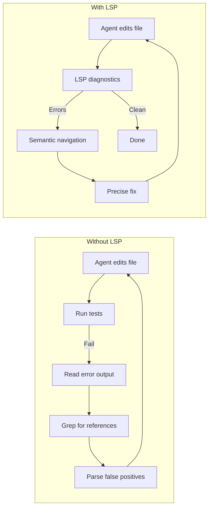
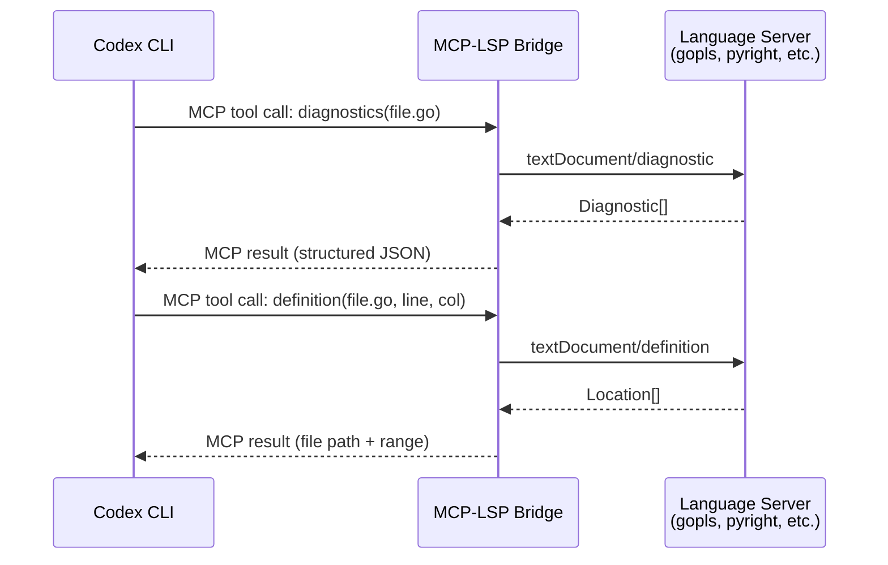
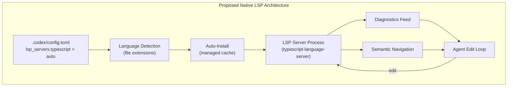

# LSP Integration for Codex CLI: Bridging the Semantic Code Intelligence Gap


Codex CLI is a formidable coding agent, but it navigates your codebase the same way a developer would without an IDE — through text search, file reads, and pattern matching. It lacks the semantic understanding that Language Server Protocol (LSP) integration provides: go-to-definition, find-references, real-time diagnostics, and type-aware symbol resolution. This gap means more trial-and-error cycles, wasted tokens on grep false positives, and avoidable type errors in generated code.

As of v0.125.0, Codex CLI has no built-in LSP support [^1]. But the community has built multiple bridges, and the official feature request remains one of the most upvoted issues in the repository [^2]. This article examines the problem, the workarounds available today, and what native integration might look like.

## Why LSP Matters for Coding Agents

The Language Server Protocol, originally designed by Microsoft for VS Code [^3], standardises communication between editors and language-specific intelligence servers. For a coding agent, LSP provides four critical capabilities:

1. **Diagnostics** — real-time type errors, unused imports, and linting violations after every edit
2. **Go-to-definition / Find-references** — semantic navigation that understands scope, not just string matching
3. **Hover information** — type signatures and documentation without reading entire files
4. **Rename symbol** — safe cross-file refactoring that respects language semantics

The performance difference is stark. Finding all call sites of a function via LSP takes approximately 50ms compared to 45 seconds with traditional text search — a 900× improvement [^4]. Token efficiency follows: in a 100-file project, grep-based reference finding might consume 2,000+ tokens scanning output, whilst LSP returns exact matches in roughly 500 tokens [^4].

More importantly, LSP eliminates false positives. Text search cannot distinguish between a function called `process`, a variable called `process`, and the word "process" appearing in a comment. LSP understands scope and semantics [^4].



## The Competitive Landscape

Codex CLI's competitors have moved ahead on LSP integration:

| Tool | LSP Support | Details |
|------|-------------|---------|
| **OpenCode** | Native, 24+ servers | Auto-detects file extensions, auto-installs servers [^5] |
| **Claude Code** | Native (v2.0.74+) | Automatic diagnostics after every file edit [^6] |
| **Kiro CLI** | Built-in | Integrated code intelligence layer [^7] |
| **Qwen Code** | Native | LSP-powered semantic navigation [^8] |
| **Codex CLI** | None (MCP bridges available) | Community workarounds via MCP [^1] |

OpenCode's implementation is particularly instructive. It ships with pre-configured language servers for TypeScript, Python (Pyright), Rust (rust-analyzer), Go (gopls), C/C++ (clangd), Java, and 18+ more languages [^5]. When OpenCode opens a file, it checks the extension against enabled LSP servers and starts the appropriate server if not already running. Diagnostics feed directly into the LLM context, so the model receives type information alongside the code it reads [^5].

## Workaround 1: MCP-LSP Bridge Servers

The most mature approach uses Model Context Protocol (MCP) servers that wrap LSP capabilities. Three community implementations stand out:

### mcp-language-server (isaacphi)

A Go-based MCP server exposing six LSP tools: `definition`, `references`, `diagnostics`, `hover`, `rename_symbol`, and `edit_file` [^9]. It works with any stdio-based LSP server.

**Installation:**

```bash
go install github.com/isaacphi/mcp-language-server@latest
```

**Codex CLI config.toml:**

```toml
[mcp_servers.lsp-go]
command = "mcp-language-server"
args = ["--workspace", "/path/to/project", "--lsp", "gopls"]
```

For TypeScript projects, swap the `--lsp` argument:

```toml
[mcp_servers.lsp-typescript]
command = "mcp-language-server"
args = [
  "--workspace", "/path/to/project",
  "--lsp", "typescript-language-server",
  "--", "--stdio"
]
```

### Codex LSP Bridge (CesarPetrescu)

Purpose-built for Codex CLI, this bridge exposes LSP features as MCP tools with Codex-specific optimisations [^10]. It provides semantic navigation, diagnostics, and hover information through the standard MCP configuration path.

### lsp-mcp (mickeyinfoshan)

A Python-based bridge supporting Go (gopls), TypeScript/JavaScript, and Python (pylsp) [^11]. It runs as an MCP server whilst internally acting as an LSP client — when an MCP request arrives, it forwards the request to the appropriate language server and returns structured results through MCP.



## Workaround 2: The lsp-skill Approach

The LSP-Skill ecosystem takes a different tack, wrapping LSP in the OpenSkills agent skill format [^12]. It layers three components:

- **LSP Client** — an async-native Python SDK for LSP communication
- **LSAP** — a semantic abstraction layer that transforms granular LSP operations into markdown-formatted snapshots suitable for LLM consumption
- **LSP Skill** — the agent-facing interface providing definition lookup, reference finding, hover documentation, file outline analysis, symbol search, and rename refactoring

Installation uses the OpenSkills standard:

```bash
openskills install lsp-client/lsp-skill --global
```

The skill is then available to Codex CLI through the standard skills discovery mechanism. The LSAP layer is the key differentiator: rather than passing raw LSP JSON to the model, it formats responses as concise markdown that the LLM can parse efficiently [^12].

## Workaround 3: AGENTS.md Linter Integration

Eric Traut, the author of Pyright, offered a pragmatic counterpoint in the original LSP feature request: existing linter and type-checker integration through AGENTS.md already provides substantial value [^2]. The argument is that rather than full LSP integration, you can configure Codex to run diagnostics tools after each edit:

```markdown
## Build and Check Commands

After editing Python files, always run:
```

pyright --outputjson .

```

After editing TypeScript files, always run:
```

npx tsc --noEmit

```

Parse the JSON output for errors and fix them before proceeding.
```

This approach is crude but effective. It lacks the real-time feedback loop and semantic navigation of LSP, but it catches type errors and forces the agent to iterate. The trade-off is latency — running `pyright` on a full project takes seconds, whilst LSP diagnostics are near-instantaneous for individual file changes.

## The Official Feature Request: What Native Integration Might Look Like

Issue #8745 proposes built-in LSP support with auto-detection and auto-installation [^2]. The discussion (45+ comments) has converged on a narrower scope than originally proposed:

- **CLI flags**: `codex --lsp=auto|on|off` for controlling activation
- **Commands**: `codex lsp status` and `codex lsp diagnostics` for inspection
- **30+ language server mappings**: TypeScript, Python, Go, Rust, Java, C/C++, and more
- **Managed installation**: Servers installed into a Codex-managed cache directory with pinned versions
- **Graceful fallback**: LSP is advisory — when a server is missing or unavailable, Codex falls back to text-based approaches

The most likely near-term implementation path is through project-scoped MCP, as suggested in the duplicate issue #14799 [^13]. This would let developers configure LSP servers per-project in `.codex/config.toml` with first-class documentation and simplified setup, without requiring changes to Codex CLI's core architecture.



## Practical Recommendations

For teams wanting LSP integration with Codex CLI today:

1. **Start with mcp-language-server** — it has the broadest language support and the simplest configuration [^9]. Add one `[mcp_servers.*]` entry per language in your `config.toml`.

2. **Scope MCP servers to projects** — use `.codex/config.toml` rather than `~/.codex/config.toml` so LSP servers match each project's language stack. This avoids starting unnecessary servers.

3. **Combine with AGENTS.md diagnostics** — use LSP for navigation and quick feedback, but also configure `AGENTS.md` to run full type-checking as a verification step. Belt and braces.

4. **Monitor token usage** — LSP tools add tool calls to your context window. Use `codex exec --json` to track reasoning-token usage [^14] and confirm the LSP bridge is saving more tokens than it consumes.

5. **Watch issue #8745** — native integration will likely arrive through first-class MCP patterns before a full built-in implementation. When it does, migration from community bridges should be straightforward.

## Limitations and Caveats

⚠️ Community MCP-LSP bridges are beta-quality software. Expect rough edges with workspace initialisation, multi-root projects, and server lifecycle management.

⚠️ LSP servers consume memory. Running `rust-analyzer` on a large Rust workspace can easily use 2–4 GB of RAM alongside Codex CLI's own footprint.

⚠️ The original LSP specification was not designed for coding agents [^2]. Operations like `textDocument/completion` assume a human cursor position and may produce noisy results in agentic contexts. The most valuable operations for agents are diagnostics, definition, and references — not completion.

⚠️ On native Windows, sandbox `deny_read` policies do not apply to shell subprocess reads [^15], which means LSP servers running as subprocesses may access files outside the configured sandbox boundary.

## Citations

[^1]: [Codex CLI v0.125.0 Changelog — OpenAI Developers](https://developers.openai.com/codex/changelog)
[^2]: [LSP integration (auto-detect + auto-install) for Codex CLI — Issue #8745, openai/codex](https://github.com/openai/codex/issues/8745)
[^3]: [Language Server Protocol Specification — Microsoft](https://microsoft.github.io/language-server-protocol/)
[^4]: [LSP: The Secret Weapon for AI Coding Tools — Amir Teymoori](https://amirteymoori.com/lsp-language-server-protocol-ai-coding-tools/)
[^5]: [LSP Servers — OpenCode Documentation](https://opencode.ai/docs/lsp/)
[^6]: [Give Your AI Coding Agent Eyes: How LSP Integrations Transform Coding Agents — the/experts Tech Talk](https://tech-talk.the-experts.nl/give-your-ai-coding-agent-eyes-how-lsp-integration-transform-coding-agents-4ccae8444929)
[^7]: [Code Intelligence — Kiro CLI Documentation](https://kiro.dev/docs/cli/code-intelligence/)
[^8]: [Language Server Protocol Support — Qwen Code Documentation](https://qwenlm.github.io/qwen-code-docs/en/users/features/lsp/)
[^9]: [mcp-language-server — GitHub (isaacphi)](https://github.com/isaacphi/mcp-language-server)
[^10]: [Codex LSP Bridge — CesarPetrescu, Glama MCP Directory](https://glama.ai/mcp/servers/CesarPetrescu/lsp-mcp)
[^11]: [lsp-mcp — GitHub (mickeyinfoshan)](https://github.com/mickeyinfoshan/lsp-mcp)
[^12]: [LSP-Client Ecosystem: IntelliSense for Agentic Coding](https://lsp-client.github.io/)
[^13]: [Native LSP support or first-class project-scoped LSP via MCP — Issue #14799, openai/codex](https://github.com/openai/codex/issues/14799)
[^14]: [Codex CLI v0.125.0 Release Notes — GitHub Releases](https://github.com/openai/codex/releases)
[^15]: [Managed Configuration — Codex, OpenAI Developers](https://developers.openai.com/codex/enterprise/managed-configuration)
