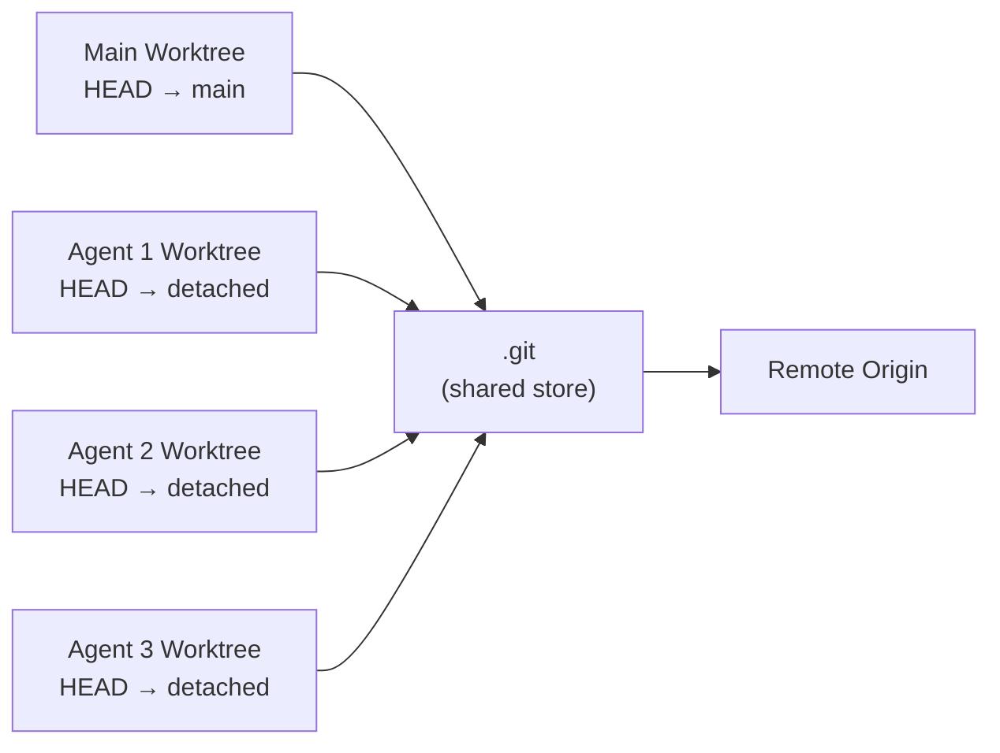
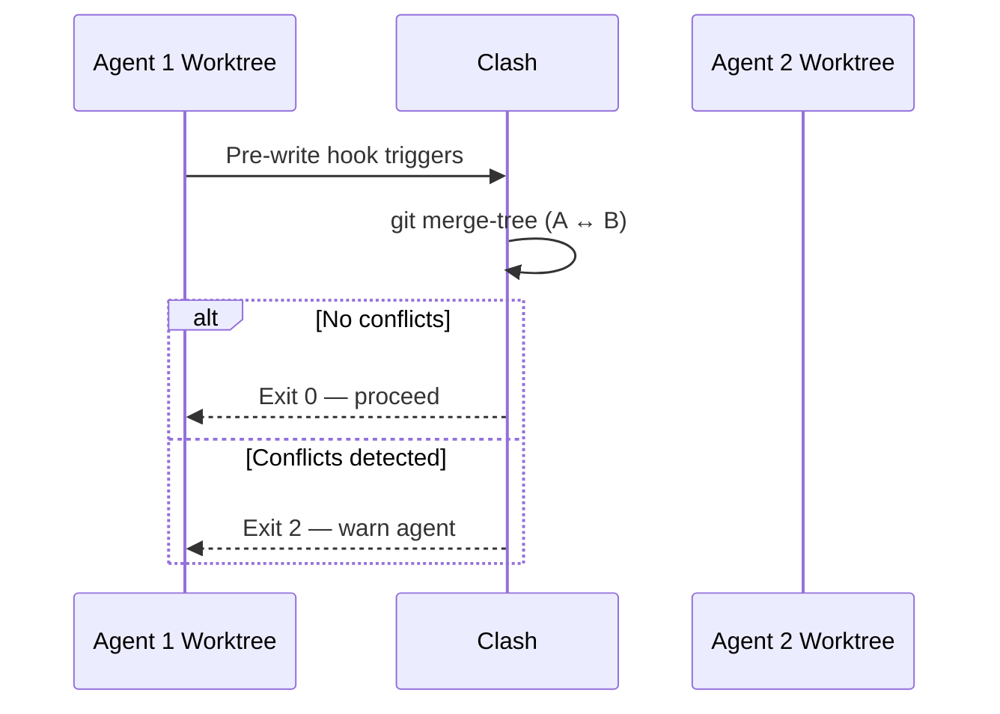
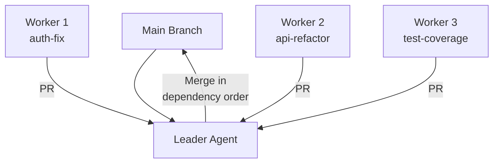
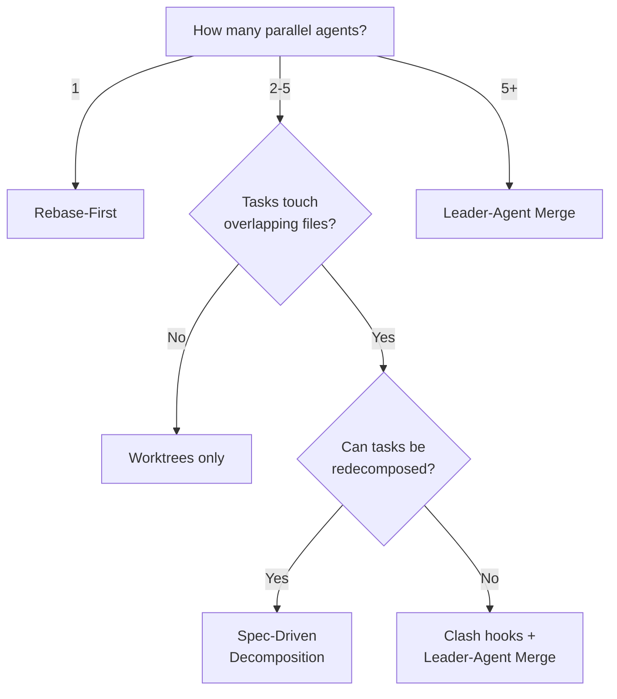

# Merge Conflict Prevention and Resolution with Codex CLI: Worktrees, Clash, and Integration Strategies


---

Running multiple Codex CLI agents in parallel is now standard practice for teams shipping at speed. But the moment two agents touch overlapping files, you inherit the oldest problem in version control: merge conflicts. This article covers the full conflict lifecycle — prevention through worktree isolation, early detection with Clash, resolution strategies for when conflicts do land, and CI automation to keep your main branch clean.

## The Parallel Agent Conflict Problem

When Codex creates a branch for a task, it snapshots `main` at that moment. If `main` advances before the agent finishes — even from an unrelated README edit or another agent's merged PR — the resulting pull request can land with conflicts the agent never caused [^1]. This is not a bug; it is a fundamental race condition in any parallel development workflow.

The problem compounds with scale. Greg Brockman noted that Codex excels at "fixing merge conflicts, getting CI to green, rewriting between languages" [^2], but prevention remains cheaper than cure. The Codex ecosystem addresses this across three layers: isolation, detection, and resolution.

## Layer 1: Worktree Isolation — Preventing Conflicts at the Filesystem Level

### How Codex Worktrees Work

A Git worktree is a separate checked-out copy of your repository sharing the same `.git` object store [^3]. Each worktree has its own HEAD, index, and working files, whilst commits, branches, and remotes remain shared. The Codex App creates worktrees automatically — one per agent thread — in a detached HEAD state to avoid branch namespace pollution [^4].



Key properties of this architecture:

- **File-level isolation**: Each agent writes to its own directory. Uncommitted work in one worktree is invisible to others [^3].
- **Branch enforcement**: Git prevents the same branch from being checked out in more than one worktree simultaneously [^4].
- **Minimal overhead**: Worktree creation takes approximately 0.8 seconds, with roughly 120 MB disk overhead per worktree for working files only [^3].

### Setting Up Worktrees for Codex CLI

For Codex CLI (as distinct from the Codex App, which manages worktrees automatically), you create worktrees manually:

```bash
# Create isolated worktrees for parallel tasks
git worktree add ../agent-auth-fix main
git worktree add ../agent-api-refactor main
git worktree add ../agent-test-coverage main

# Run agents in separate terminals
cd ../agent-auth-fix && codex "Fix the OAuth token refresh bug in src/auth/"
cd ../agent-api-refactor && codex "Refactor the REST handlers to use the new router"
cd ../agent-test-coverage && codex "Add unit tests for the payment module"
```

### The Setup Script Pattern

Untracked files — `node_modules`, virtual environments, build artefacts — do not transfer to new worktrees [^3]. A setup script eliminates this friction:

```bash
#!/bin/bash
# .codex/setup.sh
set -e
cd "$CODEX_WORKDIR"
npm ci --prefer-offline
cp "../.env" ".env"
```

### AGENTS.md for Worktree Discipline

Add explicit worktree guidance to your `AGENTS.md`:

```markdown
## Git Workflow

- One task per worktree. Never reuse a worktree for unrelated changes.
- Commit atomically: each commit should pass CI independently.
- Do not modify files outside your assigned module directory.
- Run `git pull --rebase origin main` before creating your final commit
  to minimise integration conflicts.
```

## Layer 2: Early Detection with Clash

Prevention through isolation works when tasks are truly independent. When they are not — when two agents must touch shared configuration, database migrations, or API contracts — you need early warning. Clash is a Rust-based CLI tool that detects merge conflicts across worktree pairs without modifying your repository [^5].

### How Clash Works

Clash uses `git merge-tree` via the `gix` library to perform three-way merges between every worktree pair. The operation is 100% read-only [^5]. It reports which files would conflict if those branches were merged, before any actual merge attempt.



### Installation

```bash
# macOS
brew tap clash-sh/tap && brew install clash

# From source
cargo install clash-sh
```

### Core Commands

| Command | Purpose |
|---------|---------|
| `clash check <file>` | Check a single file for conflicts across all worktrees |
| `clash status` | Display conflict matrix for all worktree pairs |
| `clash status --json` | Machine-readable output for CI pipelines |
| `clash watch` | Live TUI with automatic refresh |

### Integrating Clash as a Codex CLI Hook

With hooks now stable in v0.124+ [^6], you can wire Clash into Codex's `PreToolUse` lifecycle to block conflicting writes before they happen. Add this to your `config.toml`:

```toml
[hooks]

[[hooks.pre_tool_use]]
matcher = "write_file|apply_patch"
command = "clash check $CODEX_FILE_PATH"
on_failure = "warn"
```

When `clash check` returns exit code 2 (conflicts found), the hook warns the agent, which can then adjust its approach — perhaps modifying a different file, waiting for the conflicting worktree to merge, or flagging the conflict for human review.

For Claude Code users, the equivalent configuration in `.claude/settings.json` is documented in the Clash repository [^5]:

```json
{
  "hooks": {
    "PreToolUse": [
      {
        "matcher": "Write|Edit|MultiEdit",
        "hooks": [{ "type": "command", "command": "clash check" }]
      }
    ]
  }
}
```

## Layer 3: Resolution Strategies

When conflicts do occur — and at scale, they will — you need systematic resolution approaches rather than ad-hoc manual fixes.

### Strategy 1: Rebase-First with Codex Resolution

The simplest approach for single-agent conflicts against an advancing `main`:

```bash
cd /path/to/agent-worktree
git fetch origin
git rebase origin/main

# If conflicts appear, let Codex resolve them
codex "Resolve the merge conflicts in the current rebase. \
  Prefer our changes for business logic, \
  prefer theirs for configuration and dependency files. \
  Run the test suite after resolution to verify correctness."
```

This works because Codex can read conflict markers (`<<<<<<<`, `=======`, `>>>>>>>`), understand the semantic intent of both sides, and produce a resolution that preserves correctness — something line-level merge tools cannot do [^7].

### Strategy 2: Leader-Agent Merge Pattern

For multi-agent orchestration, designate one agent as the integration leader:



The leader merges completed branches in dependency order, resolving conflicts with full context about all branches [^8]. In practice:

```bash
# Leader agent prompt
codex "You are the integration leader. Three feature branches are ready:
  1. agent-auth-fix (modifies src/auth/)
  2. agent-api-refactor (modifies src/api/ and src/routes/)
  3. agent-test-coverage (modifies tests/)

  Merge them into main in dependency order. auth-fix first (API depends on auth),
  then api-refactor, then test-coverage. Resolve any conflicts preserving
  the intent of each branch. Run the full test suite after each merge."
```

### Strategy 3: CI-Automated Conflict Resolution

For Codex App workflows where agents open PRs automatically, a GitHub Actions workflow can catch and resolve the stale-base race condition [^1]:


```yaml
name: Auto-resolve Codex conflicts
on:
  pull_request:
    types: [opened, synchronize]

permissions:
  contents: write

jobs:
  resolve:
    if: contains(github.event.pull_request.labels.*.name, 'codex-agent')
    runs-on: ubuntu-latest
    steps:
      - uses: actions/checkout@v5
        with:
          ref: ${{ github.head_ref }}
          fetch-depth: 0

      - name: Attempt merge from main
        run: |
          git config user.name "codex-bot"
          git config user.email "codex-bot@noreply.github.com"
          git fetch origin main
          git merge origin/main -X theirs --no-edit || {
            # If -X theirs doesn't resolve everything,
            # accept all remaining conflicts as theirs
            git checkout --theirs .
            git add .
            git commit --no-edit -m "auto-resolve: accept main for non-code conflicts"
          }
          git push
```


> **Warning**: The `-X theirs` strategy preserves the agent's changes and discards `main`'s version of conflicting hunks. This is safe when the agent's work is the authoritative source, but dangerous when `main` contains critical fixes. Always gate this behind a label check and human review.

### Strategy 4: Spec-Driven Task Decomposition

The most effective conflict resolution is eliminating the conditions that create conflicts. Structure your task decomposition so that each agent owns a disjoint set of files [^8]:

```markdown
## Task Decomposition (AGENTS.md)

### Worker 1: Authentication Module
- Owns: `src/auth/**`, `tests/auth/**`
- Read-only: `src/types/**`, `src/config/**`

### Worker 2: API Layer
- Owns: `src/api/**`, `src/routes/**`, `tests/api/**`
- Read-only: `src/auth/types.ts`, `src/config/**`

### Worker 3: Database Migrations
- Owns: `migrations/**`, `src/db/**`, `tests/db/**`
- Read-only: `src/types/**`
```

When ownership boundaries are clear, the only conflicts that can arise are in shared files — and those can be serialised (Worker 3 goes first because migrations must land before API changes reference new tables).

## Decision Framework: Choosing Your Strategy



| Scenario | Recommended Stack | Conflict Risk |
|----------|------------------|---------------|
| Solo agent, feature branch | Rebase before PR | Low |
| 2-3 agents, independent modules | Worktree isolation | Minimal |
| 2-3 agents, shared files | Worktrees + Clash hooks | Medium |
| 5+ agents, large codebase | Full stack: worktrees + Clash + leader agent + CI automation | High without mitigation |

## Production Hardening Checklist

1. **Worktree hygiene**: Prune stale worktrees with `git worktree prune` in a weekly cron job. Codex App retains the 15 most recent by default [^4].
2. **Clash in CI**: Run `clash status --json` as a PR check to surface cross-branch conflicts before review.
3. **Atomic commits**: Instruct agents via `AGENTS.md` to make each commit independently CI-green. This makes rebase conflict resolution simpler because each commit has a clear, testable intent.
4. **Draft PRs early**: Have each agent open a draft PR as soon as it starts, making in-progress work visible and enabling early overlap detection [^8].
5. **Setup scripts**: Always include `.codex/setup.sh` for dependency installation in new worktrees [^3].
6. **Test after resolution**: Any conflict resolution — manual or automated — must be followed by a full test suite run. Syntactically valid merges can be semantically broken.

## Conclusion

Merge conflicts in parallel agent workflows are not a tooling failure — they are an architectural challenge. The Codex CLI ecosystem now provides tools at every layer: worktree isolation to prevent filesystem collisions, Clash hooks to detect conflicts before they compound, resolution strategies from simple rebase to full leader-agent orchestration, and CI automation to catch the stale-base race condition. The key insight is that conflict prevention through task decomposition and worktree isolation is always cheaper than conflict resolution, but when resolution is unavoidable, Codex's ability to understand semantic intent across conflicting changes makes it a genuinely useful merge conflict resolver.

## Citations

[^1]: GitHub Issue #16299 — "Auto fix conflicts" — community diagnosis of the stale-base race condition and GitHub Actions workaround. [https://github.com/openai/codex/issues/16299](https://github.com/openai/codex/issues/16299)

[^2]: Greg Brockman on X — "codex is so good at the toil — fixing merge conflicts, getting CI to green, rewriting between languages". [https://x.com/gdb/status/2023135825970749637](https://x.com/gdb/status/2023135825970749637)

[^3]: Verdent Guides — "Codex App Worktrees Explained: How Parallel Agents Avoid Git Conflicts" — worktree architecture, performance data, setup script patterns. [https://www.verdent.ai/guides/codex-app-worktrees-explained](https://www.verdent.ai/guides/codex-app-worktrees-explained)

[^4]: OpenAI Developers — "Worktrees – Codex app" — official worktree documentation covering creation, management, retention limits, and integration paths. [https://developers.openai.com/codex/app/worktrees](https://developers.openai.com/codex/app/worktrees)

[^5]: Clash — "Avoid merge conflicts across git worktrees for parallel AI coding agents" — Rust CLI tool for read-only conflict detection using git merge-tree. [https://github.com/clash-sh/clash](https://github.com/clash-sh/clash)

[^6]: Codex CLI v0.124.0 release notes — hooks graduate from experimental to stable, configurable inline in config.toml. [https://developers.openai.com/codex/changelog](https://developers.openai.com/codex/changelog)

[^7]: Graphite — "The role of AI in merge conflict resolution" — AI can understand semantic intent across conflicting changes, beyond line-level merge tools. [https://www.graphite.com/guides/ai-code-merge-conflict-resolution](https://www.graphite.com/guides/ai-code-merge-conflict-resolution)

[^8]: Multi-Agent AI Coding Workflow: Git Worktrees That Scale — leader-agent merge pattern, spec-driven task decomposition, draft PR best practices. [https://blog.appxlab.io/2026/03/31/multi-agent-ai-coding-workflow-git-worktrees/](https://blog.appxlab.io/2026/03/31/multi-agent-ai-coding-workflow-git-worktrees/)
