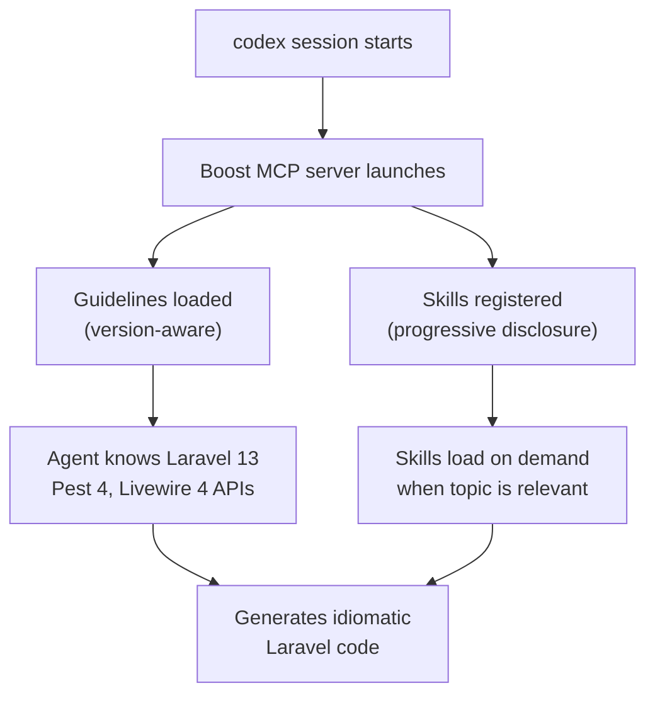

# Codex CLI for PHP and Laravel Teams: Boost MCP, Pest Workflows, and Composer Sandbox Patterns


---

PHP powers roughly 75% of websites with a known server-side language[^1], and Laravel remains the dominant framework — Laravel 13 shipped on 17 March 2026 with first-class AI-assisted development[^2]. Yet most Codex CLI guidance targets JavaScript, Python, or Go teams. This article fills that gap: configuring Codex CLI for PHP projects, from Composer sandbox workarounds to Laravel Boost MCP, Pest testing loops, and AGENTS.md templates.

## The PHP-Specific Challenge

Codex CLI's sandbox runs commands inside a restricted environment with filtered network access and no pre-installed PHP runtime on the default Linux sandbox[^3]. PHP teams hit three friction points that JavaScript teams never encounter:

1. **Composer needs network access** — `composer install` fetches packages from Packagist over HTTPS, which the sandbox blocks by default[^4].
2. **No PHP binary in the sandbox** — unlike Node.js (bundled with the Codex binary), PHP must be available on the host or installed explicitly[^3].
3. **Framework artisan commands need a database** — Laravel's `php artisan` commands frequently require a database connection, which complicates sandbox isolation.

The solutions below address each of these systematically.

## Sandbox and Network Configuration

### Enabling Composer in the Sandbox

The simplest approach: run `composer install` *before* launching Codex so `vendor/` is populated. For workflows requiring Composer during a session, configure network access explicitly:

```toml
# ~/.codex/config.toml — or project-level .codex/config.toml

[sandbox_workspace_write]
network_access = true
```

Alternatively, pass it as a flag:

```bash
codex --sandbox workspace-write \
  -c 'sandbox_workspace_write.network_access=true' \
  "Add spatie/laravel-permission and configure it"
```

For tighter control, use the `network_allowlist` to restrict traffic to Packagist and your private registry[^5]:

```toml
[sandbox_workspace_write]
network_access = true
network_allowlist = [
  "repo.packagist.org",
  "packagist.org",
  "getcomposer.org",
  "packages.your-company.com",
]
```

### Private Composer Packages

For private packages, use `deny_read` to protect credential files from agent access, and supply `COMPOSER_AUTH` as an environment variable[^6]:

```toml
deny_read = ["auth.json", ".env", ".env.local"]
```

```bash
export COMPOSER_AUTH='{"github-oauth":{"github.com":"ghp_YOUR_TOKEN"}}'
codex "Upgrade spatie/laravel-permission to v7"
```

## Laravel Boost MCP Integration

Laravel Boost is the framework's first-party MCP server with 15+ specialised tools and over 17,000 indexed pieces of Laravel ecosystem knowledge[^7]. It gives Codex awareness of your database schema, routes, configuration, and installed package versions.

### Installation

```bash
composer require laravel/boost --dev
php artisan boost:install
```

The interactive installer auto-detects your IDE and AI agents, generating configuration files for each[^7].

### Registering Boost with Codex CLI

```bash
codex mcp add laravel-boost -- php artisan boost:mcp
```

This registers the server globally. For project-scoped configuration, add to `.codex/config.toml` at the repository root[^8]:

```toml
[mcp_servers.laravel-boost]
command = "php"
args = ["artisan", "boost:mcp"]
```

### Available Tools

Once registered, Codex gains access to these tools during every session[^7]:

| Tool | Purpose |
|------|---------|
| `application-info` | PHP/Laravel versions, installed packages, Eloquent models |
| `database-schema` | Full schema inspection without raw SQL |
| `database-query` | Read-only queries for understanding data shape |
| `database-connections` | Inspect available connections and defaults |
| `search-docs` | Semantic search across 17,000+ Laravel docs |
| `last-error` | Latest application log entry |
| `read-log-entries` | Last N log entries for debugging |
| `browser-logs` | Console errors from frontend tooling |
| `get-absolute-url` | Convert relative paths to absolute URLs |

### AI Guidelines and Skills

Boost auto-generates version-aware guidelines for every installed package (Livewire 4.x, Inertia 3.x, Pest 4.x, Tailwind CSS 4.x)[^7], ensuring generated code follows current API surfaces. Agent skills load on demand via progressive disclosure[^9] — Boost ships skills for Livewire, Inertia, Pest, Tailwind CSS, Volt, Wayfinder, and Flux UI[^7].



## AGENTS.md Template for Laravel Projects

A well-crafted AGENTS.md dramatically improves Codex's output quality. The critical sections for PHP projects:

```markdown
# AGENTS.md

## Project Overview
Laravel 13 application using PHP 8.4, Pest 4 for testing, PHPStan level 8,
and Laravel Pint for code formatting.

## Build and Test Commands
- Install dependencies: `composer install && composer dump-autoload`
- Run tests: `./vendor/bin/pest`
- Static analysis: `./vendor/bin/phpstan analyse`
- Format: `./vendor/bin/pint`
- Clear caches: `php artisan optimize:clear`

## Code Conventions
- PSR-12 enforced by Pint; PHP 8.4 features (property hooks, `#[Override]`)
- Type everything — no `mixed` unless genuinely polymorphic
- Thin controllers delegating to action classes
- Form Requests for validation; Resources for API responses

## Testing Standards
- Pest tests with `describe()` blocks; `RefreshDatabase` for DB tests
- Mock external APIs with `Http::fake()`

## Do NOT
- Add packages without approval; never run `composer update`
- Modify `.env` files or use raw SQL
```

Add project-specific Laravel guidelines in `.ai/guidelines/` — Boost auto-discovers these alongside its own version-aware guidelines[^7].

## Testing Workflows with Pest

Pest is the dominant testing framework in the Laravel ecosystem as of 2026, with Pest 4 introducing parallel execution, type-safe expectations, and improved architecture testing[^10].

### The Test-Driven Loop

The most effective Codex CLI pattern for PHP is the same test-driven workflow used in other languages, adapted for Pest:

```bash
codex "Write Pest tests for the OrderService::calculateTotal method,
covering standard orders, discount codes, and tax-exempt customers.
Then implement the method to make all tests pass.
Run: ./vendor/bin/pest --filter=OrderService"
```

Codex will iterate: write tests, run them (they fail), write the implementation, run them again (they pass), then run PHPStan to verify type safety.

### PAO: Agent-Optimised Output for PHP Tools

PAO (nunomaduro/pao) is a Composer package that intercepts output from PHPUnit, Pest, PHPStan, and Laravel Artisan when running inside an AI agent, replacing verbose terminal formatting with compact structured JSON[^11].

```bash
composer require nunomaduro/pao --dev
```

The token savings are significant[^11]:

| Tool | Standard output | PAO output | Reduction |
|------|----------------|------------|-----------|
| PHPUnit (pass) | ~402 tokens | ~21 tokens | 95% |
| Pest (pass) | ~277 tokens | ~21 tokens | 93% |
| PHPStan (errors) | ~250 tokens | ~100 tokens | 60% |
| Artisan `about` | ~528 tokens | ~134 tokens | 74% |

PAO requires PHP 8.3+ and activates automatically when it detects an AI agent environment[^11]. ⚠️ PAO does not yet detect Codex CLI explicitly — verify activation by checking whether test output appears as JSON during a session.

## Static Analysis Integration

PHPStan at level 8 catches type errors and API misuse that Codex might introduce. Use `--error-format=json` for machine-readable output that Codex parses more reliably than the default table format. Combined with PAO, PHPStan runs cost approximately 100 tokens per invocation[^11]. Pair with `./vendor/bin/pint --test` as a formatting gate.

## CI Integration with codex exec

Use `codex exec` for non-interactive PHP automation in CI pipelines:

```bash
codex exec --full-auto \
  "Create a migration that adds a 'subscription_tier' enum column
   to the users table with values: free, pro, enterprise.
   Default to 'free'. Add an index.
   Run: php artisan migrate --pretend to verify SQL."
```

For GitHub Actions, pair `shivammathur/setup-php@v2` with `openai/codex-action@v1` to run automated Laravel code reviews on pull requests.

## Model Selection

GPT-5.5 (the current default) handles Laravel's conventions well with Boost guidelines providing context[^12]. Adjust reasoning effort by task complexity:

```bash
# Quick migration — low reasoning effort
codex -c reasoning_effort=low \
  "Create a migration adding a polymorphic comments system"

# Complex refactoring — high reasoning effort
codex -c reasoning_effort=high \
  "Refactor the payment module to action classes"
```

## Common Pitfalls

**Composer autoload drift.** After Codex creates new classes, the autoloader may not find them until `composer dump-autoload` runs. Include this in your AGENTS.md build commands.

**Artisan cache.** Codex may see stale behaviour if cached routes, config, or views exist. Add `php artisan optimize:clear` to AGENTS.md.

**Database state.** Always use `RefreshDatabase` in Pest tests to prevent state leaking between Codex-driven test runs.

**Blade templates.** Codex cannot render Blade directly — use `/review` for template changes, or pair with the Chrome DevTools MCP[^13].

## Citations

[^1]: W3Techs, "Usage of server-side programming languages for websites," https://w3techs.com/technologies/overview/programming_language — accessed April 2026.

[^2]: Laravel, "AI Assisted Development — Laravel 13.x," https://laravel.com/docs/13.x/ai — accessed April 2026.

[^3]: OpenAI, "Sandbox — Codex Concepts," https://developers.openai.com/codex/concepts/sandboxing — accessed April 2026.

[^4]: GitHub Issue #16242, "codex-network-proxy doesn't work with exec and interactive mode," https://github.com/openai/codex/issues/16242 — accessed April 2026.

[^5]: OpenAI, "Agent approvals and security — Codex," https://developers.openai.com/codex/agent-approvals-security — accessed April 2026.

[^6]: OpenAI, "Codex CLI filesystem security — deny-read policies," https://developers.openai.com/codex/agent-approvals-security — accessed April 2026.

[^7]: Laravel, "Laravel Boost — Laravel 13.x Documentation," https://laravel.com/docs/13.x/boost — accessed April 2026.

[^8]: OpenAI, "MCP configuration — Codex CLI," https://developers.openai.com/codex/mcp — accessed April 2026.

[^9]: OpenAI, "Agent Skills — Codex," https://developers.openai.com/codex/skills — accessed April 2026.

[^10]: Pest PHP, "Pest 4 Documentation," https://pestphp.com/docs — accessed April 2026.

[^11]: Nuno Maduro, "PAO — Agent-Optimized PHP Output," https://github.com/nunomaduro/pao — accessed April 2026.

[^12]: OpenAI, "Models — Codex," https://developers.openai.com/codex/models — accessed April 2026.

[^13]: OpenAI, "Features — Codex CLI," https://developers.openai.com/codex/cli/features — accessed April 2026.
