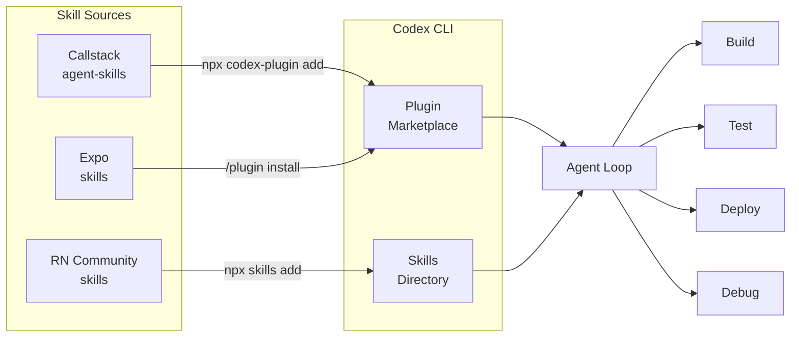
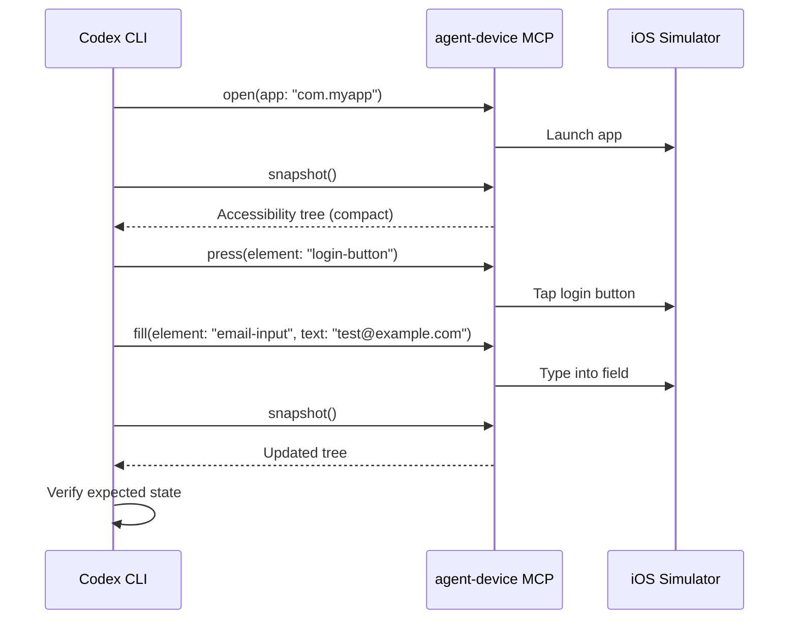
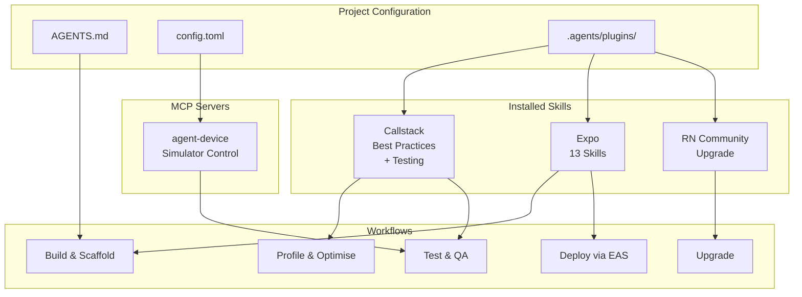

# Codex CLI for React Native and Expo: First-Party Skills, Plugins, and Mobile Development Workflows


---

React Native and Expo have always attracted developers who want to move fast. In 2026, that ethos extends to AI-assisted development: both Callstack and Expo now ship first-party Codex CLI plugins and skills that teach the agent how to build, test, deploy, and debug mobile applications correctly. Combined with the community's `react-native-community/skills` repository and Callstack's `agent-device` CLI for simulator automation, Codex CLI can now operate across the full mobile development lifecycle — from scaffolding a new Expo Router project to running exploratory QA on a connected device.

This article maps the ecosystem, shows how to wire everything together in a single `config.toml`, and walks through the workflows that emerge when you combine these tools.

## The Mobile Skills Landscape

Three independent skill sources now target React Native developers using Codex CLI:



### Callstack Agent Skills

Callstack, the largest dedicated React Native consultancy, released two Codex plugins on 27 March 2026[^1]. The repository at `callstackincubator/agent-skills` packages five core skills into two installable bundles:

| Plugin | Skills Included | Focus |
|--------|----------------|-------|
| **Building React Native Apps** | `react-native-best-practices`, Vercel patterns, `upgrading-react-native` | Performance profiling, architecture, version upgrades |
| **Testing React Native Apps** | `react-native-testing`, `agent-device`, `dogfood` | Unit/integration testing, simulator automation, exploratory QA |

Each skill follows a standardised directory layout with a `SKILL.md` reference document, an `agents/openai.yaml` metadata file for Codex discovery, and a `references/` directory containing topic-specific guidance[^2].

The repository also carries marketplace configuration for both Codex (`.agents/plugins/marketplace.json`) and Claude Code (`.claude-plugin/marketplace.json`), making it one of the few skill repositories that ships cross-agent compatibility out of the box[^2].

### Expo Official Skills

Expo ships 13 agent skills from the `expo/skills` repository, covering the full Expo application lifecycle[^3]:

| Skill | Scope |
|-------|-------|
| `building-native-ui` | Expo Router, navigation, animations, SF Symbols |
| `expo-api-routes` | Server-side API routes with Expo Router and EAS Hosting |
| `expo-cicd-workflows` | EAS Workflow YAML authoring |
| `expo-deployment` | App Store, Play Store, web, and API route publishing |
| `expo-dev-client` | Development client builds and distribution |
| `expo-module` | Native modules via the Expo Modules API |
| `expo-tailwind-setup` | Tailwind CSS v4 configuration |
| `expo-ui-jetpack-compose` | Jetpack Compose views in React Native |
| `expo-ui-swift-ui` | SwiftUI views in React Native |
| `native-data-fetching` | Network requests and data fetching patterns |
| `upgrading-expo` | SDK version upgrade management |
| `use-dom` | Web code in native webviews via DOM components |
| `eas-update-insights` | OTA update health metrics monitoring |

The skills are marked Production Ready as of January 2026, targeting React Native 0.81.5, Expo SDK 54, and React 19.2[^4]. Skills are auto-discovered by Codex based on their descriptions, meaning they activate implicitly when the agent detects an Expo project in the working directory.

### React Native Community Skills

The `react-native-community/skills` repository provides a narrower but important skill: `upgrade-react-native`[^5]. This skill fetches diffs from the React Native Upgrade Helper and applies them programmatically — a task that has historically been one of the most painful parts of React Native maintenance.

## Installation and Configuration

### Installing All Three Sources

```bash
# Callstack plugins (global)
npx codex-plugin add callstackincubator/agent-skills

# Callstack plugins (project-local)
npx codex-plugin add callstackincubator/agent-skills --project

# Expo skills via plugin marketplace (inside Codex TUI)
# /plugin marketplace add expo/skills
# /plugin install expo

# React Native Community skills
npx skills add react-native-community/skills
```

### Config.toml Integration

To make Callstack's `agent-device` available as an MCP server for simulator interaction, add it to your project-level or global configuration:

```toml
[mcp_servers.agent-device]
command = "npx"
args = ["agent-device", "mcp"]
```

This exposes the full device-control surface — `snapshot`, `press`, `fill`, `scroll`, `open`, `close` — as MCP tools that Codex can call during its agent loop[^6].

### AGENTS.md for React Native Projects

A well-structured `AGENTS.md` grounds the agent in your project's conventions. Here is a template that works with the skills above:

```markdown
# React Native Project Agent Instructions

## Stack
- React Native 0.81 with Expo SDK 54
- Expo Router for navigation
- TypeScript strict mode
- React Native Testing Library for component tests

## Build & Run
- `npx expo start` — development server
- `npx expo run:ios` — iOS build
- `npx expo run:android` — Android build
- `eas build --profile development` — cloud build

## Testing
- `npm test` — unit and component tests
- `npm run test:e2e` — Detox end-to-end tests
- Use agent-device for simulator interaction when E2E isn't needed

## Conventions
- Components in `src/components/`, screens in `src/screens/`
- Use Expo Router file-based routing (app/ directory)
- Follow React Native performance best practices from Callstack skills
- All new components must have corresponding test files
```

## Key Workflows

### 1. Scaffold and Build

With the `building-native-ui` and `expo-api-routes` skills active, Codex can scaffold a complete feature from a description:

```bash
codex "Add a user profile screen at /profile that fetches user data
from our /api/user endpoint, displays avatar, name, and bio,
and follows our existing navigation patterns"
```

The agent reads the Expo Router file structure, creates the route file in `app/profile.tsx`, generates the API route in `app/api/user+api.ts`, and wires them together — all informed by the skill's guidance on Expo Router conventions[^3].

### 2. Performance Profiling Loop

Callstack's `react-native-best-practices` skill encodes their production profiling methodology[^1]. The skill covers JavaScript/React profiling, native-layer profiling for both iOS and Android, startup time optimisation, rendering performance, memory management, and bundle size reduction. A typical workflow:

```bash
codex "Profile the FlatList on the home screen. It's janky when
scrolling through 500+ items. Check JS thread, UI thread, and
memory. Propose fixes following the Callstack performance guide."
```

The agent uses the skill's reference materials covering `js-profiling.md`, `native-profiling.md`, and `rendering-performance.md` to structure its investigation systematically rather than guessing[^2].

### 3. Automated Device Testing with agent-device

The `agent-device` CLI provides programmatic control over iOS simulators and Android emulators[^6]. When exposed as an MCP server, Codex can:

1. Launch the app with `open`
2. Inspect the accessibility tree with `snapshot`
3. Interact with UI elements using `press`, `fill`, and `scroll`
4. Capture performance metrics with `perf`
5. Compare UI states with `diff snapshot`
6. Record interaction flows as replayable `.ad` scripts



The `dogfood` skill builds on `agent-device` to run exploratory QA — effectively turning Codex into an automated tester that navigates the app, tries edge cases, and reports issues[^1].

### 4. React Native Version Upgrades

Upgrading React Native across major versions remains one of the most dreaded tasks in the ecosystem. The combination of Callstack's `upgrading-react-native` skill and the React Native Community's `upgrade-react-native` skill provides two complementary approaches[^2][^5]:

- **Callstack's skill** provides templates for handling dependency alignment, platform-specific changes, and common upgrade pitfalls
- **Community skill** fetches diffs from the Upgrade Helper and applies them programmatically, invokable with `/upgrade-react-native <version>`

A practical upgrade workflow:

```bash
codex "Upgrade this project from React Native 0.79 to 0.81.
Use the upgrade helper diffs. Run the test suite after each
major change. Fix any breaking changes following the
upgrading-react-native skill guidance."
```

### 5. Expo Deployment Pipeline

The `expo-deployment` and `expo-cicd-workflows` skills encode the full EAS deployment pipeline[^3]. Codex can generate and modify EAS workflow YAML files, configure build profiles, manage app signing, and trigger submissions to the App Store and Play Store — all from natural language instructions.

```bash
codex exec -p "Generate an EAS workflow that builds iOS and Android
on every push to main, runs our test suite first, and submits
to TestFlight and Play Store internal testing track" \
--output-schema eas-workflow.schema.json
```

## Cross-Agent Compatibility

A notable architectural decision across all three skill sources is cross-agent support. The Callstack repository ships configuration for Codex, Claude Code, Cursor, and Gemini CLI simultaneously[^2]. Expo skills work with Claude Code, Cursor, Codex, and generic agents[^3]. This means teams using a mixed-agent stack — perhaps Codex CLI in CI/CD and Cursor in the IDE — can share the same skill definitions without duplication.

The skill format itself is converging on a de facto standard: a `SKILL.md` file containing structured instructions, with optional platform-specific metadata files (`agents/openai.yaml`, `.mdc` for Cursor rules)[^2].

## Limitations and Considerations

**agent-device platform requirements**: The `agent-device` CLI requires Xcode and/or Android Studio with appropriate SDK installations. On CI runners, you need macOS runners for iOS simulator access[^6].

**Skill version pinning**: ⚠️ Expo skills target specific SDK versions (currently SDK 54). When Expo ships a new SDK, skills may lag behind — check the `expo/skills` repository for compatibility before upgrading.

**Token cost**: The combined skill surface from all three sources is substantial. Callstack's `react-native-best-practices` skill alone includes multiple reference documents with profiler screenshots. On smaller models or constrained budgets, consider installing only the plugins you actively need rather than all three sources simultaneously.

**agent-device MCP overhead**: Running the simulator through MCP adds latency compared to direct Detox or Maestro E2E tests. Use `agent-device` for exploratory testing and quick verification, not as a replacement for your existing E2E test suite.

## Putting It All Together

The React Native mobile development stack for Codex CLI in April 2026 looks like this:



For teams already using Codex CLI, adding React Native expertise is now a matter of installing three plugin sources and adding an MCP server entry. The skills encode years of mobile development best practices — from Callstack's production performance patterns to Expo's deployment pipeline — making Codex a substantially more capable mobile development partner than it is out of the box.

## Citations

[^1]: Callstack, "Announcing Codex Plugins for React Native Development," callstack.com, 27 March 2026. [https://www.callstack.com/blog/announcing-codex-plugins-for-react-native-development](https://www.callstack.com/blog/announcing-codex-plugins-for-react-native-development)

[^2]: Callstack Incubator, "agent-skills: A collection of agent-optimized React Native skills for AI coding assistants," GitHub. [https://github.com/callstackincubator/agent-skills](https://github.com/callstackincubator/agent-skills)

[^3]: Expo, "Expo Skills for AI agents," Expo Documentation. [https://docs.expo.dev/skills/](https://docs.expo.dev/skills/)

[^4]: AgentSkills.so, "building-native-ui by expo/skills," agentskills.so, January 2026. [https://skills.sh/expo/skills/building-native-ui](https://skills.sh/expo/skills/building-native-ui)

[^5]: React Native Community, "Agent skills for React Native Community," GitHub. [https://github.com/react-native-community/skills](https://github.com/react-native-community/skills)

[^6]: Callstack Incubator, "agent-device: CLI to control iOS and Android devices for AI agents," GitHub. [https://github.com/callstackincubator/agent-device](https://github.com/callstackincubator/agent-device)
