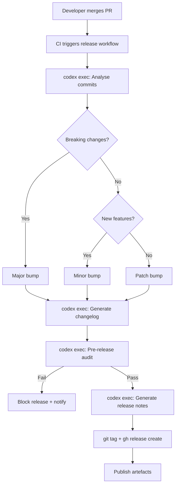

# Codex CLI for Release Engineering: Automated Changelogs, Semantic Versioning, and Release Note Generation


---

Release engineering is one of those disciplines that every team acknowledges as important yet few invest in properly. Version bumps are manual, changelogs are either auto-generated walls of commit hashes or hand-curated afterthoughts, and release notes aimed at end-users are written at 11 pm on a Friday. Codex CLI changes this by bringing agentic reasoning to the release pipeline — it can read your git history, understand the *intent* behind changes, and produce structured, audience-appropriate release artefacts.

This article covers five concrete patterns for integrating Codex CLI into your release workflow: changelog generation from git history, semantic version determination, user-facing release note authorship, release validation gates, and fully automated release pipelines via GitHub Actions.

## Why Agents Beat Templates for Release Engineering

Traditional changelog tools like `conventional-changelog`, `standard-version`, and `semantic-release` parse commit messages against the Conventional Commits specification[^1] and map prefixes (`feat:`, `fix:`, `chore:`) to version bumps and changelog sections. They work well when every contributor writes perfect commit messages. In practice, they don't.

A 2026 study of 500 open-source repositories found that only 34% of projects using Conventional Commits achieved >90% compliance across all contributors[^2]. The remaining 66% produced changelogs with orphaned entries, miscategorised fixes, and missing breaking-change annotations. An agent can do what a regex cannot: read the diff, understand the change, and classify it correctly regardless of what the commit message says.

## Pattern 1: Changelog Generation with `codex exec`

The simplest integration pipes `git log` into `codex exec` and captures the output:

```bash
git log --oneline v1.4.0..HEAD | \
  codex exec "Generate a changelog in Keep a Changelog format. \
  Group entries under Added, Changed, Deprecated, Removed, Fixed, Security. \
  Omit chore/CI-only commits. Use past tense." \
  -o changelog-draft.md
```

This produces a human-readable changelog draft, but the agent is working from commit messages alone. For higher accuracy, give it the diffs:

```bash
git log --format='%H %s' v1.4.0..HEAD | while read hash msg; do
  echo "## $msg"
  git diff "$hash^" "$hash" --stat
  echo ""
done | codex exec "Generate a changelog in Keep a Changelog format. \
  Use the diff stats to verify commit message accuracy. \
  Flag any commit where the message doesn't match the actual changes." \
  -o changelog-draft.md
```

For large repositories, you may hit context limits. The `--model gpt-5.5` flag gives you access to the 400K-token Codex context window[^3], but for truly massive release cycles, pre-filter with `git log --no-merges --first-parent`.

## Pattern 2: Semantic Version Determination with `--output-schema`

The `--output-schema` flag forces Codex to return structured JSON conforming to a schema you define[^4]. This is ideal for version determination in CI pipelines where downstream steps need machine-readable output.

Create a schema file:

```json
{
  "$schema": "https://json-schema.org/draft/2020-12/schema",
  "type": "object",
  "properties": {
    "bump_type": {
      "type": "string",
      "enum": ["major", "minor", "patch", "none"]
    },
    "new_version": { "type": "string" },
    "breaking_changes": {
      "type": "array",
      "items": { "type": "string" }
    },
    "reasoning": { "type": "string" }
  },
  "required": ["bump_type", "new_version", "breaking_changes", "reasoning"]
}
```

Then run:

```bash
CURRENT_VERSION=$(git describe --tags --abbrev=0)
git log --format='%s%n%b' "$CURRENT_VERSION"..HEAD | \
  codex exec "Given these commits since $CURRENT_VERSION, determine the \
  semantic version bump following semver.org rules. A BREAKING CHANGE \
  in any commit body or a ! after the type means major. New features \
  mean minor. Bug fixes mean patch. Return the result." \
  --output-schema ./version-schema.json \
  -o version-result.json
```

The output is guaranteed to match your schema, so `jq .new_version version-result.json` always works in your pipeline[^4].

## Pattern 3: User-Facing Release Notes

Changelogs are for developers. Release notes are for users. The distinction matters, and Codex handles it well because you can provide audience context:

```bash
codex exec "Read CHANGELOG.md and generate user-facing release notes for \
  version 2.5.0. Target audience: product managers and non-technical \
  stakeholders. Lead with the most impactful user-visible changes. \
  Omit internal refactors and dependency bumps. Use bullet points. \
  Include a one-sentence summary at the top." \
  --full-auto \
  -o release-notes-2.5.0.md
```

For projects with multiple audiences, chain `codex exec` calls:

```bash
# Technical release notes
codex exec "Generate technical release notes from CHANGELOG.md for v2.5.0. \
  Include API changes, migration steps, and deprecation notices." \
  -o release-notes-technical.md

# User-facing release notes
codex exec "Generate user-facing release notes from CHANGELOG.md for v2.5.0. \
  Focus on new capabilities and fixed issues. No jargon." \
  -o release-notes-user.md
```

## Pattern 4: Pre-Release Validation Gate

Before tagging a release, Codex can verify that the codebase is actually ready. This pattern uses hooks and `codex exec` to run a pre-release checklist:

```bash
codex exec "Perform a pre-release audit for version 2.5.0: \
  1. Check that CHANGELOG.md has an entry for 2.5.0 \
  2. Verify package.json/Cargo.toml/pyproject.toml version matches 2.5.0 \
  3. Confirm no TODO or FIXME comments reference 2.5.0 blockers \
  4. Check that all public API changes have documentation updates \
  5. Verify no console.log/print statements in production code paths \
  Report pass/fail for each check with file:line references for failures." \
  --full-auto \
  --output-schema ./audit-schema.json \
  -o audit-result.json
```

The structured output lets your CI pipeline gate on the result:

```bash
PASS_COUNT=$(jq '[.checks[] | select(.status == "pass")] | length' audit-result.json)
TOTAL=$(jq '.checks | length' audit-result.json)
if [ "$PASS_COUNT" -ne "$TOTAL" ]; then
  echo "Pre-release audit failed: $PASS_COUNT/$TOTAL checks passed"
  exit 1
fi
```

## Pattern 5: Full Release Pipeline in GitHub Actions

The following workflow combines all four patterns into a single GitHub Actions pipeline triggered by a `workflow_dispatch` event:


```yaml
name: Automated Release
on:
  workflow_dispatch:
    inputs:
      dry_run:
        description: 'Dry run (no tag/publish)'
        type: boolean
        default: true

jobs:
  release:
    runs-on: ubuntu-latest
    permissions:
      contents: write
    steps:
      - uses: actions/checkout@v4
        with:
          fetch-depth: 0

      - uses: openai/codex-action@v1
        with:
          codex_api_key: ${{ secrets.CODEX_API_KEY }}

      - name: Determine version
        run: |
          CURRENT=$(git describe --tags --abbrev=0 2>/dev/null || echo "v0.0.0")
          git log --format='%s%n%b' "$CURRENT"..HEAD | \
            codex exec "Determine semantic version bump from $CURRENT. \
            Follow semver.org strictly." \
            --output-schema ./ci/version-schema.json \
            -o version.json
          echo "NEW_VERSION=$(jq -r .new_version version.json)" >> "$GITHUB_ENV"

      - name: Generate changelog
        run: |
          CURRENT=$(git describe --tags --abbrev=0 2>/dev/null || echo "v0.0.0")
          git log --oneline "$CURRENT"..HEAD | \
            codex exec "Generate a Keep a Changelog entry for $NEW_VERSION." \
            -o changelog-entry.md

      - name: Pre-release audit
        run: |
          codex exec "Audit codebase readiness for $NEW_VERSION release. \
            Check version strings, changelog, docs, and code quality." \
            --full-auto \
            --output-schema ./ci/audit-schema.json \
            -o audit.json
          jq -e '[.checks[] | select(.status == "fail")] | length == 0' audit.json

      - name: Generate release notes
        run: |
          codex exec "Write user-facing release notes for $NEW_VERSION \
            from changelog-entry.md. One summary sentence, then bullets." \
            -o release-notes.md

      - name: Tag and publish
        if: ${{ !inputs.dry_run }}
        run: |
          git tag -a "$NEW_VERSION" -m "Release $NEW_VERSION"
          git push origin "$NEW_VERSION"
          gh release create "$NEW_VERSION" \
            --title "$NEW_VERSION" \
            --notes-file release-notes.md
```


## AGENTS.md Template for Release Repositories

Add a release-specific section to your project's AGENTS.md:

```markdown
## Release Engineering

### Versioning
- This project follows Semantic Versioning 2.0.0 (semver.org)
- Commit messages follow Conventional Commits 1.0.0
- Version source of truth: package.json (Node) / Cargo.toml (Rust) / pyproject.toml (Python)

### Changelog
- Format: Keep a Changelog (keepachangelog.com)
- File: CHANGELOG.md at repository root
- Every user-visible change MUST have a changelog entry
- Group under: Added, Changed, Deprecated, Removed, Fixed, Security

### Release Checklist
- All version strings updated consistently
- CHANGELOG.md entry present for the new version
- No FIXME/TODO referencing release blockers
- Public API changes documented
- Migration guide written for breaking changes

### Prohibited
- Never skip the changelog for a release
- Never use a version number that doesn't follow semver
- Never tag a release without passing CI
```

## Architecture: Where Codex Fits in the Release Flow



## Cost and Performance Considerations

Release engineering tasks are infrequent and low-volume compared to coding tasks, making them ideal candidates for higher reasoning effort. A typical release pipeline with all five patterns uses approximately 15,000-30,000 input tokens and 3,000-5,000 output tokens per run[^5]. At GPT-5.5 pricing, that's roughly \$0.15-0.30 per release — negligible compared to the engineering time saved.

For projects with very large commit histories between releases (>500 commits), consider:

- **Pre-filtering**: Use `git log --no-merges --first-parent` to reduce noise
- **Chunked processing**: Split the commit list and process in batches with `codex exec resume`
- **Model selection**: Use `gpt-5.5` for version determination (needs reasoning) and `o4-mini` for changelog formatting (needs speed)[^6]

## Combining with Existing Tools

Codex CLI doesn't replace your entire release toolchain — it augments it. The sweet spot is using Codex for the *judgement-intensive* parts (version determination, changelog writing, release note authorship) whilst keeping deterministic tools for the *mechanical* parts (tagging, publishing, artefact building).

A practical hybrid stack:

| Task | Tool | Rationale |
|------|------|-----------|
| Version determination | `codex exec` + `--output-schema` | Handles non-compliant commits |
| Changelog generation | `codex exec` | Understands intent, not just prefixes |
| Release note authorship | `codex exec` | Audience-aware writing |
| Git tagging | `git tag` / `gh release` | Deterministic, auditable |
| Package publishing | `npm publish` / `cargo publish` | Ecosystem-specific tooling |
| Notification | Slack webhook / email | Existing infrastructure |

## Known Limitations

- **Commit message hallucination**: Codex may infer intent that doesn't match the actual change. Always review generated changelogs before publishing. The `--sandbox read-only` default for `codex exec` prevents the agent from modifying files unless explicitly permitted[^4].
- **Version string updates**: `codex exec --full-auto` can update version strings in `package.json` or `Cargo.toml`, but this requires careful scoping. Use hooks to validate that only expected files were modified.
- **Large monorepo releases**: For monorepos with independent package versions, you'll need per-package `codex exec` invocations. The `--cd` flag or `--add-dir` can scope each run appropriately[^7].

## Citations

[^1]: [Conventional Commits Specification v1.0.0](https://www.conventionalcommits.org/en/v1.0.0/)
[^2]: [Flori.dev — Generating CHANGELOG.md from Conventional Commits](https://flori.dev/reads/changelogen-ai-agent/) — analysis of commit compliance rates across open-source projects.
[^3]: [OpenAI GPT-5.5 Announcement](https://openai.com/index/introducing-gpt-5-5/) — confirms 1M API context window, 400K in Codex.
[^4]: [OpenAI Codex Non-Interactive Mode Documentation](https://developers.openai.com/codex/noninteractive) — covers `codex exec`, `--output-schema`, `-o`, and sandbox defaults.
[^5]: Token estimates based on typical release pipelines processing 50-200 commits with diff stats. Actual usage varies. Codex CLI v0.125 reports reasoning-token usage via `codex exec --json` for precise measurement.
[^6]: [OpenAI Codex Models Page](https://developers.openai.com/codex/cli) — model selection guidance for different task profiles.
[^7]: [OpenAI Codex CLI Reference — Command Line Options](https://developers.openai.com/codex/cli/reference) — `--cd` and `--add-dir` flags for multi-directory scoping.
