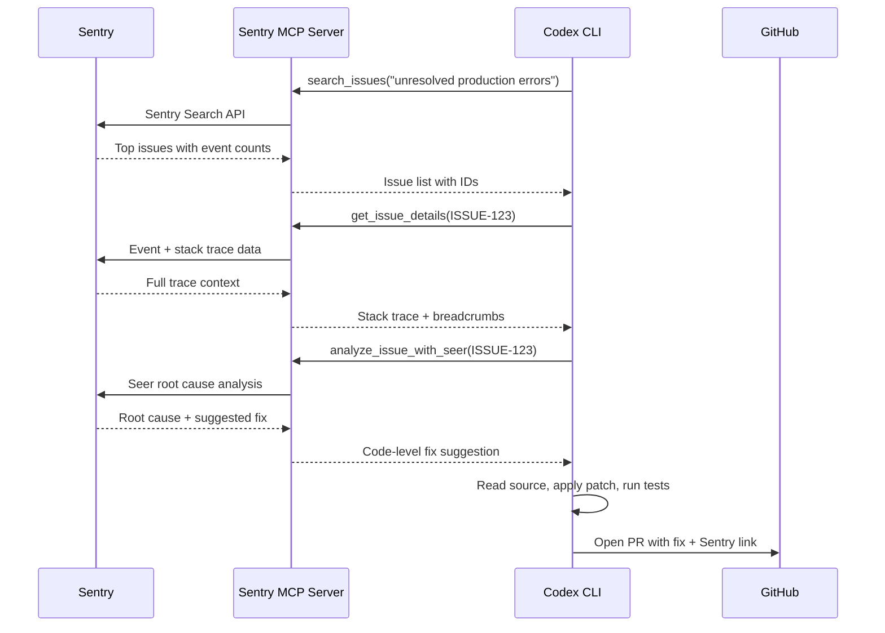
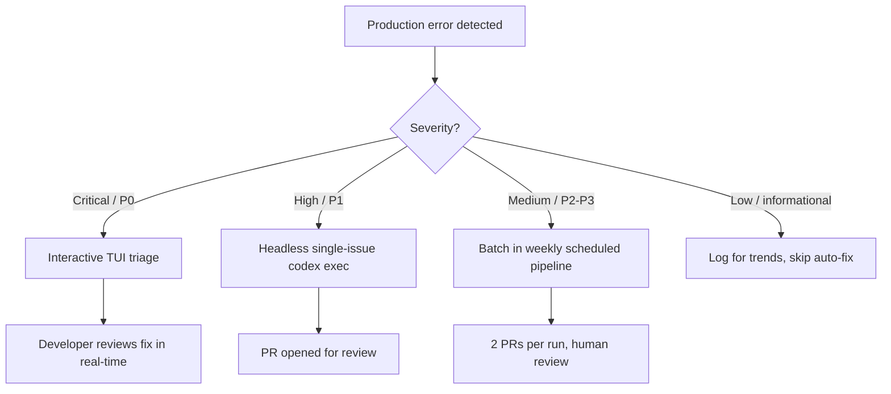

# Codex CLI and Sentry MCP: Closed-Loop Error Triage and Automated Fix Pipelines


---

Production errors are a fact of engineering life, but the manual loop of *receive alert → open Sentry → read stack trace → find code → hypothesise → fix → deploy → verify* burns hours that compound across teams. With Sentry's official MCP server[^1] and Codex CLI's stable hooks and `codex exec` pipeline[^2], you can collapse that loop into a single agent-driven workflow — from issue detection to pull request — with full human review at the gate.

This article builds three progressively more autonomous patterns: interactive TUI triage, headless single-issue remediation, and scheduled batch pipelines.

## Why Sentry + Codex CLI Is a Natural Pairing

Sentry captures the *what* — stack traces, breadcrumbs, transaction traces, release correlation — but cannot touch your codebase. Codex CLI owns the *how* — reading source, applying patches, running tests — but lacks production telemetry. The MCP bridge closes the gap: Codex calls Sentry tools to pull issue context, then uses its own sandbox to implement and validate fixes[^3].

Sentry's Seer AI debugger adds a third dimension. Seer performs root cause analysis using error telemetry, commit history, and trace data, returning code-level explanations with specific file locations and line numbers[^4]. When Codex receives a Seer analysis, it has a head start — a hypothesis with evidence — rather than starting from a raw stack trace.



## Setting Up the Sentry MCP Server

Sentry offers two transport modes. The **hosted Streamable HTTP** server at `https://mcp.sentry.dev/mcp` uses OAuth and requires zero local installation[^1]. The **stdio** transport runs locally via `npx @sentry/mcp-server` and is required for self-hosted Sentry instances[^5].

### Hosted (Cloud Sentry)

The quickest path is the CLI one-liner:

```bash
codex mcp add sentry --url https://mcp.sentry.dev/mcp
```

Codex opens an OAuth device-code flow in your browser. During authentication, you select which tool groups to expose — issues, projects, performance, and Seer analysis[^1].

To scope the server to a single organisation and project (recommended for reducing noise):

```toml
[mcp_servers.sentry]
url = "https://mcp.sentry.dev/mcp/my-org/my-project"
startup_timeout_sec = 15
tool_timeout_sec = 30
```

### Stdio (Self-Hosted Sentry)

Self-hosted instances require a User Auth Token with scopes `org:read`, `project:read`, `project:write`, `team:read`, `team:write`, and `event:write`[^5]:

```toml
[mcp_servers.sentry]
command = "npx"
args = ["-y", "@sentry/mcp-server@latest"]
env_vars = ["SENTRY_ACCESS_TOKEN"]

[mcp_servers.sentry.env]
SENTRY_HOST = "https://sentry.internal.example.com"
EMBEDDED_AGENT_PROVIDER = "openai"
```

The `EMBEDDED_AGENT_PROVIDER` variable is required for the natural-language search tools (`search_issues`, `search_events`), which use an LLM to translate queries into Sentry's search syntax[^5]. Set it to `openai` and ensure `OPENAI_API_KEY` is available in your environment.

### Verification

After configuration, launch Codex CLI and type `/mcp` to confirm the server is connected. The output should list Sentry's tools — typically 16–20, depending on your plan and enabled features[^6].

## The Sentry MCP Tool Inventory

Understanding which tools to call — and when — is essential for building reliable pipelines.

| Tool | Purpose | When to Use |
|------|---------|-------------|
| `search_issues` | Natural-language issue search | Starting point: "unresolved errors in production this week" |
| `search_events` | Query raw events across projects | Incident correlation, anomaly investigation |
| `get_issue_details` | Full stack trace, tags, breadcrumbs | After identifying a specific issue ID |
| `analyze_issue_with_seer` | AI root cause analysis with code suggestions | Error-type issues where Seer can inspect commits[^4] |
| `list_projects` | Enumerate projects in an organisation | Discovery, CI pipeline scoping |
| `get_project_dsn` | Retrieve DSN for a project | Setting up new integrations |

⚠️ Sentry's MCP server is **read-only** — it cannot create, update, or delete anything in your Sentry account[^7]. All mutations happen on the Codex CLI side.

## Pattern 1: Interactive TUI Triage

The simplest workflow uses Codex CLI's interactive TUI with Sentry MCP as a context source. No automation, no scripts — just a developer triaging production issues with agent assistance.

```bash
codex "Look at the top 5 unresolved errors in production for the
  payments service this week. For the highest-impact one, pull the
  full stack trace, run Seer analysis, find the root cause in our
  codebase, and propose a fix. Don't apply it yet — show me the
  diff first."
```

Codex calls `search_issues`, identifies the top error by event count, calls `get_issue_details` for the stack trace, invokes `analyze_issue_with_seer` for root cause analysis, then searches your local codebase for the relevant files. The result is a proposed patch you review before approving.

**Tips for effective interactive triage:**

- **Scope aggressively.** Include project name, environment, and time window in your prompt. Sentry's search API does not support boolean operators (`OR`, `AND`), so each query should target one issue type[^7].
- **Use `/side` for exploratory questions.** If you want to understand a trace without cluttering your main thread, open a side conversation.
- **Attach screenshots.** If the error manifests visually, use `codex -i screenshot.png` alongside the Sentry context for a combined visual + telemetry diagnosis.

## Pattern 2: Headless Single-Issue Remediation

When your on-call rotation surfaces a Sentry alert at 2 AM, you want a one-liner that produces a reviewable PR — not a 45-minute interactive session.

```bash
codex exec \
  --model gpt-5.5 \
  --sandbox full-auto \
  "Sentry issue PROJ-4521 is firing in production.
   1. Call get_issue_details to pull the full stack trace and event context.
   2. Call analyze_issue_with_seer for root cause analysis.
   3. Find the affected files in this repository.
   4. Implement the minimal fix that addresses the root cause.
   5. Run the test suite (npm test) and fix any regressions.
   6. Create a git branch fix/sentry-PROJ-4521, commit with message
      'fix: resolve PROJ-4521 — <one-line description>', and push.
   Do NOT merge. Output a JSON summary with fields: issue_id, root_cause,
   files_changed, tests_passed." \
  --output-schema ./schemas/sentry-fix.json
```

The `--output-schema` flag constrains the final response to a JSON Schema, making the output parseable by downstream tooling[^2]. A minimal schema:

```json
{
  "type": "object",
  "properties": {
    "issue_id": { "type": "string" },
    "root_cause": { "type": "string" },
    "files_changed": {
      "type": "array",
      "items": { "type": "string" }
    },
    "tests_passed": { "type": "boolean" },
    "branch_name": { "type": "string" }
  },
  "required": ["issue_id", "root_cause", "files_changed", "tests_passed"],
  "additionalProperties": false
}
```

### AGENTS.md Template for Sentry Workflows

Ground the agent with a Sentry-specific AGENTS.md section:

```markdown
## Sentry Error Remediation

- Always call `get_issue_details` before attempting a fix
- Prefer Seer analysis (`analyze_issue_with_seer`) for error-type issues
- For performance issues, Seer may not return a fix — fall back to trace data analysis
- Never modify test files to make failing tests pass; fix the source code
- Commit messages must reference the Sentry issue ID (e.g. PROJ-4521)
- Run the full test suite before pushing; if tests fail, iterate up to 3 times
- Do not deploy or merge; always push to a feature branch for human review
```

## Pattern 3: Scheduled Batch Pipeline

The most powerful pattern runs on a schedule — every Monday morning, or after every deployment — triaging the week's worst errors and opening fix PRs automatically.

### GitHub Actions Workflow

```yaml
name: Sentry Error Triage
on:
  schedule:
    - cron: '0 9 * * 1'  # Every Monday at 09:00 UTC
  workflow_dispatch:

env:
  OPENAI_API_KEY: ${{ secrets.OPENAI_API_KEY }}
  SENTRY_ACCESS_TOKEN: ${{ secrets.SENTRY_ACCESS_TOKEN }}

jobs:
  triage:
    runs-on: ubuntu-latest
    steps:
      - uses: actions/checkout@v4

      - name: Install Codex CLI
        run: npm install -g @openai/codex

      - name: Run Sentry triage pipeline
        run: |
          codex exec \
            --model gpt-5.5 \
            --sandbox full-auto \
            --full-auto \
            "You are a production error triage agent. Using the Sentry MCP
             server, perform the following:

             1. Search for the top 5 unresolved errors in production for
                org '${{ vars.SENTRY_ORG }}' project '${{ vars.SENTRY_PROJECT }}'
                from the last 7 days, ordered by event count.
             2. For each issue, call get_issue_details for the stack trace.
             3. For the top 3 by impact, call analyze_issue_with_seer.
             4. For issues where Seer returns a confident root cause with
                a specific code fix, implement the fix in this repository.
             5. Run tests (make test) after each fix.
             6. Create one branch per fix: fix/sentry-<issue-id>.
             7. Open a PR via 'gh pr create' with the Sentry issue link,
                root cause analysis, and change summary in the body.
             8. Maximum 2 PRs per run. Skip issues where existing PRs
                match 'fix/sentry-<issue-id>'." \
            --output-schema ./schemas/triage-summary.json \
            -o ./triage-output.json

      - name: Upload triage summary
        uses: actions/upload-artifact@v4
        with:
          name: sentry-triage-${{ github.run_id }}
          path: triage-output.json
```

### Key Design Decisions

**PR cap.** Start with 2 PRs per run. AI-generated fixes are starting points, not guaranteed solutions — each requires human review[^7]. Increase the cap as team confidence grows.

**Deduplication.** The prompt includes a `gh pr list --search` check to avoid duplicate branches. Without this, consecutive runs create conflicting PRs for the same issue.

**Model selection.** GPT-5.5's 60% reduction in hallucinations[^8] and stronger multi-step coordination make it the recommended model for production error remediation where accuracy is critical.

**Threshold tuning.** Adjust the event count or latency threshold to control sensitivity. A payments service might triage anything above 10 events/week; a logging service might set the bar at 1,000.

## Hooks for Audit Logging

With hooks now stable in v0.124[^9], you can observe every Sentry MCP tool call and log it for compliance or post-mortem analysis.

```toml
[[hooks]]
event = "mcp_tool_call"
match_server = "sentry"
command = ["bash", "-c", """
  echo "{\"timestamp\": \"$(date -u +%Y-%m-%dT%H:%M:%SZ)\", \
    \"tool\": \"$CODEX_MCP_TOOL_NAME\", \
    \"server\": \"sentry\", \
    \"session\": \"$CODEX_SESSION_ID\"}" \
    >> /var/log/codex/sentry-mcp-audit.jsonl
"""]
```

This produces a JSONL audit trail of every `search_issues`, `get_issue_details`, and `analyze_issue_with_seer` invocation across all sessions[^9].

## Security Considerations

**Credential isolation.** Store `SENTRY_ACCESS_TOKEN` in environment variables, never in committed config.toml files. In CI, use GitHub Actions secrets or your platform's vault integration[^10].

**Read-only MCP.** The Sentry MCP server cannot modify your Sentry data — it is purely observational[^7]. All code changes happen within Codex CLI's sandbox.

**Sandbox enforcement.** For automated pipelines, use `--sandbox full-auto` to prevent the agent from accessing files outside the repository or making network calls beyond the configured MCP servers[^10].

**Deny-read policies.** Ensure `.env`, credentials, and secrets directories are excluded via deny-read globs in your config.toml[^10]:

```toml
[sandbox]
deny_read = ["**/.env*", "**/secrets/**", "**/*.pem"]
```

## Limitations and Known Issues

- **Seer works best on error-type issues.** For performance regressions (slow queries, N+1 patterns), Seer may not return a fix[^4]. In these cases, the agent falls back to analysing trace data directly — effective but less precise.
- **Natural-language search requires an LLM.** The `search_issues` and `search_events` tools translate queries via an embedded model, requiring `OPENAI_API_KEY` or `ANTHROPIC_API_KEY` alongside the Sentry token[^5].
- **Self-hosted Sentry lacks Seer.** The `analyze_issue_with_seer` tool is a cloud-only feature. Self-hosted deployments can still use `get_issue_details` for stack traces but miss the AI root cause analysis[^5].
- **Single-query searches.** Sentry's search API does not support boolean operators, so each `search_issues` call should target one issue type or filter[^7]. Prompt your agent to make separate calls for different error categories.
- **OAuth token expiry.** Long-running scheduled tasks may encounter token expiration. For CI pipelines, prefer the stdio transport with a persistent access token over OAuth[^1].

## Decision Framework



## Practical Recommendations

1. **Start interactive, graduate to headless.** Run 10–20 Sentry triage sessions in the TUI before trusting `codex exec` pipelines. You need to understand what the agent gets right and where it hallucinates before removing human-in-the-loop controls.

2. **Scope your MCP server.** Use organisation and project slugs in the URL to reduce context noise. A single-project scope (`/mcp/my-org/my-project`) produces faster, more relevant results than a full-organisation scope.

3. **Pair with mutation testing.** After the agent fixes a bug, run your mutation testing suite (e.g. Stryker, mutmut) on the changed files to verify the fix actually prevents the failure mode — not just that existing tests pass[^11].

4. **Track fix quality.** Monitor the percentage of agent-generated Sentry fix PRs that ship to production without modification. If the rate drops below 60%, tighten your AGENTS.md constraints or add more specific test verification steps.

5. **Combine with Codex Security.** For security-related Sentry alerts (dependency vulnerabilities, injection patterns), chain the Sentry MCP triage with Codex Security's scanning for a scan-triage-patch-validate pipeline[^12].

## Citations

[^1]: Sentry, "Sentry MCP Server," Sentry Docs, 2026. [https://docs.sentry.io/ai/mcp/](https://docs.sentry.io/ai/mcp/)

[^2]: OpenAI, "Non-interactive mode — Codex," OpenAI Developers, 2026. [https://developers.openai.com/codex/noninteractive](https://developers.openai.com/codex/noninteractive)

[^3]: OpenAI, "Model Context Protocol — Codex," OpenAI Developers, 2026. [https://developers.openai.com/codex/mcp](https://developers.openai.com/codex/mcp)

[^4]: Sentry, "Seer: Debug faster at every stage of development," Sentry Product Page, 2026. [https://sentry.io/product/seer/](https://sentry.io/product/seer/)

[^5]: Sentry, "sentry-mcp — An MCP server for interacting with Sentry via LLMs," GitHub, 2026. [https://github.com/getsentry/sentry-mcp](https://github.com/getsentry/sentry-mcp)

[^6]: Speakeasy, "Sentry MCP server — 20 tools," Speakeasy MCP Catalogue, 2026. [https://www.speakeasy.com/use-cases/mcp-governance/catalog/sentry](https://www.speakeasy.com/use-cases/mcp-governance/catalog/sentry)

[^7]: Sentry, "Automate weekly performance triage with Claude Code + Sentry MCP," Sentry Cookbook, 2026. [https://sentry.io/cookbook/performance-bot-sentry-claude/](https://sentry.io/cookbook/performance-bot-sentry-claude/)

[^8]: OpenAI, "Introducing GPT-5.5," OpenAI Blog, 23 April 2026. [https://openai.com/index/introducing-gpt-5-5/](https://openai.com/index/introducing-gpt-5-5/)

[^9]: OpenAI, "Changelog — Codex CLI v0.124.0," OpenAI Developers, 23 April 2026. [https://developers.openai.com/codex/changelog](https://developers.openai.com/codex/changelog)

[^10]: OpenAI, "Agent approvals & security — Codex," OpenAI Developers, 2026. [https://developers.openai.com/codex/agent-approvals-security](https://developers.openai.com/codex/agent-approvals-security)

[^11]: Sentry, "Seer by Sentry: debug with AI at every stage of development," Sentry Blog, 27 January 2026. [https://blog.sentry.io/seer-debug-with-ai-at-every-stage-of-development/](https://blog.sentry.io/seer-debug-with-ai-at-every-stage-of-development/)

[^12]: OpenAI, "Codex Security," OpenAI Developers, 2026. [https://developers.openai.com/codex/security](https://developers.openai.com/codex/security)
