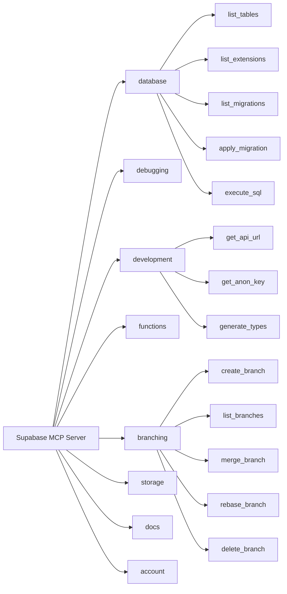
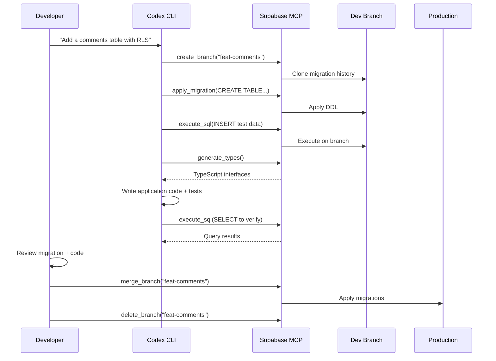

# Codex CLI and Supabase MCP: Agent-Driven Full-Stack Backend Development with Safe Database Branching


---

Supabase's MCP server exposes over 20 tools that let Codex CLI query databases, inspect schemas, generate migrations, manage Edge Functions, and orchestrate database branches — all through natural language from your terminal[^1]. This article walks through the complete integration: from initial `config.toml` wiring through branching-based migration workflows, AGENTS.md templates for Supabase-heavy projects, and the security guardrails you need before pointing an autonomous agent at your database.

## Why Supabase MCP Matters for Codex CLI Workflows

Most backend development with Codex CLI follows a predictable loop: the agent writes application code, runs tests, and iterates. Database changes break that loop. Schema migrations require careful sequencing, destructive operations need human review, and testing against production data is a non-starter. Supabase's MCP server addresses each of these friction points:

- **Schema inspection without context bloat** — the agent calls `list_tables` and `list_extensions` rather than needing the entire schema pasted into the prompt[^1]
- **Migration generation with drift detection** — DDL operations are tracked as migration files, keeping the agent's changes version-controlled[^2]
- **Copy-on-write branching** — each branch clones the production migration history into an isolated PostgreSQL instance, so the agent can experiment without risk[^3]
- **TypeScript type generation** — `generate_types` produces interfaces from the live schema, keeping application code in sync[^1]

## Setting Up the Supabase MCP Server

### Remote MCP Configuration

Supabase runs a hosted MCP server at `mcp.supabase.com`. Codex CLI connects to it as a remote (HTTP-based) MCP server[^4][^5]:

```toml
# ~/.codex/config.toml

[mcp_servers.supabase]
url = "https://mcp.supabase.com/mcp?project_ref=your-project-ref"
startup_timeout_sec = 120
tool_timeout_sec = 600
```

The `project_ref` query parameter scopes the server to a single Supabase project, preventing the agent from accidentally operating on the wrong database[^1]. For development projects where you want broader access, omit the parameter — but understand that the agent can then list and switch between all projects in your account.

### Authentication

Supabase MCP supports three authentication paths[^1]:

**1. OAuth (recommended for interactive use)**

```bash
codex mcp login supabase
```

This opens a browser-based OAuth flow. Codex stores the resulting token and refreshes it automatically[^5]. After login, restart Codex and verify with `/mcp`.

**2. Personal Access Token (CI environments)**

```toml
[mcp_servers.supabase]
url = "https://mcp.supabase.com/mcp?project_ref=your-project-ref"
bearer_token_env_var = "SUPABASE_ACCESS_TOKEN"
startup_timeout_sec = 120
tool_timeout_sec = 600
```

Set `SUPABASE_ACCESS_TOKEN` in your environment or CI secrets. This avoids the browser redirect entirely[^1].

**3. Static headers via Composio**

If you prefer Composio's unified MCP gateway:

```toml
[mcp_servers.composio]
url = "https://connect.composio.dev/mcp"
http_headers = { "x-consumer-api-key" = "ck_your_key_here" }
```

This routes through Composio's infrastructure and provides access to Supabase alongside other integrated services[^6].

### Local Development with Supabase CLI

When running Supabase locally via `supabase start`, the MCP server is available at `http://localhost:54321/mcp`[^1]:

```toml
[mcp_servers.supabase-local]
url = "http://localhost:54321/mcp"
startup_timeout_sec = 30
tool_timeout_sec = 120
```

This is the safest option for agent-driven development — no production data is reachable, and the agent can write freely.

## Available Tool Groups

Supabase MCP organises its tools into feature groups that you can selectively enable[^1][^2]:



To restrict the agent to specific groups, append the `features` parameter to the URL[^1]:

```toml
[mcp_servers.supabase]
url = "https://mcp.supabase.com/mcp?project_ref=abc123&features=database,branching,development"
```

This prevents the agent from deploying Edge Functions or modifying storage buckets unless you explicitly grant access.

## The Branch-Migrate-Merge Workflow

The most powerful pattern for agent-driven database development combines Supabase branching with Codex CLI's iterative loop. The workflow follows a disciplined sequence[^3][^7]:



### Key Principles

1. **Always branch first** — never let the agent run DDL against the production branch directly
2. **Generate types after migration** — ensures application code matches the new schema
3. **Verify with queries** — have the agent run `execute_sql` on the branch to confirm the migration produces the expected schema
4. **Human-gate the merge** — the `merge_branch` step should require explicit approval

### Configuration for Safe Branching

Combine Codex CLI's approval policies with Supabase MCP's tool controls to enforce this workflow[^8]:

```toml
# .codex/config.toml (project-scoped)

[mcp_servers.supabase]
url = "https://mcp.supabase.com/mcp?project_ref=abc123&features=database,branching,development&read_only=false"
bearer_token_env_var = "SUPABASE_ACCESS_TOKEN"
startup_timeout_sec = 120
tool_timeout_sec = 600
enabled_tools = [
    "list_tables",
    "list_extensions",
    "list_migrations",
    "apply_migration",
    "execute_sql",
    "generate_types",
    "create_branch",
    "list_branches",
    "delete_branch"
]
disabled_tools = ["merge_branch"]
```

By explicitly disabling `merge_branch`, the agent cannot promote changes to production. The developer reviews the migration files and merges manually — either through the Supabase dashboard or a separate `codex exec` step with elevated permissions.

## AGENTS.md Template for Supabase Projects

An effective AGENTS.md for a Supabase-backed project steers the agent toward safe patterns[^9]:

```markdown
# AGENTS.md

## Database

- ALWAYS create a Supabase branch before modifying schema
- NEVER run DDL statements directly via execute_sql — use apply_migration instead
- After every migration, run generate_types and update src/types/supabase.ts
- Include Row Level Security (RLS) policies in every migration that creates a table
- Test migrations with sample queries on the branch before requesting merge

## Stack

- Runtime: Supabase Edge Functions (Deno)
- Client: @supabase/supabase-js v2
- Auth: Supabase Auth with PKCE flow
- Types: Generated via Supabase MCP generate_types tool

## Testing

- Run `supabase db test` for pgTAP tests after migration
- Verify RLS policies with both authenticated and anon roles
```

## Security Considerations

### Prompt Injection via Database Content

Supabase's MCP server wraps SQL results with additional instructions to discourage LLMs from following instructions or commands that might be present in the data[^1]. However, this is a mitigation, not a guarantee. If your database contains user-generated content, a malicious row could contain text that attempts to manipulate the agent's behaviour.

**Mitigations:**

- Use `read_only=true` when the agent only needs to inspect data[^1]
- Scope queries to specific tables via AGENTS.md instructions
- Run Codex CLI with `approval_policy = "on-request"` so you review every MCP tool call[^8]

### Credential Exposure

The MCP server configuration may reference access tokens. Ensure your `config.toml` uses environment variable references rather than inline secrets[^4]:

```toml
# Good: references an environment variable
bearer_token_env_var = "SUPABASE_ACCESS_TOKEN"

# Bad: inline token (never do this)
# bearer_token = "sbp_abc123..."
```

For team projects, store the token in your secrets manager and inject it via CI or shell profile.

### Production Isolation

Supabase's own documentation is emphatic: **do not connect the MCP server to production data**[^1]. The recommended approach is:

1. Create a dedicated development project mirroring your production schema
2. Use branching within that development project for agent work
3. Promote tested migrations to production through your existing CI/CD pipeline — not through the agent

## CI Integration with `codex exec`

For automated migration validation in CI, combine `codex exec` with the Supabase MCP server[^10]:

```bash
#!/bin/bash
# ci/validate-migration.sh

codex exec \
  --approval-policy never \
  -c "mcp_servers.supabase.url=https://mcp.supabase.com/mcp?project_ref=${SUPABASE_PROJECT_REF}&read_only=true" \
  -c "mcp_servers.supabase.bearer_token_env_var=SUPABASE_ACCESS_TOKEN" \
  "Review the latest migration in supabase/migrations/. Check for:
   1. Missing RLS policies on new tables
   2. Destructive operations without a reversible counterpart
   3. Missing indexes on foreign key columns
   4. Type mismatches with the existing schema" \
  --json | jq '.output'
```

This runs a read-only review of pending migrations without granting the agent write access to the database.

## Comparison with Neon MCP

Both Supabase and Neon offer branching-based database workflows for AI agents[^11]. The key differences for Codex CLI users:

| Feature | Supabase MCP | Neon MCP |
|---------|-------------|----------|
| **Branching model** | Full project clone (Postgres + Auth + Storage) | Copy-on-write PostgreSQL only |
| **MCP tools** | 20+ across 8 feature groups | Database-focused (SQL, branches) |
| **Authentication** | OAuth, PAT, or Composio | Connection string or API key |
| **Edge Functions** | Deployable via MCP | Not applicable |
| **Type generation** | Built-in `generate_types` | External tooling required |
| **Local development** | `supabase start` with MCP at localhost | Neon CLI with local proxy |
| **Pricing for branching** | Paid plans only | Free tier includes branching |

Choose Supabase MCP when your project already uses the Supabase platform and benefits from the broader tool surface (auth, storage, Edge Functions). Choose Neon when you need lightweight, cost-effective database branching without the broader platform commitment.

## Practical Tips

1. **Set generous timeouts** — database operations, especially branching, can take 30-60 seconds. The default MCP timeout of 10 seconds will cause failures[^4]
2. **Use `enabled_tools` aggressively** — expose only the tools the agent needs for the current task. Fewer tools means less schema bloat in the system prompt[^12]
3. **Pair with hooks for audit logging** — use a `PostToolUse` hook to log every MCP call to a local audit file[^8]:

```toml
[[hooks]]
event = "PostToolUse"
match_tool = "mcp__supabase__*"
command = "echo '$(date -u +%Y-%m-%dT%H:%M:%SZ) $TOOL_NAME $TOOL_ARGS' >> .codex/supabase-audit.log"
```

1. **Generate types into version control** — commit the output of `generate_types` so that diffs reveal schema changes in code review
2. **Rebase branches before merging** — if your production schema has evolved since the branch was created, use `rebase_branch` to synchronise before merging to avoid migration conflicts[^3]

## Citations

[^1]: Supabase, "Model context protocol (MCP)," Supabase Docs, 2026. [https://supabase.com/docs/guides/getting-started/mcp](https://supabase.com/docs/guides/getting-started/mcp)

[^2]: supabase-community, "supabase-mcp — Connect Supabase to your AI assistants," GitHub, 2026. [https://github.com/supabase-community/supabase-mcp](https://github.com/supabase-community/supabase-mcp)

[^3]: DeepWiki, "Branching and Migration Workflows — supabase-community/supabase-mcp," 2026. [https://deepwiki.com/supabase-community/supabase-mcp/10-branching-and-migration-workflows](https://deepwiki.com/supabase-community/supabase-mcp/10-branching-and-migration-workflows)

[^4]: OpenAI, "Model Context Protocol — Codex," OpenAI Developers, 2026. [https://developers.openai.com/codex/mcp](https://developers.openai.com/codex/mcp)

[^5]: We Build Internet, "How to connect the Supabase MCP server to Codex and Claude CLIs (step-by-step)," January 2026. [https://www.webuildinternet.com/2026/01/09/using-supabase-mcp-in-openai-codex-cli/](https://www.webuildinternet.com/2026/01/09/using-supabase-mcp-in-openai-codex-cli/)

[^6]: Composio, "How to integrate Supabase MCP with Codex," 2026. [https://composio.dev/toolkits/supabase/framework/codex](https://composio.dev/toolkits/supabase/framework/codex)

[^7]: Design Revision, "Supabase MCP Server: AI Integration Guide (2026)," 2026. [https://designrevision.com/blog/supabase-mcp-server](https://designrevision.com/blog/supabase-mcp-server)

[^8]: OpenAI, "Agent approvals & security — Codex," OpenAI Developers, 2026. [https://developers.openai.com/codex/agent-approvals-security](https://developers.openai.com/codex/agent-approvals-security)

[^9]: OpenAI, "Custom instructions with AGENTS.md — Codex," OpenAI Developers, 2026. [https://developers.openai.com/codex/guides/agents-md](https://developers.openai.com/codex/guides/agents-md)

[^10]: OpenAI, "Non-interactive mode — Codex," OpenAI Developers, 2026. [https://developers.openai.com/codex/noninteractive](https://developers.openai.com/codex/noninteractive)

[^11]: Daniel Vaughan, "Safe Database Schema Refactoring with Codex CLI and Neon Branching," Codex Blog, April 2026. [https://codex.danielvaughan.com/2026/04/25/codex-cli-neon-branching-safe-database-schema-refactoring-mcp/](https://codex.danielvaughan.com/2026/04/25/codex-cli-neon-branching-safe-database-schema-refactoring-mcp/)

[^12]: Daniel Vaughan, "MCP Schema Bloat and System Prompt Tax," Codex Blog, April 2026. [https://codex.danielvaughan.com/2026/04/23/mcp-schema-bloat-system-prompt-tax-tool-definition-performance/](https://codex.danielvaughan.com/2026/04/23/mcp-schema-bloat-system-prompt-tax-tool-definition-performance/)
