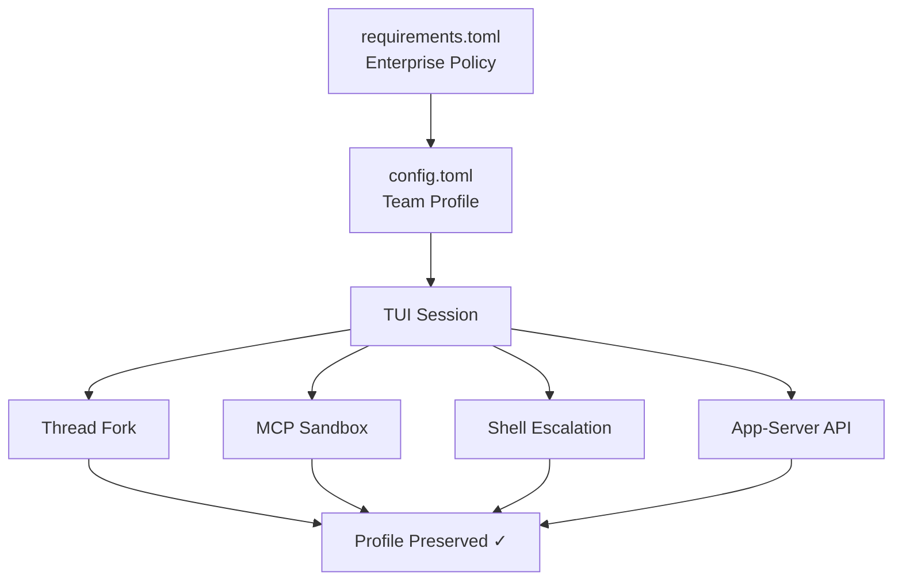
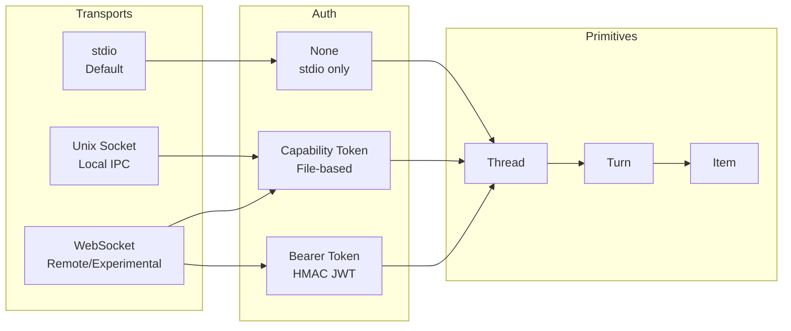
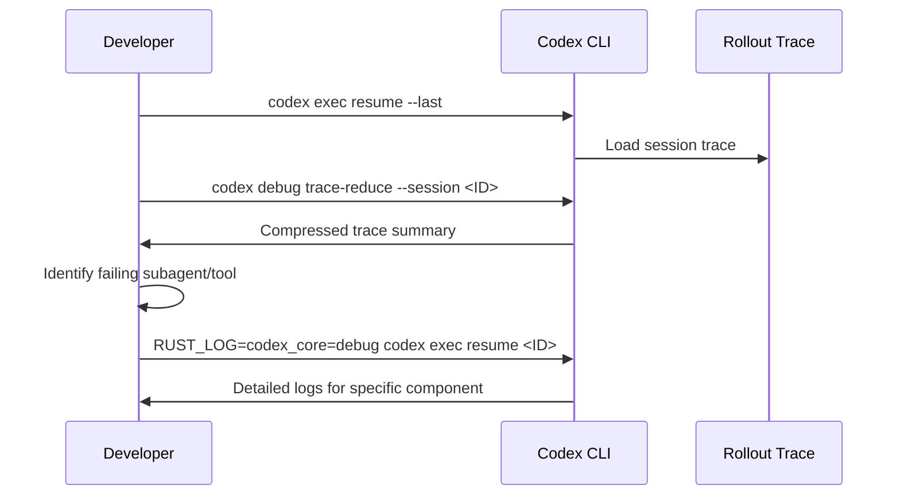

# Codex CLI v0.125: Permission Profile Persistence, App-Server Unix Sockets, and Rollout Tracing


---

Version 0.125.0, released on 24 April 2026, ships 22 features, 14 improvements, and 24 bug fixes across 69 total changes[^1]. Three themes dominate: permission profiles that finally survive every context boundary, an app-server that behaves like a proper platform service, and rollout tracing that makes multi-agent debugging tractable. This article unpacks each theme with configuration examples and practical guidance for teams adopting them.

## Permission Profile Persistence: The Round-Trip Problem Solved

### The Problem Before v0.125

Prior to this release, permission profiles were session-scoped artefacts. You could define a named profile in `config.toml`, launch with `codex -p safe`, and enjoy your carefully crafted filesystem and network restrictions — until you did anything that crossed a context boundary. Forking a thread, escalating shell permissions mid-session, handing control to an MCP tool server, or connecting via the app-server API all risked silently dropping your profile back to defaults[^2].

For enterprise teams running managed configurations via `requirements.toml`, this was more than an inconvenience — it was a governance gap. A profile that fails to persist is a policy that fails to enforce.

### What Changed

Permission profiles now **round-trip** across five context boundaries[^1]:

1. **TUI sessions** — profile survives `/clear`, session resume, and fork operations
2. **User turns** — each new turn inherits the thread's active profile rather than re-evaluating defaults
3. **MCP sandbox state** — when an MCP tool server triggers a sandboxed execution, the calling thread's profile propagates into the child sandbox
4. **Shell escalation** — granting temporary elevated permissions (e.g. network access for a single `npm install`) no longer corrupts the base profile on return
5. **App-server APIs** — remote clients starting or resuming threads via JSON-RPC inherit the profile specified at `thread/start` and retain it across `thread/resume` and `thread/fork`

### Configuration in Practice

A team-standard permission profile typically lives in `~/.codex/config.toml`:

```toml
default_permissions = "team-standard"

[permissions.team-standard.filesystem]
":project_roots" = { "." = "write", "**/*.env" = "none", "**/.secrets" = "none" }
glob_scan_max_depth = 4

[permissions.team-standard.network]
enabled = true
mode = "limited"
domains = [
  { pattern = "registry.npmjs.org", allow = true },
  { pattern = "pypi.org", allow = true },
  { pattern = "*.internal.corp", allow = true },
  { pattern = "*", allow = false }
]
```

Before v0.125, this profile would silently degrade when the agent forked a conversation or when an MCP server spawned a sub-process. Now, the profile object serialises into the thread state and deserialises faithfully at every boundary crossing[^2].

### Enterprise Governance Implications

For organisations using managed `requirements.toml` to enforce minimum security baselines[^3], profile persistence closes a significant audit gap. The enforcement chain now looks like this:



The `codex exec --profile` flag also benefits — headless CI runs that specify a profile now retain those constraints when resuming a session with `codex exec resume`[^1].

## App-Server Platform Evolution

### Unix Socket Transport

The app-server has supported WebSocket transport since v0.119[^4], but WebSocket carries overhead that local integrations don't need: HTTP upgrade handshakes, frame masking, and TLS when you're communicating between processes on the same machine.

v0.125 adds **Unix domain socket transport** via a well-known path:

```
$CODEX_HOME/app-server-control/app-server-control.sock
```

This is the same pattern used by Docker's daemon socket (`/var/run/docker.sock`) and the SSH agent (`$SSH_AUTH_SOCK`). Unix sockets offer lower latency, kernel-enforced file permission security, and no network stack involvement[^5].

For IDE extensions and local orchestrators, the upgrade path is straightforward: point your JSON-RPC client at the socket path instead of a `ws://` URL. The protocol remains identical — JSON-RPC 2.0, one message per line.

### Sticky Environments

The new `environments` field on `thread/start` and `thread/resume` enables **sticky execution environments** — named runtime contexts that persist across turns within a thread[^1]:

```json
{
  "method": "thread/start",
  "params": {
    "model": "gpt-5.5",
    "environments": [
      { "id": "backend", "cwd": "/workspace/api" },
      { "id": "frontend", "cwd": "/workspace/web" }
    ]
  }
}
```

Once set, subsequent turns inherit these environments automatically. You can override per-turn by passing explicit `environments` in `turn/start`, or pass `[]` to disable them temporarily[^5].

This matters for polyglot monorepo workflows where a single thread might need to operate in different service directories. Rather than re-specifying the working directory on every turn, the environment sticks.

### Pagination-Friendly Resume and Fork

Large threads with hundreds of turns previously loaded the entire history on resume, creating memory pressure and slow startup times. v0.125 introduces pagination support[^1]:

- `thread/resume` accepts `excludeTurns: true` to open a thread without loading its full turn history
- `thread/turns/list` paginates turn history separately, letting clients fetch only what they need
- `thread/fork` supports `ephemeral: true` for in-memory-only copies that never touch disk[^5]

For dashboard and monitoring applications built on the app-server, this is transformative — you can display thread lists and metadata without deserialising every turn in every thread.

### Architecture Overview

The v0.125 app-server now supports three transport modes with different security profiles:



## Rollout Tracing and the Debug Reducer

### Why Rollout Tracing Matters

As Codex CLI sessions grow more complex — subagent delegation, MCP tool chains, multi-agent orchestration via the Agents SDK[^6] — understanding what happened during a session becomes non-trivial. A single user request might spawn three subagents, each invoking different MCP servers, each running sandboxed commands.

v0.125 introduces **rollout tracing** that records four relationship types[^1]:

| Relationship | What It Captures |
|---|---|
| **Tool** | Which tool calls triggered which subprocesses |
| **Code-mode** | Transitions between planning, execution, and review phases |
| **Session** | Parent-child relationships between forked/resumed threads |
| **Multi-agent** | Delegation chains across subagents and MCP servers |

### The Debug Reducer Command

Raw rollout traces can be verbose — a complex session might generate thousands of trace events. The new **debug reducer** command compresses these into a human-readable summary[^1]:

```bash
codex debug trace-reduce --session <SESSION_ID>
```

The reducer collapses sequential tool calls, aggregates timing data, and highlights anomalies such as:

- Tools that timed out or returned errors
- Subagents that exceeded their token budget
- MCP servers that failed to respond within the configured timeout
- Permission escalations that were granted or denied

### Practical Debugging Workflow

When a multi-agent session produces unexpected results, the debugging workflow becomes:



This complements the existing `RUST_LOG` environment variable debugging[^7] and OpenTelemetry integration[^8] by providing a session-scoped, relationship-aware view that neither raw logs nor distributed traces offer on their own.

### Combining with OTEL

Rollout traces and OTEL traces serve different purposes. OTEL traces are span-based and designed for production monitoring dashboards — latency percentiles, error rates, cost attribution[^8]. Rollout traces are event-based and designed for post-hoc debugging of individual sessions.

The two compose well:

```toml
[otel]
environment = "staging"
exporter = { otlp-http = {
  endpoint = "https://otel.internal.corp/v1/logs",
  protocol = "binary"
}}
log_user_prompt = false
```

Use OTEL to detect *that* a session went wrong (e.g. a spike in `codex.tool_decision` error events). Use rollout tracing to understand *why* it went wrong (e.g. a subagent's MCP server returned a schema validation error that cascaded into three retry loops).

## Additional v0.125 Highlights

### Reasoning Token Reporting in codex exec

The `codex exec --json` flag now includes reasoning token counts in its output events[^1]. This is critical for cost management — reasoning tokens on models like `o3` and `o4-mini` are billed at output rates, and without visibility into their volume, cost estimates are unreliable[^9].

```bash
codex exec --json "refactor the auth module" 2>/dev/null | \
  jq 'select(.type == "turn.completed") | .usage.reasoning_tokens'
```

### Provider-Owned Model Discovery

Model providers now manage their own model discovery, with AWS/Bedrock account state exposed to app clients[^1]. This means the model picker in IDE extensions and custom app-server clients automatically reflects which models your Bedrock account has access to, without manual `models.json` configuration.

### Bug Fixes Worth Noting

Two fixes deserve special attention:

- **App-server trust persistence**: Previously, explicitly marking a project as untrusted was overridden by auto-trust logic on next connection. v0.125 respects the explicit untrust decision[^1].
- **Exec-server output buffering**: The exec-server could drop the final output buffer after a process exited. For CI pipelines parsing structured output, this meant silently truncated results[^1].

## Upgrade Path

Update via npm:

```bash
npm update -g @openai/codex
codex --version  # Should show 0.125.0
```

The release is backward-compatible with existing `config.toml` files. Permission profiles defined in earlier versions will automatically benefit from round-trip persistence without configuration changes.

For teams using the app-server API, review the refreshed schemas — the thread, marketplace, sticky environment, and permission-profile API surfaces have new fields that existing clients should handle gracefully (unknown fields are ignored by default in JSON-RPC)[^1].

## Citations

[^1]: OpenAI, "Codex CLI v0.125.0 Release Notes," GitHub Releases, 24 April 2026. [https://github.com/openai/codex/releases/tag/rust-v0.125.0](https://github.com/openai/codex/releases/tag/rust-v0.125.0)

[^2]: OpenAI, "Agent Approvals & Security," Codex Developer Documentation, 2026. [https://developers.openai.com/codex/agent-approvals-security](https://developers.openai.com/codex/agent-approvals-security)

[^3]: OpenAI, "Configuration Reference," Codex Developer Documentation, 2026. [https://developers.openai.com/codex/config-reference](https://developers.openai.com/codex/config-reference)

[^4]: OpenAI, "App Server README," GitHub, 2026. [https://github.com/openai/codex/blob/main/codex-rs/app-server/README.md](https://github.com/openai/codex/blob/main/codex-rs/app-server/README.md)

[^5]: OpenAI, "Changelog," Codex Developer Documentation, April 2026. [https://developers.openai.com/codex/changelog](https://developers.openai.com/codex/changelog)

[^6]: OpenAI, "Multi-Agent Workflows with the Agents SDK," Codex Developer Documentation, 2026. [https://developers.openai.com/codex/cli/features](https://developers.openai.com/codex/cli/features)

[^7]: Mintlify, "Tracing & Verbose Logging — Codex CLI," 2026. [https://mintlify.wiki/openai/codex/advanced/tracing](https://mintlify.wiki/openai/codex/advanced/tracing)

[^8]: OpenAI, "Security — Codex," Codex Developer Documentation, 2026. [https://developers.openai.com/codex/security](https://developers.openai.com/codex/security)

[^9]: OpenAI, "Models — Codex," Codex Developer Documentation, 2026. [https://developers.openai.com/codex/models](https://developers.openai.com/codex/models)
