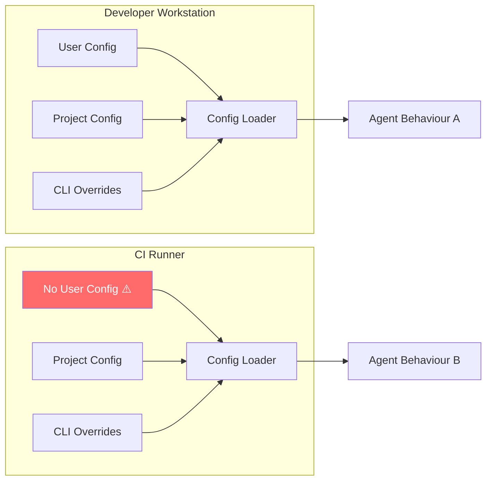
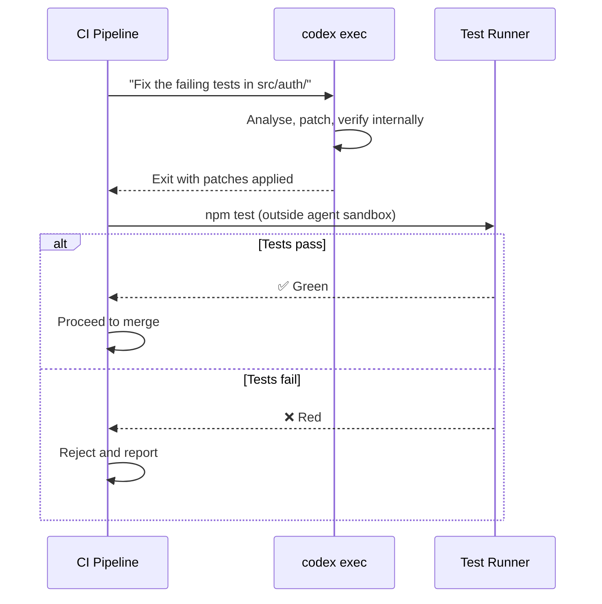
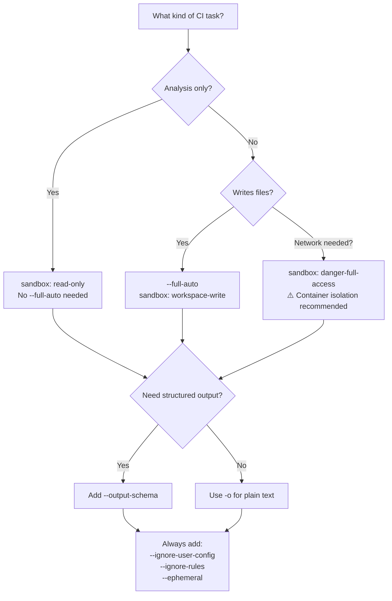

# Hermetic `codex exec` Runs: Isolation Flags, Deterministic Configuration, and Reproducible CI Pipelines


---

Every developer who has debugged a "works on my machine" CI failure knows the pain of non-deterministic builds. When you add an AI coding agent to your pipeline, the surface area for environment-dependent behaviour explodes: user-level config files, project rules, cached sessions, model defaults, and permission profiles can all silently alter agent output. Codex CLI v0.122.0 introduced two flags — `--ignore-user-config` and `--ignore-rules` — specifically designed to eliminate this class of problem [^1]. Combined with existing isolation primitives, they make truly hermetic `codex exec` runs achievable for the first time.

This article covers the complete isolation toolkit, configuration layering, and practical CI patterns for building reproducible agent pipelines.

## Why Hermeticity Matters for Agent Pipelines

A standard `codex exec` invocation resolves configuration from up to four layers [^2]:

1. **User config** — `$CODEX_HOME/config.toml` (typically `~/.codex/config.toml`)
2. **Project config** — `.codex/config.toml` in the repository
3. **CLI overrides** — `-c key=value` flags
4. **Managed config** — enterprise `managed_config.toml` and `requirements.toml`

On a developer's workstation, layers 1 and 2 accumulate preferences: a favourite model, custom reasoning effort, filesystem permission profiles, hooks, and MCP server definitions. When the same `codex exec` command runs in CI, none of those layers exist — unless the runner inherits a stale `$CODEX_HOME` from a previous job. Either way, the agent behaves differently from local runs, and failures become difficult to reproduce.



The goal of hermetic execution is to make **Agent Behaviour A** and **Agent Behaviour B** identical, regardless of the host environment.

## The Isolation Flag Toolkit

Codex CLI provides five flags that, used together, create a fully isolated execution environment [^1][^3]:

| Flag | Effect |
|------|--------|
| `--ignore-user-config` | Skips `$CODEX_HOME/config.toml`; preserves authentication via `CODEX_API_KEY` |
| `--ignore-rules` | Ignores user and project `.rules` exec-policy files |
| `--ephemeral` | Prevents session rollout files from persisting to disk |
| `--skip-git-repo-check` | Allows execution outside a Git repository |
| `-c key=value` | Inline overrides that become the sole configuration source |

### Minimal Hermetic Invocation

```bash
codex exec \
  --ignore-user-config \
  --ignore-rules \
  --ephemeral \
  --full-auto \
  -c model=gpt-5.5 \
  -c model_reasoning_effort=medium \
  -c sandbox_mode=workspace-write \
  "Summarise the top 5 code quality issues in this repository"
```

This command:

- Ignores any `~/.codex/config.toml` on the runner [^1]
- Ignores `.rules` files that might vary across branches [^1]
- Leaves no session artifacts on disk [^3]
- Pins the model and reasoning effort explicitly
- Grants workspace-write sandbox access required for `--full-auto` [^3]

## Configuration Pinning for Reproducibility

Even with `--ignore-user-config`, the project-level `.codex/config.toml` still loads (it travels with the repository). This is typically desirable — it carries AGENTS.md paths, MCP server definitions, and team-agreed defaults. However, for maximum reproducibility, pin every variable that affects output:

```bash
codex exec \
  --ignore-user-config \
  --ignore-rules \
  --ephemeral \
  --full-auto \
  -c model=gpt-5.5 \
  -c model_reasoning_effort=medium \
  -c model_reasoning_summary=concise \
  -c sandbox_mode=workspace-write \
  -c "sandbox_workspace_write.network_access=false" \
  --output-schema ./ci/review-schema.json \
  -o ./ci/review-output.json \
  "Review the changes in this PR for security issues"
```

The `--output-schema` flag [^3] enforces a JSON Schema contract on the agent's final response, which is critical for downstream pipeline steps that parse the output programmatically. Without it, the agent's natural-language response format can vary between runs, breaking `jq` or script-based extraction.

### Example Output Schema

```json
{
  "type": "object",
  "properties": {
    "risk_level": {
      "type": "string",
      "enum": ["low", "medium", "high", "critical"]
    },
    "issues": {
      "type": "array",
      "items": {
        "type": "object",
        "properties": {
          "file": { "type": "string" },
          "line": { "type": "integer" },
          "severity": { "type": "string" },
          "description": { "type": "string" }
        },
        "required": ["file", "severity", "description"]
      }
    },
    "summary": { "type": "string" }
  },
  "required": ["risk_level", "issues", "summary"],
  "additionalProperties": false
}
```

## GitHub Actions: The Complete Hermetic Pattern

The `openai/codex-action@v1` action wraps `codex exec` with runner-level security controls [^4]. Here is a production-grade workflow combining the action with isolation flags:


```yaml
name: Codex Hermetic Review
on:
  pull_request:
    types: [opened, synchronize]

permissions:
  contents: read
  pull-requests: write

jobs:
  review:
    runs-on: ubuntu-latest
    steps:
      - uses: actions/checkout@v4
        with:
          fetch-depth: 0

      - uses: openai/codex-action@v1
        id: codex-review
        with:
          prompt: |
            Review the diff for security vulnerabilities, performance
            regressions, and correctness issues. Output structured JSON.
          model: gpt-5.5
          effort: medium
          sandbox: read-only
          safety-strategy: unprivileged-user
          output-file: review.json
          codex-args: >-
            --ignore-user-config
            --ignore-rules
            --ephemeral
            --output-schema .codex/ci/review-schema.json
        env:
          OPENAI_API_KEY: ${{ secrets.OPENAI_API_KEY }}

      - name: Parse and gate
        run: |
          RISK=$(jq -r '.risk_level' review.json)
          if [ "$RISK" = "critical" ]; then
            echo "::error::Critical security risk detected"
            exit 1
          fi
```


### Key Design Choices

- **`safety-strategy: unprivileged-user`** runs the agent as a non-root user inside the runner, adding OS-level isolation on top of Codex's sandbox [^4].
- **`sandbox: read-only`** prevents the agent from modifying any files during review — appropriate for analysis-only tasks [^3].
- **`--output-schema`** ensures the JSON output is parseable by the `jq` gate step, regardless of model version or prompt variation [^3].

## Self-Hosted Runners: Docker-Based Isolation

For teams using self-hosted runners where `$CODEX_HOME` might persist between jobs, wrap execution in a fresh container:

```bash
docker run --rm \
  -v "$(pwd):/workspace" \
  -w /workspace \
  -e CODEX_API_KEY="$CODEX_API_KEY" \
  -e CODEX_HOME=/tmp/codex-ephemeral \
  ghcr.io/openai/codex:0.125.0 \
  exec \
    --ignore-user-config \
    --ignore-rules \
    --ephemeral \
    --full-auto \
    -c model=gpt-5.5 \
    "Run the test suite and fix any failures"
```

Setting `CODEX_HOME` to a temporary path inside the container guarantees no configuration leaks between runs, even if `--ignore-user-config` is accidentally omitted [^2].

## The Test-Outside Pattern

A subtlety of hermetic agent runs: the agent should generate fixes, but validation should happen *outside* the agent's sandbox [^5]. This prevents the agent from silently adjusting tests to match its own buggy output.



In practice, this means your CI workflow should run the test suite as a separate step *after* the agent exits, not rely solely on the agent's self-reported success [^5].

## Reasoning Token Reporting

As of v0.125.0, `codex exec --json` reports reasoning token usage alongside completion tokens [^6]. This is invaluable for cost attribution in CI:

```bash
codex exec --json \
  --ignore-user-config \
  --ignore-rules \
  --ephemeral \
  --full-auto \
  -c model=gpt-5.5 \
  -c model_reasoning_effort=medium \
  "Triage the open bug reports" 2>/dev/null \
  | jq -s 'last | .usage'
```

Pipe this into your observability stack to track per-pipeline cost, detect runaway sessions, and set budget alerts [^6].

## Common Pitfalls

### 1. Forgetting `--full-auto` in Non-Interactive Contexts

Without `--full-auto`, `codex exec` may pause waiting for user approval on file writes, causing the CI job to hang indefinitely [^3]. Always include it — or use `--sandbox read-only` for analysis-only tasks.

### 2. MCP Servers and `--output-schema` Conflict

A known issue (GitHub #15451): when MCP tools are active, `--output-schema` constraints may be silently ignored [^7]. If your pipeline depends on structured output, either disable MCP servers for that step or validate the output schema in a subsequent script step.

### 3. Project Config Overriding CLI Flags

The project-level `.codex/config.toml` loads even with `--ignore-user-config`. If it sets `model = "gpt-5.4"` but your CLI flag specifies `gpt-5.5`, the CLI flag wins [^2]. However, hooks defined in the project config will still execute. For complete isolation, combine `--ignore-user-config` with explicit `-c` overrides for every critical parameter.

## Decision Framework



## Summary

Hermetic `codex exec` runs require deliberate configuration: pin the model, pin the reasoning effort, strip user-level config, disable exec-policy rules, enforce output schemas, and validate results outside the agent's sandbox. The isolation flags introduced in v0.122.0 make this practical without requiring container wrappers — though Docker remains the belt to the flags' braces on self-hosted infrastructure.

The reward is CI pipelines where `codex exec` behaves identically whether triggered by a developer's `git push` or a scheduled nightly job, and where failures are always reproducible.

## Citations

[^1]: Codex CLI v0.122.0 release notes — `--ignore-user-config` and `--ignore-rules` flags. [Codex Changelog](https://developers.openai.com/codex/changelog)
[^2]: Codex configuration layers and resolution order. [Config Basics](https://developers.openai.com/codex/config-basic) and [Advanced Configuration](https://developers.openai.com/codex/config-advanced)
[^3]: Codex CLI command-line reference — `--ephemeral`, `--full-auto`, `--output-schema`, `--sandbox`. [CLI Reference](https://developers.openai.com/codex/cli/reference)
[^4]: OpenAI Codex GitHub Action documentation. [GitHub Action](https://developers.openai.com/codex/github-action)
[^5]: Codex best practices — validation and testing patterns. [Best Practices](https://developers.openai.com/codex/learn/best-practices)
[^6]: Codex CLI v0.125.0 — `codex exec --json` reasoning token reporting. [GitHub Releases](https://github.com/openai/codex/releases)
[^7]: GitHub Issue #15451 — `--json` and `--output-schema` silently ignored when MCP tools active. [GitHub Issue](https://github.com/openai/codex/issues/15451)
