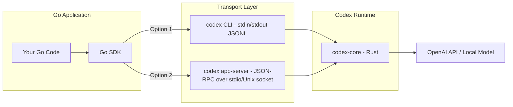
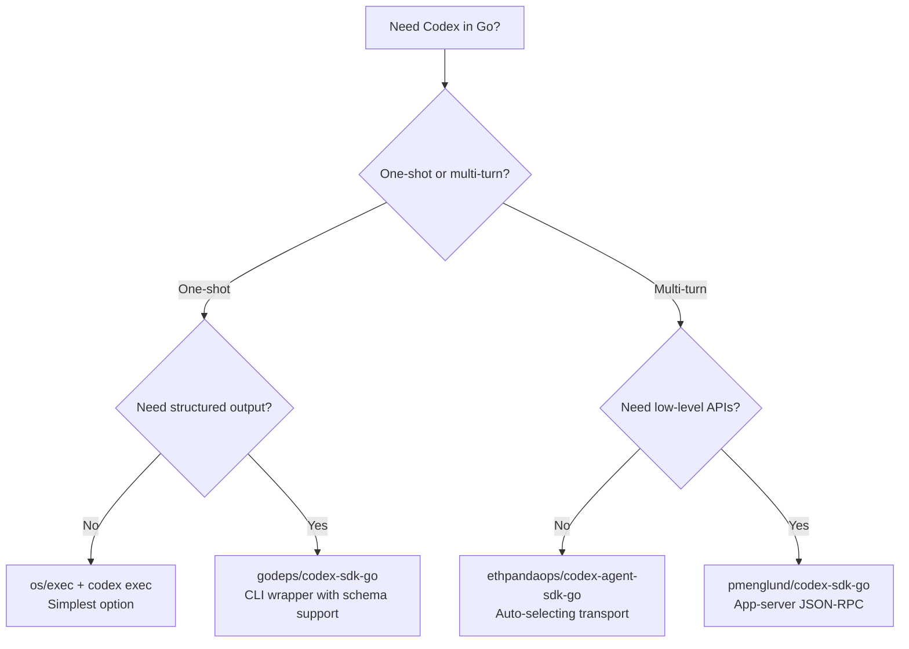

# The Codex Go SDK Ecosystem: Embedding Coding Agents in Go Applications


---

OpenAI ships official Codex SDKs for TypeScript and Python[^1], but Go — the language powering most of the cloud-native tooling developers interact with daily — has no first-party SDK. The community has filled the gap with three distinct Go SDK implementations, each taking a different architectural approach to embedding Codex agents in Go applications. This article maps the ecosystem, compares the transport mechanisms, and shows you how to build Go services with embedded coding agents.

---

## Why Go for Agent Embedding?

Go dominates the infrastructure layer: Kubernetes operators, CLI tools, CI runners, internal developer platforms, and API gateways are overwhelmingly written in Go[^2]. If you want to embed a Codex agent inside a deployment pipeline, a custom CLI, or a platform engineering service, you need a Go client. Spawning `codex exec` via `os/exec` works for one-shot tasks, but multi-turn sessions, streaming, structured output, and approval workflows demand a proper SDK.

The three community SDKs solve this problem at different levels of abstraction:

| SDK | Transport | Multi-turn | Streaming | App-server | Structured Output |
|-----|-----------|------------|-----------|------------|-------------------|
| `godeps/codex-sdk-go` | CLI stdin/stdout JSONL | Yes | Yes | No | Yes |
| `pmenglund/codex-sdk-go` | App-server JSON-RPC | Yes | Yes | Yes | Yes |
| `fanwenlin/codex-go-sdk` | Both CLI and app-server | Yes | Yes | Yes | Yes |
| `ethpandaops/codex-agent-sdk-go` | Auto-select | Yes | Yes | Yes | Yes |

---

## Architecture: Two Transport Paths

Every Go SDK must solve the same fundamental problem: how to communicate with the Codex runtime. The Codex architecture exposes two interfaces[^3]:



**Path 1 — CLI wrapping** spawns the `codex` binary as a child process and exchanges newline-delimited JSON events over stdin/stdout. This is the simpler approach: the CLI handles all configuration, sandboxing, and model routing. The `godeps/codex-sdk-go` package takes this path[^4].

**Path 2 — App-server JSON-RPC** launches `codex app-server` and speaks the same JSON-RPC protocol that the Codex desktop app uses internally[^3]. This gives access to richer APIs: model discovery, thread management, plugin installation, and fine-grained approval handling. The `pmenglund/codex-sdk-go` package takes this approach[^5].

**Hybrid SDKs** like `fanwenlin/codex-go-sdk` and `ethpandaops/codex-agent-sdk-go` support both transports, auto-selecting based on the complexity of the request[^6][^7].

---

## SDK Deep Dive: godeps/codex-sdk-go

The most widely used Go SDK wraps the CLI binary with an idiomatic Go API. Published on pkg.go.dev in January 2026[^4], it mirrors the TypeScript SDK's thread-based model.

### Installation

```bash
go get github.com/godeps/codex-sdk-go@v0.1.1
```

### Starting a Thread

```go
package main

import (
    "fmt"
    "log"

    codex "github.com/godeps/codex-sdk-go"
)

func main() {
    client := codex.NewCodex(codex.CodexOptions{})

    thread := client.StartThread(codex.ThreadOptions{
        Model:                "gpt-5.5",
        SandboxMode:          codex.SandboxWorkspaceWrite,
        WorkingDirectory:     "/path/to/repo",
        ModelReasoningEffort: codex.ReasoningMedium,
    })

    turn, err := thread.Run(
        codex.TextInput("Fix the failing test in pkg/handler"),
        codex.TurnOptions{},
    )
    if err != nil {
        log.Fatal(err)
    }

    fmt.Println("Response:", turn.FinalResponse)
    fmt.Printf("Tokens: %d input, %d output\n",
        turn.Usage.InputTokens, turn.Usage.OutputTokens)
}
```

### Streaming Events

For long-running operations, stream events to provide real-time feedback:

```go
streamed, err := thread.RunStreamed(
    codex.TextInput("Refactor the authentication module"),
    codex.TurnOptions{},
)
if err != nil {
    log.Fatal(err)
}

for event := range streamed.Events {
    switch e := event.(type) {
    case *codex.AgentMessageItem:
        fmt.Print(e.Content)
    case *codex.CommandExecutionItem:
        fmt.Printf("[CMD] %s → exit %d\n", e.Command, e.ExitCode)
    case *codex.FileChangeItem:
        fmt.Printf("[FILE] %s %s\n", e.Action, e.Path)
    case *codex.McpToolCallItem:
        fmt.Printf("[MCP] %s.%s\n", e.Server, e.Tool)
    }
}
```

### Structured Output

Constrain responses to a JSON schema for pipeline integration:

```go
schema := `{
    "type": "object",
    "properties": {
        "summary": {"type": "string"},
        "files_changed": {"type": "integer"},
        "risk_level": {"type": "string", "enum": ["low", "medium", "high"]}
    },
    "required": ["summary", "files_changed", "risk_level"]
}`

turn, err := thread.Run(
    codex.TextInput("Analyse the diff and classify risk"),
    codex.TurnOptions{OutputSchema: schema},
)
```

---

## SDK Deep Dive: pmenglund/codex-sdk-go

This SDK bypasses the CLI entirely and speaks JSON-RPC directly to the app-server process[^5]. The advantage is access to lower-level APIs that the CLI does not expose: model listing, thread enumeration, and plugin management.

### Key Differences from CLI-Based SDKs

```go
client, err := codex.New(ctx, codex.Options{
    Logger: slog.Default(),
    ApprovalHandler: codex.AutoApproveHandler{
        Logger: slog.Default(),
    },
})
if err != nil {
    log.Fatal(err)
}
defer client.Close()

// Access the raw JSON-RPC client for lower-level operations
rpcClient := client.Client()
models, err := rpcClient.ModelList(ctx, protocol.ModelListParams{})
```

The app-server transport supports Unix sockets as of Codex v0.125.0[^8], which eliminates the overhead of process spawning for high-frequency interactions:

```go
client, err := codex.New(ctx, codex.Options{
    Transport: codex.UnixSocketTransport("/tmp/codex.sock"),
})
```

---

## SDK Deep Dive: ethpandaops/codex-agent-sdk-go

The `ethpandaops` SDK takes a higher-level approach with three interaction patterns[^7]:

```go
// One-shot: auto-selects backend
for msg, err := range codexsdk.Query(ctx,
    codexsdk.Text("What is the purpose of this function?")) {
    if err != nil {
        log.Fatal(err)
    }
    if msg, ok := msg.(codexsdk.AssistantMessage); ok {
        fmt.Print(msg.Text())
    }
}

// Multi-turn: stateful client
client := codexsdk.NewClient()
client.Start(ctx, codexsdk.WithLogger(slog.Default()))
defer client.Close()

client.Query(ctx, codexsdk.Text("Explain the codebase architecture"))
for msg := range client.ReceiveResponse(ctx) {
    // Process streaming messages
}

client.Query(ctx, codexsdk.Text("Now add error handling to the API layer"))
for msg := range client.ReceiveResponse(ctx) {
    // Second turn shares context from the first
}
```

The `Query()` function auto-selects between `codex exec` for simple, stateless requests and the app-server for multi-turn conversations — a pragmatic design for Go services that handle both one-shot CI tasks and interactive sessions[^7].

---

## Practical Patterns

### Pattern 1: CI Pipeline Agent

Embed a Codex agent in a Go-based CI runner to fix failing tests automatically:

```go
func autoFixFailure(repoPath, testOutput string) (*FixResult, error) {
    client := codex.NewCodex(codex.CodexOptions{})
    thread := client.StartThread(codex.ThreadOptions{
        Model:            "o4-mini",
        SandboxMode:      codex.SandboxWorkspaceWrite,
        WorkingDirectory: repoPath,
        ModelReasoningEffort: codex.ReasoningLow,
    })

    prompt := fmt.Sprintf(
        "The following test failed. Fix the code, not the test.\n\n%s",
        testOutput,
    )

    turn, err := thread.Run(
        codex.TextInput(prompt),
        codex.TurnOptions{OutputSchema: fixResultSchema},
    )
    if err != nil {
        return nil, fmt.Errorf("codex run failed: %w", err)
    }

    var result FixResult
    json.Unmarshal([]byte(turn.FinalResponse), &result)
    return &result, nil
}
```

### Pattern 2: Internal Developer Platform

An IDP service that accepts natural-language infrastructure requests and delegates to Codex:

```go
func (s *IDPService) HandleRequest(ctx context.Context, req InfraRequest) {
    thread := s.codexClient.StartThread(codex.ThreadOptions{
        Model:       "gpt-5.5",
        SandboxMode: codex.SandboxWorkspaceWrite,
        WorkingDirectory: req.RepoPath,
    })

    streamed, _ := thread.RunStreamed(
        codex.TextInput(req.Description),
        codex.TurnOptions{},
    )

    for event := range streamed.Events {
        s.streamToClient(ctx, req.RequestID, event)
    }
}
```

### Pattern 3: Approval Gateway

Implement custom approval logic that integrates with your organisation's policies:

```go
type PolicyApprovalHandler struct {
    policyEngine *opa.Client
    auditLog     *slog.Logger
}

func (h *PolicyApprovalHandler) HandleApproval(
    ctx context.Context,
    req codex.ApprovalRequest,
) codex.ApprovalResponse {
    decision, _ := h.policyEngine.Evaluate(ctx, req.Action)

    h.auditLog.Info("approval decision",
        "action", req.Action,
        "tool", req.ToolName,
        "allowed", decision.Allow,
    )

    return codex.ApprovalResponse{
        Approved: decision.Allow,
        Reason:   decision.Reason,
    }
}
```

---

## Decision Framework



**Choose `godeps/codex-sdk-go`** when you want the most mature, documented CLI wrapper with straightforward thread management[^4].

**Choose `pmenglund/codex-sdk-go`** when you need direct app-server access — model discovery, Unix socket transport, or raw JSON-RPC calls[^5].

**Choose `ethpandaops/codex-agent-sdk-go`** when your service handles both simple and complex interactions and you want the SDK to pick the right transport automatically[^7].

**Choose `fanwenlin/codex-go-sdk`** when you need both transport modes plus the bundled `codex-webtest` tool for automated browser testing integration[^6].

---

## Known Limitations

All four SDKs share common constraints worth noting:

- **No official OpenAI support** — these are community-maintained packages. Breaking changes in the Codex CLI or app-server protocol can lag behind in SDK updates[^1].
- **Go 1.25+ required** — the `godeps` and `pmenglund` SDKs use Go 1.25 features (range-over-func iterators), while `ethpandaops` requires Go 1.26[^4][^5][^7].
- **Binary dependency** — all SDKs require the `codex` CLI binary on `PATH`. There is no pure-Go Codex runtime. ⚠️
- **GPT-5.5 authentication** — as of April 2026, GPT-5.5 is only available via ChatGPT authentication, not API-key auth[^9]. SDKs using API-key auth will fall back to GPT-5.4 or o4-mini.
- **Approval callback limitations** — the CLI-based SDKs cannot intercept all approval types. The app-server SDKs provide richer approval handling but require the app-server binary[^5].

---

## What About Godex?

The `chadgpt/godex` project takes a different approach entirely: rather than wrapping the official Codex CLI, it reimplements the agent loop in pure Go[^10]. This is more of a research project than a production SDK — it demonstrates how the JSONL protocol and tool-calling patterns work but does not track upstream changes closely. For production use, the SDK wrappers remain the safer choice.

---

## Conclusion

The Go SDK ecosystem for Codex CLI has matured rapidly from a single CLI wrapper in January 2026 to four distinct packages covering CLI wrapping, app-server JSON-RPC, and auto-selecting hybrid transports. For Go teams building internal developer platforms, CI automation, or custom agent orchestration, these SDKs eliminate the need to shell out to `codex exec` and provide proper Go-native interfaces for threading, streaming, structured output, and approval workflows.

The missing piece remains an official OpenAI Go SDK. Given that the Codex app-server protocol is documented and stable[^3], and that Go is the dominant language for the kind of infrastructure tooling that benefits most from embedded agents, it would not be surprising to see OpenAI ship one. Until then, the community options are production-ready.

---

## Citations

[^1]: OpenAI, "SDK – Codex," OpenAI Developers Documentation, 2026. [https://developers.openai.com/codex/sdk](https://developers.openai.com/codex/sdk)
[^2]: Stack Overflow, "Developer Survey 2025 — Most Popular Technologies," 2025. Go consistently ranks in the top 10 most-used languages, dominating cloud-native and infrastructure tooling.
[^3]: OpenAI, "Unlocking the Codex harness: how we built the App Server," OpenAI Blog, 2026. [https://openai.com/index/unlocking-the-codex-harness/](https://openai.com/index/unlocking-the-codex-harness/)
[^4]: godeps, "codex-sdk-go v0.1.1," Go Packages, January 2026. [https://pkg.go.dev/github.com/godeps/codex-sdk-go](https://pkg.go.dev/github.com/godeps/codex-sdk-go)
[^5]: pmenglund, "codex-sdk-go — App-server JSON-RPC SDK for Go," Go Packages, 2026. [https://pkg.go.dev/github.com/pmenglund/codex-sdk-go](https://pkg.go.dev/github.com/pmenglund/codex-sdk-go)
[^6]: fanwenlin, "codex-go-sdk — An Unofficial Go implementation for Codex agent," GitHub, 2026. [https://github.com/fanwenlin/codex-go-sdk](https://github.com/fanwenlin/codex-go-sdk)
[^7]: ethpandaops, "codex-agent-sdk-go — Go SDK for building agentic applications with Codex CLI," GitHub, 2026. [https://github.com/ethpandaops/codex-agent-sdk-go](https://github.com/ethpandaops/codex-agent-sdk-go)
[^8]: OpenAI, "Codex CLI v0.125.0 Release Notes," GitHub Releases, April 24, 2026. [https://github.com/openai/codex/releases/tag/v0.125.0](https://github.com/openai/codex/releases/tag/v0.125.0)
[^9]: OpenAI, "Models – Codex," OpenAI Developers Documentation, 2026. [https://developers.openai.com/codex/models](https://developers.openai.com/codex/models)
[^10]: chadgpt, "godex — Codex port in Go," GitHub, 2026. [https://github.com/chadgpt/godex](https://github.com/chadgpt/godex)
