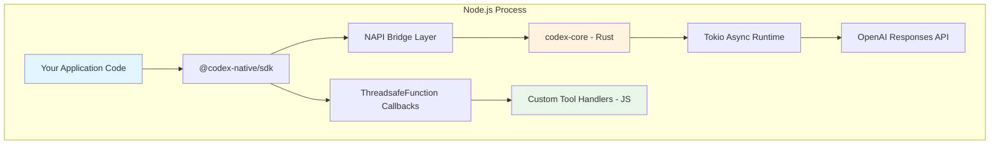
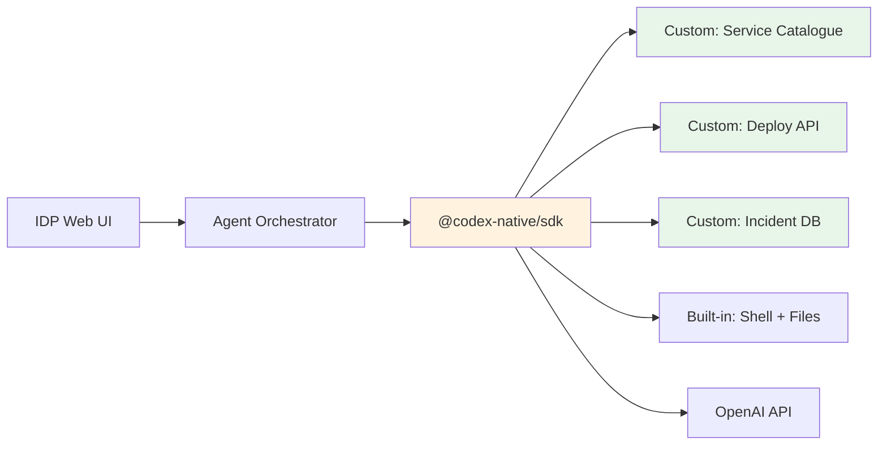
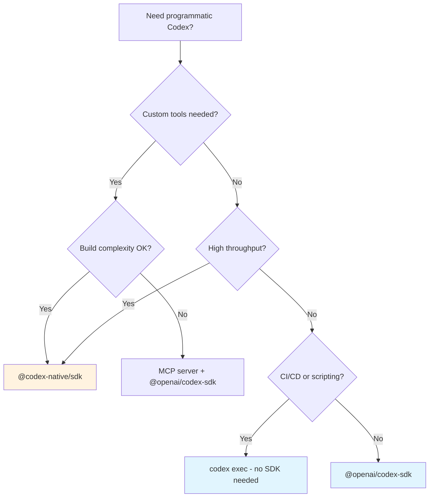

# The Codex Native SDK: Embedding Rust-Powered Coding Agents Directly in Node.js Applications


---

The official `@openai/codex-sdk` wraps the Codex CLI binary and talks to it over stdin/stdout JSONL pipes[^1]. It works, but the process-spawning overhead, serialisation cost, and inability to register custom tools at the runtime level limit what you can build. The community `@codex-native/sdk` takes a different path: it compiles `codex-rs` — the Rust core that powers the CLI — into a native Node.js addon via napi-rs, giving your application zero-copy access to the agent runtime without ever spawning a child process[^2].

This article explains when and how to use the Native SDK, walks through custom tool registration, compares the two SDKs head-to-head, and covers the production patterns emerging around it.

---

## Why a Native Binding?

The standard TypeScript SDK follows a sensible architecture: spawn `codex`, pipe messages in, parse messages out. For simple CI scripts or one-shot automations this is fine. But three use cases push against its limits:

1. **Custom tool registration** — you want the agent to call *your* functions (database queries, internal APIs, proprietary linters) as first-class tools, not via MCP server plumbing.
2. **High-throughput orchestration** — managing dozens of concurrent agent threads where per-process overhead and IPC serialisation become measurable.
3. **Embedding in Electron or server-side platforms** — where forking a CLI binary is either restricted or adds unacceptable startup latency.

The Native SDK addresses all three by linking directly against `codex-core` through napi-rs, the mature Rust-to-Node.js bridge that powers packages like `@swc/core` and `lightningcss`[^3].

---

## Architecture



The key architectural decisions[^2][^4]:

- **Direct Rust FFI via NAPI** — no child process, no stdin/stdout parsing. The JavaScript thread calls into Rust through N-API's foreign function interface, and Rust calls back through `ThreadsafeFunction` pointers.
- **Tokio runtime** — the Rust side runs its own Tokio event loop for async I/O (API calls, file system operations, sandbox management), decoupled from Node.js's libuv loop.
- **Zero-copy event streaming** — agent events surface as an async generator in JavaScript, backed by a lock-free channel on the Rust side.
- **Session persistence** — threads are persisted identically to the CLI (in `~/.codex/sessions`), so you can start a thread natively and resume it in the TUI, or vice versa[^1].

---

## Getting Started

### Prerequisites

- Node.js 18+[^1]
- Rust toolchain (for compiling the native addon)
- ripgrep (`brew install ripgrep` on macOS, `apt install ripgrep` on Debian/Ubuntu)[^4]
- A cloned copy of `codex-rs` at a compatible release tag

### Installation

```bash
# Clone codex-rs at the required release tag
git clone --branch rust-v0.45.0 https://github.com/openai/codex.git /opt/codex-rs

# Set the environment variable the build script expects
export CODEX_RUST_ROOT=/opt/codex-rs

# Install the SDK
npm install @codex-native/sdk

# Build native bindings (handles dependencies, compilation, verification)
npm run setup
```

The `setup` script compiles the napi module into `native/codex-napi/index.node` and runs a smoke test to verify the bridge loads correctly[^4]. No manual Cargo invocation is required.

### Authentication

The Native SDK respects the same authentication mechanisms as the CLI — `OPENAI_API_KEY` environment variable or OAuth credentials in `~/.codex/auth.json`[^1]:

```typescript
import { CodexClientBuilder } from '@codex-native/sdk';

const client = new CodexClientBuilder()
  .withCodexHome(process.env.CODEX_HOME ?? `${process.env.HOME}/.codex`)
  .withSandboxPolicy({ mode: 'workspace-write' })
  .build();

await client.connect();
```

---

## Core API Patterns

### Running a Simple Thread

```typescript
import { CodexClientBuilder } from '@codex-native/sdk';

const client = new CodexClientBuilder()
  .withCodexHome(`${process.env.HOME}/.codex`)
  .withSandboxPolicy({ mode: 'workspace-write' })
  .build();

await client.connect();

// Stream events from the agent
for await (const event of client.events()) {
  switch (event.type) {
    case 'AGENT_MESSAGE':
      console.log('[Agent]', event.message);
      break;
    case 'EXEC_APPROVAL_REQUEST':
      // Auto-approve in controlled environments
      client.handleCommand(event.id, true);
      break;
    case 'TASK_COMPLETE':
      console.log('[Done]', event.last_agent_message);
      break;
  }
}
```

### Registering Custom Tools

This is the headline feature that separates the Native SDK from the standard one. Custom tools are registered as JavaScript functions that the Rust runtime can invoke via `ThreadsafeFunction` callbacks[^2]:

```typescript
import { CodexClientBuilder } from '@codex-native/sdk';

const client = new CodexClientBuilder()
  .withCodexHome(`${process.env.HOME}/.codex`)
  .withSandboxPolicy({ mode: 'workspace-write' })
  .build();

// Register a custom tool the agent can call
client.registerTool({
  name: 'query_internal_api',
  description: 'Query the internal service catalogue for microservice metadata',
  parameters: {
    type: 'object',
    properties: {
      service_name: { type: 'string', description: 'Service identifier' },
      include_dependencies: { type: 'boolean', default: false }
    },
    required: ['service_name']
  },
  handler: async (params) => {
    const response = await fetch(
      `https://internal-api.corp/services/${params.service_name}`,
      { headers: { Authorization: `Bearer ${process.env.INTERNAL_TOKEN}` } }
    );
    return response.json();
  }
});

await client.connect();
```

The agent sees `query_internal_api` alongside its built-in tools (shell execution, file read/write, MCP calls) and can invoke it without any MCP server overhead[^2].

### Tool Interceptors

For cases where you want to wrap built-in Codex tools with pre/post-processing logic — audit logging, policy enforcement, metrics collection — the SDK supports interceptors[^2]:

```typescript
client.registerToolInterceptor({
  toolName: 'shell',
  before: async (params) => {
    console.log(`[Audit] Agent requesting: ${params.command}`);
    // Return modified params or throw to block execution
    return params;
  },
  after: async (result) => {
    metrics.increment('agent.shell_commands');
    return result;
  }
});
```

---

## Cloud Tasks: Remote Code Generation

From v0.1.0, the Native SDK introduced cloud tasks — the ability to submit code generation requests to Codex's cloud infrastructure with best-of-N sampling and local patch application[^4]:

```typescript
const task = await client.submitCloudTask({
  prompt: 'Refactor the payment module to use the strategy pattern',
  attempts: 3,  // best-of-3 sampling
  preflight: true  // check for conflicts before applying
});

// Preflight validation detects merge conflicts before applying diffs
if (task.preflight.conflicts.length > 0) {
  console.warn('Conflicts detected:', task.preflight.conflicts);
} else {
  await task.apply();
}
```

This pattern is particularly useful for automated refactoring pipelines where you want multiple solution attempts evaluated before committing to one.

---

## SDK Comparison Matrix

| Aspect | `@openai/codex-sdk` | `@codex-native/sdk` |
|--------|---------------------|---------------------|
| **Communication** | stdin/stdout JSONL pipes | Direct Rust FFI via NAPI |
| **Process model** | Spawns CLI binary | In-process native addon |
| **Custom tools** | Not supported (use MCP) | `registerTool()` with JS handlers |
| **Tool interceptors** | Not supported | `registerToolInterceptor()` |
| **Cloud tasks** | Not supported | `submitCloudTask()` with best-of-N |
| **Session persistence** | `~/.codex/sessions` | `~/.codex/sessions` (compatible) |
| **Structured output** | JSON Schema / Zod | JSON Schema / Zod (identical) |
| **Streaming** | `runStreamed()` async generator | `events()` async generator |
| **Rate limit tracking** | Manual | Built-in with usage projections |
| **Build requirement** | None (uses installed CLI) | Rust toolchain + compilation |
| **Platforms** | macOS, Linux, Windows | macOS, Linux, Windows[^4] |
| **Node.js version** | 18+ | 18+ |
| **Maturity** | Official, stable | Community, experimental |

The standard SDK remains the right choice for most CI/CD integrations and simple automations. The Native SDK shines when you need custom tools, high-throughput orchestration, or are embedding Codex into a larger application platform[^1][^2].

---

## Production Patterns

### Pattern 1: Internal Developer Platform Agent

Embed Codex as a coding agent within your internal developer platform, with custom tools that query your service catalogue, deployment system, and incident database:



### Pattern 2: Multi-Thread Orchestration

Run multiple agent threads in parallel within a single Node.js process, avoiding the overhead of spawning separate CLI instances:

```typescript
const threads = await Promise.all(
  microservices.map(async (svc) => {
    const thread = client.startThread({
      workingDirectory: svc.repoPath,
    });
    return thread.run(
      `Update all dependencies to their latest stable versions and run tests`
    );
  })
);

// All threads share the same Tokio runtime and connection pool
const results = await Promise.all(threads);
```

### Pattern 3: Approval Gateway

Build a web-based approval UI that intercepts the agent's shell command and file patch requests:

```typescript
import express from 'express';

const app = express();
const pendingApprovals = new Map();

// Agent events feed into a web dashboard
for await (const event of client.events()) {
  if (event.type === 'EXEC_APPROVAL_REQUEST') {
    pendingApprovals.set(event.id, event);
    // Notify dashboard via WebSocket
    wss.broadcast({ type: 'approval_needed', event });
  }
}

// REST endpoint for human approval
app.post('/approve/:id', (req, res) => {
  client.handleCommand(req.params.id, true);
  pendingApprovals.delete(req.params.id);
  res.json({ status: 'approved' });
});
```

---

## Limitations and Caveats

The Native SDK is a **community project**, not an official OpenAI package. Keep these constraints in mind:

- **Rust toolchain required** — every developer and CI runner needs a working Rust installation to compile the native addon. Pre-built binaries are published for common platforms but may lag behind releases[^4].
- **Version coupling** — the SDK pins to specific `codex-rs` release tags (e.g., `rust-v0.45.0`). Upgrading the CLI independently can break the native bridge[^4].
- **Protocol instability** — the internal NAPI interface between JavaScript and Rust is not covered by OpenAI's stability guarantees and may change between releases[^4].
- **MCP compatibility caveat** — when MCP servers are active alongside custom tools, structured output constraints (`--output-schema`) can be silently ignored, producing malformed JSON[^5]. Test thoroughly when combining both.
- **No official support** — bug reports and feature requests go to the community maintainer, not OpenAI.

---

## When to Choose Which SDK



For most teams, the official `@openai/codex-sdk` or plain `codex exec` covers 90% of programmatic use cases. The Native SDK is the right tool when you are building a platform that treats Codex as an embedded component rather than an external CLI — internal developer portals, custom IDE extensions, automated refactoring services, or multi-agent orchestration systems where process-per-agent overhead is unacceptable.

---

## Citations

[^1]: [Codex SDK documentation — OpenAI Developers](https://developers.openai.com/codex/sdk)
[^2]: [@codex-native/sdk — npm](https://www.npmjs.com/package/@codex-native/sdk)
[^3]: [napi-rs: A framework for building compiled Node.js add-ons in Rust](https://github.com/napi-rs/napi-rs)
[^4]: [OpenAI Codex as a native agent in your TypeScript (Node.js) app — DEV Community](https://dev.to/kachurun/openai-codex-as-a-native-agent-in-your-typescript-nodejs-app-kii)
[^5]: [Bug: --json and --output-schema are silently ignored when tools/MCP servers are active — GitHub Issue #15451](https://github.com/openai/codex/issues/15451)
