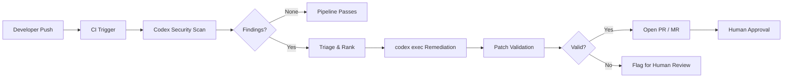
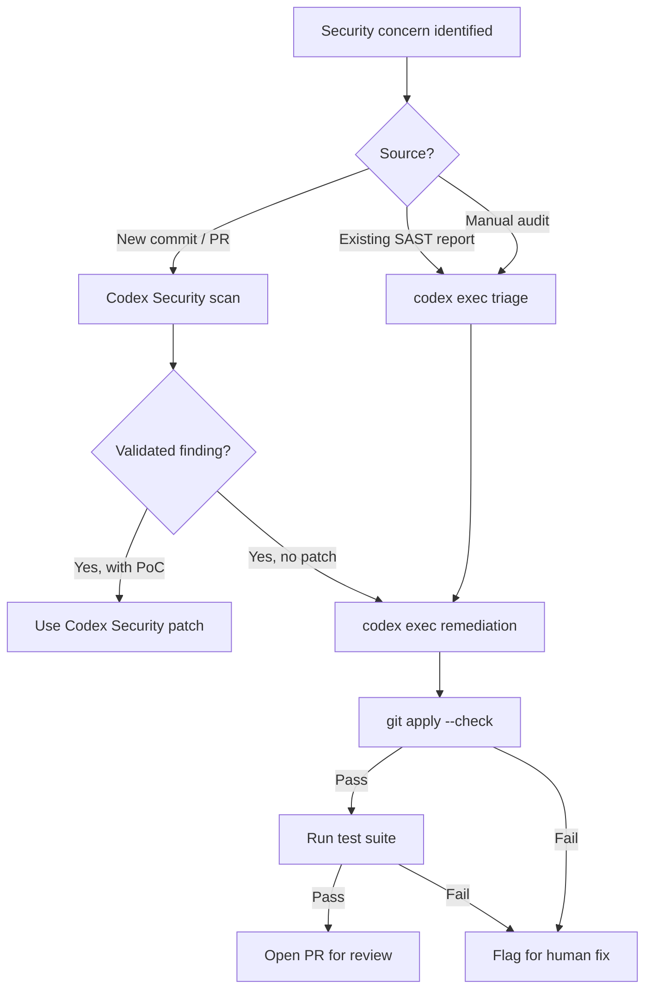

# Codex Security Meets Codex CLI: Building an Automated Vulnerability Remediation Pipeline


OpenAI now ships two complementary security surfaces: **Codex Security**, the cloud-hosted application security agent that scans repositories commit-by-commit[^1], and **Codex CLI**, the terminal-native coding agent that can generate patches on demand via `codex exec`[^2]. Individually each is useful; wired together they form a closed-loop **scan → triage → patch → validate → PR** pipeline that catches vulnerabilities earlier and remediates them faster than either tool alone.

This article walks through the architecture of that pipeline, the configuration needed for both GitHub Actions and GitLab CI/CD, and the practical patterns that make it production-ready.

---

## Why Two Tools?

Codex Security and Codex CLI solve different halves of the same problem.

| Capability | Codex Security | Codex CLI (`codex exec`) |
|---|---|---|
| **Scanning** | Semantic, repo-wide, commit-by-commit[^1] | Not a scanner — acts on provided findings |
| **Threat modelling** | Auto-generated, editable per-repo[^3] | N/A |
| **Validation** | Reproduces issues in ephemeral containers[^3] | Can run test suites inside its sandbox |
| **Patch generation** | Minimal diffs surfaced for review[^1] | Full agentic code generation with `--output-schema`[^2] |
| **CI integration** | GitHub-native via Codex Web[^4] | Any CI runner via `codex exec` or `codex-action@v1`[^5] |

Codex Security excels at *finding* business-logic flaws — broken access control, IDOR, privilege escalation — through chain-of-thought reasoning that simulates attacker paths[^6]. Codex CLI excels at *fixing* them by generating validated patches inside a sandboxed environment[^2]. The pipeline stitches the two together.

---

## Architecture Overview



The pipeline has five stages:

1. **Scan** — Codex Security analyses the commit range, building a code property graph that traces data flows across service boundaries[^6].
2. **Triage** — Findings are ranked by exploitability and consolidated to remove duplicates.
3. **Remediate** — `codex exec` receives each high/critical finding and generates a minimal patch.
4. **Validate** — The patch is checked with `git apply --check` and, optionally, the project's test suite.
5. **PR/MR** — Validated patches are committed to a remediation branch and surfaced for human review.

---

## Stage 1: Codex Security Scanning

Codex Security operates through Codex Web with connected GitHub repositories[^4]. During its beta it scanned over 1.2 million commits, identifying 792 critical and 10,561 high-severity findings across open-source projects[^7].

### How the scan works

Codex Security uses a three-phase methodology[^3]:

1. **Threat modelling** — Maps data flows, identifies trust boundaries, and determines what security controls should exist. The auto-generated threat model is editable per-repository.
2. **Vulnerability analysis** — Searches for exploitable issues using semantic reasoning rather than pattern matching, asking context-specific questions about permission validation and access controls.
3. **Validation** — Generates proof-of-concept code in ephemeral containers to confirm findings are genuinely exploitable.

The output is a ranked list of findings with severity, location, validation evidence, and suggested patch options[^1].

### Scan configuration

Administrators can tune the threat model through scope definition, attack-surface specification, and criticality assumptions[^4]. Initial scans on large repositories may take hours to days; subsequent incremental scans are faster[^3].

> **Important:** Codex Security is language-agnostic but performance varies by language and framework — its reasoning ability depends on the underlying model's training data for the stack in question[^3].

---

## Stage 2: Triage with codex exec

When Codex Security is not available (e.g. you are using third-party SAST scanners such as Semgrep, Snyk, or GitLab SAST), `codex exec` can post-process raw scanner output into a prioritised, actionable report. The OpenAI Cookbook demonstrates this pattern for GitLab[^8]:

```bash
codex exec --full-auto \
  "Parse the SAST JSON at gl-sast-report.json.
   Consolidate duplicate findings.
   Rank by exploitability.
   Output a prioritised markdown report between
   === BEGIN_SECURITY_MD === and === END_SECURITY_MD === markers."
```

The **marker-based extraction pattern** is critical: Codex output may contain ANSI colour codes and conversational preamble, so the pipeline strips escape sequences and extracts content between known delimiters[^8]:

```bash
sed -E 's/\x1B\[[0-9;]*[A-Za-z]//g' "${CODEX_RAW_LOG}" \
  | tr -d '\r' \
  | awk '
      /^\s*=== BEGIN_SECURITY_MD ===\s*$/ {grab=1; next}
      /^\s*=== END_SECURITY_MD ===\s*$/   {grab=0}
      grab
    ' > "${TMP_OUT}"
```

This pattern recurs throughout the pipeline — any stage that consumes Codex output should use markers and strip ANSI codes.

---

## Stage 3: Automated Remediation

The remediation stage loops over high and critical findings, feeding each to `codex exec` for patch generation.

### Vulnerability loop

```bash
#!/usr/bin/env bash
set -euo pipefail

SAST_REPORT="gl-sast-report.json"
PATCH_DIR="patches"
mkdir -p "${PATCH_DIR}"

jq -c '.vulnerabilities[]?
  | select((.severity | ascii_downcase) == "high"
       or (.severity | ascii_downcase) == "critical")' \
  "${SAST_REPORT}" | while IFS= read -r vuln; do

  ID=$(echo "${vuln}" | jq -r '.id // .identifiers[0].value // "unknown"')
  FILE=$(echo "${vuln}" | jq -r '.location.file // "unknown"')
  LINE=$(echo "${vuln}" | jq -r '.location.start_line // "?"')
  DESC=$(echo "${vuln}" | jq -r '.message // .description // "No description"')

  echo "Remediating ${ID} in ${FILE}:${LINE}"

  PROMPT="Fix the following vulnerability in ${FILE} at line ${LINE}:
${DESC}

Output ONLY a unified diff between
=== BEGIN_PATCH === and === END_PATCH === markers.
Do not modify unrelated code."

  codex exec --full-auto "${PROMPT}" \
    2>&1 | tee "${PATCH_DIR}/${ID}-raw.log"

  # Extract patch
  sed -E 's/\x1B\[[0-9;]*[A-Za-z]//g' "${PATCH_DIR}/${ID}-raw.log" \
    | tr -d '\r' \
    | awk '
        /=== BEGIN_PATCH ===/ {grab=1; next}
        /=== END_PATCH ===/   {grab=0}
        grab
      ' > "${PATCH_DIR}/${ID}.patch"

done
```

### Validation gate

Every generated patch is validated before being applied:

```bash
for patch_file in "${PATCH_DIR}"/*.patch; do
  [ -s "${patch_file}" ] || continue

  if git apply --check "${patch_file}" 2>/dev/null; then
    git apply "${patch_file}"
    echo "Applied: ${patch_file}"
  elif git apply --check -p1 "${patch_file}" 2>/dev/null; then
    git apply -p1 "${patch_file}"
    echo "Applied (p1): ${patch_file}"
  else
    echo "FAILED: ${patch_file} — flagging for manual review"
    mv "${patch_file}" "${PATCH_DIR}/failed/"
  fi
done
```

After applying patches, run the project's test suite to catch regressions:

```bash
# Run tests inside Codex sandbox to verify patches
codex exec --full-auto \
  "Run the project test suite. Report pass/fail summary between
   === BEGIN_TEST_RESULTS === and === END_TEST_RESULTS === markers."
```

---

## Stage 4: GitHub Actions Pipeline

The `openai/codex-action@v1` action simplifies CI integration by handling CLI installation, API proxy startup, and `codex exec` invocation[^5].


```yaml
name: Security Remediation

on:
  schedule:
    - cron: '0 6 * * 1'  # Weekly Monday scan
  workflow_dispatch:

permissions:
  contents: write
  pull-requests: write

jobs:
  remediate:
    runs-on: ubuntu-latest
    steps:
      - uses: actions/checkout@v4

      - name: Run SAST scanner
        uses: returntocorp/semgrep-action@v1
        with:
          config: p/owasp-top-ten
          output: semgrep-results.json
          json: true

      - name: Triage findings
        uses: openai/codex-action@v1
        with:
          prompt: |
            Read semgrep-results.json.
            Filter to high and critical severity.
            For each finding, generate a unified diff patch.
            Save each patch to patches/<rule-id>.patch.
            Validate each with git apply --check.
          sandbox: workspace-write
          model: o3
          effort: high
          safety-strategy: drop-sudo
        env:
          OPENAI_API_KEY: ${{ secrets.OPENAI_API_KEY }}

      - name: Create remediation PR
        if: success()
        run: |
          git config user.name "codex-security-bot"
          git config user.email "codex-bot@example.com"
          BRANCH="security/auto-remediation-$(date +%Y%m%d)"
          git checkout -b "${BRANCH}"
          git add -A
          git diff --cached --quiet && exit 0
          git commit -m "security: auto-remediate SAST findings

          Generated by Codex CLI via codex-action@v1"
          git push origin "${BRANCH}"
          gh pr create \
            --title "Security: Automated vulnerability remediation" \
            --body "Automated patches generated by Codex CLI from Semgrep findings." \
            --reviewer security-team
```


### GitLab CI/CD equivalent

The OpenAI Cookbook provides a complete GitLab pipeline with two stages[^8]:

```yaml
stages:
  - security-triage
  - remediation

codex_triage:
  stage: security-triage
  image: node:24
  script:
    - npm -g i @openai/codex@latest
    - codex exec --full-auto "${CODEX_TRIAGE_PROMPT}" 2>&1 | tee codex-raw.log
    # Extract prioritised markdown
  artifacts:
    paths:
      - security_priority.md
    expire_in: 14 days
  rules:
    - if: '$OPENAI_API_KEY'

codex_resolution:
  stage: remediation
  image: node:24
  needs: [codex_triage]
  script:
    - npm -g i @openai/codex@latest
    # Loop over high/critical vulns, generate and validate patches
    - bash scripts/remediate-vulns.sh
  artifacts:
    paths:
      - patches/
    expire_in: 14 days
```

---

## Stage 5: Safety Guardrails

Automated remediation demands strong safety controls. Apply these guardrails:

### 1. Sandbox isolation

Always run `codex exec` with the minimum required permissions[^5]:

```bash
# Read-only for triage (no code changes needed)
codex exec --sandbox read-only "${TRIAGE_PROMPT}"

# Workspace-write for remediation (needs to generate patches)
codex exec --sandbox workspace-write "${REMEDIATION_PROMPT}"
```

Never use `--sandbox danger-full-access` for security workflows.

### 2. Patch scope limits

Constrain Codex to modifying only the vulnerable file:

```bash
codex exec --full-auto \
  "Fix the vulnerability in src/auth/middleware.ts at line 42.
   Do NOT modify any other files.
   Output ONLY a unified diff for src/auth/middleware.ts."
```

### 3. Human-in-the-loop

Generated patches are *suggestions*, not automatic merges[^1]. The pipeline opens a PR/MR that requires human approval. Configure branch protection rules to enforce this:

```yaml
# GitHub branch protection
- required_reviewers: 2
  required_teams: ["security-team"]
  dismiss_stale_reviews: true
```

### 4. Deny-read policies

Prevent Codex from accessing credentials during remediation using v0.125's deny-read glob policies[^9]:

```toml
# ~/.codex/config.toml
[permissions]
deny_read = [
  "**/.env",
  "**/*.pem",
  "**/secrets/**",
  "**/credentials.json",
]
```

---

## AGENTS.md Template for Security Workflows

```markdown
# AGENTS.md — Security Remediation

## Role
You are a security remediation agent. Your job is to fix
vulnerabilities identified by SAST scanners.

## Rules
- Fix ONLY the vulnerability described in the prompt
- Do NOT refactor surrounding code
- Do NOT add new dependencies
- Generate minimal, targeted patches
- Include a brief comment explaining the fix

## Review Guidelines
- Every patch MUST pass `git apply --check`
- Every patch MUST NOT introduce new linter warnings
- Prefer established security patterns from the existing codebase
```

---

## Decision Framework: When to Use What



**Use Codex Security** when you need deep semantic analysis, cross-service vulnerability detection, and validated proof-of-concept exploits. It is ideal for scheduled repository-wide scans and ongoing commit monitoring[^1].

**Use `codex exec`** when you have findings from any scanner (Semgrep, Snyk, CodeQL, GitLab SAST) and need automated patch generation in CI/CD. It is the better choice for remediation loops and pipeline integration[^8].

**Use both** for a complete closed-loop: Codex Security finds and validates; Codex CLI remediates and tests.

---

## Cost Considerations

⚠️ Costs depend heavily on repository size, finding count, and model choice. General guidance:

- **Triage** prompts are lightweight — use `o4-mini` with `--effort medium` for cost efficiency.
- **Remediation** prompts need stronger reasoning — use `o3` or `gpt-5.5` with `--effort high` for complex vulnerability classes[^10].
- Codex Security scanning is included for ChatGPT Enterprise, Business, and Education customers, with the first month free at launch[^7].
- Each `codex exec` remediation call typically consumes 2,000–8,000 tokens depending on vulnerability complexity.

---

## Limitations

- Codex Security treats all existing code behaviour as intended — it may miss vulnerabilities where the code works as written but violates business intent[^6].
- ⚠️ Automated patches should never be auto-merged. Even validated patches may introduce subtle regressions in edge cases not covered by existing tests.
- Codex Security is currently accessible only through Codex Web with GitHub repositories[^4]. GitLab and Bitbucket support has not been announced.
- Initial scans on large repositories can take hours to days[^3].
- The marker-based extraction pattern is brittle — malformed Codex output may cause the pipeline to emit empty patches. Always include fallback handling.

---

## Citations

[^1]: OpenAI, "Codex Security: now in research preview," March 2026. [https://openai.com/index/codex-security-now-in-research-preview/](https://openai.com/index/codex-security-now-in-research-preview/)

[^2]: OpenAI, "Non-interactive mode — Codex CLI," OpenAI Developers, 2026. [https://developers.openai.com/codex/noninteractive](https://developers.openai.com/codex/noninteractive)

[^3]: OpenAI, "FAQ — Codex Security," OpenAI Developers, 2026. [https://developers.openai.com/codex/security/faq](https://developers.openai.com/codex/security/faq)

[^4]: OpenAI, "Security — Codex," OpenAI Developers, 2026. [https://developers.openai.com/codex/security](https://developers.openai.com/codex/security)

[^5]: OpenAI, "GitHub Action — Codex," OpenAI Developers, 2026. [https://developers.openai.com/codex/github-action](https://developers.openai.com/codex/github-action)

[^6]: Gecko Security, "Codex Security: Complete Guide to OpenAI's Code Vulnerability Scanner," April 2026. [https://www.gecko.security/blog/codex-security-complete-guide-openai-code-vulnerability-scanner](https://www.gecko.security/blog/codex-security-complete-guide-openai-code-vulnerability-scanner)

[^7]: The Hacker News, "OpenAI Codex Security Scanned 1.2 Million Commits and Found 10,561 High-Severity Issues," March 2026. [https://thehackernews.com/2026/03/openai-codex-security-scanned-12.html](https://thehackernews.com/2026/03/openai-codex-security-scanned-12.html)

[^8]: OpenAI, "Automating Code Quality and Security Fixes with Codex CLI on GitLab," OpenAI Cookbook, 2026. [https://developers.openai.com/cookbook/examples/codex/secure_quality_gitlab](https://developers.openai.com/cookbook/examples/codex/secure_quality_gitlab)

[^9]: OpenAI, "Codex CLI v0.125.0 Release Notes," GitHub, April 2026. [https://github.com/openai/codex/releases](https://github.com/openai/codex/releases)

[^10]: OpenAI, "Models — Codex," OpenAI Developers, 2026. [https://developers.openai.com/codex/models](https://developers.openai.com/codex/models)
