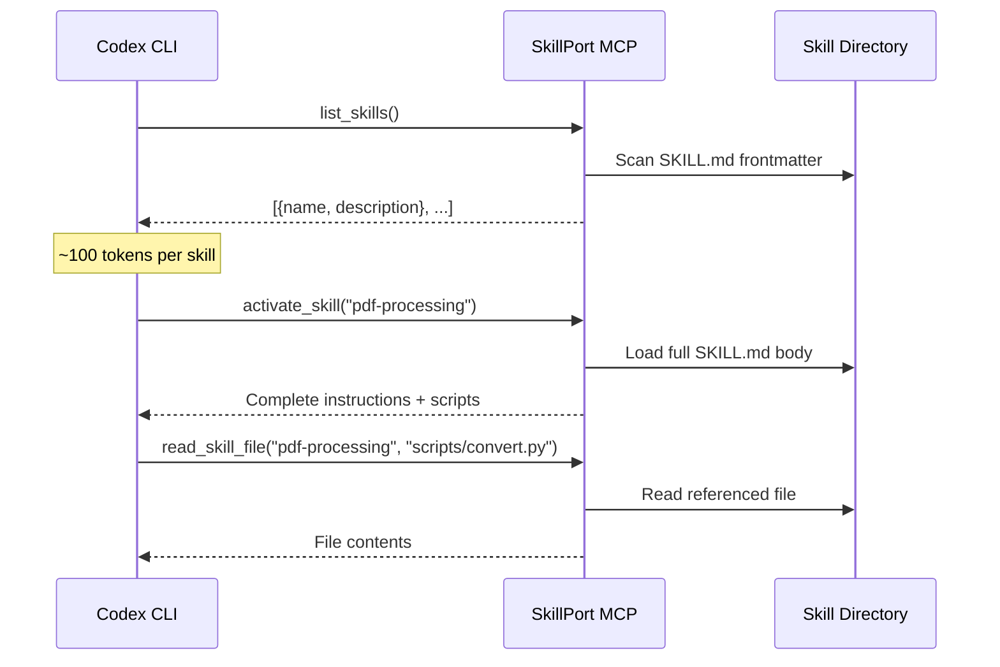
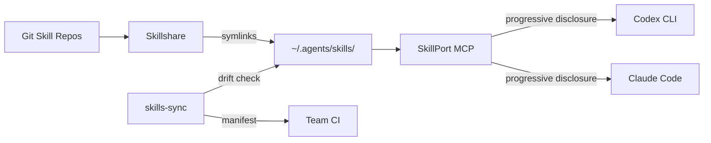

# Cross-Agent Skill Portability: Managing Skills Across Codex CLI, Claude Code, and Copilot


---

The Agent Skills specification, originally developed by Anthropic and released as an open standard in late 2025, has become the lingua franca for extending AI coding agents[^1]. A skill authored for Claude Code now runs unchanged inside Codex CLI, GitHub Copilot, Cursor, Google Antigravity, and over thirty other platforms[^2]. But portability on paper creates a management problem in practice: how do you keep skills synchronised across five different agents on the same machine, enforce team-wide standards, audit for prompt injection, and avoid the drift that accumulates when each tool has its own directory convention?

This article examines three community tools — **Skillshare**, **SkillPort**, and **skills-sync** — that solve different facets of this problem, and shows how to integrate each with Codex CLI workflows.

## The Cross-Agent Skill Problem

Every major coding agent now reads `.agents/skills/` directories[^2], but each has its own quirks:

| Agent | Skill directories scanned | MCP config location | Notes |
|-------|--------------------------|---------------------|-------|
| Codex CLI | `.agents/skills/`, `~/.agents/skills/` | `~/.codex/config.toml` | Also reads `$HOME/.codex/skills/` |
| Claude Code | `.claude/skills/`, `~/.claude/skills/` | `~/.claude.json` | Legacy `.claude/` path still supported |
| GitHub Copilot | `.agents/skills/`, `~/.agents/skills/` | VS Code settings | Uses `gh skill install` since April 2026[^3] |
| Cursor | `.agents/skills/`, `~/.cursor/skills/` | `.cursor/mcp.json` | Also reads `.cursorrules` |
| Gemini CLI | `.agents/skills/`, `~/.agents/skills/` | Gemini config | Reads `GEMINI.md` for instructions |

A team running Codex CLI as their primary agent but using Claude Code for review and Copilot in VS Code faces three synchronisation headaches:

1. **Skill scatter** — the same skill installed in three different directories
2. **MCP drift** — server configurations diverging across `config.toml`, `claude.json`, and VS Code settings
3. **Version pinning** — no mechanism to ensure all agents use the same skill revision

## The Agent Skills Specification

Before examining tools, it is worth understanding the standard they all build on. The agentskills.io specification defines a skill as a directory containing a `SKILL.md` file with YAML frontmatter[^1]:

```
my-skill/
  SKILL.md          # Required: metadata + instructions
  scripts/           # Optional: executable helpers
  references/        # Optional: documentation
  assets/            # Optional: templates, examples
```

The frontmatter follows a constrained format[^1]:

```yaml
---
name: my-skill
description: Short description for progressive disclosure
version: 1.2.0
license: Apache-2.0
author: team-name
tags: [testing, ci]
---

# My Skill

Full instructions loaded only when the skill is activated...
```

The progressive disclosure pattern is critical for context window management: at startup, agents load only the frontmatter (~100 tokens per skill), expanding the full instruction body only when the skill is selected[^4]. This keeps the system prompt lean even with dozens of installed skills.

## Tool 1: Skillshare — Symlink-Based Synchronisation

**Repository:** [runkids/skillshare](https://github.com/runkids/skillshare) | **Language:** Go | **Stars:** ~1.6k | **License:** MIT

Skillshare takes a filesystem-first approach: maintain one canonical skills directory, then create symlinks (or NTFS junctions on Windows) into each agent's expected location[^5].

### Installation and Setup

```bash
# macOS / Linux
curl -fsSL https://raw.githubusercontent.com/runkids/skillshare/main/install.sh | sh

# Homebrew
brew install skillshare

# Initialise — detects installed agents automatically
skillshare init
```

### Core Workflow

```bash
# Install skills from a Git repository
skillshare install anthropics/skills

# Sync to all detected targets (Codex CLI, Claude Code, Copilot, etc.)
skillshare sync

# Sync agents configuration alongside skills
skillshare sync --all

# Security audit — scans for prompt injection patterns
skillshare audit
```

The `sync` command creates symlinks from `~/.config/skillshare/skills/` into each agent's directory. Updates to the source propagate to all targets on the next sync[^5].

### Security Auditing

Skillshare's built-in audit system scans for prompt injection and data exfiltration patterns — a meaningful differentiator given the supply chain risks inherent in community-published skills[^5]:

```bash
# Audit all installed skills
skillshare audit

# Audit a specific skill before installation
skillshare audit --path ./downloaded-skill/
```

### Codex CLI Integration

After `skillshare sync`, Codex CLI detects skills in `~/.agents/skills/` automatically. No additional configuration is required. For project-level skills, commit a `.skillshare/` directory to the repository; Skillshare will sync project-scoped skills alongside global ones[^5].

### Filtering with .skillignore

Not every skill suits every agent. Skillshare supports `.skillignore` files and per-target filtering via SKILL.md metadata, so you can exclude heavyweight skills from agents with tighter context budgets[^5].

## Tool 2: SkillPort — Validate, Manage, and Serve via MCP

**Repository:** [gotalab/skillport](https://github.com/gotalab/skillport) | **Language:** Python | **Stars:** ~379 | **License:** MIT

SkillPort takes a different approach: rather than symlinking files, it validates skills against the specification, manages their lifecycle, and serves them to agents via MCP using a search-first pattern[^6].

### Installation

```bash
# Recommended: uv for isolated installation
uv tool install skillport

# Or via pip
pip install skillport
```

### Validation-First Workflow

```bash
# Validate skills against the agentskills.io specification
skillport validate ./my-skills/ --json

# Install from GitHub
skillport add anthropics/skills skills/

# List installed skills
skillport list

# Generate AGENTS.md skill documentation table
skillport doc
```

The `validate` command catches missing frontmatter fields, invalid name formats, and specification violations before deployment[^6] — essential for teams enforcing skill quality standards.

### MCP Server Mode

SkillPort's distinctive feature is its MCP server, which implements the progressive disclosure pattern as three tools[^6]:



### Codex CLI Configuration

Add SkillPort as an MCP server in `~/.codex/config.toml`:

```toml
[mcp_servers.skillport]
command = "uvx"
args = ["skillport", "serve"]

[mcp_servers.skillport.env]
SKILLPORT_SKILLS_DIR = "/home/dev/.agents/skills"
```

### Per-Agent Filtering

SkillPort supports environment-variable-based filtering, enabling different skill subsets for different agents[^6]:

```bash
# Expose only testing-related skills to Codex CLI
SKILLPORT_ENABLED_CATEGORIES="testing,ci" uvx skillport serve
```

## Tool 3: skills-sync — Profile-Driven Environment Management

**Repository:** [ryanreh99/skills-sync](https://github.com/ryanreh99/skills-sync) | **Language:** JavaScript | **Stars:** moderate | **License:** MIT

skills-sync occupies the most opinionated position: it manages named profiles, each containing a curated set of skills and MCP configurations, with drift detection and manifest-based reproducibility[^7].

### Installation

```bash
npm i -g @ryanreh99/skills-sync
```

### Profile Workflow

```bash
# Initialise with seed profiles
skills-sync init --seed

# Switch to a profile
skills-sync use personal

# Register an upstream skill source
skills-sync profile add-upstream --source https://github.com/anthropics/skills

# Search discoverable skills
skills-sync search skills --query "testing" --scope discoverable

# Sync to all agents
skills-sync sync
```

### Drift Detection

The standout feature is drift detection — comparing expected state with what is actually installed across agents[^7]:

```bash
# Inventory what each agent currently has
skills-sync agents inventory

# Check for drift between expected and actual state
skills-sync workspace sync --dry-run
```

This catches the common scenario where someone manually installs a skill in Claude Code but forgets to add it to the team profile.

### Manifest Export for Teams

```bash
# Export workspace manifest for sharing
skills-sync workspace manifest export > team-manifest.json

# Import on another machine
skills-sync workspace manifest import < team-manifest.json

# Reconcile differences
skills-sync workspace manifest reconcile
```

## Comparison Matrix

| Feature | Skillshare | SkillPort | skills-sync |
|---------|-----------|-----------|-------------|
| **Sync mechanism** | Symlinks / junctions | MCP server | File copy + config write |
| **Skill validation** | Security audit only | Full spec validation | Basic |
| **MCP serving** | No | Yes (search-first) | No |
| **Drift detection** | No | No | Yes |
| **Profile management** | No | Per-agent filtering | Named profiles |
| **Team sharing** | `.skillshare/` in repo | Manifest export | Manifest import/export |
| **Security scanning** | Built-in audit | Validation checks | No |
| **Offline capable** | Yes | Yes | Yes |
| **Runtime dependency** | None (Go binary) | Python 3.10+ | Node.js |
| **Agents supported** | 50+ | MCP-compatible | 5 major agents |

## Practical Patterns for Codex CLI Teams

### Pattern 1: Skillshare for Solo Developers

For individual developers using Codex CLI alongside Claude Code, Skillshare's zero-dependency symlink approach is the fastest path[^5]:

```bash
skillshare install anthropics/skills
skillshare install your-org/team-skills
skillshare sync
skillshare audit
```

### Pattern 2: SkillPort for Context-Sensitive Workflows

When skills are numerous and context window budgets matter, SkillPort's MCP server loads only what is needed. This pairs well with Codex CLI's `supports_parallel_tool_calls` flag for fast skill discovery[^6]:

```toml
[mcp_servers.skillport]
command = "uvx"
args = ["skillport", "serve"]
supports_parallel_tool_calls = true
```

### Pattern 3: skills-sync for Regulated Teams

For teams requiring reproducible environments and drift auditing, skills-sync's profile and manifest system provides the governance layer[^7]:

```bash
# CI job: verify no drift from team baseline
skills-sync workspace sync --dry-run --strict
```

### Pattern 4: Combining Tools

These tools are not mutually exclusive. A practical stack:

1. **Skillshare** for installation and security auditing
2. **SkillPort** for MCP-based progressive disclosure in Codex CLI
3. **skills-sync** for team-wide profile governance



## Enterprise Considerations

For organisations using Codex CLI's managed configuration (`requirements.toml`), skill governance adds another layer. Consider:

- **Skill allowlists** — restrict which community skills are permitted via `requirements.toml` deny-read policies blocking unapproved skill directories[^8]
- **Audit trails** — Skillshare's `audit` command can be integrated into pre-commit hooks
- **Supply chain verification** — `gh skill` supports signature verification and provenance tracking since April 2026[^3]
- **MCP schema overhead** — SkillPort adds three tools to the MCP schema; monitor schema bloat if running alongside other MCP servers

## Known Limitations

- **Symlink fragility** — Skillshare's symlinks break if the source directory moves; copy mode is available as a fallback[^5]
- **MCP cold start** — SkillPort adds latency on first skill activation as it loads the full instruction body[^6]
- **Profile lock-in** — skills-sync profiles are workspace-specific; cross-machine sync requires manual manifest transfer[^7]
- **Windows support** — all three tools work on Windows, but NTFS junctions (Skillshare) and WSL considerations (skills-sync) add complexity

## Citations

[^1]: [Agent Skills Specification](https://agentskills.io/specification) — agentskills.io
[^2]: [Agent Skills — Codex CLI](https://developers.openai.com/codex/skills) — OpenAI Developers
[^3]: [gh skill command: One Standard to Rule Claude Code, Copilot, Cursor, and Gemini](https://groundy.com/articles/github-clis-gh-skill-command-one-standard-to-rule-claude-code-copilot-cursor/) — Groundy
[^4]: [The SKILL.md Pattern: How to Write AI Agent Skills That Actually Work](https://bibek-poudel.medium.com/the-skill-md-pattern-how-to-write-ai-agent-skills-that-actually-work-72a3169dd7ee) — Bibek Poudel, Medium, February 2026
[^5]: [Skillshare — Sync skills across all AI CLI tools](https://github.com/runkids/skillshare) — GitHub
[^6]: [SkillPort — Bring Agent Skills to Any AI Agent](https://github.com/gotalab/skillport) — GitHub
[^7]: [skills-sync — AI skills and MCP configuration management](https://github.com/ryanreh99/skills-sync) — GitHub
[^8]: [Agent Approvals and Security — Codex CLI](https://developers.openai.com/codex/agent-approvals-security) — OpenAI Developers
