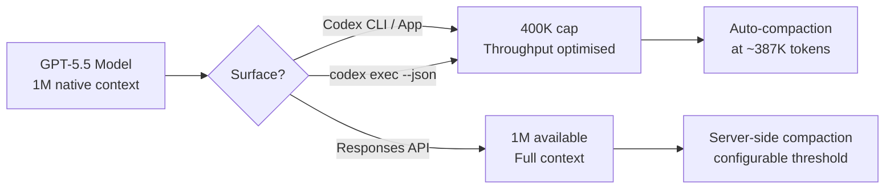
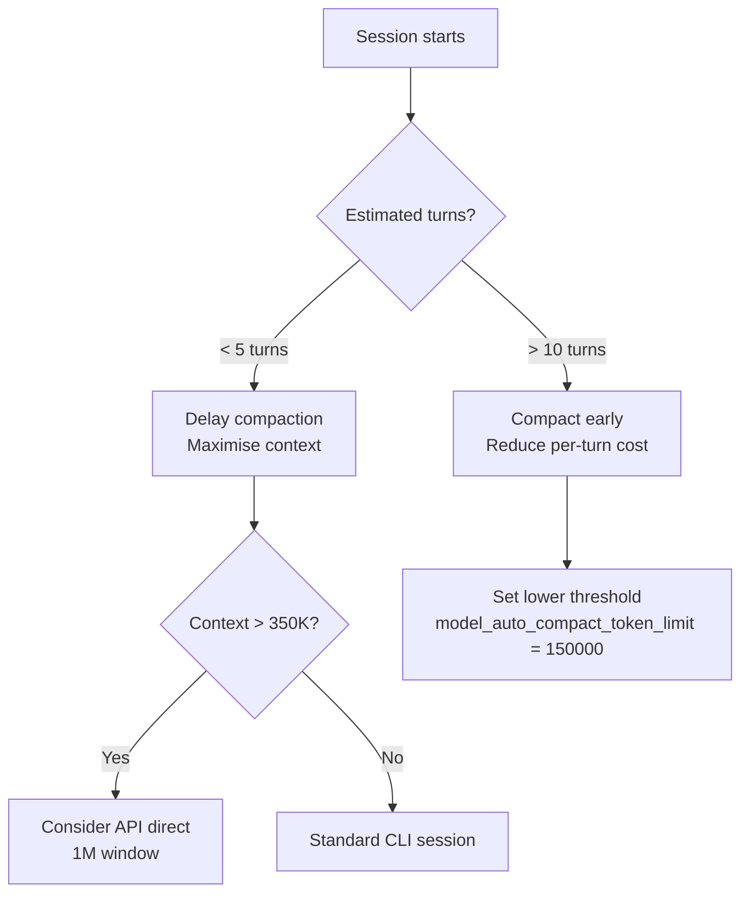

# GPT-5.5's Million-Token Context Window: Practical Strategies for Codex CLI Long-Context Workflows


---

GPT-5.5 shipped on 23 April 2026 with a headline that most coverage buried beneath benchmark tables: the API context window doubles from 512K to **1M tokens**[^1]. For Codex CLI users, the implications are subtler than the raw number suggests. The Codex surface caps GPT-5.5 at **400K tokens** — a deliberate throughput-and-cost decision, not a capability limitation[^2]. Understanding this split, and knowing when to push beyond 400K via the API, is the difference between paying for context you don't need and unlocking workflows that previously required aggressive compaction or multi-session workarounds.

This article maps the practical strategies for exploiting GPT-5.5's expanded context in Codex CLI workflows: when to let the window grow, when to compact, and how to configure the CLI for large-codebase sessions without burning through your token budget.

## The 400K / 1M Split

GPT-5.5 exposes different context limits depending on the surface:

| Surface | Context Window | Authentication |
|---------|---------------|----------------|
| **Codex CLI / App** | 400K tokens | ChatGPT session or API key |
| **Responses API** | 1M tokens | API key |
| **Chat Completions API** | 1M tokens | API key |

The Codex surface restriction exists because Codex runs many parallel agent sessions with aggressive prompt caching[^2]. Serving 4 million weekly active users at 1M tokens per session would require substantially more GPU memory per request. The 400K ceiling is a pragmatic infrastructure trade-off.



### Why 400K Is Usually Enough

A typical Codex CLI session accumulates context from three sources: the system prompt and AGENTS.md hierarchy (~2–8K tokens), tool outputs such as file reads and command results (~500–5K per tool call), and the conversation history itself. Even in a busy two-hour session with heavy file exploration, most developers rarely exceed 200K tokens before compaction fires[^3]. The 400K ceiling gives ample headroom for the vast majority of interactive workflows.

The exception is **whole-repository ingestion** — feeding an entire codebase into context for cross-cutting analysis or large-scale refactoring. A mid-sized monorepo (100K lines of code) tokenises to roughly 300–500K tokens depending on language verbosity[^4]. That is where the 400K boundary starts to bite.

## Long-Context Retrieval: The Real Upgrade

The context window size matters less than the model's ability to **use** what sits inside it. GPT-5.4 had a 1M API window too, but its long-context retrieval was mediocre. GPT-5.5 changes this dramatically:

| Benchmark | GPT-5.4 | GPT-5.5 | Claude Opus 4.7 |
|-----------|---------|---------|-----------------|
| MRCR v2 8-needle 128K | 79.7% | **91.2%** | 86.4% |
| MRCR v2 8-needle 512K–1M | 36.6% | **74.0%** | 32.2% |

The MRCR (Multi-Round Coreference Resolution) benchmark measures whether a model can find and cross-reference multiple pieces of information scattered across a large context[^1]. GPT-5.4's 36.6% at 512K–1M was barely better than random; GPT-5.5's 74.0% represents a genuine functional capability. For the first time, filling a 1M window with code and expecting the model to reason across distant files is a viable strategy rather than a marketing slide.

## Configuring Codex CLI for Large-Context Sessions

### Tuning Auto-Compaction

Codex CLI triggers automatic compaction when the conversation approaches `context_window - 13,000` tokens[^5]. With GPT-5.5's 400K Codex limit, that fires at approximately **387,000 tokens**. You can adjust the trigger point:

```toml
# ~/.codex/config.toml

# Override the context window Codex reports for gpt-5.5
# (useful if OpenAI adjusts the limit server-side)
model_context_window = 400000

# Set a custom compaction threshold
# Lower = more frequent compaction, less risk of context overflow
# Higher = longer uncompacted sessions, more context preserved
model_auto_compact_token_limit = 350000
```

⚠️ Setting `model_auto_compact_token_limit` above the effective context window has no effect — Codex clamps the value to a hard 90% ceiling[^6].

### Custom Compaction Prompts

The default compaction prompt preserves file paths, key decisions, and error states. For domain-specific workflows, you can override it:

```toml
# Inline override
compact_prompt = """
Preserve: all file paths modified, test results, architectural decisions,
database schema changes, and API contract details.
Discard: exploratory file reads that did not lead to changes,
verbose build output, and redundant dependency listings.
"""

# Or load from a file (experimental)
experimental_compact_prompt_file = ".codex/compact-prompt.md"
```

A well-tuned compaction prompt can reduce post-compaction context by 60–80% while retaining the information that matters for your specific workflow[^3].

### Profiles for Context-Intensive Work

Create named profiles that trade speed for context retention:

```toml
[profiles.deep-analysis]
model = "gpt-5.5"
model_reasoning_effort = "high"
model_auto_compact_token_limit = 380000
model_context_window = 400000
tool_output_token_limit = 8000

[profiles.quick-fix]
model = "gpt-5.4-mini"
model_reasoning_effort = "low"
model_auto_compact_token_limit = 80000
tool_output_token_limit = 2000
```

Switch at the command line:

```bash
# Deep codebase analysis session
codex --profile deep-analysis

# Quick bug fix — compact early, stay fast
codex --profile quick-fix
```

## When to Use the 1M API Window Directly

For workflows that genuinely need more than 400K tokens of context, bypass the Codex CLI surface and call the Responses API directly via `codex exec` or custom scripts.

### Server-Side Compaction via the API

The Responses API now supports **server-side compaction** — the API monitors context size during streaming and automatically compacts when a configurable threshold is breached[^7]:

```bash
curl https://api.openai.com/v1/responses \
  -H "Authorization: Bearer $OPENAI_API_KEY" \
  -d '{
    "model": "gpt-5.5",
    "input": [...],
    "context_management": {
      "compact_threshold": 800000
    }
  }'
```

The server returns an encrypted compaction item in the response stream. Pass it back in subsequent requests — the API handles context reconstruction transparently[^7].

### Standalone Compact Endpoint

For explicit control, the `/responses/compact` endpoint compacts a full context window on demand:

```bash
curl https://api.openai.com/v1/responses/compact \
  -H "Authorization: Bearer $OPENAI_API_KEY" \
  -d '{
    "model": "gpt-5.5",
    "input": [...],
    "tools": [...]
  }'
```

This is useful for pre-compacting large context before handing it to a `codex exec` run, effectively fitting a 1M-token research phase into a 400K execution phase[^7].

## Cost Arithmetic for Large-Context Sessions

Context is not free. GPT-5.5 pricing at scale:

| Scenario | Input Tokens | Cost (Standard) | Cost (Cached) |
|----------|-------------|-----------------|---------------|
| Typical CLI session (50K) | 50,000 | \$0.25 | \$0.025 |
| Heavy session (200K) | 200,000 | \$1.00 | \$0.10 |
| Near-limit session (400K) | 400,000 | \$2.00 | \$0.20 |
| Full API window (1M) | 1,000,000 | \$5.00 | \$0.50 |

Standard input pricing is \$5 per 1M tokens; cached input is \$0.50 per 1M tokens[^8]. The 10× discount on cached tokens is why prompt caching discipline matters even more at large context sizes. Codex CLI's prompt caching works automatically — keep the system prompt, AGENTS.md, and tool definitions stable at the front of the context, and move volatile content (user messages, tool outputs) to the end[^9].

### The Compaction Cost Trade-Off

Every compaction event costs one additional API call. But a compaction that reduces 350K tokens to 80K tokens saves ~\$1.35 per subsequent turn at standard rates (or ~\$0.14 at cached rates). For sessions with many turns, early compaction **saves** money. For sessions with few turns and large context needs, avoiding compaction preserves accuracy.



## Practical Workflow Patterns

### Pattern 1: Whole-Repository Audit

For cross-cutting analysis of a large codebase (security audit, dependency review, architecture assessment), feed the entire repository structure plus key files in a single prompt:

```bash
# Generate a repo manifest, then run a focused audit
find . -name '*.py' | head -200 | xargs wc -l | sort -rn > /tmp/manifest.txt

codex exec \
  --model gpt-5.5 \
  --profile deep-analysis \
  "Read the repository structure and the top 50 files by size. \
   Identify all places where database credentials are handled. \
   Report: file, line, method of handling, risk level."
```

### Pattern 2: Multi-File Refactoring Without Context Loss

Long refactoring sessions that touch dozens of files benefit from raising the compaction threshold:

```bash
codex --profile deep-analysis \
  -c model_auto_compact_token_limit=380000 \
  "Refactor the authentication module from callbacks to async/await. \
   Update all 23 files that import from auth/. \
   Run the test suite after each batch of changes."
```

### Pattern 3: Pre-Compact and Execute

For tasks that need broad research followed by focused execution:

```bash
# Phase 1: Research with full 1M API context
codex exec --model gpt-5.5 \
  --output-schema ./analysis-schema.json \
  -o /tmp/analysis.json \
  "Analyse the entire codebase for performance bottlenecks. \
   Output a prioritised list with file paths and estimated impact."

# Phase 2: Execute fixes in interactive CLI with 400K context
codex --mention /tmp/analysis.json \
  "Implement the top 3 fixes from the analysis. \
   Run benchmarks after each change."
```

## Known Issues and Workarounds

As of v0.125, several context-related issues affect GPT-5.5 sessions:

1. **Reported context mismatch**: Codex CLI may report GPT-5.5's context window as 258,400 tokens instead of the documented 400K[^10]. This causes premature compaction. Workaround: set `model_context_window = 400000` explicitly in `config.toml`.

2. **Config.toml context settings ignored**: Some users report that `model_context_window` overrides in project-scoped config are silently ignored[^11]. Workaround: set the override in `~/.codex/config.toml` (user scope) rather than `.codex/config.toml` (project scope).

3. **Compaction loops**: In rare cases, the agent enters a compaction loop where repeated compactions fail to reduce context below the threshold[^12]. Workaround: use `/compact` manually with a focused compaction prompt, or start a new session with `/fork`.

## Decision Framework

| Question | Answer → Action |
|----------|----------------|
| Session under 200K tokens? | Use defaults — compaction handles itself |
| Session 200–400K tokens? | Raise `model_auto_compact_token_limit` to 380K |
| Need > 400K tokens in one shot? | Use Responses API directly with `context_management` |
| Many turns, growing context? | Lower compaction threshold, save per-turn cost |
| Few turns, maximum context? | Delay compaction, accept higher per-turn cost |
| Context window reporting wrong? | Set `model_context_window = 400000` explicitly |

## What Comes Next

The 400K Codex limit is likely to rise. GPT-5.4 started at 256K and was later raised to 400K in Codex surfaces. As OpenAI optimises inference infrastructure for GPT-5.5's architecture, expect a similar trajectory. The server-side compaction API (currently requiring direct API calls) may surface in the Codex CLI via `config.toml` settings in a future release — issue #4106 tracks the request for configurable auto-compaction parameters[^13].

For now, the combination of a well-tuned `model_auto_compact_token_limit`, prompt caching discipline, and the option to break out to the full 1M API window gives Codex CLI users a practical toolkit for large-context work that was not viable even two months ago.

## Citations

[^1]: OpenAI, "Introducing GPT-5.5", 23 April 2026. [https://openai.com/index/introducing-gpt-5-5/](https://openai.com/index/introducing-gpt-5-5/)

[^2]: LLM Stats, "GPT-5.5 vs GPT-5.4: Pricing, Speed, Context, Benchmarks", April 2026. [https://llm-stats.com/blog/research/gpt-5-5-vs-gpt-5-4](https://llm-stats.com/blog/research/gpt-5-5-vs-gpt-5-4)

[^3]: Justin3go, "Shedding Heavy Memories: Context Compaction in Codex, Claude Code, and OpenCode", 9 April 2026. [https://justin3go.com/en/posts/2026/04/09-context-compaction-in-codex-claude-code-and-opencode](https://justin3go.com/en/posts/2026/04/09-context-compaction-in-codex-claude-code-and-opencode)

[^4]: Digital Applied, "GPT-5.5 Complete Guide: Thinking, Pro & 1M Context", April 2026. [https://www.digitalapplied.com/blog/gpt-5-5-complete-guide-thinking-pro-1m-context](https://www.digitalapplied.com/blog/gpt-5-5-complete-guide-thinking-pro-1m-context)

[^5]: badlogic, "Context Compaction Research: Claude Code, Codex CLI, OpenCode, Amp", GitHub Gist, April 2026. [https://gist.github.com/badlogic/cd2ef65b0697c4dbe2d13fbecb0a0a5f](https://gist.github.com/badlogic/cd2ef65b0697c4dbe2d13fbecb0a0a5f)

[^6]: openai/codex issue #11805, "v0.100.0 removed a critical user capability: hard 90% clamp nullifies user-defined compaction threshold", 2026. [https://github.com/openai/codex/issues/11805](https://github.com/openai/codex/issues/11805)

[^7]: OpenAI, "Compaction — API Documentation", 2026. [https://developers.openai.com/api/docs/guides/compaction](https://developers.openai.com/api/docs/guides/compaction)

[^8]: Apidog, "GPT-5.5 Pricing: Full Breakdown of API, Codex, and ChatGPT Costs (April 2026)". [https://apidog.com/blog/gpt-5-5-pricing/](https://apidog.com/blog/gpt-5-5-pricing/)

[^9]: OpenAI, "Prompt Caching 201 — Cookbook", 2026. [https://developers.openai.com/cookbook/examples/prompt_caching_201](https://developers.openai.com/cookbook/examples/prompt_caching_201)

[^10]: openai/codex issue #19319, "GPT-5.5 reports 258400 context window in Codex despite published 400K window", April 2026. [https://github.com/openai/codex/issues/19319](https://github.com/openai/codex/issues/19319)

[^11]: openai/codex issue #19185, "config.toml context window settings are not respected", April 2026. [https://github.com/openai/codex/issues/19185](https://github.com/openai/codex/issues/19185)

[^12]: openai/codex issue #14120, "codex just compacts repeatedly for hours at a time before it is able to make a change", 2026. [https://github.com/openai/codex/issues/14120](https://github.com/openai/codex/issues/14120)

[^13]: openai/codex issue #4106, "Control over auto-compaction parameters", 2026. [https://github.com/openai/codex/issues/4106](https://github.com/openai/codex/issues/4106)
