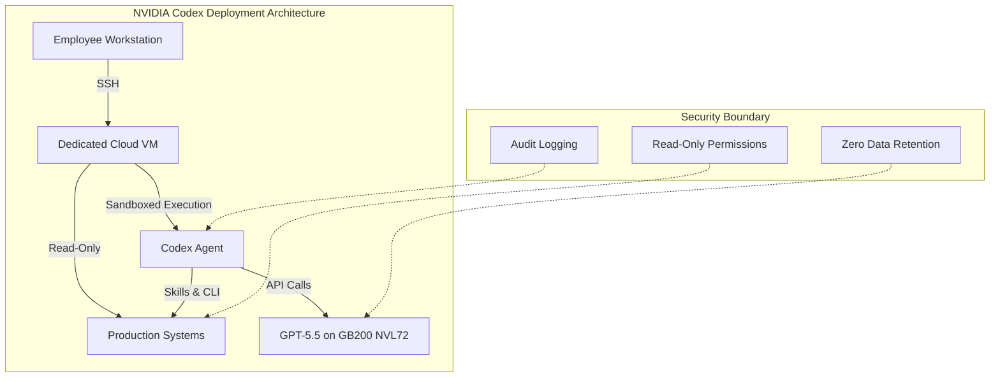
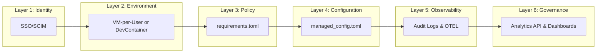

# NVIDIA's 10,000-Developer Codex Deployment: Enterprise Patterns for Large-Scale AI Agent Rollout


On 24 April 2026, NVIDIA revealed that over 10,000 employees across engineering, product, legal, marketing, finance, sales, HR, operations, and developer programmes now have access to GPT-5.5-powered Codex [^1]. Engineers described the results as "mind-blowing" and "life-changing" [^2]. CEO Jensen Huang framed the shift plainly: "Chatbots answer questions. Agents do work." [^2]

This is not a pilot. It is the largest publicly disclosed full-company Codex deployment to date, spanning technical and non-technical departments alike. For teams considering their own enterprise rollout, NVIDIA's architecture provides a concrete blueprint worth dissecting.

## The Infrastructure Layer: GB200 NVL72 at Scale

NVIDIA's deployment runs on its own **GB200 NVL72 rack-scale systems** — the same Blackwell architecture powering OpenAI's training clusters [^1]. The headline numbers are striking: **35× lower cost per million tokens** and **50× higher token output per second per megawatt** compared with prior-generation systems [^1]. A 100,000-GPU cluster completed multiple training runs for GPT-5.5 itself [^3].

For most enterprises, the infrastructure lesson is not "buy Blackwell" — it is that GPT-5.5's improved efficiency makes large-scale agent deployment economically viable at current API pricing. The cost-per-task ratio has shifted enough that deploying Codex to non-engineering roles (legal, marketing, finance) becomes justifiable [^1].



## The Security Model: VM-per-Employee Isolation

NVIDIA's most instructive decision is its **VM-per-employee architecture** [^2]. Rather than running Codex agents on developer laptops with local sandbox enforcement, NVIDIA IT provisioned a dedicated cloud virtual machine for every employee. The Codex desktop app connects to these VMs via **remote SSH** [^1].

This architectural choice delivers three properties simultaneously:

1. **Data isolation** — agents operate on company data without that data leaving the controlled VM environment [^1]
2. **Uniform enforcement** — sandbox policies, network rules, and audit logging are configured at the VM image level rather than trusting individual endpoint configuration [^2]
3. **Auditability** — every agent action occurs within a monitored, centrally managed environment [^1]

### Read-Only by Default

Agents access production systems with **read-only permissions** through command-line interfaces and Skills [^1]. A **zero-data-retention policy** governs the entire deployment — OpenAI retains no enterprise data from NVIDIA's usage [^2]. This maps directly to Codex CLI's `sandbox_mode = "read-only"` setting, enforced via `requirements.toml`:

```toml
# /etc/codex/requirements.toml — enterprise-enforced constraints
allowed_sandbox_modes = ["read-only", "workspace-write"]
allowed_approval_policies = ["untrusted", "on-request"]

[permissions.filesystem]
deny_read = [
    "/etc/secrets/**",
    "**/credentials/**",
    "**/.env*",
]
```

For CLI teams replicating this pattern, the managed configuration system [^4] provides the enforcement mechanism. Requirements files can be distributed via macOS MDM (`com.openai.codex:requirements_toml_base64`), system paths (`/etc/codex/requirements.toml`), or ChatGPT Enterprise cloud policies [^4].

## Productivity Patterns: What Actually Changed

NVIDIA reported three categories of measurable improvement [^1][^2]:

| Workflow | Before | After |
|----------|--------|-------|
| Debugging cycles | Days | Hours |
| Multi-file experiments | Weeks | Overnight |
| Feature implementation | Multiple iteration cycles | End-to-end from natural language prompts |

These gains align with the broader industry pattern documented in the Stanford Enterprise AI Playbook, which found structured human oversight correlated with successful AI deployments [^5]. NVIDIA's approach embeds this principle: agents operate within clear permission boundaries, and developers retain review authority over all changes.

### Beyond Engineering

The deployment extends to **non-engineering departments** — legal, marketing, finance, HR, and operations [^1]. While specific use cases for these teams were not detailed in the announcement, the pattern suggests Codex is being used for document analysis, data processing, and automation tasks rather than pure code generation. This mirrors the broader "Codex for (almost) everything" positioning OpenAI introduced on 16 April 2026, which added computer use, image generation, and 90+ plugins to the platform [^6].

## Replicating the NVIDIA Model: A Six-Layer Architecture

For teams planning their own large-scale deployment, NVIDIA's approach can be decomposed into six layers. Each maps to specific Codex CLI configuration mechanisms.



### Layer 1: Identity and Access

OpenAI's enterprise admin setup requires three stakeholder roles: a **Workspace Owner** who configures Codex settings, a **Security Owner** who determines agent permissions, and an **Analytics Owner** who integrates compliance APIs [^7]. RBAC is configured through custom roles:

```toml
# Example: Group-based policy assignment
# Configured via ChatGPT Enterprise admin portal

# "Codex Users" group → standard permissions
# "Codex Admin" group → policy management, analytics, environment control
```

### Layer 2: Execution Environment

NVIDIA chose dedicated cloud VMs. Smaller organisations have alternatives:

- **DevContainers** — `.devcontainer/devcontainer.json` provides reproducible, isolated environments without per-user VM overhead [^8]
- **Docker sandboxes** — containerised execution with volume-mounted workspaces
- **Local with managed requirements** — acceptable when `requirements.toml` enforcement is sufficient

The trade-off is between isolation strength and operational complexity. NVIDIA's scale justified per-employee VMs; a 50-person team likely does not need that overhead.

### Layer 3: Policy Enforcement

The `requirements.toml` file is the enforcement backbone [^4]. Key constraints for enterprise deployment:

```toml
# Sandbox: prevent full access outside controlled environments
allowed_sandbox_modes = ["read-only", "workspace-write"]

# Approval: require human review for sensitive operations
allowed_approval_policies = ["untrusted", "on-request"]

# MCP: restrict to approved tool servers
[[mcp_servers]]
name = "github"
identity = "github/github-mcp-server"

[[mcp_servers]]
name = "internal-api"
identity = "corp/internal-mcp-server"

# Web search: restrict to cached results only
allowed_web_search_modes = ["cached"]

# Feature control: disable browser/computer use if not needed
[feature_requirements]
disable = ["browser_use", "computer_use"]

# Command rules: block destructive Git operations
[[rules]]
pattern = "git push.*--force"
decision = "forbidden"
reason = "Force push requires manual authorisation"

[[rules]]
pattern = "rm -rf"
decision = "prompt"
reason = "Recursive delete requires justification"
```

### Layer 4: Managed Defaults

Distinct from requirements (which users cannot override), `managed_config.toml` sets organisational defaults that users *can* adjust during sessions [^4]:

```toml
# /etc/codex/managed_config.toml
model = "gpt-5.5"
approval_policy = "on-request"
sandbox_mode = "workspace-write"

[history]
persistence = "none"

[telemetry]
otel_endpoint = "https://otel.internal.corp:4318"
log_user_prompt = false
```

### Layer 5: Observability

NVIDIA's deployment maintains "full auditability" [^1]. The Codex enterprise platform provides three observability mechanisms [^7]:

- **Analytics API** — query workspace usage, code reviews, and review responses via `https://api.chatgpt.com/v1/analytics/codex/workspaces/{workspace_id}/usage`
- **Compliance API** — access audit logs and task details for investigation
- **Analytics Dashboard** — self-serve visibility at the admin portal

For CLI-heavy deployments, OpenTelemetry integration provides additional depth:

```toml
# OTEL configuration in managed_config.toml
[telemetry]
otel_endpoint = "https://otel-collector.internal:4318"
otel_service_name = "codex-cli"
```

### Layer 6: Governance Cadence

The Stanford Enterprise AI Playbook found that 65% of AI high performers have defined human-in-the-loop processes, compared with 23% of other organisations [^5]. Practical governance for Codex deployments includes:

- **Weekly** — review Analytics Dashboard for usage patterns and anomalies
- **Monthly** — audit `requirements.toml` drift across environments
- **Quarterly** — reassess approval policies, MCP server allowlists, and model selection

## GPT-5.5: The Model Behind the Deployment

NVIDIA's deployment coincides with the GPT-5.5 launch on 23 April 2026 [^9]. Key characteristics relevant to enterprise use:

- **1M token context window** via the API (400K through the Codex app) [^9]
- **Recommended for** complex coding, computer use, knowledge work, and research workflows [^9]
- **Available to** ChatGPT Plus, Pro, Business, and Enterprise subscribers [^9]

In Codex CLI, selecting GPT-5.5 is straightforward:

```bash
# Single session
codex --model gpt-5.5

# Default in config.toml
# model = "gpt-5.5"
```

The 1M context window is particularly relevant for NVIDIA's use case — large CUDA codebases with deeply interconnected headers and kernel files benefit significantly from expanded context [^10].

## What NVIDIA's Deployment Does Not Tell Us

Several important details remain undisclosed:

- **⚠️ Specific cost per seat** — NVIDIA's internal infrastructure costs are not representative of typical enterprise API spend
- **⚠️ Non-engineering workflow specifics** — how legal, HR, and finance teams actually use Codex was not detailed
- **⚠️ Failure rates and rollback patterns** — no data on agent errors, approval overrides, or tasks that required human takeover
- **⚠️ Skills catalogue** — the announcement references "Skills" as NVIDIA's internal automation toolkit but does not detail which skills were deployed

## Lessons for Your Team

NVIDIA's deployment validates several principles for enterprise Codex rollout:

1. **Isolate the environment, not just the agent** — VM-per-user or container-per-user provides stronger guarantees than relying solely on Codex's built-in sandbox
2. **Read-only by default** — start with agents that can observe but not modify production systems; expand write access to specific, well-tested workflows
3. **Deploy beyond engineering** — GPT-5.5's cost efficiency and expanded capabilities make non-coding use cases viable at enterprise scale
4. **Enforce policy centrally, configure locally** — use `requirements.toml` for security constraints, `managed_config.toml` for sensible defaults, and per-repository `.codex/config.toml` for project-specific tuning
5. **Staff the rollout** — NVIDIA had its own IT department managing the VM infrastructure; the Codex Labs programme [^11] exists precisely because most organisations need external expertise for this phase

The era of one-developer Codex experiments is closing. NVIDIA's deployment demonstrates what full-organisation adoption looks like — and the infrastructure, policy, and governance work required to get there.

## Citations

[^1]: NVIDIA Blog, "OpenAI's New GPT-5.5 Powers Codex on NVIDIA Infrastructure — and NVIDIA Is Already Putting It to Work," 24 April 2026. [https://blogs.nvidia.com/blog/openai-codex-gpt-5-5-ai-agents/](https://blogs.nvidia.com/blog/openai-codex-gpt-5-5-ai-agents/)

[^2]: TweakTown, "NVIDIA deploys GPT-5.5-powered Codex to 10,000 employees, with engineers calling results 'mind-blowing'," 24 April 2026. [https://www.tweaktown.com/news/111273/nvidia-deploys-gpt-5-5-powered-codex-to-10000-employees-with-engineers-calling-results-mind-blowing/index.html](https://www.tweaktown.com/news/111273/nvidia-deploys-gpt-5-5-powered-codex-to-10000-employees-with-engineers-calling-results-mind-blowing/index.html)

[^3]: TechRadar, "'It was awesome to see it work': OpenAI deploys GPT-5.5 Codex across NVIDIA Blackwell systems," 24 April 2026. [https://www.techradar.com/pro/it-was-awesome-to-see-it-work-openai-deploys-gpt-5-5-codex-across-nvidia-blackwell-systems-50x-efficiency-boost-and-35x-cost-reduction-makes-ai-viable-at-enterprise-scale](https://www.techradar.com/pro/it-was-awesome-to-see-it-work-openai-deploys-gpt-5-5-codex-across-nvidia-blackwell-systems-50x-efficiency-boost-and-35x-cost-reduction-makes-ai-viable-at-enterprise-scale)

[^4]: OpenAI, "Managed configuration – Codex," April 2026. [https://developers.openai.com/codex/enterprise/managed-configuration](https://developers.openai.com/codex/enterprise/managed-configuration)

[^5]: Stanford Digital Economy Lab, "The Enterprise AI Playbook: Lessons from 51 Successful Deployments," March 2026. [https://digitaleconomy.stanford.edu/app/uploads/2026/03/EnterpriseAIPlaybook_PereiraGraylinBrynjolfsson.pdf](https://digitaleconomy.stanford.edu/app/uploads/2026/03/EnterpriseAIPlaybook_PereiraGraylinBrynjolfsson.pdf)

[^6]: OpenAI, "Introducing upgrades to Codex," 16 April 2026. [https://openai.com/index/introducing-upgrades-to-codex/](https://openai.com/index/introducing-upgrades-to-codex/)

[^7]: OpenAI, "Admin Setup – Codex," April 2026. [https://developers.openai.com/codex/enterprise/admin-setup](https://developers.openai.com/codex/enterprise/admin-setup)

[^8]: OpenAI, "Local environments – Codex app," April 2026. [https://developers.openai.com/codex/app/local-environments](https://developers.openai.com/codex/app/local-environments)

[^9]: 9to5Mac, "OpenAI upgrades ChatGPT and Codex with GPT-5.5: 'a new class of intelligence for real work'," 23 April 2026. [https://9to5mac.com/2026/04/23/openai-upgrades-chatgpt-and-codex-with-gpt-5-5-a-new-class-of-intelligence-for-real-work/](https://9to5mac.com/2026/04/23/openai-upgrades-chatgpt-and-codex-with-gpt-5-5-a-new-class-of-intelligence-for-real-work/)

[^10]: OpenAI, "Models – Codex," April 2026. [https://developers.openai.com/codex/models](https://developers.openai.com/codex/models)

[^11]: OpenAI, "Scaling Codex to enterprises worldwide," 21 April 2026. [https://openai.com/index/scaling-codex-to-enterprises-worldwide/](https://openai.com/index/scaling-codex-to-enterprises-worldwide/)
