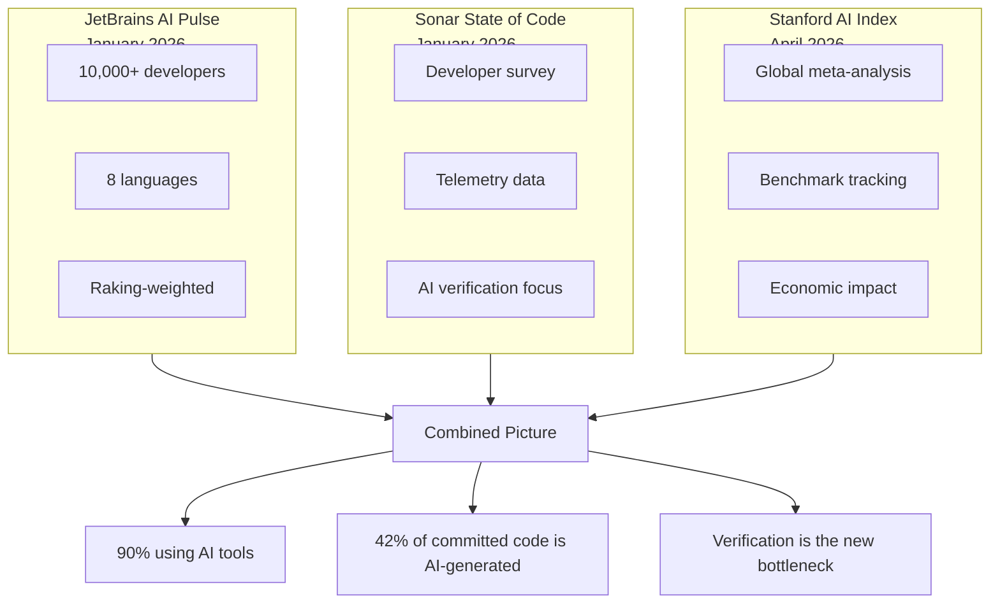
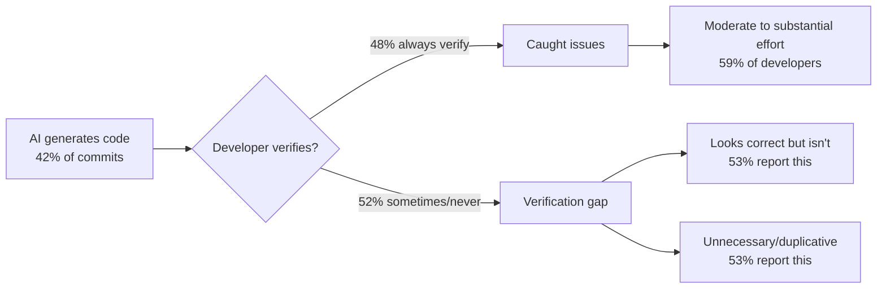
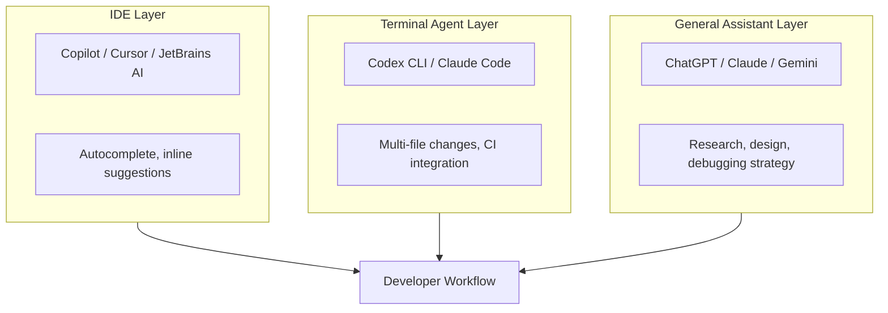

# AI Coding Agent Adoption in 2026: What the Survey Data Actually Shows and Where Codex CLI Fits


Three independent surveys published in April 2026 — the JetBrains AI Pulse (10,000+ developers), Sonar's State of Code (developer survey + telemetry), and the Stanford AI Index (meta-analysis of the field) — collectively paint the most complete picture we have had of how developers are actually using AI coding tools at work. The headline number is dramatic: 90% of developers now regularly use at least one AI tool for coding[^1]. But the detail beneath that headline matters far more, particularly for teams evaluating or already using Codex CLI.

This article synthesises the key findings from all three surveys, maps them onto the competitive landscape, and extracts actionable guidance for Codex CLI practitioners.

---

## The Three Surveys at a Glance



The JetBrains survey was deliberately debranded — no mention of AI in the promotional materials — and weighted using raking alignment against the 2025 Developer Ecosystem Survey along three dimensions: region, coding experience, and JetBrains product familiarity[^1]. This makes it one of the more methodologically rigorous surveys available.

---

## The Adoption Landscape: Who Is Using What

The JetBrains data breaks tool adoption into awareness and work usage, and the distinction matters. High awareness without proportional usage suggests a tool that developers know about but have not found compelling enough to integrate into daily work[^1].

| Tool | Awareness | Work Adoption | Trajectory |
|------|-----------|---------------|------------|
| GitHub Copilot | 76% | 29% | Plateaued |
| ChatGPT (for coding) | — | 28% | Stable |
| Cursor | 69% | 18% | Growth slowing |
| Claude Code | 57% | 18% | 6× growth in 9 months |
| JetBrains AI Assistant | — | 9% | Steady |
| Google Antigravity | — | 6% | Rapid early adoption |
| Junie (JetBrains) | — | 5% | New entrant |
| **Codex (CLI + App)** | **27%** | **3%** | **Pre-desktop-launch** |

The standout narrative is Claude Code's trajectory: from roughly 3% adoption in April–June 2025 to 18% by January 2026, reaching 24% in the US and Canada[^1]. Its satisfaction metrics are exceptional — 91% CSAT and an NPS of 54 — the highest product loyalty scores in the survey[^1].

### Codex's Position Requires Context

The 3% work adoption figure for Codex demands a critical caveat: the JetBrains survey was conducted in January 2026, *before* the desktop app relaunch, before GPT-5.3-Codex and GPT-5.4, and before the "Codex for (almost) everything" update that shipped computer use, the in-app browser, 90+ plugins, and memory[^2]. By April 8, Codex had crossed 3 million weekly active users[^3]. By April 21, it had reached 4 million[^4]. npm downloads grew 177× year-on-year, from 82,000 in April 2025 to 14.53 million in March 2026[^5]. Enterprise adoption within ChatGPT Business and Enterprise grew 6× since January[^5].

In short, the January survey captured Codex at its lowest ebb. The product that exists in April 2026 is materially different from the product the survey measured.

---

## The Verification Bottleneck

The Sonar State of Code survey surfaces a finding that should concern every team, regardless of which tool they use: **42% of all committed code is now AI-generated**, but 96% of developers do not fully trust that output[^6]. Only 48% always verify AI code before committing[^6].



Key figures from the Sonar survey[^6]:

- **95%** of developers spend at least some effort reviewing, testing, and correcting AI output
- **59%** rate that verification effort as "moderate" or "substantial"
- **38%** say reviewing AI code requires *more* effort than reviewing human code (vs. 27% who say less)
- **88%** report negative impacts alongside the positive — specifically code that "looks correct but isn't reliable" (53%) and "unnecessary and duplicative" code (53%)

The Stanford AI Index corroborates this at the macro level: whilst SWE-bench Verified performance jumped from 60% to nearly 100% of human baseline in a single year[^7], and software development productivity gains of 26% were documented[^7], employment among US software developers aged 22–25 dropped nearly 20% since 2024[^7]. The tools are getting dramatically better. The verification challenge remains.

---

## What This Means for Codex CLI Teams

### 1. The "Best-of-Breed" Shift Is Real

The JetBrains survey identifies a clear trend: "product excellence now outweighs ecosystem lock-in"[^1]. Developers are migrating to standalone, best-performing tools rather than accepting whatever ships with their IDE. This benefits Codex CLI's architecture — a standalone terminal agent that shares configuration with the IDE extension but does not require it.

For practical purposes, this means teams should evaluate Codex CLI against their specific workflow rather than defaulting to whatever comes bundled with their editor. The terminal-native model works best for:

- **Headless CI/CD integration** via `codex exec`[^8]
- **Parallel agent orchestration** using subagents and worktrees
- **Enterprise governance** through managed `requirements.toml` policies[^9]
- **Multi-provider routing** for teams using Bedrock, custom gateways, or open-weight models

### 2. Verification Is Your Competitive Advantage

The Sonar data makes it clear that the bottleneck has shifted from code generation to code verification[^6]. Teams that invest in verification infrastructure — test-driven development, mutation testing gates, hooks-based enforcement, structured output validation — will outperform teams that simply generate more code faster.

Codex CLI's toolchain for verification includes:

```toml
# config.toml — verification-focused profile
[profile.verified]
model = "gpt-5.5"
approval_mode = "suggest"

[profile.verified.hooks.post_tool_use]
# Enforce tests pass after every code change
command = "bash -c 'npm test 2>&1 | tail -20'"
on_fail = "block"
```

The `post_tool_use` hooks (stable since v0.124[^10]) let you enforce that every `apply_patch` operation passes a verification gate. Combined with `--output-schema` for structured code review output, this creates a verifiable generation pipeline rather than a hope-and-check workflow.

### 3. The Satisfaction Gap Points to Workflow, Not Model Quality

Claude Code's 91% CSAT and 54 NPS[^1] did not emerge because Anthropic's models are categorically better at code generation — GPT-5.5 matches or exceeds Claude on most coding benchmarks[^7][^11]. The satisfaction gap likely reflects workflow design: Claude Code's CLAUDE.md convention, its `/compact` and context management, and its opinionated defaults create a smoother developer experience for the common case.

Codex CLI teams can close this gap by investing in their AGENTS.md files, skills, and configuration profiles. The JetBrains HAX team's 151.9-million-event study found that AI "redistributes and reshapes developers' workflows in ways that often elude their own perceptions"[^12]. The implication: deliberate workflow design matters more than model selection.

### 4. Enterprise Is the Divergence Point

GitHub Copilot's 29% adoption rises to 40% in companies with 5,000+ employees[^1]. Enterprise is where bundled, IT-approved tools dominate through procurement convenience rather than technical superiority. Codex's competitive play here is substantial:

- **ChatGPT subscription bundling** — every ChatGPT Plus (\$20/month), Team, Business, or Enterprise subscription includes Codex[^5]
- **Managed configuration** via `requirements.toml` pushed through MDM or admin console[^9]
- **Compliance API** for audit trail export to SIEM systems[^9]
- **Named enterprise deployments** — NVIDIA (10,000+ developers), Cisco, Ramp, Rakuten, Goldman Sachs[^5]

The Codex Labs programme, announced with a Global Systems Integrator network including Accenture, Capgemini, CGI, Cognizant, Infosys, PwC, and TCS[^13], signals OpenAI's intent to compete for enterprise through the channel rather than through individual developer preference.

---

## The Multi-Tool Reality

One finding the surveys consistently reinforce: developers do not use a single tool. ChatGPT at 28% work adoption for coding[^1] coexists with specialised tools. The Tembo comparison of 15 CLI agents[^14] and the JetBrains report both describe a "mixed stack" where developers combine:

- An **IDE autocomplete layer** (Copilot, JetBrains AI, Cursor tab completion)
- A **terminal agent** (Codex CLI, Claude Code, Gemini CLI)
- A **general assistant** (ChatGPT, Claude chatbot, Gemini)



For Codex CLI users, the practical implication is to stop treating tool selection as an either/or decision. Use Codex CLI where its strengths lie — headless automation, enterprise governance, subagent orchestration, multi-provider routing — and complement it with whatever IDE-layer tool your organisation has standardised on.

---

## The Numbers to Watch

Three metrics from these surveys will determine the trajectory of the market over the next 12 months:

1. **AI code share** — Sonar reports 42% today, developers expect 65% by 2027[^6]. If the verification gap widens proportionally, the teams with the best test/review infrastructure win.

2. **Agent task success** — Stanford reports a jump from 12% to 66% on OSWorld[^7]. When this crosses 80%, fully autonomous `full-auto` mode becomes viable for standard tasks. Codex CLI's tiered approval modes (`suggest`, `auto-edit`, `full-auto`) are already designed for this graduation.

3. **Satisfaction convergence** — Claude Code's NPS of 54 is the target. If Codex closes the gap with its April 2026 feature wave (memories, plugins, computer use, GPT-5.5), the January 2026 survey numbers become a historical footnote rather than a market indicator.

---

## Practical Takeaways

For teams evaluating Codex CLI today, the survey data suggests five concrete actions:

1. **Audit your verification pipeline.** If you are in the 52% who do not always verify AI-generated code, start there — not with model selection or tool switching.

2. **Write your AGENTS.md.** The satisfaction gap between tools correlates with workflow structure, not model capability. A well-structured AGENTS.md with testing policies, coding conventions, and constraint definitions closes the gap.

3. **Set up `codex exec` in CI.** The highest-ROI Codex CLI use case is headless automation — issue-to-PR pipelines, CI failure autofix, scheduled audits. This is where terminal agents deliver value that IDE-layer tools cannot.

4. **Track your AI code ratio.** Use `ccusage` or the Codex Compliance API to measure what percentage of your commits are AI-generated and whether quality metrics (bug rates, test coverage, review turnaround) are moving in the right direction.

5. **Accept the multi-tool stack.** The data shows developers use 2–3 AI tools simultaneously. Optimise for the best combination rather than seeking a single tool that does everything.

---

## Citations

[^1]: JetBrains Research, "Which AI Coding Tools Do Developers Actually Use at Work?", JetBrains AI Pulse survey, January 2026, published April 2026. [https://blog.jetbrains.com/research/2026/04/which-ai-coding-tools-do-developers-actually-use-at-work/](https://blog.jetbrains.com/research/2026/04/which-ai-coding-tools-do-developers-actually-use-at-work/)

[^2]: OpenAI, "Codex for (almost) everything", 16 April 2026. [https://openai.com/index/codex-for-almost-everything/](https://openai.com/index/codex-for-almost-everything/)

[^3]: Daniel Vaughan, "Codex CLI 3 Million Users: Growth Trajectory and What the Usage Limit Reset Strategy Means", Codex Blog, 9 April 2026. [https://codex.danielvaughan.com/2026/04/09/codex-3-million-users-growth-usage-limits/](https://codex.danielvaughan.com/2026/04/09/codex-3-million-users-growth-usage-limits/)

[^4]: OpenAI, "Scaling Codex to enterprises worldwide", 21 April 2026. [https://openai.com/index/codex-for-almost-everything/](https://openai.com/index/codex-for-almost-everything/)

[^5]: Gradually.ai, "OpenAI Codex Statistics 2026: Key Numbers, Data & Facts", updated April 2026. [https://www.gradually.ai/en/codex-statistics/](https://www.gradually.ai/en/codex-statistics/)

[^6]: Sonar, "State of Code Developer Survey report: The current reality of AI coding", January 2026. [https://www.sonarsource.com/blog/state-of-code-developer-survey-report-the-current-reality-of-ai-coding](https://www.sonarsource.com/blog/state-of-code-developer-survey-report-the-current-reality-of-ai-coding)

[^7]: Stanford HAI, "The 2026 AI Index Report", April 2026. [https://hai.stanford.edu/ai-index/2026-ai-index-report](https://hai.stanford.edu/ai-index/2026-ai-index-report)

[^8]: OpenAI, "Non-interactive mode — Codex CLI", OpenAI Developers. [https://developers.openai.com/codex/noninteractive](https://developers.openai.com/codex/noninteractive)

[^9]: OpenAI, "Governance — Codex", OpenAI Developers. [https://developers.openai.com/codex/enterprise/governance](https://developers.openai.com/codex/enterprise/governance)

[^10]: OpenAI, Codex CLI v0.124.0 release notes, 23 April 2026. [https://github.com/openai/codex/releases](https://github.com/openai/codex/releases)

[^11]: OpenAI, "Models — Codex", OpenAI Developers. [https://developers.openai.com/codex/models](https://developers.openai.com/codex/models)

[^12]: JetBrains Research, "Understanding AI's Impact on Developer Workflows", April 2026. [https://blog.jetbrains.com/research/2026/04/ai-impact-developer-workflows/](https://blog.jetbrains.com/research/2026/04/ai-impact-developer-workflows/)

[^13]: OpenAI, "Scaling Codex to enterprises worldwide", Codex Labs GSI announcement, 21 April 2026. [https://openai.com/index/codex-for-almost-everything/](https://openai.com/index/codex-for-almost-everything/)

[^14]: Tembo, "The 2026 Guide to Coding CLI Tools: 15 AI Agents Compared", April 2026. [https://www.tembo.io/blog/coding-cli-tools-comparison](https://www.tembo.io/blog/coding-cli-tools-comparison)
