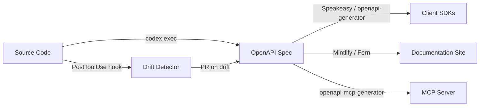
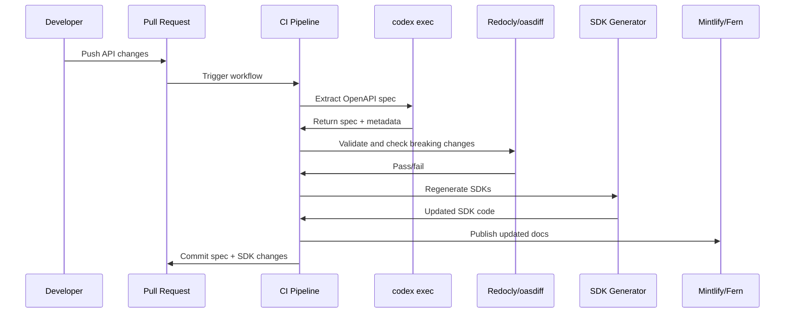

# Codex CLI for Automated API Documentation: OpenAPI Generation, SDK Scaffolding, and Doc-Code Sync


---

API documentation is the contract between your service and its consumers. When it drifts from the implementation — and it always does — developer experience degrades, integration bugs multiply, and support tickets spike. Codex CLI, particularly through `codex exec` and the emerging ecosystem of OpenAPI-focused MCP servers and agent skills, can close the gap between code and docs by automating spec extraction, SDK generation, and continuous synchronisation.

This article presents a practical, end-to-end pipeline for API documentation automation using Codex CLI v0.125, GPT-5.5, and the latest tooling available in April 2026.

## The API Documentation Problem

Most teams face three recurring failures:

1. **Spec drift** — The OpenAPI spec was accurate at launch but hasn't kept pace with six months of endpoint changes [^1].
2. **SDK staleness** — Client libraries are hand-maintained or generated once and never regenerated after spec updates.
3. **Doc rot** — Prose documentation (guides, tutorials, changelogs) describes behaviour from two versions ago.

AI-powered documentation tools now reduce documentation time by up to 70% [^2], but the real leverage comes from wiring extraction, generation, and validation into a single automated pipeline.

## Architecture Overview



The pipeline has four stages: **Extract** an OpenAPI spec from source code, **Generate** SDKs and documentation from the spec, **Serve** the API as an MCP server for agent consumption, and **Guard** against drift with hooks and CI gates.

## Stage 1: Extracting OpenAPI Specs with Codex CLI

### Interactive Extraction

For a one-off extraction from an existing codebase, use the interactive TUI:

```bash
codex --model gpt-5.5 --approval-mode auto-edit
```

Then prompt:

> Analyse all route handlers in src/api/ and generate a complete OpenAPI 3.1 specification. Include request/response schemas derived from TypeScript types, path parameters, query parameters, authentication requirements, and example values. Output to docs/openapi.yaml.

Codex reads the source files, infers schemas from types and validation logic, and writes a spec file [^3].

### Headless Extraction with `codex exec`

For CI pipelines, use `codex exec` with `--output-schema` to produce structured, machine-parseable output:

```bash
codex exec \
  --model gpt-5.5 \
  --approval-mode full-auto \
  -o docs/openapi.yaml \
  "Extract the OpenAPI 3.1 specification from src/api/. \
   Include all endpoints, request/response schemas, auth, \
   and examples. Output valid YAML only."
```

For structured metadata alongside the spec, define a JSON schema:

```json
{
  "$schema": "https://json-schema.org/draft/2020-12/schema",
  "type": "object",
  "properties": {
    "spec_version": { "type": "string" },
    "endpoint_count": { "type": "integer" },
    "breaking_changes": {
      "type": "array",
      "items": { "type": "string" }
    },
    "warnings": {
      "type": "array",
      "items": { "type": "string" }
    }
  },
  "required": ["spec_version", "endpoint_count", "breaking_changes"]
}
```

```bash
codex exec \
  --model gpt-5.5 \
  --approval-mode full-auto \
  --output-schema ./schemas/api-extract-meta.json \
  "Extract the OpenAPI spec to docs/openapi.yaml. \
   Then return metadata about the extraction."
```

The structured output provides a machine-readable summary for downstream pipeline steps [^4].

### AGENTS.md for API Projects

Encode your API documentation standards in AGENTS.md so every Codex session respects them:

```markdown
# API Documentation Standards

## OpenAPI Conventions
- All endpoints MUST have `summary`, `description`, and `operationId`
- Request bodies MUST use `$ref` to named schemas in `components/schemas`
- Every endpoint MUST include at least one example response
- Authentication requirements MUST be declared per-endpoint via `security`
- Use `tags` to group endpoints by resource (users, orders, payments)

## Versioning
- Spec version follows SemVer: bump MINOR for new endpoints, MAJOR for breaking changes
- Include `x-changelog` extension with date and description for each change

## Validation
- Run `npx @redocly/cli lint docs/openapi.yaml` after any spec changes
- Run `npx oasdiff breaking docs/openapi-prev.yaml docs/openapi.yaml` before merging
```

## Stage 2: SDK Generation from OpenAPI

Once you have a validated spec, SDK generation becomes deterministic. Two approaches work well with Codex CLI.

### Speakeasy Agent Skills

Speakeasy provides 21 agent skills covering the full API development lifecycle, from spec authoring to SDK generation across seven languages [^5]. Install them:

```bash
npx skills add speakeasy-api/skills
```

These skills load into Codex CLI's context through metadata triggers [^5]. When you prompt Codex to generate an SDK, the relevant Speakeasy skill activates automatically, providing language-specific conventions and best practices.

```bash
codex exec \
  --model gpt-5.5 \
  --approval-mode full-auto \
  "Using the Speakeasy skills, generate a TypeScript SDK \
   from docs/openapi.yaml into sdk/typescript/. \
   Include typed request/response objects, error handling, \
   and pagination helpers."
```

### OpenAPI Generator with Codex Orchestration

For teams using OpenAPI Generator [^6], Codex CLI can orchestrate the entire generation and customisation workflow:

```bash
codex exec \
  --approval-mode full-auto \
  "Run openapi-generator-cli generate \
   -i docs/openapi.yaml \
   -g typescript-axios \
   -o sdk/typescript/ \
   --additional-properties=supportsES6=true,npmName=@myorg/api-sdk. \
   Then review the generated code for any issues and fix them."
```

Codex executes the generator, reviews the output, and applies fixes — a pattern that combines deterministic code generation with intelligent post-processing [^3].

## Stage 3: OpenAPI-to-MCP for Agent Consumption

A compelling recent development is converting OpenAPI specifications into MCP servers, enabling any MCP-aware agent (including Codex CLI itself) to interact with your API programmatically.

### openapi-mcp-generator

The `openapi-mcp-generator` tool converts OpenAPI specs into fully functional MCP servers [^7]:

```bash
npx openapi-mcp-generator \
  --input docs/openapi.yaml \
  --output mcp-server/ \
  --language python
```

### Cloudflare Code Mode MCP

For APIs with large surface areas (hundreds of endpoints), Cloudflare's Code Mode MCP server reduces token overhead by exposing only two tools — `search()` and `execute()` — backed by a type-aware SDK that compiles agent plans into code snippets against the OpenAPI spec [^8]. This approach addresses the MCP schema bloat problem documented in earlier articles.

### Configuring in Codex CLI

Add the generated MCP server to your `config.toml`:

```toml
[mcp_servers.my-api]
command = "node"
args = ["./mcp-server/dist/index.js"]
env = { API_BASE_URL = "https://api.staging.example.com" }
```

Now Codex CLI can call your API endpoints as tools during development sessions — useful for testing, debugging, and building integration examples [^9].

## Stage 4: Continuous Doc-Code Sync

### PostToolUse Hooks for Drift Detection

With hooks now stable in v0.124+ [^10], you can enforce documentation updates whenever API source code changes:

```toml
[[hooks]]
event = "post_tool_use"
tool_name = "apply_patch"

[hooks.command]
program = "bash"
args = ["-c", """
  changed=$(echo "$CODEX_TOOL_INPUT" | grep -c 'src/api/')
  if [ "$changed" -gt 0 ]; then
    echo "API source changed — run 'npm run generate:openapi' to update spec"
    echo "action: notify"
  fi
"""]
```

This hook fires after every file edit and warns if API source files changed without a corresponding spec update [^10].

### CI Pipeline: Extract, Validate, Gate

```yaml
# .github/workflows/api-docs-sync.yml
name: API Documentation Sync
on:
  pull_request:
    paths: ['src/api/**']

jobs:
  validate-spec:
    runs-on: ubuntu-latest
    steps:
      - uses: actions/checkout@v4

      - name: Extract OpenAPI spec
        uses: openai/codex-action@v1
        with:
          codex-args: >
            --approval-mode full-auto
            --model gpt-5.5
          prompt: |
            Extract the OpenAPI 3.1 spec from src/api/ to
            docs/openapi.yaml. Preserve existing x-changelog entries.

      - name: Lint spec
        run: npx @redocly/cli lint docs/openapi.yaml

      - name: Check for breaking changes
        run: |
          npx oasdiff breaking \
            docs/openapi-main.yaml docs/openapi.yaml \
            --fail-on ERR

      - name: Regenerate SDKs
        run: |
          npx openapi-generator-cli generate \
            -i docs/openapi.yaml \
            -g typescript-axios \
            -o sdk/typescript/

      - name: Commit updates
        run: |
          git add docs/openapi.yaml sdk/
          git diff --cached --quiet || \
            git commit -m "docs: sync OpenAPI spec and SDKs"
```

This pipeline runs on every PR that touches API source code, extracting a fresh spec, linting it, checking for breaking changes, and regenerating SDKs automatically [^11].

### Documentation Platform Integration

Both Mintlify and Fern can consume OpenAPI specs and auto-generate documentation sites:

- **Mintlify** auto-generates API playgrounds, request/response samples, and SDK code snippets from OpenAPI specs. Its GitHub App detects changes in PRs and automatically updates documentation [^12].
- **Fern** generates SDKs alongside documentation, ensuring type definitions in client libraries match the published docs. Fern's MCP servers turn documentation into structured, queryable resources for AI agents [^13].

## Model Selection

| Task | Recommended Model | Reasoning |
|------|------------------|-----------|
| Spec extraction from complex codebases | GPT-5.5 (high effort) | Needs deep code comprehension |
| Spec linting and validation | GPT-5.3-Codex-Spark | Fast, low-cost validation |
| SDK post-processing and fixes | GPT-5.5 (medium effort) | Balances quality and cost |
| Breaking change detection | Deterministic tooling | Use oasdiff, not an LLM |
| Documentation prose generation | GPT-5.5 (medium effort) | Natural language quality matters |

For cost-sensitive pipelines, use a two-tier routing strategy: Spark for validation and simple extraction tasks, GPT-5.5 for complex spec generation and prose [^14].

## Common Pitfalls

### Hallucinated Endpoints

Codex may infer endpoints that don't exist, particularly from test files or commented-out code. Mitigate by:

- Adding explicit instructions in AGENTS.md: "Only document endpoints with active route registrations"
- Using `--output-schema` to force structured output and validate against actual routes
- Running the generated spec through a contract test suite

### Schema Over-Specification

LLMs tend to generate overly specific schemas with `enum` values derived from test data rather than the actual domain. Review generated `components/schemas` for artificial constraints.

### Breaking Change False Positives

Reordering properties or adding optional fields can trigger false positives in breaking-change detectors. Configure oasdiff's severity levels appropriately and include suppression comments for known-safe changes.

## Security Considerations

API specs may expose internal implementation details. Use deny-read policies to prevent Codex from accessing sensitive configuration:

```toml
[sandbox]
deny_read = [
  ".env*",
  "config/secrets/**",
  "src/api/internal/**"
]
```

For specs that include authentication examples, ensure tokens and API keys use placeholder values. Add a hook to reject any spec containing patterns matching real credential formats [^15].

## Putting It All Together

The complete pipeline — from source code to published documentation — can run in under five minutes for a typical REST API with 50–100 endpoints. The key is treating the OpenAPI specification as a build artefact: extracted from code, validated automatically, and consumed by downstream generators.



By wiring Codex CLI into this pipeline, you get documentation that tracks the code with every commit — not just when someone remembers to update it.

## Citations

[^1]: Fern, "API design best practices guide (March 2026)," [https://buildwithfern.com/post/api-design-best-practices-guide](https://buildwithfern.com/post/api-design-best-practices-guide)

[^2]: DigitalAPI, "AI-Powered API Docs: What makes it critical for every industry in 2026?," [https://www.digitalapi.ai/blogs/ai-powered-api-docs-what-makes-it-critical-for-every-industry-in-2026](https://www.digitalapi.ai/blogs/ai-powered-api-docs-what-makes-it-critical-for-every-industry-in-2026)

[^3]: OpenAI, "Features — Codex CLI," [https://developers.openai.com/codex/cli/features](https://developers.openai.com/codex/cli/features)

[^4]: OpenAI, "Non-interactive mode — Codex," [https://developers.openai.com/codex/noninteractive](https://developers.openai.com/codex/noninteractive)

[^5]: Speakeasy, "Agent skills for OpenAPI and SDK generation," [https://www.speakeasy.com/blog/release-agent-skills](https://www.speakeasy.com/blog/release-agent-skills)

[^6]: OpenAPI Generator, "OpenAPI Generator documentation," [https://openapi-generator.tech/](https://openapi-generator.tech/)

[^7]: harsha-iiiv, "openapi-mcp-generator — Convert OpenAPI specs to MCP servers," [https://github.com/harsha-iiiv/openapi-mcp-generator](https://github.com/harsha-iiiv/openapi-mcp-generator)

[^8]: InfoQ, "Cloudflare Launches Code Mode MCP Server to Optimize Token Usage for AI Agents," [https://www.infoq.com/news/2026/04/cloudflare-code-mode-mcp-server/](https://www.infoq.com/news/2026/04/cloudflare-code-mode-mcp-server/)

[^9]: OpenAI, "Model Context Protocol — Codex," [https://developers.openai.com/api/docs/mcp](https://developers.openai.com/api/docs/mcp)

[^10]: OpenAI, "Codex CLI v0.124.0 changelog," [https://developers.openai.com/codex/changelog](https://developers.openai.com/codex/changelog)

[^11]: OpenAI, "GitHub Action — Codex," [https://developers.openai.com/codex/github-action](https://developers.openai.com/codex/github-action)

[^12]: Mintlify, "Autogenerating API documentation from OpenAPI," [https://www.mintlify.com/blog/steps-to-autogenerate](https://www.mintlify.com/blog/steps-to-autogenerate)

[^13]: Fern, "MCP Servers for Documentation Sites," [https://buildwithfern.com/post/mcp-servers-documentation-sites](https://buildwithfern.com/post/mcp-servers-documentation-sites)

[^14]: OpenAI, "Codex models and pricing," [https://developers.openai.com/codex/cli](https://developers.openai.com/codex/cli)

[^15]: OpenAI, "Agent approvals and security — Codex," [https://developers.openai.com/codex/agent-approvals-security](https://developers.openai.com/codex/agent-approvals-security)
