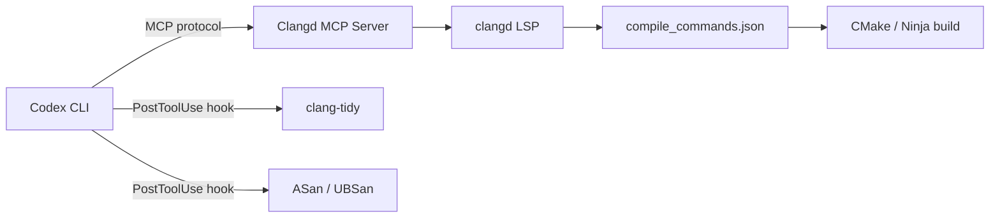
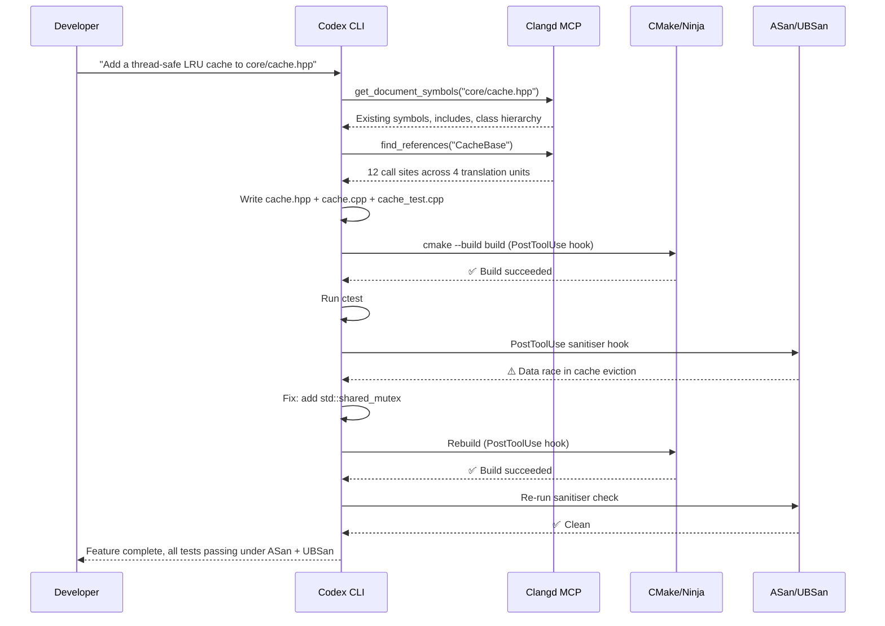

# Codex CLI for C and C++ Teams: CMake, Clangd MCP, Sanitisers, and Memory-Safe Agent Workflows


C and C++ remain the backbone of systems programming — from kernels and game engines to embedded firmware and high-frequency trading platforms. Yet most AI coding agent guides focus on managed-language ecosystems where compilation is trivial and memory management is invisible. C++ developers face a different reality: header resolution across translation units, build-system complexity, undefined behaviour lurking behind every raw pointer, and compile times measured in minutes rather than seconds.

This article shows how to configure Codex CLI as a productive partner for C and C++ projects, covering AGENTS.md conventions, sandbox and build-tool configuration, Clangd MCP integration for semantic code intelligence, `PostToolUse` hooks for compiler and sanitiser feedback, and model selection for different C++ task profiles.

## Why C++ Is Uniquely Challenging for Agents

Before diving into configuration, it is worth understanding why C++ demands more harness work than most languages:

1. **No single entry point for builds.** Projects may use CMake, Meson, Bazel, Make, or Ninja — often in combination [^1]. The agent must know the exact incantation.
2. **Header-only visibility.** Without a compilation database (`compile_commands.json`), the agent cannot resolve includes, macros, or template instantiations accurately [^2].
3. **Undefined behaviour.** Correct-looking code can silently corrupt memory. Agents need sanitiser feedback in the loop, not just "it compiled" [^3].
4. **Long compile times.** A full rebuild can take minutes on large codebases. The agent must be guided towards incremental builds and ccache.
5. **C++26 evolution.** The recently shipped C++26 standard introduces reflection, contracts, and hardened memory-safety defaults [^4] — the agent needs up-to-date knowledge of modern idioms.

## AGENTS.md Template for C/C++ Projects

A well-structured `AGENTS.md` encodes the build commands, coding standards, and safety expectations that the agent cannot infer from source alone.

```markdown
# AGENTS.md — C++ Project Conventions

## Build System
- Build tool: CMake 4.1+ with Ninja generator
- Configure: `cmake -B build -G Ninja -DCMAKE_EXPORT_COMPILE_COMMANDS=ON -DCMAKE_BUILD_TYPE=Debug`
- Build: `cmake --build build -j$(nproc)`
- Test: `ctest --test-dir build --output-on-failure`
- Clean: `cmake --build build --target clean`

## Compilation Database
- Always generate `compile_commands.json` via `-DCMAKE_EXPORT_COMPILE_COMMANDS=ON`
- Symlink to project root: `ln -sf build/compile_commands.json .`
- The Clangd MCP server depends on this file

## Coding Standards
- C++23 minimum; use C++26 features (contracts, reflection) where compiler support exists
- Smart pointers (std::unique_ptr, std::shared_ptr) — no raw owning pointers
- RAII for all resource management
- Use std::span and std::string_view over raw pointers and const char*
- Prefer std::expected or std::optional over error codes
- No `using namespace std;` in headers

## Static Analysis
- clang-tidy checks: modernize-*, bugprone-*, cppcoreguidelines-*, performance-*
- Run: `clang-tidy -p build src/**/*.cpp`

## Sanitisers
- Debug builds enable ASan + UBSan: `-DCMAKE_CXX_FLAGS="-fsanitize=address,undefined -fno-omit-frame-pointer"`
- Thread-safety builds: `-DCMAKE_CXX_FLAGS="-fsanitize=thread"`
- Always run tests under sanitisers before marking work complete

## File Layout
- Headers: `include/<project>/`
- Sources: `src/`
- Tests: `tests/` (Google Test framework)
- Benchmarks: `bench/` (Google Benchmark)
```

For monorepo layouts with multiple libraries, place a root-level `AGENTS.md` with shared conventions, then add per-library overrides in each subdirectory [^5].

## config.toml: Sandbox and Build Configuration

C++ builds require write access beyond the workspace (e.g., `/tmp` for intermediate objects) and read access to system headers and toolchain binaries. The default `workspace-write` sandbox mode works for most projects, but you may need writable roots for out-of-tree build directories.

```toml
# ~/.codex/config.toml — C++ profile

model = "gpt-5.5"
model_reasoning_effort = "high"

[features]
codex_hooks = true

[profiles.cpp]
model = "gpt-5.5"
model_reasoning_effort = "high"
sandbox_mode = "workspace-write"
approval_policy = "on-request"

[profiles.cpp-fast]
model = "GPT-5.3-Codex-Spark"
model_reasoning_effort = "medium"
sandbox_mode = "workspace-write"
```

Launch Codex with a profile:

```bash
codex --profile cpp
# Or for quick refactors:
codex --profile cpp-fast
```

For projects that place the build directory outside the workspace (e.g., a sibling `../build-release`), extend writable roots in a project-level `.codex/config.toml` [^6]:

```toml
# .codex/config.toml
sandbox_mode = "workspace-write"
```

## Clangd MCP: Semantic Code Intelligence

Raw text search is insufficient for C++ — templates, overloaded functions, and macro expansions demand semantic understanding. Two MCP servers bridge this gap.

### Option 1: clangd-mcp-server

The `clangd-mcp-server` exposes nine tools backed by the Clangd language server [^7]:

| Tool | Purpose |
|------|---------|
| `find_definition` | Jump to symbol definitions |
| `find_references` | All references to a symbol |
| `get_hover` | Type information and documentation |
| `workspace_symbol_search` | Search symbols across the workspace |
| `find_implementations` | Virtual method / interface implementations |
| `get_document_symbols` | Hierarchical symbol tree for a file |
| `get_diagnostics` | Compiler errors, warnings, and notes |
| `get_call_hierarchy` | Function callers and callees |
| `get_type_hierarchy` | Base and derived classes |

**Prerequisites:** Node.js >= 18, clangd installed, and a `compile_commands.json` at the project root [^7].

Configure in `.codex/config.toml`:

```toml
[mcp_servers.clangd]
command = "clangd-mcp-server"
[mcp_servers.clangd.env]
PROJECT_ROOT = "."
```

### Option 2: Clangaroo

Clangaroo combines Tree-sitter's parsing speed with Clangd's LSP accuracy [^8]. It offers the same core navigation tools plus AI-powered architectural analysis via an optional Gemini Flash backend. Useful for very large codebases where you want fast symbol lookup with accurate fallback.



## PostToolUse Hooks: Compiler and Sanitiser Feedback

Hooks inject deterministic checks into the agent loop [^9]. For C++ projects, two hooks are essential: one to run the build after file edits (catching compile errors immediately) and another to run sanitisers after test execution.

### Hook 1: Build After Edit

Create `.codex/hooks/build-after-edit.py`:

```python
#!/usr/bin/env python3
"""PostToolUse hook: rebuild after file edits."""
import json, subprocess, sys

event = json.loads(sys.stdin.read())
tool = event.get("tool_name", "")

if tool not in ("apply_patch", "Edit", "Write"):
    json.dump({"decision": "approve"}, sys.stdout)
    sys.exit(0)

# Check if edited file is C/C++
tool_input = event.get("tool_input", {})
path = tool_input.get("file_path", "")
if not any(path.endswith(ext) for ext in (".cpp", ".cc", ".cxx", ".c", ".h", ".hpp")):
    json.dump({"decision": "approve"}, sys.stdout)
    sys.exit(0)

result = subprocess.run(
    ["cmake", "--build", "build", "-j4"],
    capture_output=True, text=True, timeout=120
)

if result.returncode != 0:
    json.dump({
        "decision": "block",
        "reason": f"Build failed:\n{result.stderr[-2000:]}",
        "hookSpecificOutput": {
            "hookEventName": "PostToolUse",
            "additionalContext": result.stdout[-1000:]
        }
    }, sys.stdout)
    sys.exit(2)

json.dump({"decision": "approve"}, sys.stdout)
```

### Hook 2: Sanitiser Check After Tests

Create `.codex/hooks/sanitiser-check.py`:

```python
#!/usr/bin/env python3
"""PostToolUse hook: run tests under ASan/UBSan after Bash commands."""
import json, subprocess, sys

event = json.loads(sys.stdin.read())
tool = event.get("tool_name", "")
tool_input = event.get("tool_input", {})

if tool != "Bash":
    json.dump({"decision": "approve"}, sys.stdout)
    sys.exit(0)

command = tool_input.get("command", "")
if "ctest" not in command and "test" not in command:
    json.dump({"decision": "approve"}, sys.stdout)
    sys.exit(0)

# Re-run tests with sanitiser output captured
env_vars = {"ASAN_OPTIONS": "detect_leaks=1:halt_on_error=0"}
result = subprocess.run(
    ["ctest", "--test-dir", "build", "--output-on-failure"],
    capture_output=True, text=True, timeout=300,
    env={**__import__("os").environ, **env_vars}
)

if result.returncode != 0:
    json.dump({
        "decision": "block",
        "reason": f"Sanitiser or test failure:\n{result.stderr[-2000:]}"
    }, sys.stdout)
    sys.exit(2)

json.dump({"decision": "approve"}, sys.stdout)
```

Register both hooks in `.codex/config.toml`:

```toml
[[hooks.PostToolUse]]
matcher = "^(apply_patch|Edit|Write)$"

[[hooks.PostToolUse.hooks]]
type = "command"
command = '/usr/bin/python3 ".codex/hooks/build-after-edit.py"'
timeout = 120
statusMessage = "Rebuilding..."

[[hooks.PostToolUse]]
matcher = "^Bash$"

[[hooks.PostToolUse.hooks]]
type = "command"
command = '/usr/bin/python3 ".codex/hooks/sanitiser-check.py"'
timeout = 300
statusMessage = "Running sanitiser checks..."
```

## Agent-Driven Feature Development Workflow

The following sequence illustrates adding a new feature to a C++ project with full compiler and sanitiser feedback:



## Model Selection by C++ Task

| Task | Recommended Model | Reasoning Effort | Rationale |
|------|-------------------|------------------|-----------|
| Complex template metaprogramming | gpt-5.5 | high | Deep type-system reasoning [^10] |
| New feature implementation | gpt-5.5 | high | Architecture + safety awareness |
| Bug fix with sanitiser output | gpt-5.5 | medium | Focused analysis of error trace |
| Refactoring (rename, extract) | GPT-5.3-Codex-Spark | medium | Mechanical, speed matters [^11] |
| Boilerplate (getters, operators) | GPT-5.3-Codex-Spark | low | Pattern-based, minimal reasoning |
| CMakeLists.txt maintenance | gpt-5.5 | medium | CMake's DSL has subtle pitfalls |
| Code review (`/review`) | gpt-5.5 | high | Catch UB and ownership issues |

## C++26 Awareness

C++26 was finalised by WG21 on 28 March 2026 and is now in ISO Draft International Standard phase [^4]. Key features the agent should understand:

- **Contracts** (`pre`, `post`, `assert`): Language-level preconditions and postconditions that replace ad-hoc `assert()` macros [^4].
- **Static reflection** (`^` and `[: :]`): Compile-time introspection eliminating entire categories of boilerplate [^4].
- **Hardened standard library**: `std::vector`, `std::span`, `std::string`, and `std::string_view` now perform bounds checking by default in hardened mode, treating precondition violations as contract violations rather than silent undefined behaviour [^12].
- **Erased uninitialized UB**: Reading an uninitialized local variable is no longer undefined behaviour in C++26 [^12].

Encode C++26 awareness in your AGENTS.md:

```markdown
## C++26 Features (where supported)
- Prefer contracts (`pre`, `post`) over assert macros
- Use `std::hardened` mode for container bounds checking
- Leverage reflection for serialisation and logging boilerplate
```

⚠️ Compiler support for C++26 contracts and reflection varies across GCC, Clang, and MSVC as of April 2026. Check your toolchain's feature status before relying on these in production.

## Common Pitfalls

| Pitfall | Symptom | Fix |
|---------|---------|-----|
| Missing `compile_commands.json` | Clangd MCP returns empty results | Add `-DCMAKE_EXPORT_COMPILE_COMMANDS=ON` to CMake configure |
| Agent uses raw `new`/`delete` | Memory leaks under sanitiser | Add "No raw owning pointers" to AGENTS.md |
| Full rebuild on every edit | Hook timeouts | Use incremental builds; ensure Ninja (not Make) as generator |
| Agent ignores sanitiser warnings | UB persists | PostToolUse hook blocks on non-zero sanitiser exit code |
| Template errors consume context window | Agent loops on SFINAE failures | Use `gpt-5.5` with `high` effort; provide error excerpts in AGENTS.md tips |
| Agent writes `using namespace std;` in headers | Name collisions in downstream code | Explicit prohibition in AGENTS.md coding standards |

## Headless CI Pipeline

For automated pipelines, chain `codex exec` with build verification:

```bash
#!/usr/bin/env bash
set -euo pipefail

# Phase 1: Generate code
codex exec \
  --model gpt-5.5 \
  --approval-policy on-request \
  --profile cpp \
  "Implement the LRU cache described in TODO.md with thread safety"

# Phase 2: Build and test with sanitisers
cmake --build build -j"$(nproc)"
ASAN_OPTIONS="detect_leaks=1" ctest --test-dir build --output-on-failure

# Phase 3: Static analysis
clang-tidy -p build src/**/*.cpp --warnings-as-errors='*'
```

## Citations

[^1]: [CMake Documentation — cmake-toolchains(7)](https://cmake.org/cmake/help/latest/manual/cmake-toolchains.7.html) — CMake 4.x supports Ninja, Make, and other generators for cross-platform C++ builds.

[^2]: [clangd-mcp-server — GitHub](https://github.com/felipeerias/clangd-mcp-server) — Requires `compile_commands.json` generated via CMake, GN, or Bear for accurate code intelligence.

[^3]: [AddressSanitizer — Google Sanitizers Wiki](https://github.com/google/sanitizers/wiki/AddressSanitizer) — ASan detects heap/stack buffer overflows, use-after-free, and memory leaks at approximately 2x runtime overhead.

[^4]: [C++26: Reflection, Memory Safety, Contracts, and a New Async Model — InfoQ, April 2026](https://www.infoq.com/news/2026/04/cpp-26-reflection-safety-async/) — WG21 finalised C++26 on 28 March 2026 with reflection, contracts, and hardened standard library.

[^5]: [Custom instructions with AGENTS.md — OpenAI Developers](https://developers.openai.com/codex/guides/agents-md) — Codex discovers and concatenates AGENTS.md files from root to current directory.

[^6]: [Config basics — OpenAI Developers](https://developers.openai.com/codex/config-basic) — Configuration precedence: CLI flags → profiles → project config → user config → defaults.

[^7]: [clangd-mcp-server — GitHub](https://github.com/felipeerias/clangd-mcp-server) — MCP server exposing nine clangd LSP tools including find_definition, get_diagnostics, and get_call_hierarchy.

[^8]: [Clangaroo — GitHub](https://github.com/jasondk/clangaroo) — Hybrid Tree-sitter + Clangd MCP server for fast C++ code navigation in AI agent workflows.

[^9]: [Hooks — OpenAI Developers](https://developers.openai.com/codex/hooks) ��� PostToolUse hooks execute after Bash, apply_patch, and MCP calls; configurable in config.toml with regex matchers.

[^10]: [Features — Codex CLI | OpenAI Developers](https://developers.openai.com/codex/cli/features) — GPT-5.5 is recommended for complex coding and knowledge work; GPT-5.3-Codex-Spark for fast tasks at 1000+ tokens/sec.

[^11]: [Codex Changelog — OpenAI Developers](https://developers.openai.com/codex/changelog) — v0.124.0 introduced TUI quick reasoning controls (Alt+, and Alt+.) for on-the-fly effort tuning.

[^12]: [C++26 Memory Safety Is the First Serious Answer to the Rewrite Fantasy — John Farrier](https://johnfarrier.com/c26-memory-safety-is-the-first-serious-answer-to-the-rewrite-fantasy/) — C++26 eliminates UB from uninitialized reads and adds bounds checking to standard containers.
