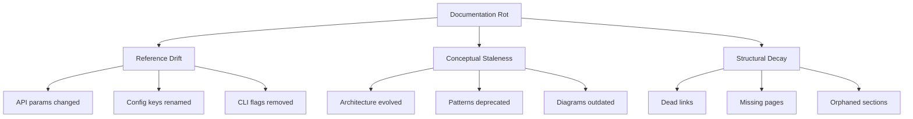
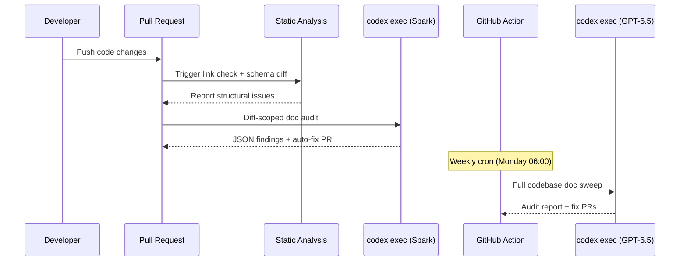

# Automated Doc-Rot Detection and Repair with Codex CLI


Documentation rots. Every senior developer knows this. The README promises a `--legacy` flag that was removed three sprints ago. The API reference still lists endpoints that were deprecated in v2. The architecture diagram shows a monolith you decomposed into microservices last quarter. Studies show that documentation drift is one of the top three barriers to developer onboarding [^1], and yet most teams treat documentation updates as an afterthought bolted onto the end of a sprint.

Codex CLI, particularly through `codex exec` and the v0.124+ stable hooks system [^2], provides the tooling to make documentation a live part of your code lifecycle rather than a static artefact that decays with every merge.

## The Doc-Rot Problem

Documentation rot falls into three categories, each requiring a different detection strategy:



**Reference drift** is fully automatable: when a function signature changes, the docs referencing that function should update. **Structural decay** (dead links, missing pages) is trivially detectable. **Conceptual staleness** is the hardest category — it requires understanding whether the documentation still reflects reality — and this is precisely where LLM-powered agents excel [^3].

## The Detection Pipeline

The core pattern is a three-stage pipeline that runs on every merge to `main`, with a deeper sweep on a weekly schedule.

### Stage 1: Static Analysis (Zero LLM Cost)

Before burning tokens, catch the cheap stuff. Dead links, missing files, and format violations are detectable with standard tooling:

```bash
# Run link checker against docs directory
find docs/ -name '*.md' -exec markdown-link-check {} \;

# Check for references to deleted files
git diff --name-only HEAD~1 --diff-filter=D | \
  xargs -I{} grep -rn "{}" docs/ || true

# Detect config keys mentioned in docs but absent from schema
diff <(grep -oP '`\K[a-z_]+(?=`)' docs/configuration.md | sort -u) \
     <(grep -oP '^([a-z_]+)\s*=' config.schema.toml | sort -u)
```

### Stage 2: Diff-Scoped Agent Audit

For every PR that touches source code, `codex exec` inspects whether the changed code affects any documentation. This is the heart of the pipeline:

```bash
#!/usr/bin/env bash
# .github/scripts/doc-drift-check.sh

CHANGED_FILES=$(git diff --name-only origin/main...HEAD -- '*.ts' '*.py' '*.go')

if [ -z "$CHANGED_FILES" ]; then
  echo "No source changes — skipping doc audit."
  exit 0
fi

codex exec \
  --model gpt-5.5 \
  --sandbox networking=off \
  --full-auto \
  --output-schema ./schemas/doc-audit-schema.json \
  "Review the following changed source files:
$CHANGED_FILES

For each file, check whether any documentation in docs/ references
functions, classes, CLI flags, configuration keys, or API endpoints
that were modified in this diff. Report:
1. Which doc files are affected
2. What specifically is now inaccurate
3. A severity rating (critical/warning/info)
4. Suggested fix (exact text replacement)

Read the actual diff with git diff origin/main...HEAD for each file."
```

The `--output-schema` flag [^4] ensures the output is machine-parseable JSON conforming to a strict schema, enabling downstream automation:

```json
{
  "type": "object",
  "properties": {
    "findings": {
      "type": "array",
      "items": {
        "type": "object",
        "properties": {
          "doc_file": { "type": "string" },
          "source_file": { "type": "string" },
          "severity": { "type": "string", "enum": ["critical", "warning", "info"] },
          "description": { "type": "string" },
          "suggested_fix": { "type": "string" }
        },
        "required": ["doc_file", "source_file", "severity", "description"],
        "additionalProperties": false
      }
    }
  },
  "required": ["findings"],
  "additionalProperties": false
}
```

### Stage 3: Deep Weekly Sweep

A scheduled GitHub Actions workflow performs a comprehensive audit — not just diff-scoped, but a full cross-reference between the codebase and documentation:


```yaml
# .github/workflows/doc-rot-sweep.yml
name: Weekly Documentation Rot Sweep
on:
  schedule:
    - cron: '0 6 * * 1'  # Monday 06:00 UTC
  workflow_dispatch:

jobs:
  sweep:
    runs-on: ubuntu-latest
    steps:
      - uses: actions/checkout@v4
      - uses: openai/codex-action@v1
        with:
          codex-args: >-
            --model gpt-5.5
            --full-auto
            --sandbox networking=off
          prompt: |
            Perform a comprehensive documentation audit:

            1. Cross-reference every public function, class, and API
               endpoint in src/ against docs/. Flag anything
               undocumented or documented incorrectly.
            2. Check all code examples in docs/ still compile/run
               against the current codebase.
            3. Verify architecture diagrams match the current
               module structure.
            4. Generate a markdown report in docs/audit-report.md
               with findings sorted by severity.
            5. For critical findings, create the fixes directly.
          codex-api-key: ${{ secrets.OPENAI_API_KEY }}
```


## The Repair Pipeline

Detection is only half the battle. Codex CLI can also generate and apply fixes automatically, with appropriate guardrails.

### Auto-Fix with Human Review

For reference drift (renamed parameters, changed signatures), Codex can apply fixes directly and open a PR:

```bash
# After the audit produces findings JSON
codex exec \
  --model gpt-5.5 \
  --full-auto \
  --sandbox networking=off \
  "Read the doc audit findings in /tmp/audit-findings.json.
For each finding with severity 'critical' or 'warning':
1. Open the affected documentation file
2. Apply the suggested fix
3. Verify the fix is consistent with surrounding content
4. Ensure no new issues are introduced

Do NOT modify any source code files — only documentation."
```

### AGENTS.md Documentation Policy

Embed documentation expectations directly into your project's AGENTS.md so that every Codex session — interactive or automated — respects documentation requirements:

```markdown
## Documentation Policy

When modifying any public API, CLI flag, configuration key,
or exported function:

1. Update the corresponding documentation in `docs/`
2. If no documentation exists, create it following the template
   in `docs/_template.md`
3. Update `CHANGELOG.md` with a brief entry
4. Verify all code examples in affected docs still work

Documentation changes MUST be included in the same commit as
the code change. Do not create separate documentation PRs.
```

This policy is read by Codex before every session [^5], ensuring that documentation updates happen at the point of code change rather than as a separate, forgettable step.

## Hooks for Real-Time Doc Drift Prevention

With hooks graduating to stable in v0.124 [^2], you can intercept file writes and enforce documentation co-evolution in real time:

```toml
# ~/.codex/config.toml

[hooks.post_tool_use.doc_drift_guard]
event = "post_tool_use"
tool = "apply_patch"
command = """
#!/usr/bin/env bash
# Check if source files were modified without corresponding doc updates
PATCH_FILE="$CODEX_TOOL_ARG_FILE"
SRC_CHANGED=$(grep -c '^+++ b/src/' "$PATCH_FILE" 2>/dev/null || echo 0)
DOC_CHANGED=$(grep -c '^+++ b/docs/' "$PATCH_FILE" 2>/dev/null || echo 0)

if [ "$SRC_CHANGED" -gt 0 ] && [ "$DOC_CHANGED" -eq 0 ]; then
  echo "WARNING: Source files modified without documentation updates."
  echo "Consider updating docs/ to reflect these changes."
fi
"""
```

## Cost Management

Documentation audits are token-intensive. A full-codebase sweep on a 100k-line repository can consume 200–400k input tokens [^6]. Practical strategies to control costs:

| Strategy | Token Reduction | Trade-off |
|----------|----------------|-----------|
| Diff-scoped audits only | ~90% | Misses pre-existing rot |
| Weekly full sweep with `o4-mini` | ~75% vs GPT-5.5 | Lower accuracy on conceptual staleness |
| Pre-filter with static analysis | ~40% | Requires toolchain setup |
| Cache audit results in `.doc-audit-cache` | ~60% on unchanged files | Stale cache risk |

The recommended approach is a two-tier model: use GPT-5.5 Spark or `o4-mini` for the diff-scoped PR checks (fast, cheap) [^7], and reserve GPT-5.5 for the weekly deep sweep where conceptual understanding matters.



## Measuring Documentation Health

Use `codex exec` with `--output-schema` to generate a documentation health score that tracks over time:

```bash
codex exec \
  --model o4-mini \
  --full-auto \
  --output-schema ./schemas/doc-health-schema.json \
  "Analyse the documentation in docs/ and the source code in src/.
Calculate a documentation health score (0-100) based on:
- Coverage: % of public APIs with documentation
- Freshness: % of docs updated within 30 days of last code change
- Accuracy: sample 20 code examples and verify they still work
- Completeness: % of docs with all required sections per template

Output the scores and a trend direction (improving/declining/stable)."
```

Track this score in your CI dashboard alongside code coverage. Dagster Labs demonstrated this pattern at scale, using Codex to measure documentation completeness across their entire open-source documentation surface [^8].

## Integration with Existing Documentation Tools

Codex CLI's doc-rot pipeline complements rather than replaces dedicated documentation platforms:

- **Swimm** [^9]: Pairs documentation to code snippets and detects when referenced code shifts. Use Codex for the conceptual audits that Swimm's AST-based approach cannot catch.
- **TypeDoc / Sphinx / rustdoc**: Continue generating API reference docs from code. Use Codex to audit the gap between generated reference docs and hand-written guides.
- **Mintlify / GitBook**: Use Codex's `--output-schema` to generate structured update suggestions that feed directly into your documentation CMS API.

## Practical Recommendations

1. **Start with diff-scoped checks** on every PR — the cost is negligible and the signal is immediate
2. **Add AGENTS.md documentation policy** to encode the expectation that code and docs ship together
3. **Schedule weekly deep sweeps** using the full GPT-5.5 context window for comprehensive cross-referencing
4. **Track documentation health scores** alongside code coverage in your CI dashboard
5. **Use hooks sparingly** — the `post_tool_use` hook is a nudge, not a gate; blocking agent progress on documentation warnings creates friction without proportional value
6. **Version your audit schemas** — as your documentation structure evolves, your `--output-schema` files should evolve with it

## Citations

[^1]: Overcast Blog, "AI-Driven Documentation in 2026," [https://overcast.blog/ai-driven-documentation-in-2026-f993f0c6d0d6](https://overcast.blog/ai-driven-documentation-in-2026-f993f0c6d0d6)

[^2]: OpenAI, "Codex CLI v0.124.0 Release Notes — Hooks Graduate to Stable," April 23, 2026, [https://developers.openai.com/codex/changelog](https://developers.openai.com/codex/changelog)

[^3]: DocsAlot, "Documentation Rots. Here's How to Stop It," [https://docsalot.dev/blog/documentation-rots-heres-how-to-stop-it](https://docsalot.dev/blog/documentation-rots-heres-how-to-stop-it)

[^4]: OpenAI, "Non-interactive mode — Codex CLI," [https://developers.openai.com/codex/noninteractive](https://developers.openai.com/codex/noninteractive)

[^5]: OpenAI, "Custom instructions with AGENTS.md," [https://developers.openai.com/codex/guides/agents-md](https://developers.openai.com/codex/guides/agents-md)

[^6]: OpenAI, "Codex CLI Models and Pricing," [https://developers.openai.com/codex/models](https://developers.openai.com/codex/models)

[^7]: OpenAI, "Codex CLI Speed and Performance Tuning," [https://developers.openai.com/codex/cli/features](https://developers.openai.com/codex/cli/features)

[^8]: OpenAI Developers Blog, "Using Codex for education at Dagster Labs," [https://developers.openai.com/blog/codex-for-documentation-dagster](https://developers.openai.com/blog/codex-for-documentation-dagster)

[^9]: Swimm, "Code-Coupled Documentation," [https://swimm.io/](https://swimm.io/)
