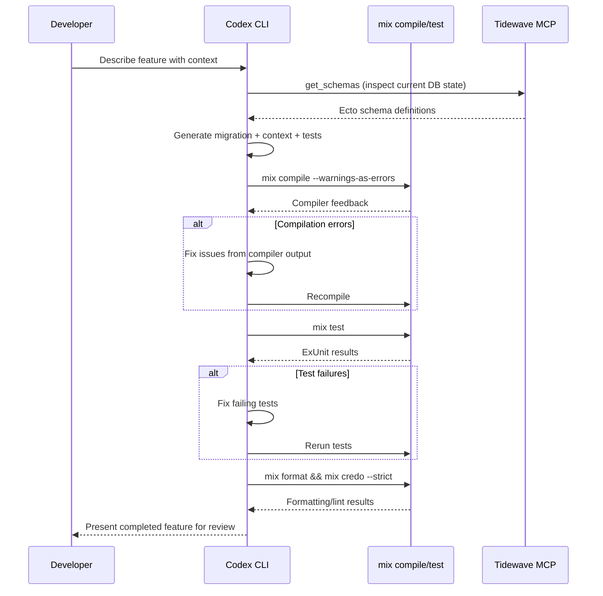

# Codex CLI for Elixir and Phoenix Teams: Tidewave MCP, AGENTS.md, and Functional Agent Workflows


---

Elixir and Phoenix occupy a singular position in the AI-assisted development landscape. The BEAM's functional paradigm — immutable data, explicit process boundaries, pattern matching — gives coding agents something most ecosystems lack: deterministic, compiler-enforced feedback at every layer of the stack.[^1] Phoenix 1.8's auto-generated `AGENTS.md`, combined with the Tidewave MCP server and Codex CLI's sandbox model, creates a remarkably tight agent development loop. This guide covers the practical setup for teams adopting Codex CLI on Elixir/Phoenix projects in 2026.

## Why Elixir Is Unusually Agent-Friendly

Most agent failures trace to ambiguous feedback: the model generates code that compiles and appears correct but breaks at runtime in ways that surface slowly or not at all.[^2] Elixir inverts this dynamic in several ways:

- **Vertical integration**: The Phoenix compiler understands the entire stack — from LiveView templates through Ecto schemas to database constraints — and surfaces errors as explicit, parseable messages.[^1]
- **Immutability by default**: No shared mutable state means the space of possible side effects is dramatically narrower, reducing the "silent failure" surface area that trips agents in imperative languages.[^1]
- **Pattern matching as specification**: Function clauses with guard expressions serve as both implementation and informal specification. Agents can reason about clause coverage directly.[^3]
- **Opinionated conventions**: Phoenix's "one idiomatic way" philosophy reduces decision ambiguity for models — there is typically one correct place for a route, one correct shape for a context module, one correct way to structure a LiveView.[^1]
- **Terseness**: Elixir code is concise. Fewer tokens per logical unit means more of the codebase fits within context, directly improving agent accuracy.[^1]

The practical upshot: teams report that GPT-5.5 with properly configured `AGENTS.md` and Tidewave MCP produces idiomatic Phoenix code at a significantly higher rate than in loosely-typed, convention-light ecosystems.[^4]

## Phoenix 1.8 AGENTS.md: The Foundation

Phoenix 1.8.0 introduced auto-generated `AGENTS.md` files in the `phx.new` generator.[^5] Unlike generic documentation, this file specifically addresses the gaps in frontier models' Elixir knowledge — correcting common mistakes with syntax, idioms, and critical API usage.[^6]

Chris McCord described the design philosophy: "AGENTS.md is for LLMs so I wouldn't necessarily call it a best practice or convention doc. The goals are gap-filling for SOTA LLMs to supplement their 'world knowledge' only."[^7]

### Enriching the Generated File with usage_rules

The base `AGENTS.md` is a starting point. The `usage_rules` library aggregates version-specific guidance from all your dependencies — Ecto, LiveView, Phoenix HTML, and any Ash or Surface libraries you use:

```bash
mix usage_rules.sync AGENTS.md \
  --all \
  --inline usage_rules,usage_rules:otp,phoenix:elixir,phoenix:phoenix,phoenix:ecto,phoenix:html,phoenix:liveview \
  --link-to-folder deps
```

This produces roughly 480 lines of consolidated, dependency-aware context.[^8] The `--inline` flag embeds critical rules directly in the file; `--link-to-folder` creates file-path references that Codex CLI can follow when it needs deeper detail.

### Codex CLI Reads AGENTS.md Natively

Codex CLI auto-loads `AGENTS.md` from the nearest directory in the hierarchy.[^9] For Phoenix projects, this means the generated file in your project root is picked up automatically — no additional configuration needed. If you have a monorepo umbrella app, place additional `AGENTS.md` files in each child application directory:

```
my_umbrella/
  AGENTS.md                  # shared conventions
  apps/
    my_web/AGENTS.md         # Phoenix/LiveView-specific rules
    my_core/AGENTS.md        # business logic conventions
```

## Tidewave MCP: Runtime Context for Codex CLI

Tidewave is an MCP server created by José Valim's team that runs inside your Phoenix application, giving AI agents access to live runtime data.[^10] This is the critical differentiator for Elixir agent workflows: the model can query your database schemas, inspect runtime logs, evaluate code in IEx context, and look up documentation — all without leaving the Codex session.

### Setup

Add Tidewave to your `mix.exs` development dependencies:

```elixir
defp deps do
  [
    {:tidewave, "~> 0.5", only: :dev}
  ]
end
```

Then fetch dependencies:

```bash
mix deps.get
```

Tidewave starts automatically in development mode, exposing an MCP endpoint at `http://localhost:4000/tidewave/mcp`.[^11]

### Codex CLI Configuration

Add Tidewave as an MCP server in your project's `.codex/config.toml`:

```toml
[mcp_servers.tidewave]
url = "http://localhost:4000/tidewave/mcp"
```

Alternatively, use the CLI:

```bash
codex mcp add tidewave http://localhost:4000/tidewave/mcp
```

### Available MCP Tools

Once connected, Codex gains access to these Tidewave tools:[^11]

| Tool | Purpose |
|------|---------|
| `project_eval` | Evaluate Elixir expressions in your running app's IEx context |
| `get_docs` | Retrieve module and function documentation |
| `get_source_location` | Find where a module or function is defined |
| `get_logs` | Access application runtime logs |
| `get_schemas` | Inspect Ecto schema definitions |
| `execute_sql_query` | Run read queries against your development database |
| `search_package_docs` | Search Hex package documentation |

This means Codex can verify its own changes against your running application. When it generates an Ecto migration, it can inspect the current schema. When it writes a LiveView component, it can check the log output from a test navigation. This feedback loop is what makes the Elixir agent experience qualitatively different.

## config.toml for Phoenix Projects

A production-ready Codex CLI configuration for a Phoenix team:

```toml
model = "gpt-5.5"
model_reasoning_effort = "medium"

[sandbox]
mode = "supervised"

[permissions]
allow_read = ["**/*.ex", "**/*.exs", "**/*.heex", "**/*.eex", "config/**", "priv/**", "assets/**"]
deny_read = [".env", "config/runtime.exs"]

[mcp_servers.tidewave]
url = "http://localhost:4000/tidewave/mcp"
```

Key decisions:

- **`gpt-5.5`** is the recommended model for Phoenix work — its million-token context window handles large umbrella projects well, and its improved planning capabilities suit multi-file LiveView refactoring.[^12]
- **`deny_read`** protects runtime secrets in `config/runtime.exs` and `.env` files from being included in model context.[^13]
- **`supervised` sandbox** is appropriate for most Phoenix development; the agent proposes file changes and shell commands for your approval.

## AGENTS.md Template for Phoenix Projects

While Phoenix 1.8 generates a base file, teams should extend it with project-specific guidance. Here is a template that supplements the auto-generated content:

```markdown
# AGENTS.md

## Project Overview
<!-- Auto-generated Phoenix section above; add team-specific guidance below -->

## Build and Test Commands
- `mix deps.get` — fetch dependencies
- `mix compile --warnings-as-errors` — compile with strict warnings
- `mix test` — run full ExUnit suite
- `mix test test/path/to_test.exs:42` — run single test at line
- `mix format --check-formatted` — verify formatting
- `mix credo --strict` — static analysis
- `mix dialyzer` — type checking (first run is slow)

## Architecture Conventions
- Contexts are the public API; never call Repo directly from controllers or LiveView
- LiveView components use function components unless stateful interaction required
- All database access goes through context modules in `lib/my_app/`
- Ecto changesets validate at the boundary; trust data inside contexts

## Common LLM Mistakes to Avoid
- Do NOT use list index access (Enum.at/0-based indexing) — use pattern matching
- Do NOT use `if/else` chains — use `case`, `cond`, or multi-clause functions
- Do NOT import modules wholesale — alias and use only what is needed
- LiveView `handle_event/3` must return `{:noreply, socket}` — never `{:ok, socket}`
- Ecto `Repo.insert/update` returns `{:ok, struct}` or `{:error, changeset}` — always pattern match both

## Verification
After any code change, run:
1. `mix compile --warnings-as-errors`
2. `mix test` (or the relevant test file)
3. `mix format`
4. `mix credo --strict`
```

## Workflow: Agent-Driven Feature Development

The following workflow takes advantage of Elixir's deterministic feedback loop. The key insight is to let the compiler and ExUnit be the agent's primary quality gate, not human review.



### Practical Example: Adding a Feature

```
Goal: Add a "bookmark" feature — users can bookmark posts.
Context: @lib/my_app/posts.ex @lib/my_app/accounts.ex @priv/repo/migrations/
Constraints: Use a join table, add context functions, write ExUnit tests first (TDD).
Done when: mix compile --warnings-as-errors && mix test && mix credo --strict all pass.
```

With Tidewave connected, Codex will inspect your existing schemas before generating the migration, ensuring foreign key references match your actual table names and column types.

## Hooks for Continuous Verification

Codex CLI v0.124+ hooks are stable and can be configured inline in `config.toml`.[^14] For Phoenix projects, a `post_tool_use` hook that runs the compiler after every file write catches errors immediately:

```toml
[[hooks]]
event = "post_tool_use"
tool_names = ["apply_patch", "write_file"]
command = "mix compile --warnings-as-errors 2>&1 | head -20"
timeout_ms = 15000
```

This ensures the agent receives compiler feedback after every change, not just at the end of a multi-file edit sequence. For Elixir's incremental compiler, this is fast enough to be practical on most projects.

For stricter enforcement, add a Credo hook:

```toml
[[hooks]]
event = "post_tool_use"
tool_names = ["apply_patch", "write_file"]
command = "mix credo --strict --format flycheck 2>&1 | head -10"
timeout_ms = 20000
```

## Model Selection for Elixir Tasks

Elixir's smaller training corpus compared to Python or JavaScript means model selection matters more. Here is a task-appropriate model routing guide:

| Task | Recommended Model | Reasoning Effort |
|------|------------------|-----------------|
| Schema design, complex contexts | `gpt-5.5` | high |
| LiveView components, templates | `gpt-5.5` | medium |
| Simple CRUD context functions | `gpt-5.4-mini` | medium |
| Test generation | `gpt-5.5` | medium |
| Migration generation | `gpt-5.4-mini` | low |
| Documentation/typespecs | `gpt-5.3-codex-spark` | low |
| Codebase exploration (subagent) | `gpt-5.4-mini` | low |

GPT-5.5's stronger planning capabilities make it the better choice for complex Elixir tasks where the model needs to reason about process supervision, GenServer state machines, or multi-step Ecto.Multi transactions.[^12] For routine CRUD and template work, smaller models suffice and preserve your token budget.

## Common Pitfalls

### 1. Models Default to Imperative Patterns

Even with `AGENTS.md`, models occasionally generate imperative-style Elixir — using `Enum.reduce` where a comprehension is clearer, or building state with accumulators when a `with` chain expresses intent better. Include explicit "prefer X over Y" rules in your `AGENTS.md` for recurring offences.

### 2. LiveView Lifecycle Confusion

LLMs frequently confuse `mount/3`, `handle_params/3`, and `handle_event/3` return shapes.[^6] The Phoenix-generated `AGENTS.md` addresses the most common mistakes, but teams should add project-specific component patterns.

### 3. Ecto Association Preloading

Agents routinely forget to preload associations, generating code that raises `Ecto.Association.NotLoaded` at runtime. Add an explicit rule:

```markdown
## Ecto Rules
- Always preload associations needed by the caller — never return unloaded associations
- Use `Repo.preload/2` or `from(q in query, preload: [...])` — not `Ecto.assoc`
```

### 4. Dialyzer Types ⚠️

GPT-5.5 generates `@spec` annotations with reasonable accuracy for common types, but struggles with complex typespec syntax involving remote types, opaque types, and protocol-derived types. Consider running Dialyzer as a separate verification step rather than expecting agents to produce spec-perfect code on first pass. ⚠️ No published benchmarks exist for GPT-5.5 Dialyzer compliance rates specifically.

### 5. Tidewave Port Conflicts

If your Phoenix app runs on a non-standard port, update the MCP configuration accordingly. Tidewave binds to whatever port your application uses — there is no separate port configuration.[^11]

## Subagent Patterns for Umbrella Apps

For Phoenix umbrella projects, custom subagents can target specific applications:

```toml
# .codex/agents/web-agent.toml
name = "web-agent"
description = "Handles Phoenix web layer: controllers, LiveView, templates, routes"
developer_instructions = """
You work exclusively in apps/my_web/.
Follow Phoenix conventions strictly.
Run mix test apps/my_web/ after every change.
"""
sandbox_mode = "read-only"
model = "gpt-5.5"

# .codex/agents/core-agent.toml
name = "core-agent"
description = "Handles business logic contexts, Ecto schemas, domain rules"
developer_instructions = """
You work exclusively in apps/my_core/.
Never import Phoenix or web-related modules.
Run mix test apps/my_core/ after every change.
"""
sandbox_mode = "read-only"
model = "gpt-5.5"
model_reasoning_effort = "high"
```

This separation mirrors Phoenix's recommended umbrella boundary: one agent for web concerns, another for domain logic.[^15]

## Getting Started Checklist

1. **Generate or update your project**: Ensure Phoenix 1.8+ with the auto-generated `AGENTS.md`
2. **Enrich with usage_rules**: Run `mix usage_rules.sync` to pull in dependency-specific guidance
3. **Add Tidewave**: Include `{:tidewave, "~> 0.5", only: :dev}` and start your dev server
4. **Configure Codex CLI**: Add Tidewave MCP and set appropriate sandbox/permission policies
5. **Add post_tool_use hooks**: Wire up `mix compile --warnings-as-errors` for instant feedback
6. **Extend AGENTS.md**: Add project-specific conventions, common mistakes, and verification commands
7. **Start with supervised mode**: Review agent changes until you build confidence, then consider loosening sandbox policies for trusted workflows

---

## Citations

[^1]: Kristoffer Opsahl, "Coding Agents Need Deterministic Feedback: A Case for Phoenix," [kristofferopsahl.com](https://kristofferopsahl.com/posts/coding-agents-need-deterministic-feedback-a-case-for-phoenix/), 2026.
[^2]: Ivanov, Rana & Prabhakaran, "Can Coding Agents be General Agents?", arXiv:2604.13107, April 2026.
[^3]: "The Elixir programming language," [elixir-lang.org](https://elixir-lang.org/), accessed April 2026.
[^4]: Elixir Forum, "How are you using AI with Elixir at work on production-ready apps?", [elixirforum.com](https://elixirforum.com/t/how-are-you-using-ai-with-elixir-at-work-on-production-ready-apps/72326), 2026.
[^5]: Phoenix Blog, "Phoenix 1.8.0 released!", [phoenixframework.org/blog/phoenix-1-8-released](https://www.phoenixframework.org/blog/phoenix-1-8-released), 2026.
[^6]: Hashrocket, "Supercharging AI-Assisted Development in Phoenix Applications," [hashrocket.com](https://hashrocket.com/blog/posts/supercharging-ai-assisted-development-in-phoenix-applications), 2026.
[^7]: Elixir Forum, "Phoenix phx.new generator and AGENTS.md," [elixirforum.com](https://elixirforum.com/t/phoenix-phx-new-generator-and-agents-md/71850), 2026.
[^8]: Hashrocket, ibid. — `usage_rules.sync` command producing ~480 lines of consolidated context.
[^9]: OpenAI, "Custom instructions with AGENTS.md," [developers.openai.com/codex/guides/agents-md](https://developers.openai.com/codex/guides/agents-md), accessed April 2026.
[^10]: Tidewave, "The coding agent for full-stack web app development," [tidewave.ai](https://tidewave.ai/), accessed April 2026.
[^11]: Tidewave HexDocs, "Setting up Tidewave MCP," [hexdocs.pm/tidewave/mcp.html](https://hexdocs.pm/tidewave/mcp.html), v0.5.6.
[^12]: OpenAI, "Introducing GPT-5.5," [openai.com/index/introducing-gpt-5-5](https://openai.com/index/introducing-gpt-5-5/), April 23, 2026.
[^13]: OpenAI, "Codex CLI filesystem security — deny-read policies," [developers.openai.com/codex/cli/features](https://developers.openai.com/codex/cli/features), accessed April 2026.
[^14]: OpenAI, "Codex changelog — v0.124.0: hooks are now stable," [developers.openai.com/codex/changelog](https://developers.openai.com/codex/changelog), April 23, 2026.
[^15]: Phoenix Guides, "Umbrella Projects," [hexdocs.pm/phoenix/umbrella.html](https://hexdocs.pm/phoenix/umbrella.html), accessed April 2026.
