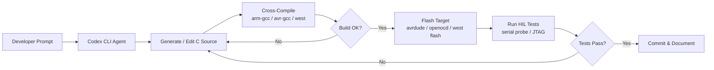

# Codex CLI for Embedded Systems and Firmware Teams: Hardware-in-the-Loop, RTOS Patterns, and Agent-Driven Bring-Up


---

Embedded firmware development has long been the domain least affected by AI coding assistants. The reasons are well understood: register-level programming demands precise hardware knowledge, cross-compilation toolchains are notoriously finicky, and the feedback loop — edit, build, flash, probe — resists the rapid iteration that makes agentic coding shine.

That is changing. Codex CLI's sandboxed execution model, combined with its ability to shell out to arbitrary build toolchains, makes it possible to close the loop between code generation and hardware verification in a single agent session. This article covers practical patterns for using Codex CLI with embedded targets, from bare-metal AVR through to Zephyr RTOS on ARM Cortex-M and RISC-V.

## Why Embedded Teams Should Care About Agentic Coding

A 2026 survey by Embedded Computing Design found that firmware engineers spend more time navigating reference manuals, register maps, and errata sheets than writing functional code [^1]. Codex CLI cannot replace deep hardware intuition, but it can dramatically accelerate the boilerplate-heavy phases of embedded work: peripheral initialisation, protocol driver scaffolding, build system configuration, and test harness generation.

The key enabler is **hardware-in-the-loop (HIL)** execution. Thomas Spielauer demonstrated this pattern in March 2026 by connecting an ATmega2560 with an RS-485 transceiver to a Codex CLI session [^2]. The agent compiled firmware with `avr-gcc`, flashed via `avrdude`, and validated ModBus responses over a USB-serial adapter — all within a single agentic loop. The result was a working ModBus RTU slave library produced through iterative, test-driven hardware bring-up.



## Configuring AGENTS.md for Firmware Projects

The AGENTS.md file is where you encode the hardware constraints that a general-purpose LLM would otherwise hallucinate around. A well-structured embedded AGENTS.md should cover four areas: toolchain specifics, coding standards, verification requirements, and hardware context.

```markdown
# AGENTS.md �� STM32F4 Sensor Hub

## Toolchain
- Target: STM32F407VG (ARM Cortex-M4F, 168 MHz, 1 MB flash, 192 KB SRAM)
- RTOS: Zephyr 4.2 with west build system
- Compiler: arm-zephyr-eabi-gcc 13.3 via Zephyr SDK 0.17.0
- Flash tool: openocd with ST-LINK/V2

## Coding Standards
- All peripheral access through Zephyr device driver API — no direct register writes
- ISRs must complete within documented WCET; defer processing to work queues
- Static allocation only — CONFIG_HEAP_MEM_POOL_SIZE=0
- Volatile qualifiers on all ISR-shared variables
- Every function must check and propagate return values

## Verification
- `west build` must produce zero warnings with -Wall -Wextra -Werror
- Run cppcheck --enable=all before committing
- Stack analysis: 25% headroom above measured peak per thread
- Power consumption measured per operating mode against energy budget

## Hardware Context
- UART1 (PA9/PA10): Debug console, 115200 baud
- SPI1 (PA5-7, PE3 CS): BME280 environmental sensor
- I2C1 (PB6/PB7): OLED display SSD1306
- PA0: User button (active low, internal pull-up)
- PC13: Heartbeat LED
```

This approach aligns with the embedded systems agent template published in the awesome-claude-code-toolkit repository, which recommends a structured ten-step methodology from hardware interface definition through to firmware update mechanisms [^3].

## Sandbox Configuration for Cross-Compilation Toolchains

Codex CLI's default `workspace-write` sandbox mode restricts filesystem access to the project directory. Embedded toolchains typically live outside the workspace — in `/opt/zephyr-sdk`, `~/.platformio`, or `/usr/lib/avr`. You need to grant read access to these paths and, in some cases, write access to build output directories.

```toml
# .codex/config.toml

model = "o3"
approval_policy = "unless-allow-listed"

[sandbox_workspace_write]
writable_roots = [
  "/tmp/build",                    # Out-of-tree build directory
  "~/.cache/west",                 # Zephyr west cache
]
exclude_slash_tmp = false          # Toolchains often use /tmp
network_access = false             # No network needed for builds
```

For the approval policy, use rules to allow your embedded toolchain commands without manual approval on every build-flash cycle:

```toml
# .codex/rules.toml — embedded toolchain allow-list

[[rule]]
name = "Allow cross-compilation"
pattern = "west build.*|arm-zephyr-eabi-gcc.*|avr-gcc.*|make.*|cmake.*"
action = "allow"

[[rule]]
name = "Allow flashing"
pattern = "west flash.*|openocd.*|avrdude.*|pyocd.*|nrfjprog.*"
action = "allow"

[[rule]]
name = "Allow serial monitoring"
pattern = "minicom.*|picocom.*|screen /dev/tty.*|python.*serial.*"
action = "allow"
```

⚠️ The rules system uses pattern matching against command strings. Exact syntax may vary between Codex CLI versions; consult the [rules documentation](https://developers.openai.com/codex/rules) for your installed version.

## Hardware-in-the-Loop Patterns

### Pattern 1: Build-Flash-Probe Loop

The simplest HIL pattern gives Codex CLI direct access to the serial port connected to your target. The agent writes code, builds, flashes, then reads serial output to verify behaviour.

```bash
# Launch Codex with the project and serial port visible
codex --model o3 \
  --approval-mode suggest \
  "Implement a BME280 SPI driver for Zephyr. After each change, \
   build with 'west build -b stm32f4_disco', flash with 'west flash', \
   then read 5 seconds of serial output from /dev/ttyACM0 at 115200 \
   to verify sensor readings appear."
```

Spielauer's ModBus project demonstrated that this loop catches bugs that static analysis misses entirely — such as half-duplex timing violations on RS-485 that only manifest when the transceiver's direction pin toggles under load [^2].

### Pattern 2: Emulated Target with QEMU

When physical hardware is unavailable, Zephyr's QEMU support provides a viable alternative for logic-level testing:

```bash
codex --model o3 \
  "Build and run the sensor fusion module on qemu_cortex_m3. \
   Use 'west build -b qemu_cortex_m3 && west build -t run' to execute. \
   Verify output matches expected Kalman filter convergence within 5%."
```

QEMU cannot test real peripheral timing or power consumption, but it eliminates the flash cycle entirely and runs in CI without hardware [^4].

### Pattern 3: PlatformIO Integration

For teams using PlatformIO rather than Zephyr's west, the workflow maps cleanly to `pio run` and `pio test`:

```bash
codex --model o3 \
  "Implement a FreeRTOS task for CAN bus message routing on ESP32. \
   Build with 'pio run -e esp32dev', flash with 'pio run -t upload', \
   and run unit tests with 'pio test -e native'."
```

PlatformIO's CLI-first design makes it particularly well-suited to Codex CLI workflows [^5]. The `pio test -e native` command runs tests on the host machine using Unity, providing fast feedback without flashing.

## RTOS-Specific Considerations

### Zephyr RTOS

Zephyr's Kconfig system and devicetree overlays add complexity that benefits from agent assistance. A common pattern is to have Codex generate devicetree overlay files for custom boards:

```bash
codex "Generate a devicetree overlay for our custom board that enables \
  SPI1 with DMA on channels 2/3, configures the BME280 on CS pin PE3, \
  and sets the SPI clock to 8 MHz. Follow Zephyr 4.2 devicetree syntax."
```

Zephyr's build system uses CMake underneath with a layered configuration that captures feature relationships and enforces consistency [^6]. This structure is well-documented enough for Codex to navigate reliably, provided your AGENTS.md specifies the exact Zephyr version and SDK path.

### FreeRTOS

FreeRTOS projects tend to be more manual in configuration, using flat header files without dependency resolution [^7]. This makes AGENTS.md guidance even more critical — specify your `FreeRTOSConfig.h` location, heap implementation choice (heap_4 vs heap_5), and any CMSIS-RTOS wrapper conventions.

## Model Selection for Embedded Work

Embedded firmware demands precision over speed. Register-level code with incorrect bit masks or timing parameters can damage hardware.

| Task | Recommended Model | Reasoning |
|------|------------------|-----------|
| Peripheral driver scaffolding | o3 | Needs careful register-level reasoning |
| Devicetree / Kconfig generation | GPT-5.5 | Large context for complex board configs [^8] |
| Build system debugging | o4-mini | Fast iteration, cost-effective |
| Protocol implementation (ModBus, CAN) | o3 | Specification compliance requires deep reasoning |
| Documentation generation | GPT-5.5 | Narrative quality, large context |

⚠️ Always verify generated register addresses and bit-field definitions against the manufacturer's reference manual. LLMs can and do hallucinate peripheral register maps, even with AGENTS.md constraints.

## Comparison with Specialised Tools

Embedder, an AI firmware platform nominated for the Embedded Award 2026, takes a fundamentally different approach: it ingests datasheets and schematics directly, grounding code generation against verified silicon specifications [^1]. Its closed-loop verification checks generated code against real hardware with no human in the loop.

Codex CLI is a general-purpose agent that happens to work well for embedded when properly configured. The trade-offs:

| Capability | Codex CLI | Embedder |
|-----------|-----------|----------|
| Hardware grounding | Via AGENTS.md (manual) | Automatic from datasheets |
| MCU coverage | Any (user-configured) | 400+ MCUs, 2000+ peripherals [^1] |
| RTOS support | Any (user-configured) | FreeRTOS, Zephyr, bare-metal |
| Cost model | OpenAI API / ChatGPT plan | Separate subscription |
| Extensibility | Full MCP + plugin ecosystem | Firmware-specific tooling |
| Open source | Yes (Rust, Apache 2.0) [^9] | No |

For teams already invested in Codex CLI across their stack, extending it to firmware work avoids tool proliferation. For pure-play firmware shops, Embedder's datasheet grounding is compelling.

## CI Integration with codex exec

Automated firmware validation in CI uses `codex exec` with structured output:

```bash
codex exec \
  --model o4-mini \
  --sandbox-mode workspace-write \
  "Build the firmware for all three board targets (stm32f4_disco, \
   nrf52840dk, esp32_devkitc_wroom). Report build status, flash size, \
   and RAM usage for each." \
  --output-schema ./firmware-report-schema.json \
  -o build-report.json
```

Combined with the reasoning-token reporting added in v0.125 [^10], teams can track both firmware resource usage and AI resource usage in the same pipeline.

## Practical Tips

1. **Pin your toolchain versions** in AGENTS.md. Embedded toolchains are version-sensitive; a GCC minor version bump can change code generation and break timing.

2. **Use `--model o3` for anything touching hardware registers.** The additional reasoning tokens are worth the cost when incorrect bit manipulation can brick a board.

3. **Keep datasheets in the repo.** Place PDF reference manuals in a `docs/datasheets/` directory and reference them in AGENTS.md. Codex CLI can read PDFs and extract register tables.

4. **Start with QEMU, graduate to hardware.** Validate logic in emulation before burning flash cycles. This is faster and cheaper for both developer time and API tokens.

5. **Use hooks for post-build validation.** A `PostToolUse` hook can automatically run `arm-none-eabi-size` after every build and warn if flash or RAM usage exceeds thresholds.

## Citations

[^1]: Embedder AI Firmware Engineer — [embedder.com](https://embedder.com/); Embedded Computing Design, "Embedder v0.3.1 AI Firmware Platform Nominated for Embedded Award 2026" — [embeddedcomputing.com](https://embeddedcomputing.com/technology/ai-machine-learning/ai-logic-devices-worload-acceleration/embedder-v031-ai-powered-firmware-engineering-platform-nominated-for-embedded-award-2026-in-the-startup-category)
[^2]: Thomas Spielauer, "Using Codex with Hardware In The Loop for Microcontrollers," March 2026 — [tspi.at](https://www.tspi.at/2026/03/24/hardwareloop.html)
[^3]: rohitg00/awesome-claude-code-toolkit, "Embedded Systems Agent Template" — [github.com](https://github.com/rohitg00/awesome-claude-code-toolkit/blob/main/agents/specialized-domains/embedded-systems.md)
[^4]: Zephyr Project, "QEMU Emulation (QEMU)" — [docs.zephyrproject.org](https://docs.zephyrproject.org/latest/boards/qemu/index.html)
[^5]: PlatformIO, "Your Gateway to Embedded Software Development Excellence" — [platformio.org](https://platformio.org/)
[^6]: Zephyr Project, "Build System (CMake)" — [docs.zephyrproject.org](https://docs.zephyrproject.org/latest/build/cmake/index.html); Jacob Beningo, "How to Configure Zephyr RTOS: A Practical Guide to West, Kconfig, proj.conf" — [beningo.com](https://www.beningo.com/how-to-configure-zephyr-rtos-a-practical-guide-to-west-kconfig-proj-conf/)
[^7]: FreeRTOS Community, "FreeRTOS vs Zephyr on STM32U5" — [community.st.com](https://community.st.com/t5/stm32-mcus-embedded-software/freertos-vs-zephyr-on-stm32u5-support-maturity-integration-with/td-p/791705)
[^8]: OpenAI, "Introducing upgrades to Codex" (GPT-5.5 announcement) — [openai.com](https://openai.com/index/introducing-upgrades-to-codex/)
[^9]: OpenAI Codex CLI GitHub Repository — [github.com/openai/codex](https://github.com/openai/codex)
[^10]: Codex CLI v0.125 Release Notes, "Reasoning-token reporting in exec JSON" — [github.com/openai/codex/releases](https://github.com/openai/codex/releases)
