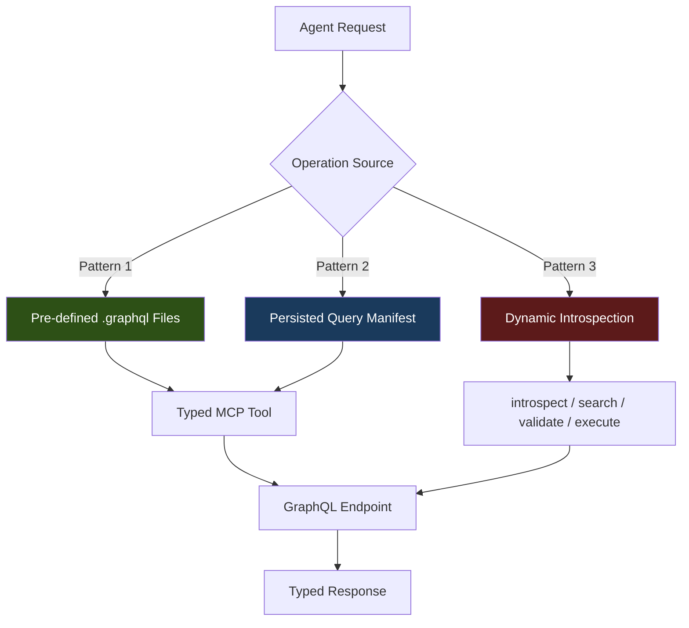
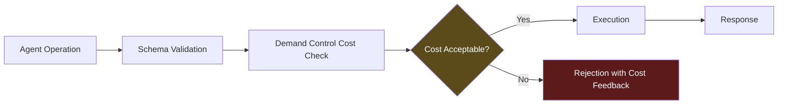

# Codex CLI for GraphQL Development: Apollo MCP Server, Schema-First Workflows, and Type-Safe Agent Patterns


GraphQL APIs occupy an unusual position in the coding agent landscape. The typed schema, introspection capabilities, and operation-level granularity that make GraphQL powerful for humans also make it exceptionally well-suited for AI agents. An agent that can introspect a schema, validate operations before execution, and receive typed responses is an agent that makes fewer mistakes. This article covers how to wire Codex CLI into a GraphQL development workflow — from Apollo MCP Server integration to schema-first code generation and type-safe testing patterns.

## Why GraphQL and Coding Agents Are a Natural Fit

GraphQL schemas are, at their core, machine-readable API contracts. Every field has a type, every argument is declared, and the introspection system exposes the entire API surface programmatically[^1]. For Codex CLI, this means the agent can discover available data, construct valid operations, and validate responses without guesswork.

The practical benefits compound:

- **Schema-as-context**: feeding `schema.graphql` into AGENTS.md gives the agent a complete map of your API surface[^2]
- **Operation validation**: malformed queries fail at parse time, not at runtime — the agent gets immediate, structured feedback
- **Typed code generation**: tools like GraphQL Code Generator produce TypeScript types that the agent can use to write resolvers with compile-time safety[^3]
- **Demand control**: Apollo Router's cost calculation rejects expensive queries before they execute, providing a safety net for agent-generated operations[^4]

## Setting Up Apollo MCP Server for Codex CLI

Apollo MCP Server bridges your GraphQL API to any MCP-compatible agent by translating GraphQL operations into MCP tools[^5]. Each `.graphql` operation file becomes a discrete tool with a typed input schema — non-null types become required parameters, nullable types and defaults become optional[^6].

### Installation

You need Rover CLI v0.37 or later[^7]:

```bash
rover init --mcp
```

Select "Create MCP tools from a new Apollo GraphOS project" and choose the connector template. Start the development server:

```bash
rover dev --supergraph-config supergraph.yaml --mcp .apollo/mcp.local.yaml
```

This launches GraphQL at `http://localhost:4000` and the MCP server at `http://127.0.0.1:8000/mcp`[^7].

### Codex CLI Configuration

Add Apollo MCP Server to your Codex config. For a stdio transport via `mcp-remote`:

```toml
[mcp_servers.apollo-graphql]
command = "npx"
args = ["-y", "mcp-remote", "http://127.0.0.1:8000/mcp"]
startup_timeout_sec = 15
tool_timeout_sec = 30
```

For direct HTTP transport (requires Codex v0.124+):

```toml
[mcp_servers.apollo-graphql]
url = "http://127.0.0.1:8000/mcp"
startup_timeout_sec = 15
tool_timeout_sec = 30
```

Verify the connection from the TUI with `/mcp` — you should see your GraphQL operations listed as available tools[^8].

### Alternatively: Lightweight mcp-graphql

If you do not use Apollo GraphOS, the community `mcp-graphql` server provides direct schema introspection and query execution against any GraphQL endpoint[^9]:

```toml
[mcp_servers.graphql]
command = "npx"
args = ["-y", "mcp-graphql"]

[mcp_servers.graphql.env]
ENDPOINT = "http://localhost:4000/graphql"
ALLOW_MUTATIONS = "false"
```

Mutations are disabled by default — a sensible security measure when an agent can construct arbitrary operations[^9].

## Three Operation Exposure Patterns

Apollo MCP Server supports three patterns for controlling what your agent can do, and the choice matters for both security and agent effectiveness[^6]:



**Pattern 1 — Pre-defined operations** (recommended for mutations): each `.graphql` file becomes a named tool. The agent can only execute what you have explicitly approved:

```graphql
# operations/GetProductById.graphql
# Retrieves a single product with pricing and inventory
query GetProductById($id: ID!) {
  product(id: $id) {
    id
    name
    description
    price
    inventory {
      available
      warehouse
    }
  }
}
```

**Pattern 2 — Persisted queries**: operations published to Apollo GraphOS with automatic safelisting via the Router manifest[^5].

**Pattern 3 — Dynamic introspection**: the agent gets four runtime tools (`introspect`, `search`, `validate`, `execute`) and can explore the schema freely[^6]. Useful for read-only exploration but requires careful security configuration for production APIs.

Most teams combine patterns: **pre-defined operations for writes, introspection for reads**[^4].

```yaml
# apollo-mcp-server.yaml
operations:
  source: local
  paths:
    - ./operations/mutations/*.graphql
introspection:
  execute:
    enabled: true
  search:
    enabled: true
overrides:
  mutation_mode: explicit
```

## AGENTS.md for GraphQL Projects

A well-structured AGENTS.md dramatically reduces the agent's tendency to generate malformed schemas or ignore project conventions. Here is a template for a schema-first GraphQL project:

```markdown
# AGENTS.md

## Project Architecture
This is a schema-first GraphQL API using Apollo Server 4 and TypeScript.
The schema definition (`schema.graphql`) is the single source of truth.

## Key Conventions
- Schema changes go in `src/schema.graphql` FIRST, then run codegen
- Run `npm run codegen` after any schema change to regenerate types
- Resolvers live in `src/resolvers/` — one file per root type
- All resolvers MUST use generated types from `src/__generated__/resolvers-types.ts`
- Use DataLoader for N+1 prevention — never call a data source in a loop
- Every mutation must return a union with a `...Error` type for error handling

## Testing
- Run `npm test` to execute the test suite
- Integration tests use a test Apollo Server instance
- Mock data factories live in `test/factories/`

## Commands
- `npm run codegen` — regenerate TypeScript types from schema
- `npm run dev` — start dev server with hot reload
- `npm test` — run Jest test suite
- `npm run lint` — ESLint + GraphQL ESLint rules
```

## Schema-First Development with Codex CLI

The schema-first workflow maps naturally to agentic development. The agent modifies the SDL, runs code generation, and then writes resolvers against the generated types — each step producing verifiable output.

### Step 1: Schema Evolution

Prompt Codex to extend the schema:

```
Add a `reviews` field to the Product type. Each review has an id, author (String!),
rating (Int!, 1-5), body (String), and createdAt (DateTime!). Add a createReview
mutation that requires productId, author, rating, and optional body.
```

The agent edits `schema.graphql` and can validate the result against GraphQL ESLint rules.

### Step 2: Type Generation

After schema changes, the agent runs code generation to produce typed resolver signatures[^3]:

```bash
npx graphql-codegen --config codegen.ts
```

A `codegen.ts` configuration for a typical project:

```toml
# codegen.ts (referenced in package.json scripts)
```

```typescript
import type { CodegenConfig } from '@graphql-codegen/cli';

const config: CodegenConfig = {
  schema: './src/schema.graphql',
  generates: {
    './src/__generated__/resolvers-types.ts': {
      plugins: ['typescript', 'typescript-resolvers'],
      config: {
        useIndexSignature: true,
        contextType: '../context#GraphQLContext',
        mappers: {
          Product: '../models/Product#ProductModel',
          Review: '../models/Review#ReviewModel',
        },
      },
    },
  },
};

export default config;
```

The `mappers` configuration is critical — it tells the code generator that your database models differ from your GraphQL types, ensuring the agent writes resolvers that correctly map between them[^10].

### Step 3: Resolver Implementation

With generated types in place, the agent writes resolvers with full type safety:

```typescript
import { Resolvers } from '../__generated__/resolvers-types';

export const productResolvers: Resolvers = {
  Product: {
    reviews: async (parent, _args, { dataSources }) => {
      return dataSources.reviewsAPI.getByProductId(parent.id);
    },
  },
  Mutation: {
    createReview: async (_parent, { input }, { dataSources }) => {
      const review = await dataSources.reviewsAPI.create(input);
      return { __typename: 'CreateReviewSuccess', review };
    },
  },
};
```

TypeScript will flag any mismatches between the resolver return types and the schema — the agent gets compile-time feedback rather than runtime surprises.

### Enforcing the Workflow with Hooks

Use a `post_tool_use` hook to automatically run codegen after schema file changes[^11]:

```toml
[[hooks.post_tool_use]]
event = "post_tool_use"
tool_names = ["apply_patch"]
command = "bash -c 'if git diff --name-only | grep -q schema.graphql; then npm run codegen; fi'"
```

This ensures the agent always works against current types — a common failure mode is editing a schema without regenerating, leading to resolvers that type-check against stale definitions.

## Security Hardening for Agent-Generated GraphQL

Agents can construct expensive or dangerous operations if left unchecked. Layer your defences:



1. **Mutation mode**: set `mutation_mode: explicit` in Apollo MCP Server config — agents can only execute mutations you have pre-defined as `.graphql` files[^4]
2. **Demand control**: use `@cost` and `@listSize` directives on your schema to assign execution costs to fields and list types[^4]
3. **Codex sandbox permissions**: restrict network access to localhost only for development:

```toml
[sandbox]
allow_network = ["localhost:4000"]
```

1. **Operation depth limiting**: configure your GraphQL server to reject queries beyond a maximum depth — prevents the agent from constructing deeply nested operations that could cause performance issues

## Testing GraphQL with Codex CLI

GraphQL's typed nature makes agent-generated tests more reliable than for REST APIs. The agent can generate test data that conforms to the schema types and validate responses against the same types.

### Integration Test Pattern

```typescript
import { ApolloServer } from '@apollo/server';
import { typeDefs, resolvers } from '../src/schema';
import { createTestContext } from './helpers';

describe('Product Reviews', () => {
  let server: ApolloServer;

  beforeAll(() => {
    server = new ApolloServer({ typeDefs, resolvers });
  });

  it('creates a review and retrieves it', async () => {
    const context = createTestContext();

    const createResult = await server.executeOperation({
      query: `mutation CreateReview($input: CreateReviewInput!) {
        createReview(input: $input) {
          ... on CreateReviewSuccess { review { id rating } }
          ... on ValidationError { message field }
        }
      }`,
      variables: {
        input: { productId: 'prod-1', author: 'Alice', rating: 5 },
      },
    }, { contextValue: context });

    expect(createResult.body.singleResult.data?.createReview.__typename)
      .toBe('CreateReviewSuccess');
  });
});
```

### Using codex exec for Schema Validation in CI

Run schema compatibility checks as part of your CI pipeline:

```bash
codex exec \
  --model gpt-5.3-codex-spark \
  --approval-mode full-auto \
  "Check schema.graphql for breaking changes against the main branch version. \
   Report any removed fields, changed types, or removed arguments." \
  --output-schema ./schemas/breaking-changes.json \
  -o ./reports/schema-check.json
```

⚠️ Note: `--output-schema` and MCP tools cannot be used simultaneously in the same `codex exec` invocation due to a known limitation (#15451)[^12].

## Model Selection for GraphQL Tasks

Different GraphQL tasks benefit from different model and reasoning configurations:

| Task | Model | Reasoning | Rationale |
|------|-------|-----------|-----------|
| Schema design | GPT-5.5 | High | Domain modelling requires deep reasoning about relationships |
| Resolver implementation | GPT-5.5 | Medium | Straightforward with generated types |
| Test generation | GPT-5.3-Codex-Spark | Low | Fast iteration, type-safe patterns are templatable |
| Schema migration scripts | GPT-5.5 | High | Breaking change analysis needs careful reasoning |
| Documentation generation | GPT-5.3-Codex-Spark | Low | Mechanical extraction from schema + resolvers |

Adjust reasoning effort with `Alt+,` and `Alt+.` in the TUI, or via `--reasoning-effort` in `codex exec`[^13].

## Common Pitfalls

**N+1 queries in resolvers**: agents frequently generate resolvers that call a data source inside a loop. Include DataLoader guidance in AGENTS.md and enforce it with a `post_tool_use` hook that greps for obvious patterns.

**Stale generated types**: if the agent edits `schema.graphql` but the hook fails to run codegen, subsequent resolver edits will use outdated types. Make codegen a `required` step in your testing flow.

**Over-broad introspection access**: giving the agent full dynamic introspection on a production API is equivalent to giving it full API access. Use pre-defined operations for anything beyond local development.

**Schema drift between services**: in a federated GraphQL architecture, changes to one subgraph can break composition. Use `rover subgraph check` in your CI pipeline before merging agent-generated schema changes.

## Citations

[^1]: [GraphQL Specification — Introspection](https://spec.graphql.org/October2021/#sec-Introspection)
[^2]: [OpenAI Codex Best Practices — Provide Context](https://developers.openai.com/codex/learn/best-practices)
[^3]: [GraphQL Code Generator — TypeScript Resolvers Plugin](https://the-guild.dev/graphql/codegen/plugins/typescript/typescript-resolvers)
[^4]: [Apollo — Building a Secure AI Agent API Stack with GraphQL, Apollo Skills, and MCP Server](https://www.apollographql.com/blog/building-a-secure-ai-agent-api-stack-with-graphql-apollo-skills-and-mcp-server)
[^5]: [Apollo MCP Server Documentation](https://www.apollographql.com/docs/apollo-mcp-server)
[^6]: [Apollo — Connect AI Agents to Your GraphQL API Using MCP and Type-Safe Tool Configuration](https://www.apollographql.com/blog/connect-ai-agents-to-your-graphql-api-using-mcp-and-type-safe-tool-configuration)
[^7]: [Apollo MCP Server Quickstart](https://www.apollographql.com/docs/apollo-mcp-server/quickstart)
[^8]: [Codex CLI — Model Context Protocol Configuration](https://developers.openai.com/codex/mcp)
[^9]: [mcp-graphql — GitHub Repository](https://github.com/blurrah/mcp-graphql)
[^10]: [GraphQL Code Generator — Mappers Configuration](https://the-guild.dev/graphql/codegen/plugins/typescript/typescript-resolvers#mappers)
[^11]: [Codex CLI — Hooks Documentation](https://developers.openai.com/codex/hooks)
[^12]: [GitHub Issue #15451 — --json and --output-schema silently ignored when tools/MCP servers are active](https://github.com/openai/codex/issues/15451)
[^13]: [Codex CLI v0.124.0 Release Notes — TUI reasoning controls](https://github.com/openai/codex/releases/tag/rust-v0.124.0)
