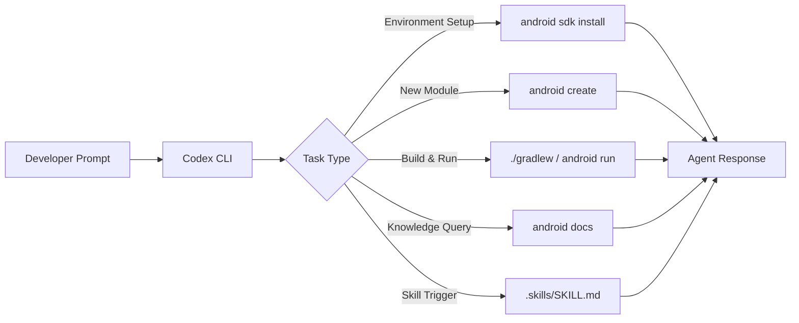
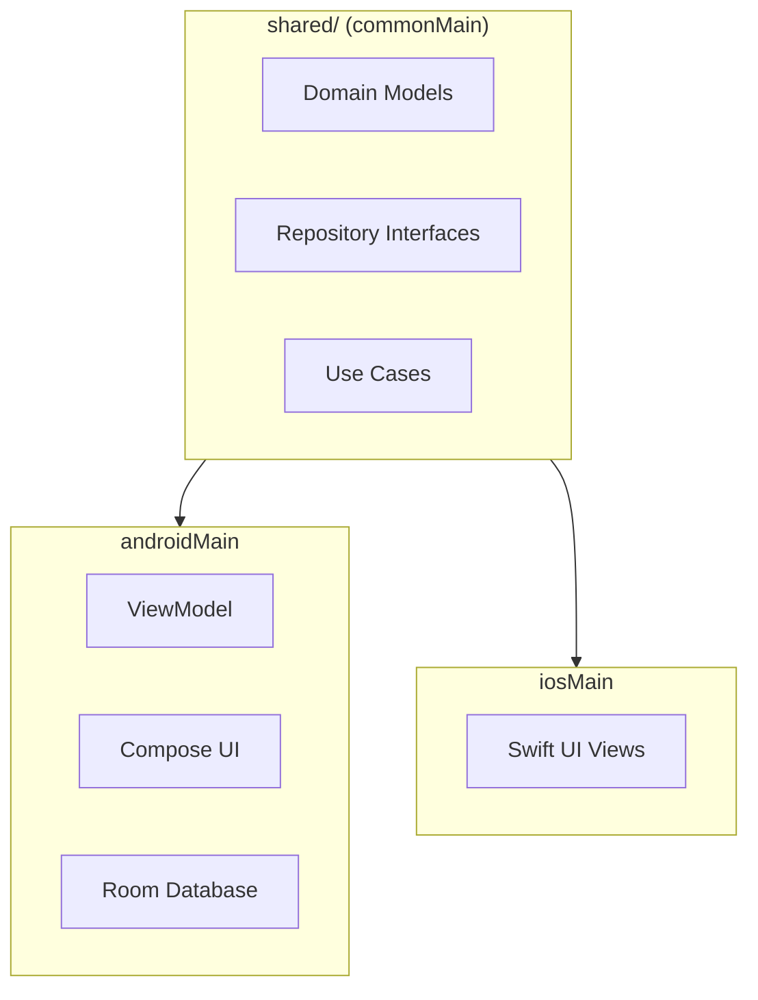
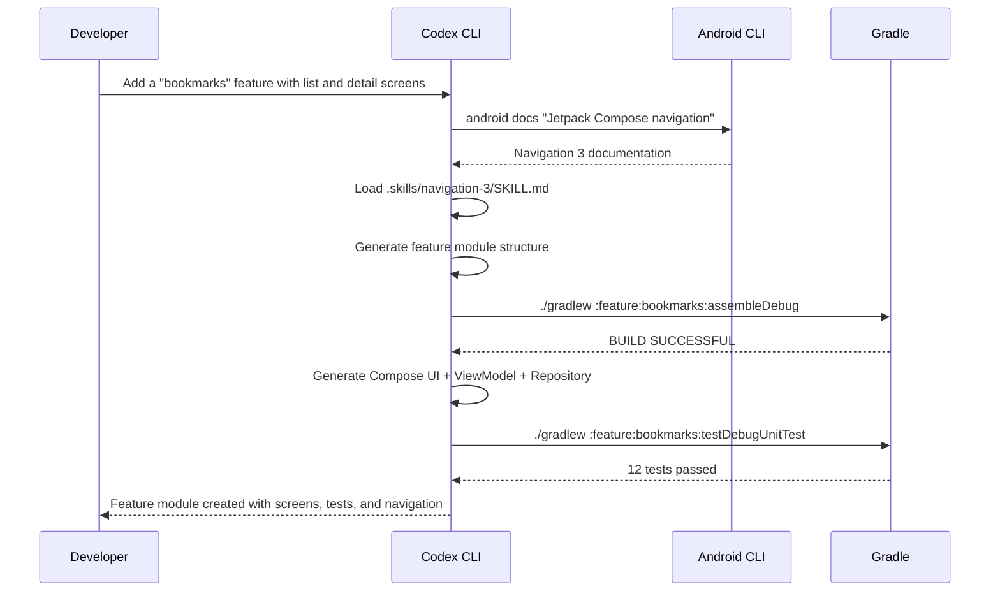

# Codex CLI for Kotlin and Android Teams: Android CLI, Skills, Jetpack Compose, and Agent-Driven Mobile Workflows


---

Android development in 2026 has become one of the strongest use cases for agentic coding. Google's release of Android CLI and Android Skills on 16 April 2026 [^1] created a purpose-built interface for AI agents, and Codex CLI is one of the officially supported agents alongside Gemini CLI and Claude Code [^1]. This article covers how to configure Codex CLI for Kotlin/Android projects — from AGENTS.md templates and sandbox settings through to Android Skills integration, Jetpack Compose workflows, and Kotlin Multiplatform patterns.

## Why Kotlin and Android Are Agent-Friendly

Kotlin's combination of strict type safety, expressive DSLs, and the Gradle build system gives agents rich compile-time feedback. Unlike dynamically typed languages where errors surface at runtime, Kotlin's compiler catches type mismatches, null-safety violations, and missing overrides immediately — each error message becomes a correction signal for the agent loop.

Android Gradle Plugin 9.2 (the current stable series as of April 2026) [^2] introduces built-in Kotlin support enabled by default, meaning agents no longer need to apply the `org.jetbrains.kotlin.android` plugin separately [^2]. This reduces configuration surface area and eliminates a common source of build failures when agents scaffold new modules.

Kotlin itself is at version 2.3.20 stable, with 2.4.0-Beta2 introducing stable context parameters and explicit backing fields [^3]. Agents benefit from Kotlin's conventional project structure and the version catalogue system (`gradle/libs.versions.toml`) that centralises dependency management in a single, parseable TOML file.

## Project Setup and AGENTS.md Template

A well-crafted `AGENTS.md` is the single most impactful configuration for Codex CLI on an Android project. Place it at your repository root:

```markdown
# AGENTS.md — Android/Kotlin Project

## Project Overview
Android application using Kotlin 2.3.20, Jetpack Compose, and Android Gradle Plugin 9.2.
Target SDK: 36. Min SDK: 26. Architecture: MVVM with Hilt dependency injection.

## Build Commands
- Full build: `./gradlew assembleDebug`
- Unit tests: `./gradlew testDebugUnitTest`
- Instrumentation tests: `./gradlew connectedDebugAndroidTest`
- Lint: `./gradlew lintDebug`
- Single module: `./gradlew :feature:home:testDebugUnitTest`

## Code Conventions
- Kotlin code style: official Kotlin coding conventions
- Compose: stateless composables, state hoisting, Material 3 design tokens
- All public APIs documented with KDoc
- Coroutines for async: use viewModelScope and Dispatchers.IO
- No RxJava — this project uses Kotlin Flow exclusively

## Testing
- Unit tests: JUnit 5 + MockK
- Compose UI tests: compose-ui-test-junit4 with createComposeRule
- Screenshot tests: Roborazzi for visual regression
- Coverage threshold: 80% line coverage per module

## Dependencies
- Version catalogue at gradle/libs.versions.toml — always use catalogue references
- Never add dependencies directly in build.gradle.kts with hardcoded versions

## Android Skills
- Android Skills installed in .skills/ — defer to SKILL.md for Navigation 3 and Compose patterns
```

Run `/init` in Codex CLI to generate a baseline, then customise from the template above [^4].

## Sandbox and config.toml Configuration

Android builds require network access for Gradle dependency resolution and broader filesystem access than the default sandbox permits. Configure `~/.codex/config.toml`:


```toml
[model]
default = "gpt-5.5"

[sandbox]
# Android builds need network for Gradle dependency resolution
network = true

# Allow Gradle daemon and Android SDK access
writable_paths = [
  "~/.gradle",
  "~/Android/Sdk",
  "~/Library/Android/sdk",  # macOS SDK path
]

[hooks.on_agent_message]
# Auto-format Kotlin files on each agent edit
command = "ktlint --format {{changed_files}}"
```


For CI pipelines using `codex exec`, lock the sandbox down further:

```bash
codex exec \
  --model gpt-5.5 \
  --sandbox-network-allow "maven.google.com,repo.maven.apache.org,plugins.gradle.org" \
  --approval-mode auto \
  "Run ./gradlew testDebugUnitTest and fix any failures"
```

## Integrating Google's Android CLI and Skills

Google's Android CLI reduces LLM token usage by over 70% and completes tasks 3× faster than agents navigating standard toolsets alone [^1]. It exposes commands that Codex CLI can invoke via shell access:



### Installing Android CLI

```bash
# macOS (Apple Silicon)
curl -fsSL https://dl.google.com/android/cli/android-cli-darwin-arm64.tar.gz | tar xz
sudo mv android /usr/local/bin/

# Verify
android --version
```

### Android Skills with Codex CLI

Android Skills are markdown-based instruction files (`SKILL.md`) that follow the open Agent Skills Specification [^5]. They live in `.skills/` or `.agent/skills/` at your project root and activate automatically when the agent's prompt matches the skill metadata [^5].

```bash
# List available skills
android skills list

# Install a skill (e.g. Navigation 3 setup)
android skills add --skill navigation-3
```

The installed skill structure:

```
.skills/
└── navigation-3/
    ├── SKILL.md
    ├── scripts/
    │   └── migrate-nav.sh
    └── references/
        └── nav3-api-reference.md
```

Codex CLI discovers these alongside your `AGENTS.md`. When you prompt "Migrate the home screen to Navigation 3", the agent loads the Navigation 3 skill automatically, following Google's prescribed multi-step migration rather than hallucinating an approach [^5].

The initial skill set includes Navigation 3 setup, edge-to-edge implementation, AGP 9 migration, XML-to-Compose migration, and R8 configuration analysis [^1].

## Jetpack Compose Workflows

Compose is where Codex CLI truly excels on Android. The declarative, function-based UI paradigm produces compact, self-contained composables that fit well within the agent's context window.

### Generating Composables

A typical prompt and the resulting workflow:

```
Create a ProfileCard composable that displays a user avatar, name, and bio.
Use Material 3 components, follow state hoisting, and include a Compose Preview.
Write a UI test using createComposeRule.
```

Codex CLI will:

1. Generate the composable in the appropriate package
2. Create a `@Preview` annotated function
3. Write a test using `composeTestRule.setContent { ... }`
4. Run `./gradlew testDebugUnitTest` to validate

### Compose-Specific AGENTS.md Additions

```markdown
## Compose Guidelines
- Use `Modifier` as the first optional parameter in every composable
- Prefer `remember` and `derivedStateOf` over recomputation
- Extract theme values via MaterialTheme.colorScheme / MaterialTheme.typography
- Navigation: use Navigation 3 with type-safe routes (no string-based routes)
- Never use `mutableStateOf` outside a `remember` block in composables
- Image loading: Coil 3 with AsyncImage — no Glide
```

### XML-to-Compose Migration

With the Android `xml-to-compose` skill installed, you can prompt:

```
Migrate the activity_settings.xml layout to a SettingsScreen composable.
Preserve all click handlers and data binding references.
```

The skill provides the agent with step-by-step instructions following Google's recommended migration path [^1], preventing common pitfalls like losing scroll behaviour or incorrectly mapping XML attributes to Compose modifiers.

## Kotlin Multiplatform (KMP) Patterns

Kotlin Multiplatform is stable and production-ready, with companies like Netflix and Cash App running it in production [^6]. AGP 9.0 introduces a dedicated KMP library plugin (`com.android.kotlin.multiplatform.library`) [^2], simplifying shared module configuration.



### AGENTS.md for KMP Projects

Append KMP-specific guidance:

```markdown
## Kotlin Multiplatform
- Shared business logic lives in shared/src/commonMain
- Platform-specific implementations use expect/actual declarations
- Android-specific code: shared/src/androidMain
- iOS-specific code: shared/src/iosMain
- Jetpack libraries with KMP support: Room 2.8.x, DataStore 1.1.x, ViewModel 2.9.x
- Test shared code: ./gradlew :shared:allTests
- Never put Android framework imports in commonMain
```

## Model Selection for Android Tasks

| Task | Recommended Model | Rationale |
|------|------------------|-----------|
| Scaffolding new feature modules | gpt-5.5 | Complex multi-file generation across layers |
| Compose UI components | gpt-5.5 | Nuanced understanding of Compose idioms |
| Build script fixes | o4-mini | Fast, mechanical Gradle DSL corrections |
| XML-to-Compose migration | gpt-5.5 | Requires semantic understanding of UI hierarchy |
| Unit test generation | o4-mini | Pattern-based, benefits from speed |
| Code review | gpt-5.5 | Needs architectural context [^7] |

GPT-5.5 is OpenAI's recommended model for complex coding tasks as of April 2026 [^7]. For rapid iteration during test-fix cycles, o4-mini provides faster turnaround with lower token costs.

## JetBrains IDE Integration

Codex has been natively integrated into JetBrains IDEs since January 2026 [^8], including Android Studio (which is built on IntelliJ IDEA). Developers can access Codex through the AI chat panel using their JetBrains AI subscription, ChatGPT account, or their own OpenAI API key [^8].

The JetBrains integration complements the CLI workflow:

- **IDE for interactive development** — use the AI chat for quick refactors, code explanations, and inline completions
- **CLI for batch operations** — use `codex exec` for running migrations, generating test suites, or processing multiple modules
- **Shared configuration** — the same `AGENTS.md` and `.skills/` directory serve both the IDE extension and the CLI

## Practical Workflow: Adding a New Feature

Here is a complete agent-driven workflow for adding a feature module to an Android project:



## Common Pitfalls and Mitigations

| Pitfall | Mitigation |
|---------|------------|
| Agent uses deprecated `View`-based APIs | Add "Compose only — no XML layouts" to AGENTS.md |
| Gradle sync fails in sandbox | Ensure `network = true` and writable SDK paths in config.toml |
| Agent ignores version catalogue | Explicitly state "use libs.versions.toml references only" in AGENTS.md |
| Wrong Kotlin version assumed | Pin version in AGENTS.md header: "Kotlin 2.3.20" |
| Agent generates Java instead of Kotlin | Add "This is a Kotlin-only project — never generate Java files" to AGENTS.md |
| Compose preview not generated | Include "Always add @Preview functions" in Compose guidelines |

## Conclusion

The convergence of Codex CLI, Google's Android CLI, and Android Skills creates a remarkably productive environment for Kotlin/Android teams. The key to success is thorough `AGENTS.md` configuration that communicates your project's conventions, build commands, and architectural decisions. Combined with Android Skills for standardised patterns and the right model selection for each task type, Codex CLI can handle everything from Compose UI generation to full feature module scaffolding with minimal manual intervention.

Start with the `AGENTS.md` template above, install the Android Skills that match your project's needs, and let the agent's compile-feedback loop do the rest.

## Citations

[^1]: Google Android Developers Blog, "Android CLI and skills: Build Android apps 3x faster using any agent", April 2026. [https://android-developers.googleblog.com/2026/04/build-android-apps-3x-faster-using-any-agent.html](https://android-developers.googleblog.com/2026/04/build-android-apps-3x-faster-using-any-agent.html)

[^2]: Android Developers, "Android Gradle plugin 9.2.0 (April 2026) release notes". [https://developer.android.com/build/releases/agp-9-2-0-release-notes](https://developer.android.com/build/releases/agp-9-2-0-release-notes)

[^3]: JetBrains, "Kotlin 2.3.20 Released", March 2026; "What's new in Kotlin 2.4.0-Beta2". [https://blog.jetbrains.com/kotlin/2026/03/kotlin-2-3-20-released/](https://blog.jetbrains.com/kotlin/2026/03/kotlin-2-3-20-released/)

[^4]: OpenAI Developers, "Custom instructions with AGENTS.md". [https://developers.openai.com/codex/guides/agents-md](https://developers.openai.com/codex/guides/agents-md)

[^5]: Google Android Developers, "Overview of Android skills". [https://developer.android.com/tools/agents/android-skills](https://developer.android.com/tools/agents/android-skills)

[^6]: commonmain.dev, "Kotlin Multiplatform (KMP): The Ultimate Guide (2026)". [https://commonmain.dev/kotlin-multiplatform/](https://commonmain.dev/kotlin-multiplatform/)

[^7]: OpenAI Developers, "Models — Codex" and "Features — Codex CLI". [https://developers.openai.com/codex/models](https://developers.openai.com/codex/models)

[^8]: JetBrains AI Blog, "Codex Is Now Integrated Into JetBrains IDEs", January 2026. [https://blog.jetbrains.com/ai/2026/01/codex-in-jetbrains-ides/](https://blog.jetbrains.com/ai/2026/01/codex-in-jetbrains-ides/)
