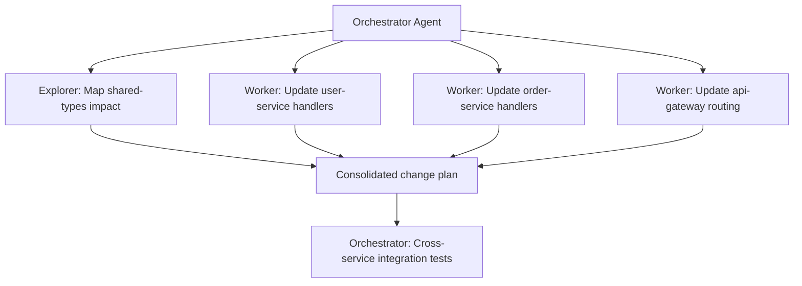
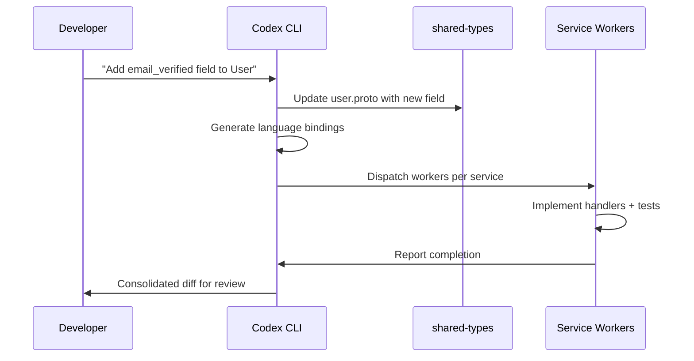

# Codex CLI for Microservices: Cross-Service Development, Multi-Repo Patterns, and Distributed Workflows


---

Microservices architectures pose a unique challenge for AI coding agents: the work you need done rarely fits inside a single repository. A typical change — say, adding a field to a shared protobuf definition — cascades across an API gateway, two backend services, a shared library, and a set of integration tests. Codex CLI, as of v0.125, has the primitives to handle these workflows, but you need to assemble them deliberately. This article covers the patterns that work.

## The Core Problem: Single-Root Assumptions

Most coding agents, Codex included, default to a single working directory rooted at your Git checkout [^1]. That assumption breaks immediately when your microservice stack spans multiple repositories. Until recently, the main workaround was running separate Codex sessions per repo and manually coordinating changes — precisely the kind of toil an agent should eliminate.

The community has been vocal about this. GitHub issue #11956 has accumulated significant support from developers who cite multi-repo context as a primary reason for switching between tools [^2]. Codex CLI's answer comes in two parts: the `--add-dir` flag for multi-root sessions, and subagents for parallel cross-service orchestration.

## Multi-Root Sessions with `--add-dir`

The `--add-dir` flag exposes additional writable roots to a single Codex session [^3]. This is the foundational primitive for cross-service work:

```bash
codex --cd services/api-gateway \
      --add-dir ../user-service \
      --add-dir ../order-service \
      --add-dir ../shared-types
```

With this invocation, Codex can read and write files across all four directories within a single conversation context. The active path displays in the terminal header, and you can reference files from any root using the `@` fuzzy search [^3].

### Practical Constraints

The `--add-dir` approach works best when your services live in a monorepo or are checked out as siblings in a parent directory. For genuinely separate repositories, you need to clone them into adjacent paths first:

```bash
mkdir -p ~/work/platform && cd ~/work/platform
git clone git@github.com:acme/api-gateway.git
git clone git@github.com:acme/user-service.git
git clone git@github.com:acme/order-service.git
git clone git@github.com:acme/shared-types.git

codex --cd api-gateway \
      --add-dir ../user-service \
      --add-dir ../order-service \
      --add-dir ../shared-types
```

Be mindful of context window budget. GPT-5.5 offers roughly a million tokens of context [^4], but four large services with node_modules or build artefacts can still overwhelm it. Exclude irrelevant paths via AGENTS.md:

```markdown
## Excluded Directories
Do NOT read or index:
- `node_modules/`, `dist/`, `build/`, `.next/`
- `vendor/`, `target/`, `__pycache__/`
```

## Layered AGENTS.md for Service Boundaries

Codex discovers AGENTS.md files hierarchically, concatenating from the repository root downward [^5]. In a microservices context, this hierarchy becomes your service contract with the agent:

```
~/work/platform/
├── AGENTS.md                          # Cross-cutting standards
├── api-gateway/
│   └── AGENTS.md                      # Gateway-specific rules
├── user-service/
│   ├── AGENTS.md                      # Service conventions
│   └── services/auth/
│       └── AGENTS.override.md         # Auth module overrides
├── order-service/
│   └── AGENTS.md
└── shared-types/
    └── AGENTS.md
```

The root-level `AGENTS.md` should encode cross-cutting concerns — naming conventions, API versioning rules, shared error handling patterns. Each service-level file narrows the context:

```markdown
# User Service — AGENTS.md

## Stack
- Runtime: Node.js 22 LTS, TypeScript 5.7
- Framework: Fastify 5.x
- Database: PostgreSQL 16 via Drizzle ORM
- Testing: Vitest + Testcontainers

## API Contract
- All endpoints defined in ../shared-types/proto/user.proto
- gRPC for inter-service, REST for external consumers
- Breaking changes require proto field deprecation, never removal

## Sandbox Rules
- Database migrations must be reversible
- Never modify files in ../shared-types without explicit instruction
```

The `project_doc_max_bytes` setting defaults to 32 KiB [^5]. With four services, you will hit this limit quickly if your AGENTS.md files are verbose. Keep them terse and factual.

## Subagent Patterns for Cross-Service Changes

For changes that genuinely need to touch multiple services in parallel, Codex subagents provide structured delegation [^6]. The system supports up to six concurrent threads by default (`max_threads: 6`), with a nesting depth of one.



### Configuring Subagents for Service Specialisation

Create service-specific agent definitions in `~/.codex/agents/`:

```toml
# ~/.codex/agents/user-svc-worker.toml
name = "user-service-worker"
description = "Implements changes in the user-service, follows Fastify/Drizzle conventions"
developer_instructions = """
You work exclusively in the user-service directory.
Follow the AGENTS.md in that directory.
Run `pnpm test` before reporting completion.
Never modify files outside user-service/ unless explicitly told.
"""
model = "gpt-5.5"
sandbox_mode = "standard"
```

The built-in agent types — `default`, `worker`, and `explorer` — cover most needs [^6]. The explorer agent is particularly useful as a first step: send it to map the dependency graph across services before dispatching workers.

### Token Budget Awareness

Subagent workflows consume significantly more tokens than single-agent runs [^6]. For a four-service change, expect roughly 3-4x the token usage of modifying a single service. Use the `codex exec --json` flag to monitor reasoning token consumption [^7], and set `job_max_runtime_seconds` (default: 1800) to prevent runaway sessions:

```toml
[agents]
max_threads = 4
max_depth = 1
job_max_runtime_seconds = 900
```

## The Contract-First Workflow

The most reliable pattern for cross-service changes follows a contract-first approach that minimises coordination failures:



In practice, this translates to a prompt like:

```
Add an email_verified boolean field to the User entity.
1. Update shared-types/proto/user.proto first
2. Regenerate TypeScript and Go bindings
3. Update user-service to populate the field during OAuth callback
4. Update order-service to read the field for fraud checks
5. Update api-gateway to expose it in the REST response
6. Run tests in each service
```

The explicit ordering matters. Without it, Codex may attempt parallel modifications to shared-types while simultaneously updating consumers, leading to compilation failures against stale definitions.

## Integration Testing Across Services

After individual service changes, you need cross-service validation. Codex can orchestrate Docker Compose-based integration tests:

```bash
codex exec "Run docker compose up -d for the integration test stack, \
  execute the cross-service test suite in tests/integration/, \
  and report any failures with root cause analysis"
```

For teams using Testcontainers, add guidance to your root AGENTS.md:

```markdown
## Integration Testing
- Cross-service tests live in tests/integration/
- Use docker compose -f docker-compose.test.yml up
- Each service exposes health checks on /healthz
- Wait for all health checks before running tests
```

## Current Limitations and Workarounds

Multi-repo support in Codex CLI is functional but evolving. Key limitations to be aware of:

| Limitation | Workaround |
|---|---|
| `--add-dir` requires local filesystem paths | Clone repos as siblings before starting session |
| No native multi-repo Git operations | Use hooks or post-session scripts for coordinated commits |
| Subagent nesting capped at depth 1 [^6] | Flatten orchestration; avoid agent-spawns-agent chains |
| IDE extension visibility for subagents is limited [^6] | Use CLI with `--json` for full observability |
| No atomic cross-repo commits | Create PRs per repo, link them in descriptions |

For coordinated commits across repositories, a post-session script works well:

```bash
#!/usr/bin/env bash
CHANGE_ID=$(date +%s)
for svc in api-gateway user-service order-service shared-types; do
  cd ~/work/platform/$svc
  git add -A
  git commit -m "feat: add email_verified field [change:${CHANGE_ID}]"
  git push origin HEAD
done
```

## When to Use What

Not every microservices task needs the full multi-root, subagent treatment. A decision framework:

| Scenario | Approach |
|---|---|
| Single-service feature | Standard single-root `codex` session |
| Shared type change + 1 consumer | `--add-dir` with two roots |
| Cross-cutting change across 3+ services | Subagents with service-specific workers |
| Read-only cross-service investigation | Explorer subagent across `--add-dir` roots |
| CI pipeline validation | `codex exec` with Docker Compose integration tests |

## Citations

[^1]: [Codex CLI Features — OpenAI Developers](https://developers.openai.com/codex/cli/features)
[^2]: [Multi-repo support — GitHub Issue #11956](https://github.com/openai/codex/issues/11956)
[^3]: [Codex CLI Features — `--add-dir` flag documentation](https://developers.openai.com/codex/cli/features)
[^4]: [GPT-5.5 Migration Cookbook — Codex Blog](https://codex.danielvaughan.com/2026/04/24/gpt-5-5-migration-cookbook-effort-tuning-cost-comparison/)
[^5]: [Custom Instructions with AGENTS.md — OpenAI Developers](https://developers.openai.com/codex/guides/agents-md)
[^6]: [Subagents — OpenAI Developers](https://developers.openai.com/codex/subagents)
[^7]: [Codex CLI Changelog — v0.125.0 exec --json reasoning tokens](https://developers.openai.com/codex/changelog)
