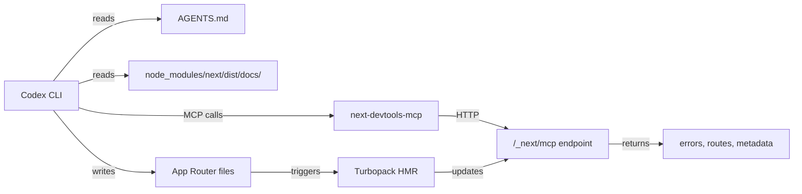
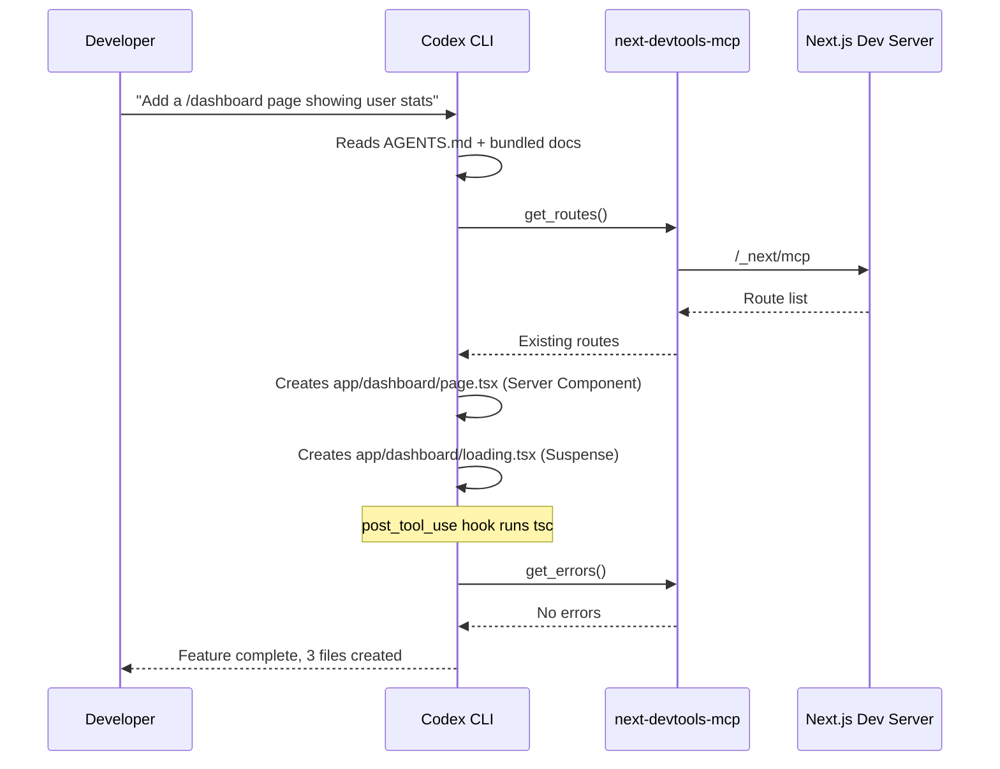

# Codex CLI for Next.js Teams: App Router, Server Components, DevTools MCP, and Agent-Driven Full-Stack Workflows


---

Next.js 16 is the first major framework release built with AI coding agents as a first-class concern. Version-matched documentation ships inside `node_modules`, `create-next-app` generates an `AGENTS.md` by default, and a dedicated MCP server exposes live application state to any connected agent[^1]. For teams already running Codex CLI, this means the gap between "ask the agent to build a page" and "the page actually works" has narrowed considerably. This article covers the complete setup: AGENTS.md configuration, the next-devtools-mcp integration, config.toml profiles, post-tool-use hooks, and practical workflow patterns for Server Components, Server Actions, and the App Router.

## Why Next.js 16 Is Unusually Agent-Friendly

Three properties make Next.js 16 stand out from other frameworks when paired with a coding agent:

1. **Bundled documentation.** Installing `next` places the full Next.js docs at `node_modules/next/dist/docs/`, matching your exact installed version[^1]. Agents read these instead of relying on stale training data — a pattern no other major framework has shipped natively.

2. **Convention-heavy file system routing.** The App Router enforces `page.tsx`, `layout.tsx`, `loading.tsx`, `error.tsx`, and `route.ts` conventions[^2]. Agents benefit from strong structural constraints: there is exactly one correct place for each concern.

3. **Built-in MCP endpoint.** Next.js 16+ exposes `/_next/mcp` on the dev server, allowing agents to query live errors, routes, page metadata, and Server Action definitions without leaving the terminal[^3].



## Setting Up AGENTS.md for Next.js

### New Projects

`create-next-app` on Next.js 16.2+ generates `AGENTS.md` and `CLAUDE.md` automatically[^1]:

```bash
npx create-next-app@canary my-app
```

Pass `--no-agents-md` to skip generation. The generated file contains a single, focused instruction within delimited markers:

```markdown
<!-- BEGIN:nextjs-agent-rules -->

# Next.js: ALWAYS read docs before coding

Before any Next.js work, find and read the relevant doc in
`node_modules/next/dist/docs/`. Your training data is outdated
-- the docs are the source of truth.

<!-- END:nextjs-agent-rules -->
```

### Existing Projects

For projects on Next.js 16.1 or earlier, run the codemod:

```bash
npx @next/codemod@latest agents-md
```

This outputs bundled docs to `.next-docs/` and generates agent files pointing there[^1].

### Enriching AGENTS.md with Project-Specific Rules

The `<!-- BEGIN/END -->` markers delimit the Next.js-managed section. Add your own rules outside these markers. A production-ready addition for a typical Next.js 16 project:

```markdown
<!-- BEGIN:nextjs-agent-rules -->
# Next.js: ALWAYS read docs before coding
Before any Next.js work, find and read the relevant doc in
`node_modules/next/dist/docs/`. Your training data is outdated
-- the docs are the source of truth.
<!-- END:nextjs-agent-rules -->

## Project conventions

- Use the App Router exclusively. Never create files under `pages/`.
- All data fetching happens in Server Components via `async` functions.
  Never use `useEffect` for data fetching.
- Server Actions live in dedicated `actions.ts` files with `'use server'`
  at the top. Never inline `'use server'` inside component bodies.
- Use `next/image` for all images. Never use raw `` tags.
- Styles use Tailwind CSS v4. Never create CSS modules.
- Tests use Vitest + Testing Library. Run `pnpm test` after changes.
- TypeScript strict mode is enabled. Never use `any` or `@ts-ignore`.
```

Codex CLI discovers `AGENTS.md` from the repository root and merges it with any global instructions in `~/.codex/AGENTS.md`[^4]. Root-level instructions appear first; directory-level overrides appear later and take precedence.

## Configuring next-devtools-mcp

The `next-devtools-mcp` package bridges Codex CLI to your running dev server via the Model Context Protocol[^3].

### Installation

Add to `.mcp.json` at the project root:

```json
{
  "mcpServers": {
    "next-devtools": {
      "command": "npx",
      "args": ["-y", "next-devtools-mcp@latest"]
    }
  }
}
```

Or register via the CLI:

```bash
codex mcp add next-devtools -- npx next-devtools-mcp@latest
```

### Available Tools

| Tool | Purpose |
|---|---|
| `get_errors` | Retrieves build errors, runtime errors, and type errors from the dev server[^3] |
| `get_logs` | Returns the path to the dev log file containing browser console and server output[^3] |
| `get_page_metadata` | Queries routes, components, and rendering information for a specific page[^3] |
| `get_project_metadata` | Returns project structure, configuration, and dev server URL[^3] |
| `get_routes` | Lists all routes grouped by router type (appRouter, pagesRouter), including dynamic segments[^3] |
| `get_server_action_by_id` | Looks up Server Actions by ID to find source file and function name[^3] |

The MCP server automatically discovers Next.js instances on different ports and forwards tool calls to the appropriate dev server[^3]. This means Codex can work with multiple Next.js services in a microservices setup simultaneously.

### Verification

After starting your dev server, confirm the MCP connection within a Codex session:

```
/mcp verbose
```

You should see `next-devtools` listed with six available tools. If the connection fails, ensure you are on Next.js 16+ and that the dev server is running before starting Codex[^3].

## config.toml for Next.js Projects

Create a profile tailored to Next.js development:

```toml
# ~/.codex/config.toml

model = "gpt-5.5"
approval_policy = "on-request"

[profiles.nextjs]
model = "gpt-5.5"
model_reasoning_effort = "high"
sandbox_mode = "workspace-write"

[profiles.nextjs-review]
model = "o4-mini"
model_reasoning_effort = "medium"
sandbox_mode = "read-only"
```

Launch with:

```bash
codex --profile nextjs
```

The `nextjs` profile uses GPT-5.5 at high reasoning effort for implementation tasks — Server Components, complex data fetching patterns, and Server Action chains benefit from deeper reasoning[^5]. The `nextjs-review` profile uses o4-mini in read-only mode for code review passes, keeping costs lower while still catching structural issues.

## post_tool_use Hooks

Hooks run automatically after every tool invocation, catching errors before they compound. For a Next.js 16 project with Turbopack:

```toml
# .codex/config.toml (project-level)

[[hooks.post_tool_use]]
trigger = "on_file_change"
match_files = ["**/*.ts", "**/*.tsx"]
command = "npx tsc --noEmit --pretty 2>&1 | head -30"
timeout_ms = 15000

[[hooks.post_tool_use]]
trigger = "on_file_change"
match_files = ["**/*.ts", "**/*.tsx", "**/*.css"]
command = "npx next lint --quiet 2>&1 | head -20"
timeout_ms = 10000
```

These hooks ensure that every file edit triggers a type check and lint pass. Codex reads the hook output and self-corrects before proceeding to the next change[^6]. With Turbopack's filesystem caching in Next.js 16.1+, incremental type checks typically complete in under five seconds[^7].

## Workflow Patterns

### Server Component Feature Development

The most common workflow for adding a feature to a Next.js 16 App Router project:



**Key principle:** Codex creates Server Components by default for data-fetching pages. The bundled docs reinforce that Server Components are the default in the App Router — no `'use client'` directive unless interactivity is genuinely required[^2].

### Client Component Extraction

When Codex needs to add interactivity (event handlers, hooks, browser APIs), it should extract the interactive portion into a separate Client Component:

```
Prompt: "Add a search filter to /dashboard that filters the stats table
client-side"
```

Codex will:

1. Keep `app/dashboard/page.tsx` as a Server Component for data fetching
2. Create `app/dashboard/stats-filter.tsx` with `'use client'` at the top
3. Import the Client Component into the Server Component
4. Pass server-fetched data as serialisable props

This pattern — server-first with surgical client extraction — is exactly what the App Router documentation prescribes[^2], and agents following the bundled docs naturally adopt it.

### Server Actions for Mutations

Server Actions replace traditional API routes for form submissions and mutations in the App Router[^2]. Direct Codex to create them in dedicated files:

```
Prompt: "Add a Server Action to update user preferences. Put it in
app/dashboard/actions.ts"
```

The AGENTS.md rule about dedicated `actions.ts` files prevents the common anti-pattern of inlining `'use server'` inside component bodies, which creates maintenance headaches and makes the action harder to test independently.

### Route Handler Generation

For cases where Server Actions are insufficient (webhooks, third-party API callbacks, streaming responses), Codex generates Route Handlers:

```
Prompt: "Create a webhook handler at /api/stripe/webhook that verifies
the Stripe signature and processes checkout.session.completed events"
```

Codex creates `app/api/stripe/webhook/route.ts` with the correct `POST` export, following the App Router convention of named HTTP method exports[^2].

## Model Selection

| Task | Recommended Model | Reasoning Effort | Rationale |
|---|---|---|---|
| Feature implementation | GPT-5.5 | high | Complex Server Component/Action patterns benefit from deep reasoning[^5] |
| Bug fixing | GPT-5.5 | medium | Targeted fixes need less exploration |
| Code review | o4-mini | medium | Read-only analysis at lower cost |
| Scaffold generation | GPT-5.5 | low | Boilerplate follows strong conventions |
| Refactoring to App Router | GPT-5.5 | high | Migration from Pages Router requires understanding both paradigms |

GPT-5.5's million-token context window[^5] is particularly valuable for large Next.js codebases where the agent needs to understand the full route tree, shared layouts, and middleware configuration simultaneously.

## The Vercel Plugin (Preview)

Vercel's plugin for AI coding agents provides 25 skills, three specialist agents, and five slash commands covering the entire Vercel ecosystem[^8]. At the time of writing, Codex CLI support is listed as "coming soon," but the architecture is already available:

```bash
npx plugins add vercel/vercel-plugin
```

Notable skills relevant to Next.js development include `nextjs` (App Router, Server Components, rendering strategies), `next-cache-components` (Cache Components, PPR, `use cache`), `turbopack` (bundler configuration and HMR), and `shadcn` (component installation and theming)[^8].

The three specialist agents — `deployment-expert`, `performance-optimizer`, and `ai-architect` — can be invoked directly[^8]. Once Codex CLI support ships, these will integrate as subagents callable from your Codex session.

## Common Pitfalls

| Pitfall | Symptom | Fix |
|---|---|---|
| Agent adds `'use client'` to data-fetching pages | Unnecessary client-side JavaScript, lost SSR benefits | AGENTS.md rule: "Server Components are default. Only add `'use client'` for event handlers and hooks" |
| Agent creates `pages/` directory files | Conflicting routers, build errors | AGENTS.md rule: "Use App Router exclusively. Never create files under `pages/`" |
| Agent uses `getServerSideProps` | Deprecated pattern in App Router | Bundled docs redirect to `async` Server Components |
| Agent inlines `'use server'` in components | Mixed concerns, untestable actions | AGENTS.md rule: "Server Actions in dedicated `actions.ts` files" |
| Agent uses `fetch` in Client Components for initial data | Waterfalls, loading spinners | AGENTS.md rule: "Data fetching in Server Components only" |
| MCP reports stale errors after fix | Agent loops on phantom errors | Ensure Turbopack HMR has completed before querying `get_errors` |
| Type check hook times out | Large codebase, slow `tsc` | Increase `timeout_ms` or use `tsc --incremental` |

## Putting It All Together

A minimal but production-ready setup for a Next.js 16 project with Codex CLI:

1. **Scaffold:** `npx create-next-app@canary` (generates `AGENTS.md` automatically)
2. **Enrich AGENTS.md** with project conventions outside the managed markers
3. **Add `.mcp.json`** with `next-devtools-mcp` for live application state
4. **Create project-level `.codex/config.toml`** with `post_tool_use` hooks for `tsc` and `next lint`
5. **Start the dev server** before launching Codex
6. **Use `--profile nextjs`** for implementation, `--profile nextjs-review` for review passes

The combination of bundled docs, convention-enforced file routing, live MCP diagnostics, and automatic type checking creates a feedback loop tight enough that the agent self-corrects most errors without developer intervention. For Next.js teams, this is as close as current tooling gets to a genuinely autonomous development workflow.

## Citations

[^1]: Next.js Documentation, "How to set up your Next.js project for AI coding agents," [https://nextjs.org/docs/app/guides/ai-agents](https://nextjs.org/docs/app/guides/ai-agents)

[^2]: Next.js Documentation, "App Router: Getting Started," [https://nextjs.org/docs/app/getting-started](https://nextjs.org/docs/app/getting-started)

[^3]: Next.js Documentation, "Enabling Next.js MCP Server for Coding Agents," [https://nextjs.org/docs/app/guides/mcp](https://nextjs.org/docs/app/guides/mcp)

[^4]: OpenAI Developers, "Custom instructions with AGENTS.md," [https://developers.openai.com/codex/guides/agents-md](https://developers.openai.com/codex/guides/agents-md)

[^5]: OpenAI, "Introducing GPT-5.5," [https://openai.com/index/introducing-gpt-5-5/](https://openai.com/index/introducing-gpt-5-5/)

[^6]: OpenAI Developers, "Codex CLI Features: Hooks," [https://developers.openai.com/codex/cli/features](https://developers.openai.com/codex/cli/features)

[^7]: Next.js Blog, "Next.js 16.1," [https://nextjs.org/blog/next-16-1](https://nextjs.org/blog/next-16-1)

[^8]: Vercel Documentation, "Vercel Plugin for AI Coding Agents," [https://vercel.com/docs/agent-resources/vercel-plugin](https://vercel.com/docs/agent-resources/vercel-plugin)
