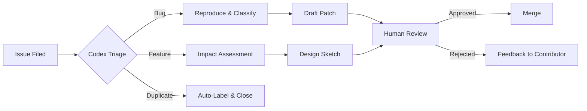
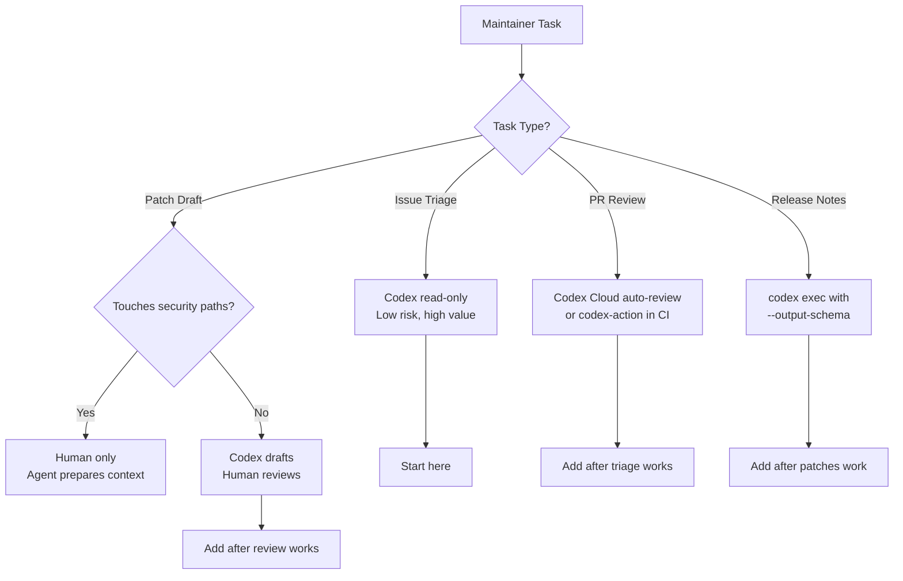

# Codex CLI for Open Source Maintainers: Issue Triage, PR Review, and Contributor Automation at Scale


Open source maintainers face a compounding problem: issue volumes grow faster than review capacity. A popular project with 50 open issues per week and three active maintainers is perpetually underwater. OpenAI's **Codex for Open Source** programme[^1] — launched in April 2026 with a \$1 million fund — signals that the industry recognises this. But the programme's real value is not the credits; it is the workflow patterns that emerge when Codex CLI and Codex Cloud sit between the issue tracker and the merge button.

This article maps five concrete maintainer workflows onto Codex CLI tooling, drawing on the official GitHub integration[^2], the OpenAI best practices documentation[^3], and early field reports from WordPress and Drupal maintainers[^4].

## The Maintainer Bottleneck

Most open source projects stall not from lack of contributors but from lack of review bandwidth. A 2026 practical assessment of Codex for WordPress/Drupal maintainers found that treating Codex as a "queue-acceleration layer inside strict review controls" is the pattern that works[^4]. The critical distinction: **agent for preparation, human for acceptance**.



The five workflows below form a progressive adoption path: start with triage, add review, then graduate to patch drafting once governance is in place.

## Workflow 1: Automated Issue Triage

Issue triage is the highest-value, lowest-risk entry point. Codex reads the issue body, reproduces the bug against known versions, classifies the issue type, and prepares an impact summary — reducing the time maintainers spend normalising reports[^4].

### GitHub Cloud Triage

If your repository is connected to Codex Cloud, mention `@codex` in an issue comment to trigger a cloud task[^2]:

```
@codex reproduce this bug on the main branch and classify severity
```

Codex spins up an isolated container, clones the repository, attempts reproduction, and posts findings as a comment[^5].

### CLI-Based Batch Triage

For maintainers who prefer local control, `codex exec` can process issues in batch via the GitHub CLI:

```bash
#!/usr/bin/env bash
# triage-issues.sh — batch triage with codex exec
set -euo pipefail

ISSUES=$(gh issue list --state open --label "needs-triage" --json number,title,body --limit 20)

echo "$ISSUES" | jq -c '.[]' | while read -r issue; do
  NUMBER=$(echo "$issue" | jq -r '.number')
  TITLE=$(echo "$issue" | jq -r '.title')
  BODY=$(echo "$issue" | jq -r '.body')

  codex exec \
    --model gpt-5.5 \
    --sandbox-mode read-only \
    --approval-policy on-request \
    --output-schema triage-schema.json \
    "Triage issue #${NUMBER}: ${TITLE}

Issue body:
${BODY}

Tasks:
1. Search the codebase for related code
2. Determine if this is a bug, feature request, or duplicate
3. Assess severity (P0-P3)
4. Suggest which maintainer or area owner should review
5. If a bug, attempt to identify the root cause file and function"
done
```

The `--output-schema` flag ensures structured JSON output that downstream tooling can parse[^6]:

```json
{
  "type": "object",
  "properties": {
    "issue_number": { "type": "integer" },
    "classification": { "type": "string", "enum": ["bug", "feature", "duplicate", "question"] },
    "severity": { "type": "string", "enum": ["P0", "P1", "P2", "P3"] },
    "root_cause_file": { "type": "string" },
    "suggested_owner": { "type": "string" },
    "summary": { "type": "string" }
  },
  "required": ["issue_number", "classification", "severity", "summary"],
  "additionalProperties": false
}
```

### AGENTS.md for Triage Context

Add a `## Triage guidelines` section to your repository's `AGENTS.md` so Codex understands your project's classification scheme:

```markdown
## Triage guidelines

- P0: Data loss, security vulnerability, or complete service outage
- P1: Major functionality broken with no workaround
- P2: Functionality broken with a known workaround
- P3: Minor issue, cosmetic, or enhancement request

When triaging, always check:
1. Which version introduced the regression (use `git bisect` if needed)
2. Whether a duplicate exists in closed issues
3. Whether the issue affects the critical path listed in CRITICAL_PATHS.md
```

## Workflow 2: Automated PR Review

Codex reviews every PR at OpenAI internally[^3]. Open source maintainers can replicate this with two approaches.

### GitHub Cloud Reviews

Enable automatic reviews in your repository's Codex settings[^2]. Codex will post a review whenever a new PR is opened, surfacing P0 and P1 findings by default. Customise severity thresholds in `AGENTS.md`:

```markdown
## Review guidelines

- Flag any change to authentication, authorisation, or permissions as P0
- Flag missing test coverage for new public APIs as P1
- Flag style-only issues as P3 (do not comment unless severity >= P1)
- All database migration changes require explicit approval from @db-team
- Never approve changes that add new runtime dependencies without justification
```

For on-demand reviews, comment `@codex review` on a PR. For focused reviews, add context: `@codex review for security regressions`[^2].

### codex-action in CI

For repositories on GitHub Enterprise or GitLab — or maintainers wanting explicit control — `openai/codex-action@v1` runs in your own CI pipeline[^7]:


```yaml
# .github/workflows/codex-review.yml
name: Codex PR Review
on:
  pull_request:
    types: [opened, synchronize]

permissions:
  contents: read
  pull-requests: write

jobs:
  review:
    runs-on: ubuntu-latest
    steps:
      - uses: actions/checkout@v4
        with:
          fetch-depth: 0

      - uses: openai/codex-action@v1
        with:
          codex_home: .codex
          prompt: |
            Review this PR against the project's AGENTS.md review guidelines.
            Focus on correctness, security, and test coverage.
            Post findings as inline PR comments.
          sandbox_mode: read-only
        env:
          OPENAI_API_KEY: ${{ secrets.OPENAI_API_KEY }}
```


## Workflow 3: Draft Patch Generation

Patch drafting is high-leverage but narrower in scope. It works best on maintenance backlogs — API migration updates, test coverage additions, and small refactors with explicit acceptance criteria[^4]. It is explicitly **not** suited for greenfield features or security-sensitive code.

### Issue-to-PR Pipeline

Combine `codex exec` with `gh` to create a draft PR from an issue:

```bash
#!/usr/bin/env bash
set -euo pipefail

ISSUE_NUMBER=$1
ISSUE_BODY=$(gh issue view "$ISSUE_NUMBER" --json body -q .body)
BRANCH="codex/fix-issue-${ISSUE_NUMBER}"

git checkout -b "$BRANCH" origin/main
codex exec \
  --model gpt-5.5 \
  --sandbox-mode workspace-write \
  --approval-policy on-request \
  "Fix the issue described below. Follow the project's AGENTS.md conventions.
Run existing tests after making changes. Do not modify unrelated files.

Issue #${ISSUE_NUMBER}:
${ISSUE_BODY}"

# Only create PR if tests pass
if npm test 2>/dev/null || python -m pytest 2>/dev/null || go test ./... 2>/dev/null; then
  git add -A
  git commit -m "fix: address issue #${ISSUE_NUMBER}

Generated by Codex CLI. Human review required."
  git push -u origin "$BRANCH"
  gh pr create \
    --title "fix: address #${ISSUE_NUMBER}" \
    --body "Automated draft from Codex CLI. Closes #${ISSUE_NUMBER}." \
    --draft
fi
```

### Minimum Control Framework

The WordPress/Drupal assessment identified a non-negotiable control framework for agent-generated patches[^4]:

| Control | Purpose |
|---------|---------|
| Branch protection with mandatory CI checks | Prevents direct merge of unreviewed agent code |
| CODEOWNERS enforcement for security paths | Forces human review on authentication, authorisation, database migrations |
| Prompt-injection-aware review policy | Guards against malicious issue bodies manipulating agent behaviour |
| Default deny for agent network egress | Prevents supply-chain attacks via `sandbox_mode = "workspace-write"` with `network_access = false` |

Configure this in your repository's `.codex/config.toml`:

```toml
[profile.oss-maintainer]
model = "gpt-5.5"
approval_policy = "on-request"
sandbox_mode = "workspace-write"

[profile.oss-maintainer.sandbox_workspace_write]
network_access = false

[profile.oss-maintainer.permissions.filesystem]
deny_read = [".env*", "**/*.key", "**/*.pem", "**/secrets/**"]
```

## Workflow 4: Contributor Onboarding

New contributors often submit PRs that violate project conventions — wrong test framework, incorrect commit message format, missing documentation. Rather than writing lengthy review comments, Codex can generate a structured onboarding response.

Create a skill for contributor guidance:

```markdown
<!-- .agents/skills/contributor-guide/SKILL.md -->
# Contributor Guide Responder

When a new contributor opens a PR:
1. Check if the contributor has previous merged PRs (use git log)
2. If this is their first contribution, post a welcome message
3. Review the PR against CONTRIBUTING.md conventions
4. List specific actionable fixes (not vague suggestions)
5. Link to relevant documentation sections
6. Keep the tone encouraging — this person is volunteering their time
```

Invoke it in CI or via `@codex` mention:

```
@codex /contributor-guide — this is a first-time contributor, please review gently
```

## Workflow 5: Release Engineering

Maintainers can automate changelog generation and release note drafting using `codex exec` with structured output[^6]:

```bash
codex exec \
  --model gpt-5.5 \
  --sandbox-mode read-only \
  --output-schema release-notes-schema.json \
  "Generate release notes for all commits since the last tag.
Group changes into: Breaking Changes, Features, Bug Fixes, Documentation.
Use conventional commit messages to classify.
Include contributor attribution with GitHub usernames."
```

This pairs naturally with the release engineering patterns documented in the Codex CLI best practices[^3], where skills define methodology and automations define schedules.

## The Codex for Open Source Programme

OpenAI's Codex for Open Source programme[^1] provides three tiers of support for eligible maintainers:

1. **ChatGPT Pro access** — six months of ChatGPT Pro with Codex for daily coding, triage, review, and maintainer workflows
2. **Codex Security** — conditional access for repositories requiring deeper vulnerability analysis
3. **API credits** — funding through the \$1M Codex Open Source Fund for projects implementing Codex in PR review, release workflows, or maintainer automation

Eligibility targets core maintainers of widely-used public repositories. Applications are open via the OpenAI submission form[^1].

## Anti-Patterns to Avoid

Drawing from both the official best practices[^3] and field assessments[^4]:

1. **Autonomous merge without human review** — Codex should never have write access to protected branches. The agent prepares; the human accepts.
2. **Triaging security issues with full context exposure** — use `deny_read` policies to prevent Codex from accessing secrets, even during read-only triage.
3. **Overloading a single thread** — use one Codex thread per issue or PR. Context bloat from multi-issue threads degrades accuracy[^3].
4. **Ignoring prompt injection in issue bodies** — malicious actors can craft issue text designed to manipulate the agent. Always review agent output before applying patches, and use `AGENTS.md` to instruct Codex to ignore instruction-like patterns in issue bodies.
5. **Skipping the governance setup** — start with branch protection, CODEOWNERS, and CI gates *before* enabling agent-generated patches.

## Decision Framework



## Conclusion

The pattern that works for open source maintainers is progressive adoption: triage first, then review, then patch drafting, each gated by appropriate governance. Codex does not replace maintainer judgement — it accelerates the preparation that consumes most of a maintainer's time. With the Codex for Open Source programme now providing dedicated funding and tooling, projects that establish these workflows early will compound their review capacity rather than drowning in their backlog.

## Citations

[^1]: OpenAI, "Codex for Open Source", developers.openai.com, April 2026. [https://developers.openai.com/community/codex-for-oss](https://developers.openai.com/community/codex-for-oss)

[^2]: OpenAI, "Use Codex in GitHub", OpenAI Developers Documentation, 2026. [https://developers.openai.com/codex/integrations/github](https://developers.openai.com/codex/integrations/github)

[^3]: OpenAI, "Best practices — Codex", OpenAI Developers Documentation, 2026. [https://developers.openai.com/codex/learn/best-practices](https://developers.openai.com/codex/learn/best-practices)

[^4]: VictorStackAI, "Review: Codex for Open Source — Practical Assessment for WordPress/Drupal Maintainers", DEV Community, April 2026. [https://dev.to/victorstackai/review-codex-for-open-source-practical-assessment-for-wordpressdrupal-maintainers-8em](https://dev.to/victorstackai/review-codex-for-open-source-practical-assessment-for-wordpressdrupal-maintainers-8em)

[^5]: OpenAI, "Codex Cloud", OpenAI Developers Documentation, 2026. [https://developers.openai.com/codex/cloud](https://developers.openai.com/codex/cloud)

[^6]: OpenAI, "Command line options — Codex CLI", OpenAI Developers Documentation, 2026. [https://developers.openai.com/codex/cli/reference](https://developers.openai.com/codex/cli/reference)

[^7]: OpenAI, "GitHub Action — Codex", OpenAI Developers Documentation, 2026. [https://developers.openai.com/codex/github-action](https://developers.openai.com/codex/github-action)
