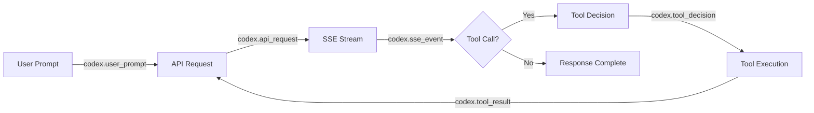
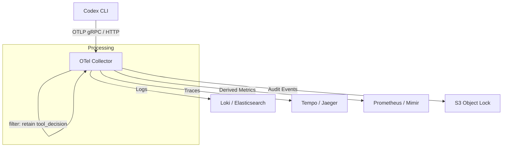

# Codex CLI OpenTelemetry Observability: Monitoring Agent Sessions, Token Spend, and Tool Decisions in Production


---

Codex CLI ships with built-in OpenTelemetry (OTel) instrumentation that exports traces, logs, and token-level metrics via OTLP [^1]. Unlike bolt-on wrappers, this telemetry is part of the Rust core — implemented in a dedicated `codex-telemetry` crate behind a compile-time `otel` feature flag [^2]. Every API call, tool decision, and streaming event is captured as a structured log event with stable, documented attributes, giving teams the same observability over their AI coding agents that they already expect from microservices.

This article walks through the configuration, the event schema, practical dashboards, and production hardening patterns for Codex CLI telemetry.

## Why Observability Matters for Coding Agents

Traditional CLI tools are fire-and-forget. Coding agents are not. A single Codex session can span dozens of model round-trips, execute shell commands, read and write files, and burn through tens of thousands of tokens — all within a conversation that may last hours. Without observability you are flying blind on:

- **Cost attribution** — which projects, teams, or workflows consume the most tokens?
- **Failure diagnosis** — did the session stall because the API returned a 429, or because the sandbox blocked a tool call?
- **Security auditing** — which tool invocations were approved by config versus by user interaction?
- **Performance tuning** — where is latency hiding: in model inference, tool execution, or streaming overhead?

## Enabling the OTel Exporter

Telemetry export is disabled by default and requires opt-in via `~/.codex/config.toml` [^3]. The `[otel]` table supports two exporter protocols — HTTP and gRPC — plus a handful of behavioural knobs:

```toml
[otel]
environment = "production"       # tag for deployment env; defaults to "dev"
log_user_prompt = false          # redact prompt content by default

[otel.exporter.otlp-http]
endpoint = "http://otel-collector:4318/v1/logs"
protocol = "binary"
headers = { "x-otlp-api-key" = "${OTLP_TOKEN}" }

[otel.trace_exporter.otlp-http]
endpoint = "http://otel-collector:4318/v1/traces"
protocol = "binary"
```

For gRPC:

```toml
[otel.exporter.otlp-grpc]
endpoint = "https://otel-collector:4317"
headers = { "x-otlp-meta" = "abc123" }

[otel.trace_exporter.otlp-grpc]
endpoint = "https://otel-collector:4317"
```

Standard OTel environment variables work too, which is useful for CI where you do not want to commit secrets into config files [^4]:

```bash
export OTEL_RESOURCE_ATTRIBUTES="env=production,department=engineering,team.id=platform"
```

### Grafana Cloud Shortcut

Grafana Cloud provides a one-click Codex integration with three prebuilt dashboards — **Overview**, **Usage**, and **Performance** — covering session counts, API latency percentiles, and tool invocation breakdowns [^5]. Point both the log and trace exporters at your Grafana OTLP endpoints with a base64-encoded `instanceId:token` in the `Authorization` header, restart Codex, and data appears within minutes.

## The Event Schema

Codex treats its OTel events as a stable contract rather than an implementation detail [^2]. The following event types are emitted:

### Common Attributes

Every event carries a shared set of resource and log attributes [^1] [^4]:

| Attribute | Description |
|---|---|
| `service.name` | Always `codex_cli_rs` |
| `app.version` | CLI version string |
| `env` | The `environment` value from config |
| `conversation.id` | Unique session identifier |
| `model` | Active model slug (e.g. `gpt-5.5`) |
| `slug` | Operation slug |
| `auth_mode` | Authentication method |
| `terminal.type` | Terminal emulator detected |
| `user.account_id` | OpenAI account identifier |

### Event Types



| Event | Key Attributes | Notes |
|---|---|---|
| `codex.conversation_starts` | provider, reasoning effort, context window, approval policy, sandbox mode | Emitted once per session |
| `codex.api_request` | attempt number, duration, HTTP status, error message | Includes retry attempts |
| `codex.sse_event` | event kind, `input_token_count`, `output_token_count`, `cached_token_count`, `reasoning_token_count`, `tool_token_count` | Per-stream granularity [^4] |
| `codex.user_prompt` | prompt length, content (redacted by default) | Opt-in via `log_user_prompt` |
| `codex.tool_decision` | tool name, decision (approved/denied/aborted), decision source (config vs user) | Critical for security audits [^2] |
| `codex.tool_result` | execution duration, success status, output details | Links back to the triggering decision |

### Trace Structure

Codex wraps each session in a top-level `session_loop` span [^1]. Child spans cover individual API calls and tool executions, giving you a Gantt-chart view of exactly where time is spent in each agent turn:

```mermaid
gantt
    title Codex Session Trace — Single Turn
    dateFormat X
    axisFormat %s

    section API
    api_request (attempt 1)       :0, 3
    sse_stream                    :3, 8

    section Tool
    tool_decision (shell_exec)    :8, 9
    tool_execution                :9, 12

    section API
    api_request (follow-up)       :12, 15
    sse_stream                    :15, 19
```



## Building a Token-Spend Dashboard

The five token counters on `codex.sse_event` — `input_token_count`, `output_token_count`, `cached_token_count`, `reasoning_token_count`, and `tool_token_count` — give you everything needed for cost attribution [^4]. A minimal Grafana panel query using Loki:

```
sum by (model) (
  rate({service_name="codex_cli_rs"} | json | event_name="codex.sse_event"
    | unwrap output_token_count [5m])
)
```

Pair this with a lookup table of per-model pricing and you have real-time cost-per-team visibility. For organisations using multiple models (e.g. `gpt-5.5` for complex tasks, `o4-mini` for fast iterations), this breakdown reveals whether the model-selection strategy is actually saving money.

### Alerting on Runaway Sessions

A session that exceeds its expected token budget is either exploring productively or stuck in a loop. A simple alert rule:


```yaml
# Grafana alert rule — fires when a single session
# exceeds 500k output tokens in 30 minutes
- alert: CodexSessionTokenRunaway
  expr: |
    sum by (conversation_id) (
      increase({service_name="codex_cli_rs"}
        | json | event_name="codex.sse_event"
        | unwrap output_token_count [30m])
    ) > 500000
  for: 5m
  labels:
    severity: warning
  annotations:
    summary: "Codex session {{ $labels.conversation_id }} exceeded 500k output tokens in 30m"
```


## Security Auditing with Tool Decisions

The `codex.tool_decision` event records whether each tool invocation was approved or denied, and crucially, whether the approval came from a config-level policy or from interactive user consent [^2]. This distinction matters for compliance: an organisation can prove that no shell command ran in production without either a matching `guardian_approval` rule or an explicit human click.

A simple query to surface all user-approved shell commands in the last 24 hours:

```
{service_name="codex_cli_rs"} | json
  | event_name="codex.tool_decision"
  | decision="approved"
  | decision_source="user"
  | tool_name="shell_exec"
```

For teams operating under SOC 2 or similar frameworks, exporting these events to an immutable log store (e.g. S3 with Object Lock) provides a tamper-proof audit trail of every autonomous action the agent attempted.

## Production Hardening

### Sampling Strategy

In a team of 50 engineers each running several Codex sessions daily, unsampled telemetry generates substantial volume. Recommendations [^4]:

- **Probabilistic sampling at 10%** for routine monitoring — set via your OTel Collector's `probabilistic_sampler` processor.
- **Tail-based sampling** to retain 100% of error traces and slow requests while downsampling the rest.
- **Always retain** `codex.tool_decision` events at 100% — these are low-volume and high-value for auditing.

### Prompt Redaction

The `log_user_prompt` flag defaults to `false`, which means prompt content is replaced with a length indicator [^3]. Keep it off in production unless you have explicit data-handling consent from your developers. Even with it enabled, consider running an OTel Collector `transform` processor to strip sensitive patterns before storage.

### Known Limitations

Two gaps worth noting as of v0.125.0 [^6]:

1. **No metrics in `codex exec` mode** — the non-interactive execution path does not emit OTel metrics, only logs. Derive metrics from log data if you need `codex exec` coverage.
2. **No telemetry in `codex mcp-server` mode** — when Codex runs as an MCP server for other agents, telemetry is not emitted. This is a tracked limitation.

## Architecture: Collector Pipeline

For production deployments, run an OTel Collector as a sidecar or daemon that receives from Codex, applies sampling and transformation, then fans out to your backends:



This architecture decouples Codex from your storage backends, lets you swap Grafana for Datadog or SigNoz without touching developer machines, and gives you a single place to enforce redaction and sampling policies.

## Comparing Agent Observability

Codex CLI's approach sits in the middle of the spectrum [^6]:

| Capability | Codex CLI | Claude Code | Gemini CLI |
|---|---|---|---|
| Traces | Yes (OTLP) | No | Google Cloud only |
| Logs | Yes (OTLP) | Basic file logs | Google Cloud Logging |
| Metrics | Derived from logs | No | Prebuilt dashboard |
| Token breakdown | 5-way split | Total only | Input/output |
| Tool-decision audit | Yes | No | No |
| Prompt redaction | Config flag | N/A | N/A |

The five-way token split (`input`, `output`, `cached`, `reasoning`, `tool`) is particularly valuable — it lets you see exactly how much of your spend goes to chain-of-thought reasoning versus actual code generation.

## Getting Started in Five Minutes

For a quick local setup using Docker Compose with Grafana, Loki, and Tempo:

```bash
# 1. Clone the community observability stack
git clone https://github.com/grafana/docker-otel-lgtm.git
cd docker-otel-lgtm && docker compose up -d

# 2. Configure Codex
cat >> ~/.codex/config.toml << 'EOF'

[otel]
environment = "local"
log_user_prompt = true

[otel.exporter.otlp-http]
endpoint = "http://localhost:4318/v1/logs"
protocol = "binary"

[otel.trace_exporter.otlp-http]
endpoint = "http://localhost:4318/v1/traces"
protocol = "binary"
EOF

# 3. Run a Codex session and check Grafana at http://localhost:3000
codex "refactor the auth module to use dependency injection"
```

Within seconds you will see `codex.conversation_starts`, `codex.api_request`, and subsequent events flowing into Grafana's Explore view.

## Conclusion

Codex CLI's built-in OpenTelemetry support transforms AI coding agents from opaque black boxes into observable, auditable systems. The stable event contract — with five-way token attribution, tool-decision provenance, and configurable prompt redaction — gives platform teams the primitives they need for cost control, security compliance, and performance optimisation. With Grafana Cloud's prebuilt dashboards or a self-hosted collector stack, you can go from zero to full observability in under ten minutes.

The remaining gaps — no metrics in `codex exec` mode and no telemetry in MCP server mode — are worth tracking, but for interactive and app-server workflows the coverage is already production-grade.

## Citations

[^1]: [OpenAI Codex Observability & Monitoring with OpenTelemetry — SigNoz](https://signoz.io/docs/codex-monitoring/)
[^2]: [OpenTelemetry events PR #2103 — openai/codex on GitHub](https://github.com/openai/codex/pull/2103)
[^3]: [Advanced Configuration — Codex CLI — OpenAI Developers](https://developers.openai.com/codex/config-advanced)
[^4]: [Vibe Coding Tools Observability with VictoriaMetrics Stack and OpenTelemetry — VictoriaMetrics](https://victoriametrics.com/blog/vibe-coding-observability/)
[^5]: [OpenAI Codex Integration — Grafana Cloud Documentation](https://grafana.com/docs/grafana-cloud/monitor-infrastructure/integrations/integration-reference/integration-openai-codex/)
[^6]: [Coding Agent Observability for Your Team — base14 Scout](https://docs.base14.io/blog/coding-agent-observability/)
