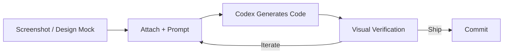
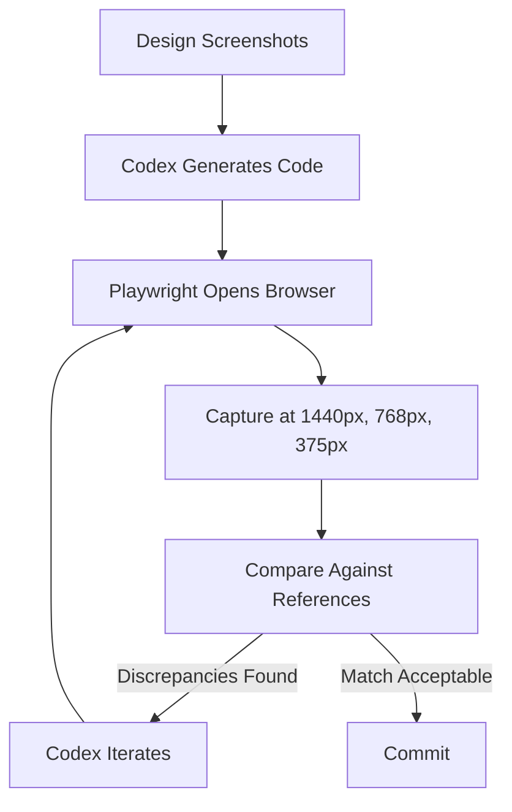

# Rapid Prototyping with Codex CLI: From Screenshot to Working Application


---

Design handoff has always been a bottleneck. Designers produce pixel-perfect mocks; developers spend hours interpreting spacing tokens and hover states from static exports. Codex CLI's multimodal image capabilities — combined with the Playwright interactive skill and the in-app browser — collapse that cycle from hours to minutes. This article walks through the complete screenshot-to-working-application workflow, covering image input methods, prompt engineering for visual fidelity, live iteration patterns, and the verification loop that keeps output honest.

## The Prototyping Pipeline

The workflow follows a four-stage pipeline that maps directly to OpenAI's official prototyping workflow documentation[^1].



Each stage has specific tooling and configuration requirements. Getting them right up front avoids the most common failure mode: Codex generating a plausible-looking component that diverges from the design in subtle but costly ways.

## Attaching Images to Prompts

Codex CLI accepts PNG and JPEG inputs through three mechanisms[^2]:

```bash
# Flag-based attachment (single or multiple images)
codex -i screenshot.png "Implement this dashboard"
codex --image desktop.png,mobile.png "Build responsive layout"

# Drag-and-drop into the TUI
# Drag the file from your file manager into the terminal window

# Paste from clipboard
# Cmd+V (macOS) or Ctrl+V (Linux/Windows) inside the TUI
```

For multi-state designs, comma-separated files via `--image` are the most reliable method. Providing desktop, mobile, hover, and empty states in a single prompt gives Codex the complete picture[^3]. The official use-case documentation notes that "a single screenshot can be enough for a narrow task, but the handoff gets better when you include multiple states"[^3].

## Crafting the Initial Prompt

The prompt structure matters more than most developers expect. A bare "build this" attached to a screenshot produces generic output. The official workflow documentation recommends specifying three categories of constraint[^1]:

1. **Framework and tooling** — React, Vue, Svelte; bundler; CSS approach
2. **Layout fidelity** — spacing, typography, colour tokens to match
3. **Deliverables** — routes, components, README, dev server instructions

Here is a practical example adapted from the official Codex workflows page[^1]:

```text
Create a new dashboard page based on this image.

Constraints:
- Use React, Vite, and Tailwind CSS. Write all code in TypeScript.
- Match spacing, typography, and layout hierarchy as closely as possible.
- Reuse existing design system components and tokens from src/components/.
- Do NOT invent a parallel component system.

Deliverables:
- A new route at /dashboard that renders the UI
- Any small components needed, placed in src/components/dashboard/
- Updated router configuration
- README section with instructions to run locally
```

The instruction to reuse existing components is critical. Without it, Codex tends to create standalone styled elements that duplicate your design system[^3]. The responsive frontend designs guide explicitly warns: "Codex works best when the target repo already has a clear component layer"[^3].

### Non-Obvious Behaviours

Screenshots encode layout but not interaction. Always specify in text[^1]:

- Hover and focus states
- Form validation rules
- Keyboard navigation requirements
- Loading and empty-state behaviour
- Animation or transition expectations

## Model Selection for Prototyping

Model choice affects both quality and speed. As of April 2026, the relevant options are[^4][^5]:

| Model | Best For | Speed | Context |
|---|---|---|---|
| GPT-5.5 | Complex multi-file prototypes, design system integration | Moderate | 1M tokens |
| GPT-5.4 | General prototyping, good balance | Moderate | 1M tokens |
| GPT-5.3-Codex-Spark | Rapid iteration, small component tweaks | >1,000 tok/s | 128K tokens |

For the initial scaffold, GPT-5.5 or GPT-5.4 produce more accurate layout interpretations[^4]. Once the structure is in place and you are iterating on spacing and colour, switching to Codex-Spark via `/model gpt-5.3-codex-spark` gives near-instant feedback at 15× the speed of the standard model[^5].

```bash
# Start with the flagship for structural accuracy
codex --model gpt-5.5 -i mock.png "Build the dashboard page..."

# Switch mid-session for rapid iteration
/model gpt-5.3-codex-spark
```

## The Live Iteration Loop

Once Codex generates the initial scaffold, the real productivity gain comes from the tight iteration cycle. The official "Iterate on UI with live updates" workflow[^1] prescribes a two-terminal pattern:

**Terminal 1 — Dev server:**

```bash
npm run dev
# or: pnpm dev / yarn dev / bunx vite
```

**Terminal 2 — Codex CLI:**

```bash
codex
```

With the dev server running and hot module replacement active, every file Codex writes triggers an immediate browser refresh. The workflow becomes conversational:

```text
> Propose 2-3 styling improvements for the dashboard header.

[Codex suggests changes]

> Apply option 2. Also increase the card border-radius to match
  the design — the screenshot shows 12px, not 8px.

[Codex edits the file; browser refreshes]

> The sidebar width is 280px in the screenshot but you've set 256px.
  Fix that and ensure the main content area fills the remaining space.
```

### Commit Early, Revert Freely

The official documentation recommends committing changes you like immediately and reverting those you do not[^1]. Crucially, if you revert a change, tell Codex — otherwise it may overwrite your reversion on the next edit:

```text
> I reverted the last change to the sidebar. The original padding
  was better. Do not change sidebar padding again.
```

## Visual Verification with Playwright

For designs that must match screenshots at multiple breakpoints, the Playwright interactive skill closes the verification loop[^3]. When the skill is installed, Codex can open the running application in a real browser, capture screenshots at specified viewport widths, and compare them against the original design references.



To activate this workflow, include the Playwright skill in your prompt[^3]:

```text
$playwright

Compare the current /dashboard route against the attached screenshots
at 1440px, 768px, and 375px widths. List any discrepancies in spacing,
colour, or layout, then fix the top 3 most visible issues.
```

This is particularly powerful for responsive layouts where manual browser resizing is tedious and error-prone.

## The In-App Browser (Codex App)

For developers using the Codex desktop application rather than the CLI directly, the in-app browser provides an even tighter feedback loop[^6]. Codex can operate the browser to navigate to local development URLs, take screenshots, click elements, and verify rendered output — all within the same window.

The browser supports[^6]:

- Local development servers (`localhost:3000`, `localhost:5173`, etc.)
- File-backed pages (`file://` URLs)
- Public pages that do not require authentication

To use it, simply ask Codex to check the browser after making changes:

```text
Start the dev server and open http://localhost:5173/dashboard
in the browser. Compare what you see against the attached screenshot
and fix any differences.
```

## Figma MCP Integration

For teams with a Figma-based design workflow, the Figma MCP server provides programmatic access to design tokens, layout properties, and component structures[^7]. Rather than exporting screenshots manually, you can point Codex directly at a Figma frame:

1. Right-click a frame in Figma → **Copy as** → **Copy link to selection**
2. Pass the link to Codex:

```text
Help me implement this Figma design in code. Use my existing
design system components.

Figma link: https://www.figma.com/file/abc123/Dashboard?node-id=42:1337
```

The MCP server's `get_design_context` tool extracts layout, styles, and component metadata[^7], giving Codex structured data rather than pixel inference. This produces significantly more accurate spacing and colour values than screenshot-only workflows.

### Bidirectional Flow

The Figma integration also supports code-to-canvas conversion[^7]. After Codex generates your UI, you can ask it to push the rendered result back into Figma as editable frames using the `generate_figma_design` tool — useful for design review cycles where stakeholders work exclusively in Figma.

## Common Pitfalls and Mitigations

### 1. Parallel Component Systems

**Problem:** Codex creates new `Card`, `Button`, and `Input` components instead of using your existing ones.

**Mitigation:** Explicitly reference your component directory and include the constraint "Do NOT create new primitive components"[^3].

### 2. Hardcoded Dimensions

**Problem:** Codex matches the screenshot pixel-perfectly at one breakpoint but breaks at others.

**Mitigation:** Provide multiple viewport screenshots and specify responsive behaviour explicitly. Use the Playwright verification loop to catch breakpoint regressions.

### 3. Missing Interaction States

**Problem:** The prototype looks right but hover, focus, and active states are absent.

**Mitigation:** Include interaction state screenshots where possible. Where you cannot, describe states in text with specific CSS values[^1].

### 4. Image Generation Cost

**Problem:** Turns involving `$imagegen` or gpt-image-2 consume credits 3–5× faster than text-only turns[^2].

**Mitigation:** Use image generation only for asset creation (icons, illustrations), not for verification screenshots. Use Playwright for visual comparison instead.

## A Complete Prototyping Session

Putting it all together, here is a realistic session flow:

```bash
# 1. Start with design references
codex --model gpt-5.5 \
  --image specs/dashboard-desktop.png,specs/dashboard-mobile.png \
  "Build a responsive dashboard page. Use React, Vite, Tailwind, TypeScript.
   Reuse components from src/components/ui/. Match the layout precisely.
   Create a /dashboard route. Include instructions to run locally."

# 2. Codex scaffolds the page, installs dependencies, configures routing

# 3. Start the dev server in another terminal
npm run dev

# 4. Switch to Spark for rapid iteration
/model gpt-5.3-codex-spark

# 5. Iterate on specifics
> The card grid should be 3 columns on desktop, 2 on tablet, 1 on mobile.
  The screenshot shows 24px gap between cards, not 16px.

# 6. Verify with Playwright
$playwright
Compare /dashboard against the attached screenshots at 1440px, 768px,
and 375px. List discrepancies and fix the top 5.

# 7. Commit when satisfied
> Commit these changes with message "feat: add dashboard page from design spec"
```

## Conclusion

The screenshot-to-code workflow in Codex CLI is not a party trick — it is a legitimate prototyping accelerator when used with the right prompt structure, model selection, and verification tooling. The combination of multimodal image input, the Playwright skill for automated visual comparison, and Codex-Spark for rapid iteration creates a feedback loop that is materially faster than traditional design handoff. The key is treating Codex as a collaborator that needs explicit constraints, not a mind-reader that infers your design system from a single screenshot.

## Citations

[^1]: OpenAI, "Workflows – Codex," OpenAI Developers, 2026. [https://developers.openai.com/codex/workflows](https://developers.openai.com/codex/workflows)

[^2]: OpenAI, "Features – Codex CLI," OpenAI Developers, 2026. [https://developers.openai.com/codex/cli/features](https://developers.openai.com/codex/cli/features)

[^3]: OpenAI, "Build responsive front-end designs – Codex use cases," OpenAI Developers, 2026. [https://developers.openai.com/codex/use-cases/frontend-designs](https://developers.openai.com/codex/use-cases/frontend-designs)

[^4]: OpenAI, "Models – Codex," OpenAI Developers, 2026. [https://developers.openai.com/codex/models](https://developers.openai.com/codex/models)

[^5]: OpenAI, "Introducing GPT-5.3-Codex-Spark," OpenAI, February 2026. [https://openai.com/index/introducing-gpt-5-3-codex-spark/](https://openai.com/index/introducing-gpt-5-3-codex-spark/)

[^6]: OpenAI, "In-app browser – Codex app," OpenAI Developers, 2026. [https://developers.openai.com/codex/app/browser](https://developers.openai.com/codex/app/browser)

[^7]: OpenAI, "Building frontend UIs with Codex and Figma," OpenAI Developers Blog, 2026. [https://developers.openai.com/blog/building-frontend-uis-with-codex-and-figma](https://developers.openai.com/blog/building-frontend-uis-with-codex-and-figma)
