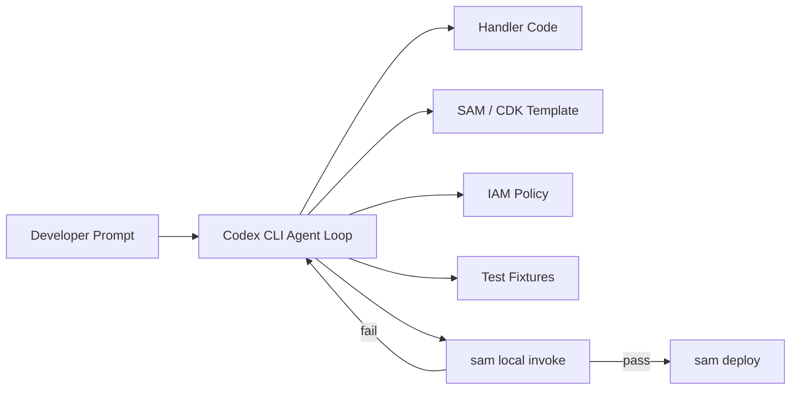
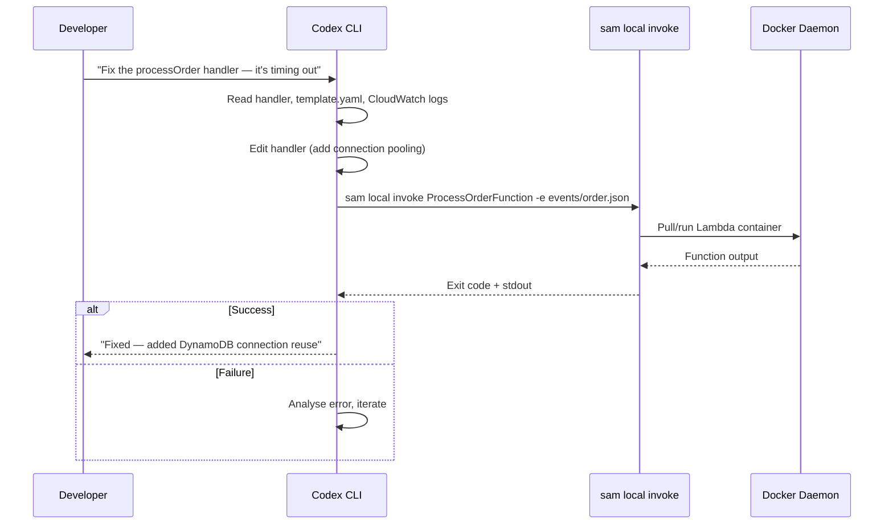

# Codex CLI for Serverless Teams: AWS Lambda, SAM, CDK, and Agent Plugin Workflows


---

Serverless development has a peculiar shape: functions are small, but the surrounding configuration — IAM roles, event source mappings, API Gateway routes, Step Functions state machines — dwarfs the business logic. This makes serverless codebases ideal territory for agentic coding. Codex CLI can scaffold a Lambda handler in seconds, but the real value emerges when it manages the SAM templates, CDK constructs, and deployment pipelines that tie everything together.

This article covers how to configure Codex CLI for serverless teams building on AWS Lambda with SAM and CDK, including the new AWS Agent Plugin for Serverless that packages best-practice guidance directly into the agent loop.

## The Serverless Agent Opportunity

A typical Lambda microservice comprises a handler file, a SAM `template.yaml` or CDK stack, IAM policies, environment variable configuration, event source bindings, and test fixtures. Changing one piece usually requires coordinated edits across three or four files[^1]. This is precisely the kind of multi-file, configuration-heavy workflow where coding agents excel.



With Codex CLI v0.125.0 and GPT-5.5, the agent can reason across all these files simultaneously, run `sam local invoke` to validate changes, and iterate until the function passes[^2][^3].

## AGENTS.md for Serverless Projects

A well-structured `AGENTS.md` is the single highest-leverage investment for serverless teams. Here is a practical template:

```markdown
# AGENTS.md — Serverless Project

## Architecture
- AWS Lambda functions in `src/handlers/`
- Shared utilities in `src/lib/`
- SAM template at `template.yaml` (or CDK stacks in `infra/`)
- Tests in `tests/unit/` and `tests/integration/`

## Conventions
- Runtime: Node.js 22.x (or Python 3.13)
- Handler signature: `export const handler = async (event, context) => {}`
- One function per file; file name matches logical function name
- Environment variables defined in SAM template, never hard-coded
- IAM policies follow least-privilege; never use `*` resource

## Build & Test
- `sam build` compiles all functions
- `sam local invoke FunctionName -e events/event.json` runs locally
- `npm test` runs unit tests with vitest
- `sam validate` checks template syntax

## Deployment
- `sam deploy --config-env dev` for development
- Never deploy to production without CI pipeline approval

## Gotchas
- Lambda cold starts: prefer ESM, minimise dependencies, use layers
- Always include `X-Ray` tracing configuration
- API Gateway timeout is 29 seconds; long-running work goes to Step Functions
```

This gives the agent enough context to make correct decisions about file placement, testing commands, and deployment safety without over-constraining its approach[^4].

## config.toml: Sandbox Settings for SAM Local

Serverless development needs network access for `sam local invoke` (which pulls Docker images) and for AWS SDK calls during integration tests. The default Codex sandbox blocks outbound network — you need to enable it selectively:

```toml
[model]
default = "gpt-5.5"
reasoning_effort = "medium"

[sandbox_workspace_write]
network_access = true
additional_writable_roots = ["/tmp", "~/.aws-sam"]

[hooks.pre_tool_use.sam_validate]
match_tools = ["Bash"]
match_commands = ["sam deploy"]
command = "sam validate"
timeout_ms = 10000
on_failure = "stop"
status_message = "Validating SAM template..."
```

The `network_access = true` setting allows `sam local invoke` to communicate with the local Docker daemon and pull container images[^5]. The `additional_writable_roots` entry for `~/.aws-sam` ensures the SAM build cache is accessible. The pre-tool-use hook intercepts any `sam deploy` command and runs `sam validate` first — preventing malformed templates from reaching AWS[^6].

### Permission Profile for Serverless Work

For teams using permission profiles, a serverless-specific profile balances safety with the access patterns Lambda development demands:

```toml
[permissions.serverless]
filesystem_write = ["src/", "tests/", "template.yaml", "infra/", "events/"]
filesystem_deny_read = [".env.production", "*.pem", "*.key"]
network = true
```

This permits writes to source, test, and template directories whilst blocking access to production secrets and private keys[^5].

## Installing the AWS Serverless Agent Plugin

In March 2026, AWS released the Agent Plugin for AWS Serverless — part of the broader `awslabs/agent-plugins` collection[^7]. The plugin packages skills, sub-agents, hooks, and MCP servers into a single modular unit, providing structured guidance for Lambda, API Gateway, EventBridge, Step Functions, and durable functions[^8].

### Codex CLI Installation

For Codex, installation uses the repo-local marketplace pattern. Create a `.agents/plugins/marketplace.json` in your repository root:

```json
{
  "marketplaces": [
    {
      "name": "awslabs",
      "url": "https://github.com/awslabs/agent-plugins"
    }
  ],
  "plugins": [
    {
      "source": "awslabs/aws-serverless",
      "enabled": true
    }
  ]
}
```

Then open the project in Codex CLI. Codex discovers the marketplace file at startup and loads the plugin's skills and MCP configuration[^9]. The plugin includes:

- **Lambda function scaffolding** — creates handlers with correct event signatures for API Gateway, EventBridge, Kinesis, and SQS triggers
- **SAM and CDK deployment workflows** — guides the agent through `sam build`, `sam local invoke`, and `sam deploy` sequences
- **SAM template validation hooks** — catches common template errors before deployment
- **Lambda durable functions** — checkpoint-replay patterns for long-running orchestration
- **Troubleshooting quick reference** — common error patterns and resolution steps packaged in the SKILL.md entry point[^7]

### Additional AWS Plugins Worth Installing

The `awslabs/agent-plugins` repository includes several complementary plugins for serverless teams[^9]:

| Plugin | Use Case |
|--------|----------|
| `aws-serverless` | Lambda, API Gateway, Step Functions, SAM/CDK |
| `deploy-on-aws` | Architecture recommendations, cost estimates, IaC deployment |
| `databases-on-aws` | DynamoDB schema design, Aurora DSQL, multi-tenant patterns |
| `aws-amplify` | Full-stack apps with auth, data, storage, and functions |

## Practical Workflows

### Scaffold a New Lambda Function

```bash
codex "Add a new Lambda function called processOrder that:
  - Triggers from an SQS queue named order-events
  - Validates the order payload against the OrderSchema
  - Writes to DynamoDB table Orders
  - Includes unit tests and a sample event file
  - Updates template.yaml with the function, IAM policy, and event source"
```

Codex creates the handler, test file, sample event JSON, and SAM template entries in a single pass. With the AWS serverless plugin loaded, it follows Lambda best practices for error handling, structured logging, and IAM scoping[^7].

### Local Testing Loop

The most productive serverless workflow combines Codex with `sam local invoke` in a tight feedback loop:



For this to work, Docker must be running and the sandbox needs `network_access = true`[^5]. The agent reads the error output from `sam local invoke`, adjusts the code, and retries — typically resolving issues within two or three iterations.

### CDK Stack Generation

For teams using AWS CDK rather than SAM, Codex generates type-safe infrastructure alongside application code:

```bash
codex "Create a CDK stack in infra/order-service-stack.ts that:
  - Defines the processOrder Lambda with Node.js 22 runtime
  - Creates an SQS queue with a dead-letter queue (maxReceiveCount: 3)
  - Wires the queue as an event source for the Lambda
  - Grants DynamoDB read/write to the Orders table
  - Outputs the queue URL and function ARN"
```

CDK's TypeScript constructs give the agent strong type checking — the CDK compiler catches errors that would be silent in YAML templates[^10].

### Headless CI Integration

`codex exec` slots into CI pipelines for automated serverless review and deployment preparation:

```bash
codex exec --json \
  --approval-mode full-auto \
  "Review the SAM template for security issues:
   - Check for overly broad IAM policies
   - Verify all Lambdas have X-Ray tracing enabled
   - Confirm environment variables don't contain secrets
   - Validate API Gateway has throttling configured
   Output findings as a JSON array of {severity, resource, issue, fix}"
```

The `--json` flag (enhanced in v0.125.0) reports reasoning-token usage alongside the review output, enabling cost tracking per CI run[^2].

## Cold Start Optimisation with Codex

Lambda cold starts remain a practical concern, particularly for user-facing APIs. Codex can systematically address cold start contributors:

```bash
codex "Analyse all Lambda functions in this project for cold start issues:
  - Check bundle sizes and suggest tree-shaking improvements
  - Identify heavy imports that could move to Lambda layers
  - Recommend ESM migration where CommonJS is used
  - Add SnapStart configuration for Java functions
  - Suggest provisioned concurrency settings for latency-critical functions"
```

The agent audits `package.json` dependencies, checks for dynamic `require()` patterns, and updates SAM template configurations — addressing cold starts at both the code and infrastructure layers[^1].

## Step Functions Orchestration

For workflows that exceed Lambda's 15-minute execution limit, Step Functions is the standard approach. Codex handles the state machine definition alongside the Lambda handlers:

```bash
codex "Create a Step Functions workflow for order processing:
  - ValidateOrder → ProcessPayment → FulfilOrder → SendConfirmation
  - Add error handling with retry and catch for each step
  - Create the ASL definition in statemachine/order-workflow.asl.json
  - Wire it into template.yaml with appropriate IAM roles"
```

The Amazon States Language (ASL) definition is verbose JSON that benefits enormously from agent generation — the agent produces syntactically correct ASL with proper error handling patterns whilst maintaining consistency with the Lambda handlers it references[^8].

## Testing Strategy

### Unit Tests with Mocked Services

```bash
codex "Generate comprehensive unit tests for processOrder:
  - Mock DynamoDB using aws-sdk-client-mock
  - Mock SQS using the same library
  - Test happy path, validation failure, DynamoDB throttling, and malformed input
  - Use vitest with the standard project configuration"
```

### Integration Tests with SAM Local

```bash
codex "Create an integration test script that:
  - Starts sam local start-lambda in the background
  - Runs integration tests against the local Lambda endpoint
  - Uses the AWS SDK to invoke functions via the local endpoint
  - Tears down the local environment after tests complete"
```

SAM's `start-lambda` command creates a local endpoint that emulates the Lambda invoke API, enabling realistic integration testing without deploying to AWS[^11].

## Model Selection for Serverless Tasks

| Task | Recommended Model | Reasoning Effort |
|------|-------------------|-----------------|
| Handler scaffolding | GPT-5.3-Codex-Spark | Low |
| SAM/CDK template generation | GPT-5.5 | Medium |
| IAM policy review | GPT-5.5 | High |
| Step Functions ASL generation | GPT-5.5 | Medium |
| Cold start analysis | GPT-5.5 | High |
| Unit test generation | GPT-5.3-Codex-Spark | Low |

Use `Alt+,` and `Alt+.` in the TUI to adjust reasoning effort dynamically as you move between tasks[^12]. Spark's 1,000+ tokens/second makes it ideal for rapid scaffolding, whilst GPT-5.5's deeper reasoning handles security review and complex orchestration patterns[^3].

## Common Pitfalls

| Pitfall | Cause | Fix |
|---------|-------|-----|
| Agent uses `*` in IAM Resource | Insufficient AGENTS.md guidance | Add explicit "never use * resource" rule |
| `sam local invoke` fails in sandbox | Network blocked by default | Set `network_access = true` in config.toml |
| Agent hard-codes environment variables | Missing convention documentation | Document env var pattern in AGENTS.md |
| CDK synth fails silently | Agent doesn't run `cdk synth` | Add post_tool_use hook for CDK validation |
| Agent deploys to production | No deployment guardrails | Use hooks to block `--config-env prod` in `sam deploy` |

## Conclusion

Serverless development's configuration-heavy, multi-file nature makes it a natural fit for agentic coding. With a well-structured `AGENTS.md`, appropriate sandbox configuration, and the AWS Serverless Agent Plugin loaded, Codex CLI handles the full lifecycle from function scaffolding through local testing to deployment preparation — letting your team focus on business logic rather than YAML wrangling.

## Citations

[^1]: [AWS SAM Documentation — Building Serverless Applications](https://docs.aws.amazon.com/serverless-application-model/latest/developerguide/) — AWS. Official SAM developer guide covering template structure, local testing, and deployment.
[^2]: [Codex CLI Changelog — v0.125.0](https://developers.openai.com/codex/changelog) — OpenAI. Release notes for v0.125.0 including `codex exec --json` reasoning-token reporting.
[^3]: [Introducing GPT-5.5 — OpenAI](https://openai.com/index/introducing-upgrades-to-codex/) — OpenAI. GPT-5.5 announcement with Codex integration details.
[^4]: [Custom Instructions with AGENTS.md — Codex Developer Docs](https://developers.openai.com/codex/guides/agents-md) — OpenAI. Official guide to writing effective AGENTS.md files.
[^5]: [Codex CLI Sample Configuration](https://developers.openai.com/codex/config-sample) — OpenAI. Reference config.toml with sandbox, network, and hook settings.
[^6]: [Codex CLI Hooks — Stable in v0.124.0](https://developers.openai.com/codex/changelog) — OpenAI. Hooks now configurable inline in config.toml, observing MCP tools and Bash sessions.
[^7]: [Agent Plugins for AWS — awslabs/agent-plugins](https://github.com/awslabs/agent-plugins) — AWS. Open-source repository of agent plugins including aws-serverless.
[^8]: [Accelerate AI-Assisted Development with Agent Plugin for AWS Serverless](https://aws.amazon.com/about-aws/whats-new/2026/03/agent-plugin-aws-serverless/) — AWS. March 2026 announcement of the serverless agent plugin.
[^9]: [Agent Plugins for AWS — Installation Guide](https://github.com/awslabs/agent-plugins#installation) — AWS. Instructions for installing plugins in Codex, Claude Code, and Cursor.
[^10]: [AWS CDK Developer Guide — Lambda Constructs](https://docs.aws.amazon.com/cdk/v2/guide/work-with-cdk-typescript.html) — AWS. CDK TypeScript reference for Lambda and related constructs.
[^11]: [Introduction to Testing with sam local start-lambda](https://docs.aws.amazon.com/serverless-application-model/latest/developerguide/using-sam-cli-local-start-lambda.html) — AWS. Local Lambda endpoint for integration testing.
[^12]: [Codex CLI v0.124.0 Release — TUI Reasoning Controls](https://github.com/openai/codex/releases/tag/rust-v0.124.0) — OpenAI. Alt+, and Alt+. shortcuts for dynamic reasoning effort adjustment.
