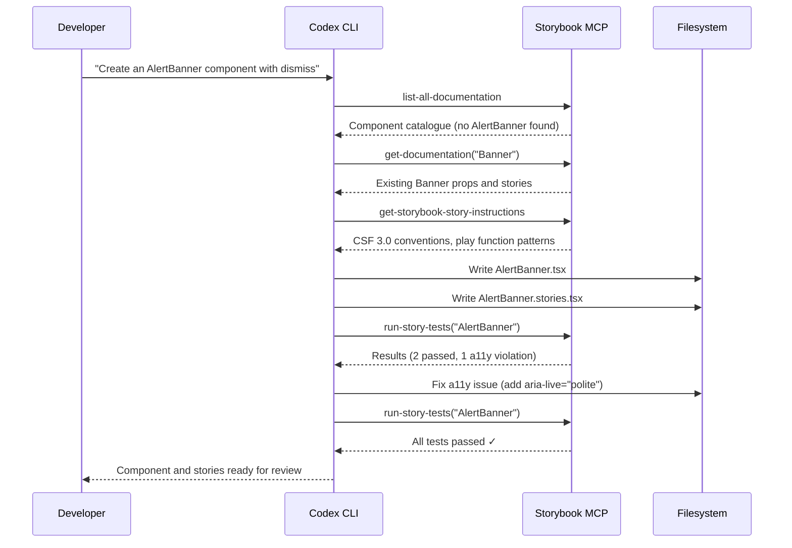
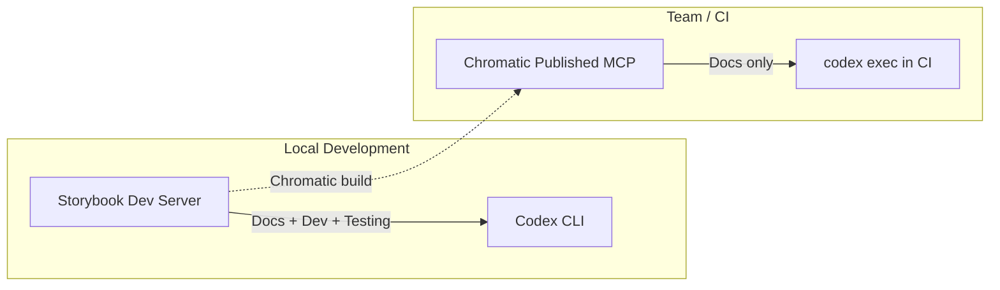

# Codex CLI and Storybook MCP: Agent-Driven Component Development, Story Generation, and Visual Testing


---

Front-end teams spend a disproportionate amount of time on the mechanical parts of component development: writing stories, documenting props, building interaction tests, and maintaining design system consistency. Storybook's official MCP server — shipped in Storybook 10.3 on 23 March 2026 [^1] — gives AI coding agents direct access to your component library's metadata, documentation, and test runner. Paired with Codex CLI, this creates a closed-loop workflow where the agent can discover existing components, generate new ones with matching stories, preview them live, and verify correctness through automated tests — all without leaving the terminal.

This article walks through the full integration: configuring the Storybook MCP server for Codex CLI, structuring AGENTS.md for component-driven workflows, and building a repeatable agent pipeline from component scaffold to visual verification.

## Why Storybook MCP Changes the Agent Game

Before MCP, coding agents hallucinated component props with depressing regularity. They would invent a `shadow` prop on a `Card` component that never existed, or duplicate a `Button` variant that was already in the design system under a slightly different name. The root cause is simple: without access to the component catalogue, the agent is guessing.

Storybook MCP solves this by exposing three toolsets [^2]:

| Toolset | Purpose | Key Tools |
|---------|---------|-----------|
| **Docs** | Component intelligence | `list-all-documentation`, `get-documentation`, `get-documentation-for-story` |
| **Development** | Story authoring and preview | `get-storybook-story-instructions`, `preview-stories` |
| **Testing** | Automated validation | `run-story-tests` |

Early benchmarks with the Reshaped component library showed 12.8% improved code usage, 2.76× faster generation, and 27% fewer tokens consumed compared to baseline approaches without MCP [^1].

## Prerequisites

- **Codex CLI** v0.124+ (hooks stable, MCP support) [^3]
- **Storybook** 10.3+ with `@storybook/addon-mcp` [^1]
- **React project** (Storybook MCP currently supports React only; additional frameworks planned for later 2026) [^2]
- **Node.js** 20+

## Setting Up Storybook MCP for Codex CLI

### Step 1: Install the Storybook MCP Addon

```bash
npx storybook@latest upgrade
npx storybook add @storybook/addon-mcp
```

This registers the MCP server, accessible at `http://localhost:6006/mcp` once Storybook's dev server is running [^2].

### Step 2: Configure Codex CLI

Add the Storybook MCP server to your project's `.codex/config.toml`:

```toml
[mcp_servers.storybook]
transport = "http"
url = "http://localhost:6006/mcp"
```

Verify the connection:

```bash
codex --ask-for-approval never "List all documented components using the Storybook MCP tools."
```

The agent should call `list-all-documentation` and return your component catalogue.

### Step 3: Start Storybook Before Codex

The MCP server requires Storybook's dev server to be running. In a typical workflow:

```bash
# Terminal 1: Start Storybook
npx storybook dev -p 6006

# Terminal 2: Run Codex CLI
codex
```

For CI pipelines, start Storybook in the background:

```bash
npx storybook dev -p 6006 --ci &
sleep 5  # Wait for server to be ready
codex exec "Generate stories for all components missing coverage"
```

## AGENTS.md Template for Component-Driven Development

Place this at the root of your React project:

```markdown
# AGENTS.md

## Project Overview
React component library built with [your framework].
Storybook MCP is available — always use it before working on UI.

## Component Development Rules
1. **CRITICAL**: Never hallucinate component properties. Before using ANY
   property on a component, call `get-documentation` to verify it exists.
2. Before creating a new component, call `list-all-documentation` to check
   whether it already exists in the design system.
3. Follow the conventions returned by `get-storybook-story-instructions`.
4. Every new component MUST have a corresponding `.stories.tsx` file.
5. After writing stories, call `run-story-tests` to validate.

## Story Conventions
- Use CSF 3.0 format (meta + named exports)
- Include at minimum: Default, AllVariants, Interactive, Accessibility
- Add interaction tests for stateful components using `play` functions
- Document props with JSDoc comments, not inline comments

## Verification
- Run `run-story-tests` after creating or modifying any story
- Fix accessibility violations before considering the task complete
- If tests fail, read the error output and iterate

## Testing Commands
- Unit tests: `pnpm test`
- Storybook tests: `pnpm test-storybook`
- Type check: `pnpm tsc --noEmit`
```

## The Agent-Driven Component Workflow

The following sequence shows how Codex CLI uses the Storybook MCP tools to build a component from specification to verified story:



### What Happens at Each Stage

**Discovery** — The agent calls `list-all-documentation` to check whether a similar component exists. This prevents the classic duplication problem where agents create a `NotificationBar` when `Banner` already handles the use case [^2].

**Convention Loading** — `get-storybook-story-instructions` returns the project's current story-writing conventions, including prop selection strategies and interaction test patterns [^2]. This eliminates the need to encode all story conventions in AGENTS.md — Storybook itself becomes the source of truth.

**Generation** — Armed with real component metadata and conventions, the agent writes both the component and its stories. Because it verified actual props via `get-documentation`, hallucinated properties drop dramatically.

**Verification** — `run-story-tests` executes component tests including accessibility checks [^2]. The agent reads failures, fixes them, and re-runs — a genuine red-green-refactor loop driven entirely by the MCP feedback channel.

## PostToolUse Hooks for Automatic Verification

Configure hooks in `.codex/config.toml` to enforce story creation and testing after every file write:

```toml
[[hooks]]
event = "post_tool_use"
tool = "apply_patch"
command = """
FILE="$CODEX_CHANGED_FILE"
if echo "$FILE" | grep -qE '\.tsx$' && ! echo "$FILE" | grep -qE '\.stories\.tsx$'; then
  STORY="${FILE%.tsx}.stories.tsx"
  if [ ! -f "$STORY" ]; then
    echo "⚠️ Component file written without a matching story: $STORY"
    exit 1
  fi
fi
"""
```

This hook triggers after every patch application. If a `.tsx` component file is written without a corresponding `.stories.tsx` file, the hook emits a warning that the agent sees and acts upon [^3].

## Chromatic: Publishing MCP for the Whole Team

Local MCP servers are useful for individual developers, but teams need shared access to design system documentation. Chromatic — Storybook's cloud platform — can publish your Storybook as a remote MCP server [^4]:

```bash
# Run a Chromatic build (CI or locally)
npx chromatic --project-token=$CHROMATIC_PROJECT_TOKEN
```

This publishes your MCP server at a URL like `https://[appid]-[hash].chromatic.com/mcp` [^4].

Configure Codex to use the published server for read-only documentation access:

```toml
[mcp_servers.design-system]
transport = "http"
url = "https://your-appid.chromatic.com/mcp"
```

**Important limitation**: Published Chromatic MCP servers only expose the **Docs toolset** [^4]. Development and Testing tools require the local dev server. This means remote servers are ideal for component discovery and prop verification, but story generation and testing still need a local Storybook instance.



## Composition: Multiple Design Systems

Large organisations often have multiple Storybooks — a core design system, an application-specific library, and perhaps third-party component documentation. Storybook composition aggregates these into a single MCP endpoint [^1]:

```javascript
// .storybook/main.js
export default {
  refs: {
    'design-system': {
      title: 'Design System',
      url: 'https://design-system.chromatic.com',
    },
    'app-components': {
      title: 'App Components',
      url: 'https://app-components.chromatic.com',
    },
  },
};
```

With composition configured, the agent's `list-all-documentation` call returns components from all composed Storybooks, preventing cross-library duplication [^2].

## Model Selection for Component Work

| Task | Recommended Model | Rationale |
|------|-------------------|-----------|
| New component + stories | `gpt-5.5` | Complex multi-file generation with design system awareness [^5] |
| Story backfill (existing components) | `gpt-5.3-codex-spark` | Mechanical generation, benefits from speed (1,000+ TPS) [^6] |
| Visual review and iteration | `gpt-5.5` | Nuanced understanding of accessibility and interaction patterns |
| CI story validation | `o4-mini` | Cost-effective for structured test-pass/fail assessment |

Configure profiles in `~/.codex/config.toml`:

```toml
[profiles.component-dev]
model = "gpt-5.5"

[profiles.story-backfill]
model = "gpt-5.3-codex-spark"
```

Then switch as needed:

```bash
codex --profile component-dev
codex --profile story-backfill
```

## Headless Story Generation Pipeline

For teams with large component libraries that lack story coverage, a batch pipeline using `codex exec` fills the gap:

```bash
#!/usr/bin/env bash
# generate-missing-stories.sh

# Ensure Storybook is running
npx storybook dev -p 6006 --ci &
SB_PID=$!
sleep 8

# Find components without stories
find src/components -name '*.tsx' ! -name '*.stories.*' ! -name '*.test.*' | while read -r COMPONENT; do
  NAME=$(basename "$COMPONENT" .tsx)
  echo "Generating stories for: $NAME"
  codex exec \
    --profile story-backfill \
    --approval-mode full-auto \
    "Generate comprehensive Storybook stories for the component at $COMPONENT. \
     Use the Storybook MCP tools to check conventions and verify props. \
     Include Default, AllVariants, and Interactive stories with play functions. \
     Run story tests after generation."
done

kill $SB_PID
```

## Common Pitfalls

| Pitfall | Symptom | Fix |
|---------|---------|-----|
| Storybook not running | MCP connection refused errors | Start `npx storybook dev` before Codex |
| Agent ignores MCP tools | Props hallucinated, stories don't match conventions | Add explicit AGENTS.md instructions to use MCP tools first |
| ⚠️ Non-React framework | MCP addon installation fails or no tools available | Storybook MCP currently supports React only [^2]; other frameworks planned for later 2026 |
| Composition manifests stale | Agent references outdated components | Rebuild Chromatic deployment; use default branch permalinks [^4] |
| Story tests timeout | `run-story-tests` hangs | Check that interaction tests don't rely on external APIs; mock network calls |
| Token budget exceeded | Large design systems overwhelm context | Use `get-documentation` for specific components rather than bulk `list-all-documentation` |

## What's Next

Storybook's MCP server is in preview and currently React-only, but the roadmap includes Vue, Svelte, Angular, and Web Components support later in 2026 [^2]. ⚠️ The exact timeline for additional framework support has not been publicly committed. When framework support broadens, the same Codex CLI configuration and AGENTS.md patterns described here will apply — the MCP tools are framework-agnostic at the protocol level; only the manifest generation is currently framework-specific.

The combination of Codex CLI's sandboxed execution, hooks-based verification, and Storybook MCP's component intelligence creates a workflow where the agent genuinely understands your design system rather than guessing at it. For teams maintaining component libraries at scale, this is the difference between an agent that creates work and one that ships it.

## Citations

[^1]: Storybook, "Storybook MCP for React," storybook.js.org, 23 March 2026. [https://storybook.js.org/blog/storybook-mcp-for-react/](https://storybook.js.org/blog/storybook-mcp-for-react/)

[^2]: Storybook, "MCP Server Overview," storybook.js.org docs. [https://storybook.js.org/docs/ai/mcp/overview](https://storybook.js.org/docs/ai/mcp/overview)

[^3]: OpenAI, "Hooks — Codex CLI," developers.openai.com, April 2026. [https://developers.openai.com/codex/hooks](https://developers.openai.com/codex/hooks)

[^4]: Chromatic, "MCP — Chromatic docs," chromatic.com. [https://www.chromatic.com/docs/mcp/](https://www.chromatic.com/docs/mcp/)

[^5]: OpenAI, "GPT-5.5 model card," developers.openai.com, 23 April 2026. [https://developers.openai.com/docs/models](https://developers.openai.com/docs/models)

[^6]: OpenAI, "GPT-5.3-Codex-Spark," developers.openai.com. [https://developers.openai.com/codex/cli/features](https://developers.openai.com/codex/cli/features)
