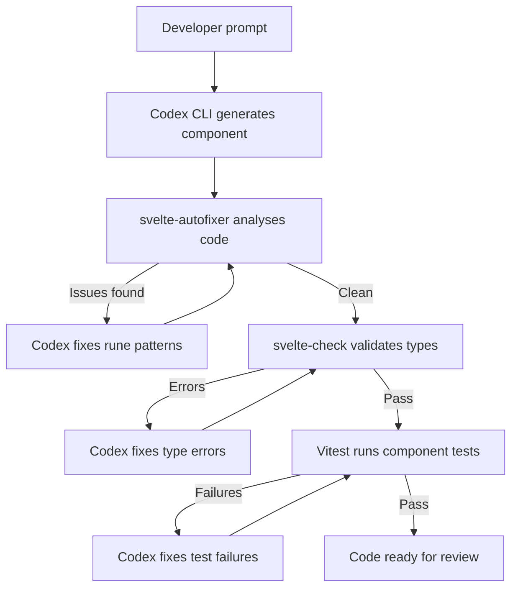

# Codex CLI for Svelte and SvelteKit Teams: Runes, Svelte MCP, and Agent-Driven Component Workflows


---

Svelte 5's runes system fundamentally changed how reactivity works in the framework — replacing implicit `$:` declarations with explicit primitives like `$state`, `$derived`, and `$effect` [^1]. Combined with SvelteKit 2's file-based routing and server-side rendering, Svelte projects now have a compiler-driven architecture that is exceptionally well-suited to AI coding agents. The compiler catches mistakes early, runes enforce explicit data flow, and the convention-heavy project structure gives agents clear navigation signals.

This guide covers the AGENTS.md templates, Svelte MCP server configuration, `config.toml` settings, and workflow recipes needed to make Codex CLI v0.125+ a productive member of your Svelte team.

## Prerequisites

This article assumes you are running:

- **Codex CLI** v0.125+ [^2]
- **Svelte** 5.x with runes enabled (the default since October 2024) [^1]
- **SvelteKit** 2.x with Vite 6+
- **Vitest** 3.x with `vitest-browser-svelte` for component testing [^3]
- **Node.js** 22 LTS
- **TypeScript** 5.7+ (recommended for all new Svelte 5 projects)

## Why Svelte Is Agent-Friendly

Three characteristics of Svelte 5 make it particularly amenable to agent-driven development:

1. **Compiler-as-validator.** Svelte's compiler catches invalid rune usage, undeclared props, and accessibility violations at build time [^1]. This gives Codex CLI immediate, deterministic feedback — exactly the kind of signal that prevents silent agent drift.

2. **Explicit reactivity.** Runes like `$state()` and `$derived()` make reactive dependencies visible in source code rather than hidden behind compiler magic [^4]. Agents can reason about data flow without inferring implicit subscriptions.

3. **Convention-heavy structure.** SvelteKit's file-based routing (`src/routes/`), co-located server functions (`+page.server.ts`), and layout hierarchy reduce the navigation burden that typically slows agents in large codebases [^5].

## AGENTS.md Template for Svelte/SvelteKit Projects

Place this at your repository root. It encodes the conventions that prevent the most common agent mistakes with Svelte 5:

```markdown
# AGENTS.md

## Project Overview
This is a SvelteKit 2 application using Svelte 5 with runes.
TypeScript is mandatory for all new code.

## Architecture
- Pages in `src/routes/` using file-based routing
- Components in `src/lib/components/` with PascalCase filenames
- Reactive classes in `src/lib/state/` (replacing Svelte stores)
- Server routes in `src/routes/api/` as `+server.ts` files
- Layouts in `src/routes/+layout.svelte` and `+layout.server.ts`
- Static assets in `static/`

## Coding Standards — Svelte 5 Runes
- Use `$state()` for all mutable reactive state
- Use `$derived()` for computed values — NEVER `$effect` for derivations
- Use `$effect()` ONLY for side effects (DOM manipulation, logging, API calls)
- Use `$props()` with TypeScript interfaces for component props
- Use `$bindable()` for two-way bindable props
- NEVER use legacy Svelte 4 syntax: no `export let`, no `$:`, no `createEventDispatcher`
- Use callback props (e.g. `onclick`) instead of `createEventDispatcher`
- Extract shared reactive logic into `.svelte.ts` files as reactive classes

## Component Conventions
- All components use `<script lang="ts">` (NOT `<script setup>`)
- Use snippets (`{#snippet}`) for reusable markup within a component
- Prefer `{@render children()}` over `<slot />`
- Keep components under 150 lines — extract sub-components early

## Testing
- Unit tests co-located as `*.test.ts` next to source files
- Use `vitest-browser-svelte` with Playwright for component tests
- Use `render()` from `vitest-browser-svelte` for mounting
- Target 80%+ coverage on reactive classes and utilities
- Run: `npx vitest run` for full suite
- Run: `npx vitest run src/lib/components/Button.test.ts` for single file

## Build and Validation
- `npm run check` — runs `svelte-check` for type and compiler errors
- `npm run lint` — ESLint with `eslint-plugin-svelte`
- `npm run build` — full SvelteKit build
- `npm run test` — Vitest suite
- ALWAYS run `npm run check` after making changes

## Common Pitfalls
- Do NOT destructure `$props()` without `$derived` — reactivity is lost
- Do NOT use `$effect` where `$derived` suffices — it causes unnecessary rerenders
- Do NOT import from `svelte/store` — use reactive classes with `$state` instead
- `$app/stores` is deprecated since SvelteKit 2.12 — use `$app/state` instead
```

## Connecting the Svelte MCP Server

The official Svelte MCP server provides Codex CLI with live access to Svelte 5 and SvelteKit documentation, plus a built-in autofixer that catches rune misuse [^6]. This is the single highest-impact integration for Svelte teams.

### MCP Server Tools

The server exposes four tools [^6]:

| Tool | Purpose |
|------|---------|
| `list-sections` | Discovers available documentation sections |
| `get-documentation` | Retrieves full docs for specific topics |
| `svelte-autofixer` | Analyses generated Svelte code and suggests fixes |
| `playground-link` | Generates shareable Svelte REPL links |

The `svelte-autofixer` is particularly valuable — it catches stale Svelte 4 patterns, incorrect rune usage, and accessibility issues before code reaches `svelte-check` [^6].

### config.toml Configuration

Add the Svelte MCP server to your project's `config.toml`:

```toml
model = "gpt-5.5"
approval_mode = "unless-allow-listed"

[sandbox]
allow_commands = [
  "npm run check",
  "npm run lint",
  "npm run build",
  "npx vitest run*",
  "npx svelte-check",
  "npx sv add*",
  "node*"
]

[mcp_servers.svelte-docs]
# Remote setup — no local dependencies required
type = "streamable-http"
url = "https://mcp.svelte.dev/mcp"

# Alternative: local setup for offline/air-gapped environments
# [mcp_servers.svelte-docs-local]
# command = "npx"
# args = ["@sveltejs/mcp"]
```

The remote MCP endpoint at `https://mcp.svelte.dev/mcp` requires no local installation [^6]. For air-gapped environments, use the local `@sveltejs/mcp` package instead.

### Automated Setup

SvelteKit projects can bootstrap MCP configuration automatically [^6]:

```bash
npx sv add mcp
```

This generates the recommended MCP client configuration and adds agent instruction prompts to your project.

## Agent-Driven Development Workflow

The following workflow leverages Svelte's compiler feedback loop and the MCP autofixer to create a tight agent iteration cycle:



### Example: Generating a Reactive Component

```bash
codex "Create a SearchFilter component in src/lib/components/SearchFilter.svelte.
It should accept an items prop (array of {id: string, name: string, tags: string[]}),
a reactive search query with $state, filter items using $derived, and expose
an onselect callback prop. Include a co-located test file."
```

Codex CLI will:

1. Scaffold `SearchFilter.svelte` using `$state()` for the query and `$derived()` for filtered results
2. Run the `svelte-autofixer` MCP tool to catch any Svelte 4 patterns
3. Create `SearchFilter.test.ts` with `vitest-browser-svelte` rendering
4. Execute `npm run check` to validate types and compiler output

### Post-Tool-Use Hooks

Add hooks to your `config.toml` to enforce validation after every file write [^2]:

```toml
[[hooks]]
event = "post_tool_use"
tool_name = "write_file"
command = "npm run check"
timeout_ms = 30000

[[hooks]]
event = "post_tool_use"
tool_name = "write_file"
command = "npx vitest run --reporter=verbose --changed"
timeout_ms = 60000
```

These hooks ensure that `svelte-check` and Vitest run automatically after Codex modifies any file, catching rune misuse and test regressions within the agent loop.

## Reactive Classes: The Svelte 5 State Pattern

In 2026, the idiomatic Svelte 5 approach to shared state has moved from Svelte stores to reactive classes [^4][^7]. These work in `.svelte.ts` files and are naturally agent-friendly because they follow standard TypeScript class patterns:

```typescript
// src/lib/state/cart.svelte.ts
export class CartState {
  items = $state<CartItem[]>([]);

  total = $derived(
    this.items.reduce((sum, item) => sum + item.price * item.quantity, 0)
  );

  itemCount = $derived(this.items.length);

  add(item: CartItem) {
    this.items.push(item); // deep reactivity handles the update
  }

  remove(id: string) {
    this.items = this.items.filter(i => i.id !== id);
  }
}

export const cart = new CartState();
```

Instruct Codex to generate reactive classes rather than stores by including this pattern in your AGENTS.md. The reactive class pattern produces code that is easier for agents to reason about because dependencies are explicit `$derived` expressions rather than implicit store subscriptions [^7].

## Testing Strategy with Vitest Browser Mode

Svelte 5 component testing has converged on Vitest browser mode with Playwright, which runs tests in real browsers rather than simulated JSDOM environments [^3][^8]:

```typescript
// src/lib/components/SearchFilter.test.ts
import { render } from 'vitest-browser-svelte';
import { page } from '@vitest/browser/context';
import { expect, test } from 'vitest';
import SearchFilter from './SearchFilter.svelte';

const mockItems = [
  { id: '1', name: 'TypeScript Guide', tags: ['ts', 'guide'] },
  { id: '2', name: 'Svelte Tutorial', tags: ['svelte', 'tutorial'] },
];

test('filters items by search query', async () => {
  const selected: string[] = [];
  render(SearchFilter, {
    items: mockItems,
    onselect: (item) => selected.push(item.id),
  });

  const input = page.getByRole('textbox');
  await input.fill('Svelte');

  const results = page.getByRole('listitem');
  await expect.element(results).toHaveTextContent('Svelte Tutorial');
});
```

This testing approach integrates well with Codex CLI because test failures produce concrete, actionable error messages that the agent can use to self-correct.

## Model Selection for Svelte Workflows

| Task | Recommended Model | Reasoning Effort |
|------|------------------|-----------------|
| Component scaffolding | GPT-5.5 | Medium |
| Reactive class design | GPT-5.5 | High |
| Test generation | GPT-5.5 | Medium |
| Rune migration (Svelte 4 → 5) | GPT-5.5 | High |
| Quick fixes and linting | o4-mini | Low |
| Documentation generation | o4-mini | Medium |

GPT-5.5's stronger planning capabilities make it the better choice for tasks that require understanding the interplay between `$state`, `$derived`, and `$effect` [^9]. For simpler tasks like generating boilerplate or fixing lint errors, o4-mini keeps costs down whilst remaining accurate on Svelte syntax [^2].

## Svelte 4 to Svelte 5 Migration with Codex CLI

Codex CLI excels at systematic migration tasks. For teams still on Svelte 4, the following prompt drives a file-by-file migration:

```bash
codex "Migrate src/lib/components/UserProfile.svelte from Svelte 4 to Svelte 5.
Replace all 'export let' with '$props()'. Replace all '$:' reactive declarations
with '$derived()' or '$effect()' as appropriate. Replace 'createEventDispatcher'
with callback props. Replace any '<slot />' with '{@render children()}'.
Run svelte-check after migration. Preserve all existing functionality."
```

The Svelte MCP autofixer validates the migration output, catching subtle issues like destructured `$props()` losing reactivity — a common migration pitfall [^6].

## Subagent Patterns for SvelteKit Projects

For larger SvelteKit applications, delegate specialised tasks to subagents:

```toml
[subagents.component-builder]
model = "gpt-5.5"
instructions = """
You build Svelte 5 components using runes exclusively.
Always use $state for reactive state, $derived for computations.
Never use Svelte 4 patterns. Run svelte-autofixer via MCP after generation.
"""

[subagents.test-writer]
model = "o4-mini"
instructions = """
You write Vitest tests for Svelte components using vitest-browser-svelte.
Use render() for mounting, page queries for assertions.
Test user-visible behaviour, not internal state.
"""
```

## Common Pitfalls and Agent Guardrails

These are the mistakes Codex CLI most frequently makes with Svelte 5, based on community reports and the SvelteKit AGENTS.md conventions [^10]:

| Pitfall | Guardrail |
|---------|-----------|
| Using `$effect` for derivations | AGENTS.md rule: "Use `$derived()` for computed values — NEVER `$effect` for derivations" |
| Destructuring `$props()` | AGENTS.md rule: "Do NOT destructure `$props()` without `$derived`" |
| Importing from `svelte/store` | AGENTS.md rule: "Use reactive classes with `$state` instead" |
| Using `$app/stores` | AGENTS.md rule: "Use `$app/state` instead" (deprecated since SvelteKit 2.12) [^5] |
| Generating `<slot />` instead of `{@render}` | AGENTS.md rule: "Prefer `{@render children()}` over `<slot />`" |
| Using `createEventDispatcher` | AGENTS.md rule: "Use callback props (e.g. `onclick`)" [^7] |

## Putting It All Together

The combination of Svelte's compiler feedback, the official MCP autofixer, and well-structured AGENTS.md instructions creates a development loop where Codex CLI can reliably produce idiomatic Svelte 5 code. The key ingredients are:

1. **AGENTS.md** encoding rune conventions and anti-patterns
2. **Svelte MCP server** providing live documentation and code analysis
3. **Post-tool-use hooks** running `svelte-check` and Vitest after every change
4. **Reactive classes** in `.svelte.ts` files as the standard state pattern
5. **Vitest browser mode** for component tests with real browser rendering

Start with the AGENTS.md template, connect the Svelte MCP server, and add the hooks. From there, Codex CLI has the guardrails it needs to generate correct, idiomatic Svelte 5 code with minimal human intervention.

## Citations

[^1]: Svelte 5 documentation — Runes system and migration guide. [https://svelte.dev/docs/svelte/v5-migration-guide](https://svelte.dev/docs/svelte/v5-migration-guide)

[^2]: OpenAI Codex CLI documentation — Features, hooks, and configuration reference. [https://developers.openai.com/codex/cli](https://developers.openai.com/codex/cli)

[^3]: Svelte testing documentation — Vitest browser mode with vitest-browser-svelte. [https://svelte.dev/docs/svelte/testing](https://svelte.dev/docs/svelte/testing)

[^4]: "Svelte 5 Runes in 2026: How They Work" — PkgPulse Blog, comprehensive runes guide. [https://www.pkgpulse.com/blog/svelte-5-runes-complete-guide-2026](https://www.pkgpulse.com/blog/svelte-5-runes-complete-guide-2026)

[^5]: SvelteKit 2 documentation — File-based routing, `$app/state`, and layout conventions. [https://svelte.dev/docs/kit](https://svelte.dev/docs/kit)

[^6]: Svelte MCP server documentation — Tools, setup, and autofixer reference. [https://svelte.dev/docs/mcp](https://svelte.dev/docs/mcp)

[^7]: "Svelte Best Practices in 2026: Scaling with Runes, Snippets, and Pure Reactivity" — OneHorizon AI. [https://onehorizon.ai/blog/svelte-best-practices-in-2026-scaling-with-runes-snippets-and-pure-reactivity](https://onehorizon.ai/blog/svelte-best-practices-in-2026-scaling-with-runes-snippets-and-pure-reactivity)

[^8]: "From JSDOM to Real Browsers: Testing Svelte with Vitest Browser Mode" — Scott Spence. [https://scottspence.com/posts/testing-with-vitest-browser-svelte-guide](https://scottspence.com/posts/testing-with-vitest-browser-svelte-guide)

[^9]: "Introducing GPT-5.5" — OpenAI blog, GPT-5.5 capabilities and availability. [https://openai.com/index/introducing-gpt-5-5/](https://openai.com/index/introducing-gpt-5-5/)

[^10]: SvelteKit AGENTS.md — Official AI agent configuration for the SvelteKit monorepo. [https://github.com/sveltejs/kit/blob/main/AGENTS.md](https://github.com/sveltejs/kit/blob/main/AGENTS.md)
