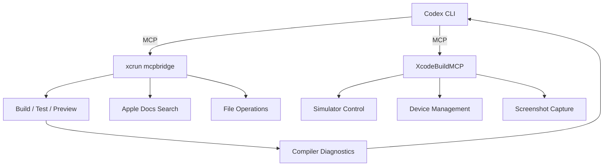
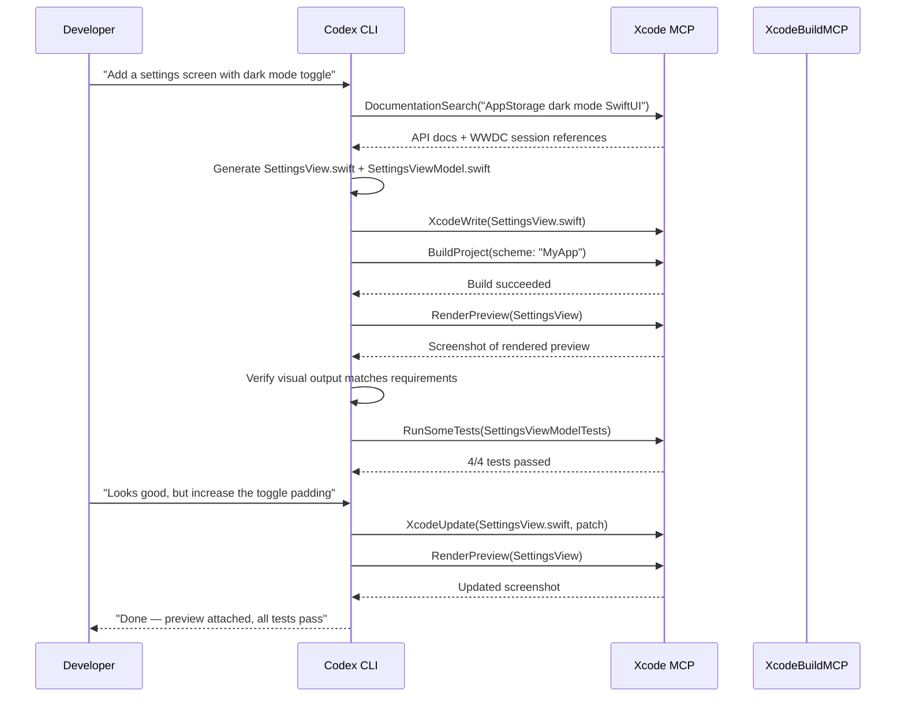

# Codex CLI for Swift and iOS Teams: Xcode MCP, SwiftUI Skills, and Agent-Driven Apple Platform Development


---

Apple's integration of agentic coding into Xcode 26.3 in February 2026 transformed how iOS teams work with AI coding agents [^1]. Codex CLI now operates as both a standalone terminal agent and a native runtime inside Xcode, with two complementary MCP servers providing structured access to builds, tests, previews, and Apple's documentation corpus. This article covers the complete setup for Swift and iOS teams — from AGENTS.md templates and MCP configuration to SwiftUI skill installation and production workflows.

## Why Swift Is Unusually Agent-Friendly

Swift's design characteristics make it one of the strongest languages for agentic coding:

- **Compiler-driven feedback loops.** Swift's type system and strict concurrency checking in Swift 6.2 produce structured, actionable diagnostics [^2]. Agents receive file paths, line numbers, and fix-it suggestions — not vague runtime errors.
- **Declarative UI.** SwiftUI's declarative syntax maps cleanly to natural language instructions. "Add a navigation stack with a list of items" translates almost directly to code.
- **Preview rendering.** Xcode's `RenderPreview` MCP tool returns actual screenshots of SwiftUI views, giving the agent visual verification without deploying to a device [^3].
- **Convention-heavy ecosystem.** SPM package resolution, Xcode scheme conventions, and Apple's Human Interface Guidelines provide strong implicit constraints that reduce hallucination.

## MCP Server Landscape: Two Complementary Options

iOS teams have two MCP servers available, each with different strengths:

### Apple's Built-In Xcode MCP Bridge (20 tools)

Ships with Xcode 26.3. Requires Xcode to be running with a project open [^1].

```bash
codex mcp add xcode -- xcrun mcpbridge
```

Key tools include:

| Tool | Purpose |
|------|---------|
| `BuildProject` | Trigger builds for specific schemes |
| `RenderPreview` | Screenshot SwiftUI previews as images |
| `DocumentationSearch` | Semantic search across Apple docs and WWDC transcripts [^3] |
| `RunAllTests` / `RunSomeTests` | Execute test suites with structured results |
| `XcodeRead` / `XcodeWrite` / `XcodeUpdate` | File operations within the project |
| `XcodeGrep` / `XcodeGlob` | Content and pattern search |
| `XcodeListNavigatorIssues` | Retrieve build errors and warnings |
| `ExecuteSnippet` | Run code in a REPL-like environment |

### XcodeBuildMCP by Sentry (59 tools)

A community MCP server that provides deeper automation capabilities, including simulator control, device management, and screenshot capture [^4].

```bash
brew tap getsentry/xcodebuildmcp
brew install xcodebuildmcp
xcodebuildmcp init  # installs agent skills
```

Add to your project's `.codex/config.toml`:

```toml
[mcp_servers.xcodebuild]
command = "xcodebuildmcp"
args = ["mcp"]
```

Or launch on demand without installation:

```toml
[mcp_servers.xcodebuild]
command = "npx"
args = ["-y", "xcodebuildmcp@latest", "mcp"]
```

XcodeBuildMCP adds simulator lifecycle management, device provisioning queries, and the ability to capture screenshots from running simulators — capabilities the built-in bridge does not expose [^4].



**Decision guide:** Use the built-in bridge for documentation search, preview rendering, and standard build/test loops. Add XcodeBuildMCP when you need simulator automation, device management, or screenshot capture from running apps.

## AGENTS.md Template for Swift/iOS Projects

Create an `AGENTS.md` at your project root. This template targets Swift 6.2, iOS 26, and SwiftUI-first architecture [^5][^6]:

```markdown
# Project Context

## Stack
- iOS 26+ / Swift 6.2 with strict concurrency
- SwiftUI-exclusive (no UIKit unless absolutely required)
- SwiftData for persistence, SPM for dependencies
- Swift Testing framework (not XCTest)
- MVVM with @Observable ViewModels

## Architecture Rules
- Views hold ViewModels as @State properties
- NavigationStack with NavigationPath (never NavigationView)
- SwiftUI Environment for dependency injection
- One type per file, feature-based directory structure
- All views MUST include a #Preview block

## Concurrency
- async/await preferred over callbacks
- Structured concurrency via TaskGroup
- Typed throws for error handling (Swift 6.2)
- nonisolated async functions run on caller's actor (SE-0461)

## Build & Test
- Build with: `xcodebuild -scheme MyApp -destination 'platform=iOS Simulator,name=iPhone 16'`
- Test with: `xcodebuild test -scheme MyApp -destination 'platform=iOS Simulator,name=iPhone 16'`
- Use Swift Testing: @Test attribute, #expect() assertions
- Run preview renders to verify UI changes visually

## Naming
- PascalCase for types, camelCase for properties
- SF Symbols for all icons
- British English in user-facing strings

## Dependencies
- SPM packages only (no CocoaPods)
- Verify APIs via DocumentationSearch before using
```

## config.toml for iOS Development

```toml
[model]
default = "gpt-5.5"

[model.reasoning]
effort = "medium"

[sandbox]
mode = "workspace-write"
allow_network = ["api.openai.com", "registry.npmjs.org"]

[profiles.ios]
model = "gpt-5.5"
sandbox_mode = "workspace-write"

[profiles.ios-quick]
model = "gpt-5.3-codex-spark"
sandbox_mode = "workspace-write"

[mcp_servers.xcode]
command = "xcrun"
args = ["mcpbridge"]

[mcp_servers.xcodebuild]
command = "xcodebuildmcp"
args = ["mcp"]

[hooks.post_tool_use.build_check]
event = "post_tool_use"
match_tools = ["shell"]
command = "xcodebuild -scheme MyApp -destination 'platform=iOS Simulator,name=iPhone 16' -quiet 2>&1 | tail -5"
on_failure = "notify"
```

## Installing SwiftUI Agent Skills

Paul Hudson's SwiftUI Agent Skill addresses the most common mistakes AI agents make when writing SwiftUI code — deprecated APIs, performance anti-patterns, accessibility gaps, and concurrency missteps [^7].

```bash
npx skills add https://github.com/twostraws/swiftui-agent-skill --skill swiftui-pro
```

The full Swift Agent Skills collection covers additional domains [^7]:

| Skill | Focus |
|-------|-------|
| `swiftui-pro` | Best practices, accessibility, modern APIs |
| `swiftdata` | Persistence patterns and model design |
| `swift-concurrency` | Async/await, actors, structured concurrency |
| `swift-testing` | Swift Testing framework patterns |

For Codex CLI, copy skills into your global directory:

```bash
mkdir -p ~/.codex/skills
cp -r ./swiftui-agent-skill ~/.codex/skills/swiftui-pro
```

Or for project-scoped skills:

```bash
mkdir -p .codex/skills
cp -r ./swiftui-agent-skill .codex/skills/swiftui-pro
```

## Agent-Driven Feature Development Workflow

The following sequence illustrates a typical feature implementation loop for an iOS team using Codex CLI with both MCP servers:



The key insight is the **visual verification loop**: `RenderPreview` lets Codex see the actual rendered UI, spot layout issues, and iterate without the developer needing to check every change manually [^3].

## Model Selection by iOS Task

| Task | Recommended Model | Reasoning Effort | Rationale |
|------|------------------|-----------------|-----------|
| New SwiftUI view generation | GPT-5.5 | Medium | Complex layout + accessibility |
| Bug fix with compiler errors | GPT-5.5 | High | Needs deep understanding of Swift type system |
| Test generation | GPT-5.3-Codex-Spark | Low | Repetitive, pattern-based work [^9] |
| Documentation search queries | GPT-5.3-Codex-Spark | Low | Simple tool invocation |
| Concurrency migration (Swift 6.2) | GPT-5.5 | High | Requires understanding of actor isolation model |
| UI polish and iteration | GPT-5.5 | Medium | Visual reasoning from preview screenshots |

## Xcode Native vs Codex CLI

Xcode 26.3 ships Codex as a native runtime — a separate installation from standalone Codex CLI [^10]. Use Xcode's native integration for interactive development where preview rendering is central. Use Codex CLI for CI pipelines, headless automation, and multi-agent workflows. Maintain shared skills by symlinking:

```bash
ln -s ~/.codex/skills ~/Library/Developer/Xcode/CodingAssistant/codex/skills
```

## Common Pitfalls

| Pitfall | Symptom | Fix |
|---------|---------|-----|
| Agent uses UIKit patterns | `UIViewController` subclasses in SwiftUI project | Explicit "SwiftUI-exclusive" rule in AGENTS.md |
| Deprecated SwiftUI APIs | `foregroundColor()`, `NavigationView` | Install SwiftUI Agent Skill [^7] |
| Macro validation errors | Build fails on Swift macros | XcodeBuildMCP skips macro validation by default [^4] |
| `ObservableObject` overuse | Unnecessary `@Published` properties | Enforce `@Observable` macro in AGENTS.md [^2] |
| Missing previews | Views without `#Preview` blocks | PostToolUse hook checking for preview presence |
| Xcode MCP requires GUI | `xcrun mcpbridge` fails headless | Use XcodeBuildMCP for CI; bridge needs running Xcode [^3] |
| Concurrency warnings | `Sendable` violations on view models | Specify Swift 6.2 strict concurrency mode in AGENTS.md [^2] |

## Citations

[^1]: [Xcode 26.3 unlocks the power of agentic coding — Apple Newsroom, February 2026](https://www.apple.com/newsroom/2026/02/xcode-26-point-3-unlocks-the-power-of-agentic-coding/)
[^2]: [Swift 6.2 Released — Swift.org, 2026](https://www.swift.org/blog/swift-6.2-released/)
[^3]: [Exploring AI Driven Coding: Using Xcode 26.3 MCP Tools in Cursor, Claude Code and Codex — Rudrank Riyam](https://rudrank.com/exploring-xcode-using-mcp-tools-cursor-external-clients)
[^4]: [XcodeBuildMCP — Sentry/GitHub](https://github.com/getsentry/XcodeBuildMCP)
[^5]: [A simple template for Swift 6 and iOS development using Agentic coding — NDCSwift GitHub Gist](https://gist.github.com/NDCSwift/5b9cd71bb930542f434de4cda2cf46ca)
[^6]: [Agentic coding in Xcode — Swift with Majid, February 2026](https://swiftwithmajid.com/2026/02/10/agentic-coding-in-xcode/)
[^7]: [SwiftUI Agent Skill — Hacking with Swift (Paul Hudson)](https://www.hackingwithswift.com/articles/282/swiftui-agent-skill-claude-codex-ai)
[^9]: [Models — Codex, OpenAI Developers](https://developers.openai.com/codex/models)
[^10]: [Agentic Coding in Xcode 26.3 with Claude Code and Codex — Swiftjective-C](https://swiftjectivec.com/Agentic-Coding-Codex-Claude-Code-in-Xcode/)
