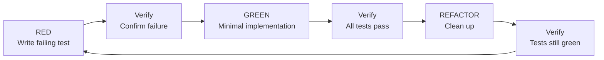
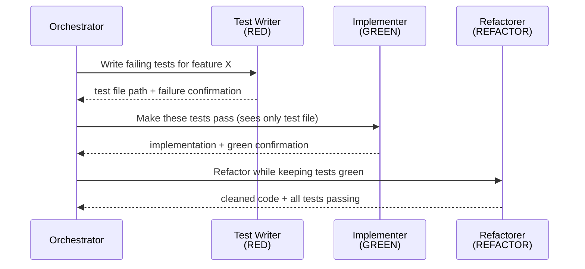
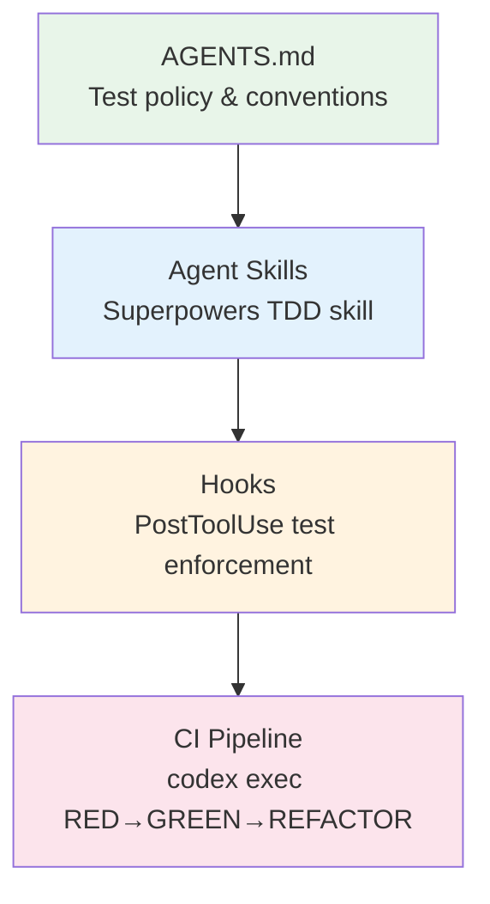

# Test-Driven Development with Codex CLI: Agent-Driven Red-Green-Refactor Workflows


---

The single most reliable technique for getting consistently correct output from a coding agent is also one of the oldest ideas in software engineering: write the test first, watch it fail, then implement. Test-driven development (TDD) gives Codex CLI an external source of truth that persists across the entire agent loop, regardless of how long the session runs or how far the context window drifts[^1]. Without tests, the agent verifies its own work using its own judgement — a recipe for silent regressions[^2].

This article walks through the complete TDD workflow with Codex CLI in 2026: from AGENTS.md policies and agent skills through hooks-based enforcement, all the way to headless CI pipelines with `codex exec`.

## Why TDD Matters More for Agents Than for Humans

A human developer holds mental state about edge cases and implicit requirements. A coding agent does not. When Codex generates implementation first and tests second, the tests tend to mirror what was built rather than what was required — they pass immediately, proving nothing[^3]. Simon Willison's agentic engineering patterns highlight this as the core risk: "a significant risk with coding agents is that they might write code that doesn't work, or build code that is unnecessary and never gets used, or both"[^1].

Tests-first development inverts the dynamic:

- **Edge-case discovery** happens before implementation, not after[^3]
- **Observed failure** proves the test actually measures something meaningful
- **Minimal implementation** prevents the agent from gold-plating
- **Regression safety** protects features as the codebase grows



## Setting the Foundation: AGENTS.md Test Policy

The first step is encoding your testing expectations in `AGENTS.md`. Codex reads this file to understand build commands, test runners, and engineering conventions[^4]. A TDD-enforcing AGENTS.md might look like this:

```markdown
# AGENTS.md

## Build & Test
- Build: `npm run build`
- Test: `npm test`
- Lint: `npm run lint`
- Single test file: `npm test -- --testPathPattern=<file>`

## Development Policy
- **All new features and bug fixes MUST use test-driven development**
- Write the failing test FIRST, confirm it fails, then implement
- Never write production code without a corresponding failing test
- Run the full test suite after every implementation change
- Target 80%+ line coverage on new code

## Test Conventions
- Test files: `*.test.ts` alongside source files
- Use `describe`/`it` blocks with behaviour-describing names
- Prefer real implementations over mocks where practical
- One assertion concept per test
```

OpenAI's best practices documentation recommends including "done when" criteria that explicitly require test execution as part of completion[^5]. This gives the agent an unambiguous exit condition.

## The Superpowers TDD Skill

Jesse Vincent's Superpowers framework provides a battle-tested TDD skill that works with Codex CLI out of the box[^6]. Install it by symlinking into the skills discovery directory:

```bash
# Clone superpowers
git clone https://github.com/obra/superpowers.git ~/.codex/superpowers

# Symlink for Codex discovery
mkdir -p ~/.agents/skills
ln -s ~/.codex/superpowers/skills/test-driven-development ~/.agents/skills/test-driven-development
```

The skill enforces what it calls the "Iron Law": **no production code without a failing test first**[^3]. Any code written before its corresponding test must be deleted entirely — no "keeping as reference" or "adapting while writing tests."

### Skill Activation

Codex discovers skills from `~/.agents/skills/` at startup and can invoke them explicitly or implicitly[^7]:

```bash
# Explicit invocation
codex "Using $test-driven-development, add email validation to the User model"

# Implicit — Codex selects the skill when it matches the task context
codex "Add email validation to the User model with full test coverage"
```

The skill's `SKILL.md` defines a verification checklist that the agent must complete before declaring the work done[^3]:

- Every new function has a corresponding test
- Each test was observed failing before implementation
- Tests failed for the expected reason (missing feature, not syntax errors)
- Minimal code was written per test
- All tests pass with clean output

## Context Isolation: The Subagent Pattern

A key insight from production TDD workflows is that running test-writing and implementation in the same context window causes "cheating" — the agent's knowledge of the implementation pollutes its test design[^8]. The solution is context isolation through subagents.

Alex Opoien's approach, originally demonstrated with Claude Code but directly portable to Codex CLI's `/side` conversations, uses three phases with separate context[^8]:



In Codex CLI, you can approximate this with `/side` conversations introduced in v0.122.0[^9]:

```bash
# Main conversation: orchestrate
codex "I need email validation on the User model.
First, open a /side conversation to write failing tests only.
Then implement in the main thread.
Then open another /side to refactor."
```

For headless workflows, chain separate `codex exec` invocations:

```bash
# RED: Write failing tests
codex exec "Write failing tests for email validation in src/user.test.ts. \
Do NOT write any implementation code. Confirm the tests fail." \
  --approval-mode full-auto

# GREEN: Implement
codex exec "Make all failing tests in src/user.test.ts pass with \
minimal implementation. Do not add features beyond what the tests require." \
  --approval-mode full-auto

# REFACTOR: Clean up
codex exec "Refactor src/user.ts for clarity and duplication removal. \
All tests must remain green." \
  --approval-mode full-auto
```

## Hooks-Based Test Enforcement

Codex CLI hooks, now stable as of v0.124[^10], can enforce test verification after every code change. A `PostToolUse` hook on `apply_patch` can trigger the test suite automatically:

```toml
# .codex/config.toml

[[hooks.PostToolUse]]
matcher = "^apply_patch$"

[[hooks.PostToolUse.hooks]]
type = "command"
command = """
#!/bin/bash
# Run tests after every file edit
cd "$(git rev-parse --show-toplevel)"
npm test --silent 2>&1 | tail -20
if [ $? -ne 0 ]; then
  echo '{"decision":"block","reason":"Tests are failing after this change. Fix before continuing."}' >&2
  exit 2
fi
"""
timeout = 60
statusMessage = "Running test suite"
```

This creates a tight feedback loop: every `apply_patch` triggers tests, and failures block the agent from proceeding until the suite is green[^10]. Combined with a `PreToolUse` hook that logs what's being changed, you get a complete audit trail of the TDD cycle.

For more targeted verification, match specific file patterns:

```toml
[[hooks.PostToolUse]]
matcher = "^apply_patch$"

[[hooks.PostToolUse.hooks]]
type = "command"
command = """
#!/bin/bash
# Only run tests when source files change (not test files themselves)
CHANGED=$(echo "$CODEX_TOOL_INPUT" | grep -oP 'src/[^"]+' | head -1)
if [[ "$CHANGED" == src/*.test.* ]]; then
  exit 0  # Skip — test file edit, not implementation
fi
npm test --silent 2>&1 | tail -20
[ $? -eq 0 ] || { echo '{"decision":"block","reason":"Tests failing."}' >&2; exit 2; }
"""
timeout = 60
statusMessage = "Verifying tests"
```

## Headless TDD in CI with codex exec

The `codex exec` non-interactive mode integrates TDD enforcement into CI/CD pipelines[^11]. Use `--output-schema` to extract structured test results:

```json
{
  "type": "object",
  "properties": {
    "tests_written": { "type": "integer" },
    "tests_passing": { "type": "integer" },
    "coverage_percent": { "type": "number" },
    "files_changed": {
      "type": "array",
      "items": { "type": "string" }
    },
    "tdd_violations": {
      "type": "array",
      "items": { "type": "string" }
    }
  },
  "required": ["tests_written", "tests_passing", "coverage_percent", "tdd_violations"],
  "additionalProperties": false
}
```

A GitHub Actions workflow enforcing TDD on issue-driven work:


```yaml
name: TDD Agent Pipeline
on:
  issues:
    types: [labeled]
jobs:
  tdd-implement:
    if: contains(github.event.label.name, 'agent-tdd')
    runs-on: ubuntu-latest
    steps:
      - uses: actions/checkout@v4
      - uses: actions/setup-node@v4
        with:
          node-version: '22'
      - run: npm ci

      - name: RED — Write failing tests
        uses: openai/codex-action@v1
        with:
          codex-args: >
            exec "Read issue #${{ github.event.issue.number }}.
            Write failing tests that verify the described behaviour.
            Do NOT implement any production code.
            Confirm tests fail for the expected reason."
            --approval-mode full-auto
            --model o4-mini

      - name: Verify RED
        run: |
          npm test && echo "::error::Tests should be FAILING at this stage" && exit 1
          echo "Tests correctly failing — RED phase complete"

      - name: GREEN — Minimal implementation
        uses: openai/codex-action@v1
        with:
          codex-args: >
            exec "Make all failing tests pass with minimal implementation.
            Do not add features beyond what tests require."
            --approval-mode full-auto
            --model o4-mini

      - name: Verify GREEN
        run: npm test

      - name: REFACTOR — Clean up
        uses: openai/codex-action@v1
        with:
          codex-args: >
            exec "Refactor changed files for clarity. All tests must remain green."
            --approval-mode full-auto
            --model codex-spark

      - name: Final verification
        run: npm test && npm run lint
```


## Model Selection for TDD Phases

Different TDD phases have different reasoning demands. A cost-effective strategy routes each phase to the appropriate model[^12]:

| Phase | Recommended Model | Reasoning Effort | Rationale |
|-------|-------------------|-----------------|-----------|
| RED (test writing) | `o4-mini` | Medium | Tests require understanding requirements but not deep implementation reasoning |
| GREEN (implementation) | `o4-mini` or `gpt-5.5` | Medium–High | Complex implementations may benefit from GPT-5.5's stronger reasoning |
| REFACTOR | `codex-spark` | Low | Mechanical cleanup — pattern matching, not problem-solving |

Configure per-phase model routing in `config.toml`:

```toml
# Default for interactive TDD sessions
[model]
name = "o4-mini"

[reasoning]
effort = "medium"
```

Override per `codex exec` invocation with `--model` and `--reasoning-effort` flags as shown in the CI example above.

## Common Pitfalls

**1. Tests that test mocks, not behaviour.** Codex tends to over-mock when not constrained. Add to your AGENTS.md: "Prefer real implementations over mocks. Only mock external HTTP calls and database connections."

**2. Tests passing immediately.** If a test passes on first run without implementation, it proves nothing. The Superpowers TDD skill flags this as a red flag requiring restart[^3].

**3. The `--output-schema` and MCP conflict.** As of v0.125, `--output-schema` is silently ignored when MCP servers are active[^13]. If your TDD pipeline uses MCP tools, extract structured results via marker-based output instead.

**4. Skipping the RED verification.** The most common failure mode. Without confirming test failure, you cannot know the test actually exercises the new code path. Automate this check in CI as shown in the GitHub Actions example.

**5. Agent refactoring tests during GREEN.** Constrain the GREEN phase explicitly: "Do not modify test files. Only add or change production code."

## Putting It All Together

A complete TDD setup for Codex CLI combines four layers:



1. **AGENTS.md** encodes the policy: what test runner to use, coverage targets, and the mandate for test-first development
2. **Agent skills** provide structured workflow guidance that the agent follows automatically
3. **Hooks** enforce compliance by running tests after every code change and blocking on failure
4. **CI pipelines** automate the full cycle headlessly with phase-separated `codex exec` invocations

The investment is roughly two hours of configuration. The payoff is every feature request, bug fix, and refactoring task arriving with verified, behaviour-driven tests — regardless of whether a human or an agent wrote the code.

## Citations

[^1]: Simon Willison, "Red/green TDD — Agentic Engineering Patterns," [simonwillison.net](https://simonwillison.net/guides/agentic-engineering-patterns/red-green-tdd/), 2025–2026.
[^2]: OpenAI, "Best practices — Codex," [developers.openai.com](https://developers.openai.com/codex/learn/best-practices), April 2026.
[^3]: Jesse Vincent / obra, "Test-Driven Development SKILL.md — Superpowers," [github.com/obra/superpowers](https://github.com/obra/superpowers/blob/main/skills/test-driven-development/SKILL.md), 2025–2026.
[^4]: OpenAI, "Custom instructions with AGENTS.md — Codex," [developers.openai.com](https://developers.openai.com/codex/guides/agents-md), April 2026.
[^5]: OpenAI, "Best practices — Codex," [developers.openai.com](https://developers.openai.com/codex/learn/best-practices), April 2026.
[^6]: Jesse Vincent, "Superpowers: An agentic skills framework," [github.com/obra/superpowers](https://github.com/obra/superpowers), 2025–2026.
[^7]: OpenAI, "Agent Skills — Codex," [developers.openai.com](https://developers.openai.com/codex/skills), April 2026.
[^8]: Alex Opoien, "Forcing Claude Code to TDD: An Agentic Red-Green-Refactor Loop," [alexop.dev](https://alexop.dev/posts/custom-tdd-workflow-claude-code-vue/), 2026.
[^9]: OpenAI, "Codex CLI v0.122.0 — /side conversations and slash commands in queued input," [github.com/openai/codex/releases](https://github.com/openai/codex/releases), April 2026.
[^10]: OpenAI, "Hooks — Codex," [developers.openai.com](https://developers.openai.com/codex/hooks), April 2026.
[^11]: OpenAI, "Non-interactive mode — Codex," [developers.openai.com](https://developers.openai.com/codex/noninteractive), April 2026.
[^12]: OpenAI, "Codex CLI Changelog," [developers.openai.com](https://developers.openai.com/codex/changelog), April 2026.
[^13]: GitHub Issue #15451, "--json and --output-schema are silently ignored when tools/MCP servers are active," [github.com/openai/codex/issues/15451](https://github.com/openai/codex/issues/15451), 2026.
