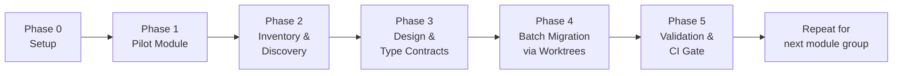
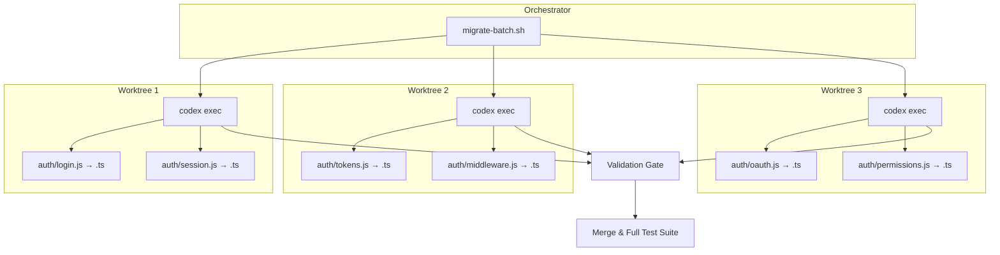

# JavaScript-to-TypeScript Migration with Codex CLI: Gradual Typing Strategies for Large Codebases


---

Migrating a JavaScript codebase to TypeScript remains one of the most requested — and most dreaded — modernisation tasks in 2026. With TypeScript 6.0 shipping strict mode by default and deprecating ES5 targets [^1], the pressure to migrate has intensified. Meanwhile, GPT-5.5's million-token context window [^2] and Codex CLI's parallel worktree support [^3] make agent-assisted migration genuinely practical at scale for the first time.

This article walks through a battle-tested workflow for migrating large JavaScript codebases (10k–500k+ lines) to TypeScript using Codex CLI, covering incremental strategies, AGENTS.md configuration, parallel execution patterns, and validation gates.

## Why Now?

Three converging factors make 2026 the year to tackle your JS-to-TS migration:

1. **TypeScript 6.0** defaults to `strict: true`, `module: "esnext"`, and `target: "ES2025"` [^1]. New projects already assume strict typing, widening the gap with legacy JS codebases.
2. **GPT-5.5** can hold an entire medium-sized codebase in context (~1M tokens), enabling cross-file type inference that previous models could not sustain [^2].
3. **AI-assisted migration accelerates work by 30–40%** compared to manual approaches, according to industry reports [^4]. Codex CLI's `exec` mode and worktree parallelism push this further.

## Migration Strategy: Incremental, Not Big-Bang

For any codebase beyond a few thousand lines, the strangler-fig pattern is the only sane approach [^5]. Codex CLI's code modernisation cookbook formalises this into five phases: setup, pilot selection, inventory, design, and implementation [^6].



### Phase 0: AGENTS.md and Configuration

Create an AGENTS.md file that encodes your migration conventions so every Codex session follows the same rules:

```markdown
# AGENTS.md — TypeScript Migration

## Context
This repository is being incrementally migrated from JavaScript to TypeScript.
TypeScript 6.0 with strict mode. Target: ES2025. Module: ESNext.

## Rules
- When converting a .js file to .ts, preserve all existing behaviour exactly.
- Add explicit type annotations; do not use `any` except as a temporary bridge type marked with `// TODO: narrow type`.
- Convert JSDoc @param/@returns annotations to TypeScript signatures.
- Update import paths to use .js extensions per ESM resolution rules.
- Run `tsc --noEmit` after each file conversion to verify type correctness.
- Do not modify files that are not part of the current migration batch.

## Testing
- Run `npm test` after each batch to confirm no regressions.
- If a test fails, fix the type error rather than weakening the type.
```

Configure your `config.toml` profile for migration work:

```toml
[profile.ts-migrate]
model = "gpt-5.5"
approval_policy = "unless-allow-listed"
auto_edit = true

[profile.ts-migrate.instructions]
text = "You are performing a JavaScript-to-TypeScript migration. Follow AGENTS.md strictly."
```

### Phase 1: Pilot Module Selection

Start with a bounded, well-tested module. Ask Codex to identify candidates:

```bash
codex --profile ts-migrate \
  "Analyse this repository and propose the three best pilot modules for JS-to-TS migration. \
   Rank by: test coverage, number of dependents, and complexity. \
   Output a markdown table with file counts, LOC, and test coverage percentage."
```

Pick the module with the highest test coverage and fewest downstream dependents — you want a tight feedback loop with low blast radius.

### Phase 2: Inventory and Type Discovery

Before converting anything, have Codex map the implicit type landscape:

```bash
codex --profile ts-migrate \
  "For the src/auth/ module: \
   1. List every exported function with inferred parameter and return types from JSDoc and usage. \
   2. Identify shared data shapes that should become interfaces or type aliases. \
   3. Flag any dynamic patterns (eval, Function constructor, prototype mutation) that need manual review. \
   Output as pilot_auth_inventory.md."
```

This produces an ExecPlan-style inventory document [^6] that serves as both a migration map and a review artifact.

### Phase 3: Type Contract Design

Generate TypeScript interfaces from the inventory:

```bash
codex --profile ts-migrate \
  "Based on pilot_auth_inventory.md, generate a types.ts file for the src/auth/ module. \
   Include all shared interfaces, type aliases, and enums. \
   Add JSDoc comments explaining each type's purpose. \
   Do not convert any .js files yet — only create the type definitions."
```

Review these types carefully — they form the contract that all subsequent conversions must satisfy.

### Phase 4: Batch Migration with Parallel Worktrees

This is where Codex CLI's parallel execution shines. For larger modules, split the work across isolated worktrees [^3]:

```bash
#!/bin/bash
# migrate-batch.sh — parallel JS-to-TS conversion
FILES=($(find src/auth -name '*.js' | sort))
BATCH_SIZE=5
BATCH_NUM=0

for ((i=0; i<${#FILES[@]}; i+=BATCH_SIZE)); do
    BATCH=("${FILES[@]:i:BATCH_SIZE}")
    BATCH_NUM=$((BATCH_NUM + 1))

    codex exec --profile ts-migrate \
      "Convert these files from JavaScript to TypeScript: ${BATCH[*]}. \
       Follow AGENTS.md rules. Import types from src/auth/types.ts. \
       Rename each file from .js to .ts. Update all internal imports. \
       Run tsc --noEmit to verify. Fix any type errors." \
      2>&1 | tee "logs/batch-${BATCH_NUM}.log" &
done

wait
echo "All batches complete. Run full test suite."
```

For very large migrations, use `codex exec` with `--add-dir` to expose multiple writable roots [^7]:

```bash
codex exec --add-dir ../shared-types \
  "Convert src/api/routes.js to TypeScript. \
   Import shared types from ../shared-types/index.ts."
```



### Phase 5: Validation Gates

After each batch, run a multi-layered validation pipeline:

```bash
# Type-check without emitting
npx tsc --noEmit

# Run existing test suite
npm test

# Use Codex /review to catch migration-specific issues
codex --profile ts-migrate "/review --diff main \
  Focus on: type narrowing correctness, any-typed escape hatches, \
  missing null checks, and import path consistency."
```

The `/review` command analyses diffs without modifying the working tree [^7], making it safe to use as a pre-merge quality gate.

## Handling Common Migration Challenges

### Dynamic Imports and `require()` Calls

```bash
codex exec --profile ts-migrate \
  "Find all CommonJS require() calls in src/ and convert them to ESM import statements. \
   Update package.json to set type: module. Fix any circular dependency issues."
```

### JSDoc-to-TypeScript Annotation Conversion

GPT-5.5 excels at this — it can parse complex JSDoc generics and convert them to proper TypeScript signatures [^2]:

```bash
codex exec --profile ts-migrate \
  "Convert all JSDoc type annotations in src/utils/ to TypeScript type annotations. \
   Remove the JSDoc @param/@returns/@typedef comments after conversion. \
   Preserve all other JSDoc comments (descriptions, examples, @deprecated)."
```

### Third-Party Libraries Without Types

```bash
codex exec --profile ts-migrate \
  "For each untyped dependency in src/auth/, check if @types/* packages exist on npm. \
   If types exist, add them to devDependencies. \
   If not, generate a minimal .d.ts declaration file in types/ directory."
```

## CI Integration

Wire the migration validation into your CI pipeline using `codex exec --json` for structured output [^8]:

```bash
# In your GitHub Actions workflow
codex exec --json --profile ts-migrate \
  "Type-check the entire project. Report: total errors, files with errors, \
   and percentage of codebase converted to TypeScript." \
  | jq '.output' > migration-status.json
```

The `--json` flag now includes reasoning-token usage [^8], enabling you to track migration cost per batch.

## Model Selection for Migration Tasks

| Task | Recommended Model | Rationale |
|------|-------------------|-----------|
| Type inventory and discovery | GPT-5.5 | Needs large context for cross-file inference [^2] |
| Batch file conversion | GPT-5.5 | Precision matters more than speed for type correctness |
| Quick import path fixes | Codex Spark | Fast iteration at 1000+ tokens/sec [^9] |
| Migration status reporting | Codex Spark | Lightweight summarisation task |

## Tracking Migration Progress

Create a simple tracking script that runs after each batch:

```bash
#!/bin/bash
TOTAL_JS=$(find src -name '*.js' | wc -l)
TOTAL_TS=$(find src -name '*.ts' -o -name '*.tsx' | wc -l)
TOTAL=$((TOTAL_JS + TOTAL_TS))
PCT=$(echo "scale=1; $TOTAL_TS * 100 / $TOTAL" | bc)
echo "Migration progress: ${TOTAL_TS}/${TOTAL} files (${PCT}%)"
echo "Remaining JS files: ${TOTAL_JS}"
```

## Pitfalls to Avoid

| Pitfall | Mitigation |
|---------|-----------|
| Agent introduces `any` to pass type-checks | AGENTS.md rule: mark all `any` with `// TODO: narrow` and lint for them |
| Import paths break after rename | Use TypeScript path aliases and `moduleResolution: "bundler"` |
| Tests pass but types are wrong | Add `tsc --noEmit` as a separate CI step before test execution |
| Agent modifies files outside current batch | Use `codex exec` sandbox; restrict writable paths in config.toml |
| Merge conflicts between parallel batches | Each worktree targets non-overlapping file sets; merge sequentially |

## Conclusion

The combination of TypeScript 6.0's stricter defaults, GPT-5.5's extended context window, and Codex CLI's parallel execution model makes large-scale JS-to-TS migration a tractable problem rather than a multi-quarter odyssey. The key is treating migration as a structured, phased process — not a single prompt — with AGENTS.md encoding your conventions, ExecPlans tracking progress, and CI gates catching regressions at every checkpoint.

Start with a pilot module this week. You will be surprised how far a well-configured Codex CLI profile and a disciplined strangler-fig approach can take you.

## Citations

[^1]: Microsoft, "Announcing TypeScript 6.0", TypeScript Blog, March 2026. [https://devblogs.microsoft.com/typescript/announcing-typescript-6-0/](https://devblogs.microsoft.com/typescript/announcing-typescript-6-0/)

[^2]: OpenAI, "GPT-5.5 Model Documentation", Codex Developers, April 2026. [https://developers.openai.com/codex/models](https://developers.openai.com/codex/models)

[^3]: OpenAI, "Worktrees — Codex App", Codex Developers, 2026. [https://developers.openai.com/codex/app/worktrees](https://developers.openai.com/codex/app/worktrees)

[^4]: Builder.io, "TypeScript vs JavaScript: AI Works Better with TS", 2026. [https://www.builder.io/blog/typescript-vs-javascript](https://www.builder.io/blog/typescript-vs-javascript)

[^5]: Martin Fowler, "StranglerFigApplication", martinfowler.com. [https://martinfowler.com/bliki/StranglerFigApplication.html](https://martinfowler.com/bliki/StranglerFigApplication.html)

[^6]: OpenAI, "Modernizing your Codebase with Codex", Codex Cookbook, 2026. [https://developers.openai.com/cookbook/examples/codex/code_modernization](https://developers.openai.com/cookbook/examples/codex/code_modernization)

[^7]: OpenAI, "Features — Codex CLI", Codex Developers, 2026. [https://developers.openai.com/codex/cli/features](https://developers.openai.com/codex/cli/features)

[^8]: OpenAI, "Changelog — Codex", Codex Developers, April 2026. [https://developers.openai.com/codex/changelog](https://developers.openai.com/codex/changelog)

[^9]: OpenAI, "Codex CLI 2026 Update: GPT-5.3-Codex-Spark at 1000+ TPS", April 2026. [https://daily1bite.com/en/blog/ai-tools/openai-codex-cli-april-2026-update](https://daily1bite.com/en/blog/ai-tools/openai-codex-cli-april-2026-update)
