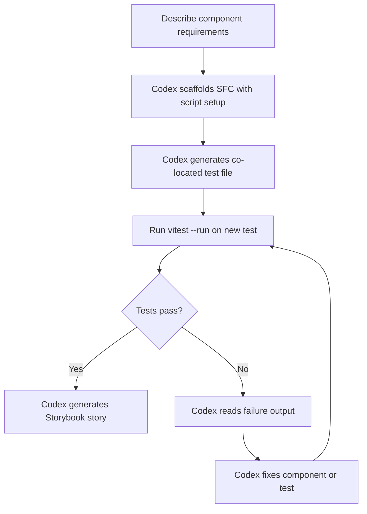
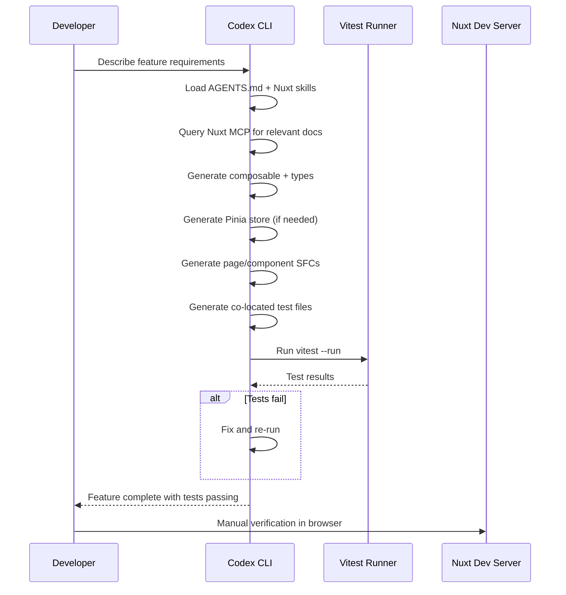

# Codex CLI for Vue and Nuxt Teams: Composition API, Pinia, Vitest, and Agent-Driven Component Workflows


---

Vue 3.6 and Nuxt 4.4 represent the current state of the art for the Vue ecosystem [^1][^2]. Combined with Codex CLI v0.125, Vue teams now have a mature agent-assisted development pipeline covering component scaffolding, Pinia store generation, Vitest testing, and Nuxt MCP integration. This guide provides the AGENTS.md templates, config.toml settings, and workflow recipes needed to make Codex CLI a productive member of your Vue team.

## Prerequisites

This article assumes you are running:

- **Codex CLI** v0.125+ [^3]
- **Vue** 3.6.x with the Composition API
- **Nuxt** 4.4.x (or standalone Vue + Vite 8)
- **Pinia** 3.x for state management
- **Vitest** 3.x with `@vue/test-utils` for testing
- **Node.js** 22 LTS

## AGENTS.md Template for Vue/Nuxt Projects

The most impactful configuration for any Codex CLI project is a well-structured `AGENTS.md` [^4]. Place this at your repository root:

```markdown
# AGENTS.md

## Project Overview
This is a Vue 3.6 / Nuxt 4.4 application using the Composition API
exclusively. TypeScript is mandatory for all new code.

## Architecture
- Components live in `components/` with PascalCase filenames
- Composables in `composables/` prefixed with `use` (e.g. `useAuth.ts`)
- Pinia stores in `stores/` with `defineStore` and setup syntax
- Server routes in `server/api/` following Nitro conventions
- Pages in `pages/` using file-based routing

## Coding Standards
- Use `<script setup lang="ts">` for all Single File Components
- Prefer `ref()` and `computed()` over Options API
- Never use `this` — Composition API only
- Use `defineProps<T>()` and `defineEmits<T>()` with TypeScript generics
- Extract shared logic into composables, not mixins
- Use `toRefs()` when destructuring reactive objects from composables

## Testing
- All components require co-located `*.test.ts` files
- Use `mount()` from `@vue/test-utils` for integration tests
- Use `shallowMount()` for isolated unit tests
- Use `createTestingPinia()` from `@pinia/testing` for store mocking
- Target 80%+ coverage on stores and composables
- Test user-visible behaviour, not internal state

## Review Guidelines
- Flag any Options API usage as P0
- Flag any `any` type as P1
- Flag missing test files for new components as P1
- Flag direct Pinia store mutations outside actions as P2
```

For monorepos, place additional scoped `AGENTS.md` files in each package directory. Codex merges them in directory order, with the closest file taking precedence [^5].

## config.toml Configuration

Configure Codex for Vue development by setting sandbox permissions and model preferences in `~/.codex/config.toml` or a project-level `.codex/config.toml`:

```toml
model = "gpt-5.3-codex"

[sandbox]
# Vitest and Nuxt dev server need network for HMR
permissions = ["disk-full-read-write", "network-localhost"]

[env]
# Ensure Vitest runs in non-interactive mode
CI = "true"
# Nuxt telemetry off to avoid prompts in sandbox
NUXT_TELEMETRY_DISABLED = "1"
```

For teams using profiles, define a dedicated Vue development profile:

```toml
[profiles.vue]
model = "gpt-5.3-codex"
reasoning = "medium"

[profiles.vue-review]
model = "gpt-5.5"
reasoning = "high"
```

Switch at runtime with `codex --profile vue` or `codex --profile vue-review` for code review tasks [^6].

## Installing Nuxt Skills and MCP Server

The Nuxt ecosystem provides two complementary AI integration points: skills files and an MCP server.

### Skills Installation

The `nuxt-skills` package provides 18 skill modules covering Vue, Nuxt, Pinia, Vitest, VueUse, Reka UI, and more [^7]:

```bash
npx skills add onmax/nuxt-skills
```

The CLI auto-detects Codex and copies skill files to `.codex/skills/`. Skills activate automatically when the agent encounters relevant file types — `.vue` files trigger the Vue skill, `server/api/` routes trigger the Nuxt skill.

### Nuxt MCP Server

The official Nuxt MCP server provides live documentation access via HTTP transport [^8]:

```toml
# .codex/config.toml
[mcp_servers.nuxt]
transport = "http"
url = "https://nuxt.com/mcp"
```

This gives Codex access to Nuxt 4.x documentation, blog posts, and deployment guides without consuming context window tokens on static docs.

For Nuxt UI projects, add the component library MCP server as well [^9]:

```toml
[mcp_servers.nuxt-ui]
transport = "http"
url = "https://ui.nuxt.com/mcp"
```

## Component Generation Workflow

A productive pattern for generating Vue components follows a three-phase flow:



### Example Prompt

```
Create a UserCard.vue component in components/ that:
- Accepts props: user (object with name, email, avatarUrl), compact (boolean, default false)
- Emits click event with user id
- Uses Nuxt Image for the avatar
- Has compact and expanded visual states
- Include a UserCard.test.ts with mount tests covering both states and the click emission
```

Codex generates the SFC using `<script setup lang="ts">`, defines typed props with `defineProps<>()`, and creates the test file using `mount()` and `createTestingPinia()` if the component touches any store.

## Pinia Store Patterns

Codex works best with Pinia's setup syntax stores because they align with the Composition API patterns the model is trained on [^10]:

```typescript
// stores/useCartStore.ts
import { defineStore } from 'pinia'
import { ref, computed } from 'vue'

export const useCartStore = defineStore('cart', () => {
  const items = ref<CartItem[]>([])

  const total = computed(() =>
    items.value.reduce((sum, item) => sum + item.price * item.quantity, 0)
  )

  function addItem(product: Product) {
    const existing = items.value.find(i => i.productId === product.id)
    if (existing) {
      existing.quantity++
    } else {
      items.value.push({ productId: product.id, price: product.price, quantity: 1 })
    }
  }

  function removeItem(productId: string) {
    items.value = items.value.filter(i => i.productId !== productId)
  }

  return { items, total, addItem, removeItem }
})
```

### Testing Pinia Stores

The `@pinia/testing` package provides `createTestingPinia()` for injecting initial state and stubbing actions [^11]:

```typescript
// stores/useCartStore.test.ts
import { describe, it, expect } from 'vitest'
import { setActivePinia } from 'pinia'
import { createTestingPinia } from '@pinia/testing'
import { useCartStore } from './useCartStore'

describe('useCartStore', () => {
  it('calculates total from items', () => {
    setActivePinia(createTestingPinia({
      initialState: {
        cart: {
          items: [
            { productId: '1', price: 10, quantity: 2 },
            { productId: '2', price: 5, quantity: 3 },
          ],
        },
      },
    }))
    const store = useCartStore()
    expect(store.total).toBe(35)
  })
})
```

When asking Codex to generate store tests, include the directive: *"Use createTestingPinia with initialState injection. Test computed getters and action side-effects separately."*

## Composable Extraction Workflow

One of Codex's strongest patterns for Vue development is extracting composables from complex components. Prompt:

```
Extract the data-fetching and pagination logic from pages/users.vue into
a composables/useUserList.ts composable. The composable should return
{ users, loading, error, page, nextPage, prevPage }. Update the page
component to use the new composable and add a useUserList.test.ts file.
```

Codex identifies the reactive state, watchers, and lifecycle hooks in the component, moves them to a standalone function, and rewires the component to call the composable — maintaining the same runtime behaviour.

## Nuxt-Specific Patterns

### Server Route Generation

For Nuxt server routes, Codex generates Nitro-compatible handlers:

```
Create a server/api/products/[id].get.ts route that:
- Validates the id parameter with zod
- Fetches from the products table using Drizzle ORM
- Returns 404 with a typed error if not found
- Add a matching server/api/products/[id].get.test.ts using $fetch
```

### Auto-Import Awareness

Nuxt 4's auto-import system means `ref`, `computed`, `useRoute`, and other Vue/Nuxt APIs are available without explicit imports [^12]. Your AGENTS.md should note this:

```markdown
## Nuxt Auto-Imports
Do NOT add explicit imports for Vue reactivity APIs (ref, computed, watch,
etc.) or Nuxt composables (useRoute, useFetch, navigateTo, etc.) in
components and pages. These are auto-imported by Nuxt. Only add explicit
imports in non-Nuxt files like standalone composables and test files.
```

## Hooks for Quality Gates

Codex CLI hooks can enforce Vue-specific quality gates. Add a `post_tool_use` hook in your config to lint generated components:

```toml
[[hooks.post_tool_use]]
event = "file_write"
pattern = "**/*.vue"
command = "npx eslint --fix $FILE && npx vue-tsc --noEmit"
```

This runs ESLint with `eslint-plugin-vue` and type-checks with `vue-tsc` after every file write, catching template compilation errors and style violations before they enter the conversation [^13].

## Model Selection for Vue Tasks

Different tasks benefit from different models:

| Task | Recommended Model | Reasoning Effort |
|------|-------------------|-----------------|
| Component scaffolding | `gpt-5.3-codex` | medium |
| Composable extraction | `gpt-5.3-codex` | medium |
| Complex refactoring | `gpt-5.5` | high |
| Code review | `gpt-5.5` | high |
| Test generation | `gpt-5.3-codex` | medium |
| Nuxt config/migration | `gpt-5.3-codex` | high |

Use `/fast` in the TUI to switch to `codex-spark` for quick scaffolding tasks, and `/model gpt-5.5` when tackling complex Nuxt migration work [^14].

## Putting It All Together: Feature Development Recipe

A complete feature development workflow for a Vue/Nuxt team:



## Common Pitfalls

**Reactivity loss**: Codex occasionally destructures reactive objects without `toRefs()`. Your AGENTS.md rule about `toRefs()` catches this in review.

**Options API regression**: Without explicit guidance, models sometimes fall back to `export default { data() {...} }`. The P0 review guideline prevents this from merging.

**Over-importing auto-imports**: Codex may add `import { ref } from 'vue'` in Nuxt page files where it is unnecessary. The auto-import note in AGENTS.md addresses this.

**Snapshot testing**: Codex defaults to snapshot tests if not guided otherwise. The AGENTS.md testing section steers it towards behavioural assertions.

## Conclusion

The Vue/Nuxt ecosystem's embrace of AI tooling — from the official Nuxt MCP server to the community `nuxt-skills` package — makes it one of the best-integrated frontend frameworks for Codex CLI workflows. A well-structured AGENTS.md, the right skills and MCP servers, and clear testing directives turn Codex into a reliable pair programmer that understands Composition API idioms, Pinia patterns, and Nuxt conventions.

---

## Citations

[^1]: Vue.js 3.6 — "Vue, Nuxt & Vite Status in 2026: Risks, Priorities & Architecture." FiveJars, 2026. [https://fivejars.com/insights/vue-nuxt-vite-status-for-2026-risks-priorities-architecture-updates/](https://fivejars.com/insights/vue-nuxt-vite-status-for-2026-risks-priorities-architecture-updates/)

[^2]: Nuxt 4.4 release — "Releases." GitHub, nuxt/nuxt, 2026. [https://github.com/nuxt/nuxt/releases](https://github.com/nuxt/nuxt/releases)

[^3]: Codex CLI v0.125 release — "Releases." GitHub, openai/codex, April 2026. [https://github.com/openai/codex/releases](https://github.com/openai/codex/releases)

[^4]: AGENTS.md documentation — "Customization." OpenAI Developers, Codex, 2026. [https://developers.openai.com/codex/concepts/customization](https://developers.openai.com/codex/concepts/customization)

[^5]: AGENTS.md merge order — "Best practices." OpenAI Developers, Codex, 2026. [https://developers.openai.com/codex/learn/best-practices](https://developers.openai.com/codex/learn/best-practices)

[^6]: Configuration profiles — "Advanced Configuration." OpenAI Developers, Codex, 2026. [https://developers.openai.com/codex/config-advanced](https://developers.openai.com/codex/config-advanced)

[^7]: nuxt-skills — onmax/nuxt-skills. GitHub, 2026. [https://github.com/onmax/nuxt-skills](https://github.com/onmax/nuxt-skills)

[^8]: Nuxt MCP Server — "Working with AI: Nuxt MCP Server v4." Nuxt Documentation, 2026. [https://nuxt.com/docs/4.x/guide/ai/mcp](https://nuxt.com/docs/4.x/guide/ai/mcp)

[^9]: Nuxt UI MCP Server — "MCP Server." Nuxt UI Documentation, 2026. [https://ui.nuxt.com/docs/getting-started/ai/mcp](https://ui.nuxt.com/docs/getting-started/ai/mcp)

[^10]: Pinia setup stores — "Dealing with Composables." Pinia Documentation, 2026. [https://pinia.vuejs.org/cookbook/composables.html](https://pinia.vuejs.org/cookbook/composables.html)

[^11]: @pinia/testing — "Testing stores." Pinia Documentation, 2026. [https://pinia.vuejs.org/cookbook/testing.html](https://pinia.vuejs.org/cookbook/testing.html)

[^12]: Nuxt auto-imports — "Vue.js Development." Nuxt 4 Documentation, 2026. [https://nuxt.com/docs/4.x/guide/concepts/vuejs-development](https://nuxt.com/docs/4.x/guide/concepts/vuejs-development)

[^13]: Codex CLI hooks — "Features." OpenAI Developers, Codex CLI, 2026. [https://developers.openai.com/codex/cli/features](https://developers.openai.com/codex/cli/features)

[^14]: Codex CLI model selection — "Models." OpenAI Developers, Codex, 2026. [https://developers.openai.com/codex/models](https://developers.openai.com/codex/models)
