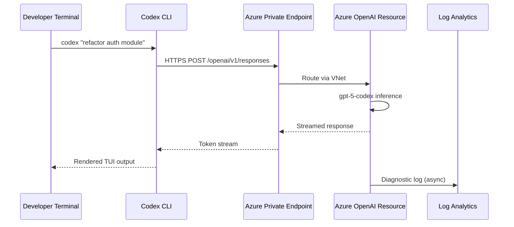
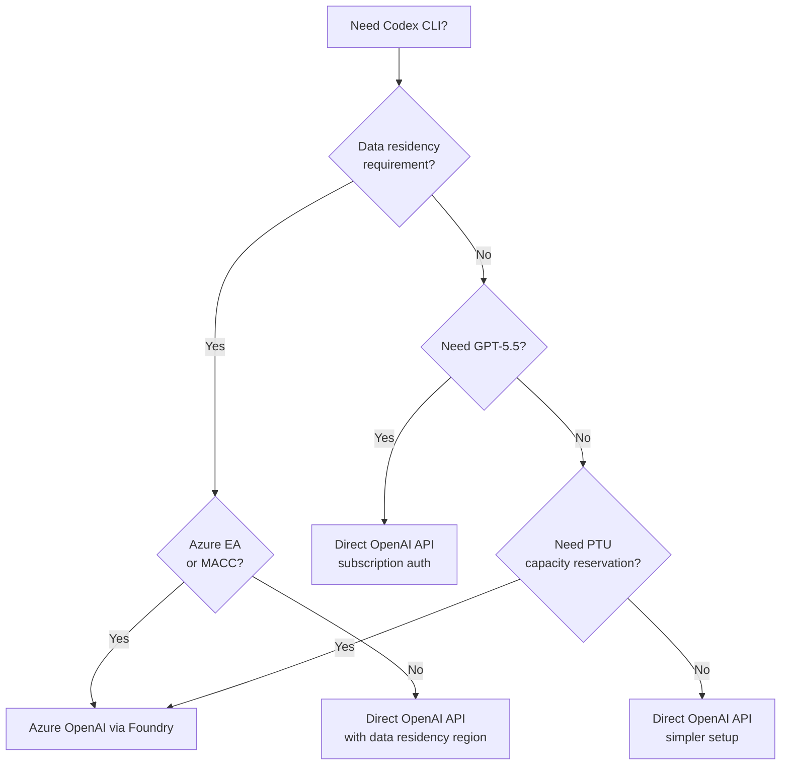

# Codex CLI with Azure OpenAI and Microsoft Foundry: Enterprise Agent Deployment on Azure Infrastructure


---

Codex CLI's first-party GitHub integration makes it trivially easy to start coding with agents — but many enterprise engineering teams run on Azure infrastructure with strict data-residency, networking, and compliance requirements. Running Codex CLI through Azure OpenAI in Microsoft Foundry keeps every token inside your Azure tenancy, routes traffic through private endpoints, and bills through your existing Enterprise Agreement[^1]. This article walks through the full setup: model deployment, TOML configuration, CI/CD integration, and the operational trade-offs you need to understand before rolling this out to a team.

## Why Azure OpenAI Rather Than Direct OpenAI API?

The core value proposition is compliance boundary preservation. When you point Codex CLI at an Azure OpenAI resource, your prompts and completions never leave the Azure region you deployed into[^1]. You gain:

- **Private networking** — VNet injection and Private Link keep traffic off the public internet[^1].
- **Role-Based Access Control** — Azure RBAC governs who can call the deployment, replacing bare API keys with Entra ID service principals (once Entra ID support ships for Codex — currently not available)[^2].
- **Predictable cost management** — Provisioned Throughput Units (PTUs) let you reserve capacity and cap spend, avoiding surprise token bills during multi-agent runs[^1].
- **Audit logging** — Azure Diagnostic Settings stream every API call to Log Analytics, meeting SOC 2 and ISO 27001 evidence requirements[^3].

The trade-off is model availability lag: new models typically reach the direct OpenAI API days or weeks before Azure OpenAI deployments catch up.

## Available Codex-Optimised Models on Azure

As of late April 2026, Microsoft Foundry offers the following reasoning models suitable for Codex CLI[^2]:

| Model | Strength | Notes |
|-------|----------|-------|
| `gpt-5.3-codex` | Latest agentic coding, front-end generation | Updated April 2026[^4] |
| `gpt-5.2-codex` | Stable general-purpose coding | Wide regional availability |
| `gpt-5.1-codex-max` | Extended context, long-horizon tasks | Higher PTU requirement |
| `gpt-5.1-codex` | Balanced cost/performance | Good default for teams |
| `gpt-5.1-codex-mini` | Fast, cost-efficient subagent work | Ideal for review/lint loops |
| `gpt-5-codex` | Original Codex-family flagship | Most mature, broadest region support[^5] |
| `gpt-5-mini` | Lightweight general model | Budget CI tasks |

> **Note:** GPT-5.5 is currently available only when authenticated via ChatGPT (subscription-based), not through API-key authentication against Azure OpenAI deployments[^6]. If your workflows depend on GPT-5.5 specifically, you will need to use direct OpenAI access until Azure Foundry adds support. ⚠️ This may change — check the [Azure model catalog](https://ai.azure.com/catalog/) for the latest availability.

## Step-by-Step Setup

### 1. Deploy a Model in Foundry

Navigate to [Microsoft Foundry](https://ai.azure.com), create or select a project, then deploy a reasoning model from the catalogue[^2]:

```bash
# Alternatively, deploy via Azure CLI
az cognitiveservices account deployment create \
  --name my-openai-resource \
  --resource-group my-rg \
  --deployment-name gpt-5-codex \
  --model-name gpt-5-codex \
  --model-version "2026-04-01" \
  --sku-capacity 10 \
  --sku-name "Standard"
```

Copy the **endpoint URL** and **API key** from the deployment's overview pane.

### 2. Install Codex CLI

```bash
# macOS
brew install --cask codex
codex --version

# Linux / WSL2
npm install -g @openai/codex
codex --version
```

Requirements: macOS 12+, Ubuntu 20.04+, Debian 10+, or Windows 11 via WSL2. Minimum 4 GB RAM (8 GB recommended). Git 2.23+ is optional but recommended for PR helpers[^2].

### 3. Configure `config.toml`

Create or edit `~/.codex/config.toml`:

```toml
model = "gpt-5-codex"               # Must match your Azure deployment name
model_provider = "azure"
model_reasoning_effort = "medium"    # low | medium | high | xhigh

[model_providers.azure]
name = "Azure OpenAI"
base_url = "https://YOUR_RESOURCE_NAME.openai.azure.com/openai/v1"
env_key = "AZURE_OPENAI_API_KEY"
wire_api = "responses"
```

Then export the key:

```bash
export AZURE_OPENAI_API_KEY   # set this to your Azure deployment key
```

> **Critical:** `env_key` must reference an *environment variable name*, not the key itself. Embedding secrets directly in `config.toml` will fail silently[^2].

### 4. Verify the Connection

```bash
codex "List the files in this directory and describe the project structure"
```

If you see a `401 Unauthorized`, double-check that your environment variable is exported in the current shell. If you see `404 Not Found`, verify the `/v1` suffix in your `base_url`[^2].

## Advanced Configuration: Retries, Timeouts, and Query Parameters

For production deployments behind corporate proxies or with high-latency private endpoints, tune the retry and timeout settings:

```toml
[model_providers.azure]
name = "Azure OpenAI"
base_url = "https://YOUR_RESOURCE_NAME.openai.azure.com/openai/v1"
env_key = "AZURE_OPENAI_API_KEY"
wire_api = "responses"
request_max_retries = 4              # retry on transient 5xx errors
stream_max_retries = 10              # streaming reconnection attempts
stream_idle_timeout_ms = 300000      # 5 minutes before dropping idle stream
```

If your Azure resource still requires explicit API versioning (pre-v1 endpoints), add query parameters:

```toml
query_params = { api-version = "2025-04-01-preview" }
```

The v1 Responses API path (`/openai/v1`) no longer requires `api-version`, but older deployments may still need it[^2][^7].

## Architecture: How Traffic Flows



When Private Link is enabled, the `base_url` resolves to a private IP within your VNet. No traffic traverses the public internet, satisfying data-residency requirements for regulated industries[^1][^3].

## CI/CD Integration with Azure Pipelines

While Codex CLI ships a first-party GitHub Action (`openai/codex-action@v1`)[^8], Azure Pipelines integration requires a manual task definition. The pattern is straightforward:

### Azure Pipelines YAML

```yaml
# azure-pipelines.yml
trigger:
  branches:
    include:
      - main

pool:
  vmImage: 'ubuntu-latest'

steps:
  - task: NodeTool@0
    inputs:
      versionSpec: '20.x'

  - script: npm install -g @openai/codex
    displayName: 'Install Codex CLI'

  - script: |
      codex -p azure exec --full-auto \
        "Review the last commit for security issues and suggest fixes"
    displayName: 'Run Codex security review'
    env:
      AZURE_OPENAI_API_KEY: $(AZURE-OPENAI-API-KEY)
```

Store `AZURE_OPENAI_API_KEY` as a pipeline secret variable or link it from Azure Key Vault[^9].

### GitHub Actions with Azure Backend

If your code is on GitHub but inference must stay on Azure, use the standard `codex-action` with your Azure provider config:

```yaml
jobs:
  codex-review:
    runs-on: ubuntu-latest
    steps:
      - uses: actions/checkout@v4
      - name: Run Codex on Azure OpenAI
        run: |
          npm install -g @openai/codex
          AZURE_OPENAI_API_KEY="${{secrets.AZURE_OPENAI_KEY}}"
          export AZURE_OPENAI_API_KEY
          codex -p azure exec --full-auto \
            "update CHANGELOG for next release"
```

The `-p azure` flag selects the Azure provider profile directly from the command line[^2].

## VS Code Extension with Azure

The [OpenAI Codex extension](https://marketplace.visualstudio.com/items?itemName=openai.chatgpt) reads your `config.toml` automatically[^2]. One quirk to note on WSL2: the extension may look for the API key environment variable on the Windows host rather than within the WSL session. Set the variable in both environments:

```bash
# In WSL
export AZURE_OPENAI_API_KEY   # same key as above

# On Windows (PowerShell)
[System.Environment]::SetEnvironmentVariable(
  "AZURE_OPENAI_API_KEY", "<paste-key-here>", "User"
)
```

Then launch VS Code from the WSL terminal with `code .` to ensure the variable is inherited[^2].

## Multi-Model Configuration for Cost Optimisation

Enterprise teams rarely use a single model for everything. Configure multiple Azure deployments and switch between them per task:

```toml
model = "gpt-5-codex"
model_provider = "azure"

[model_providers.azure]
name = "Azure OpenAI - Primary"
base_url = "https://myresource.openai.azure.com/openai/v1"
env_key = "AZURE_OPENAI_API_KEY"
wire_api = "responses"

[model_providers.azure-mini]
name = "Azure OpenAI - Mini"
base_url = "https://myresource.openai.azure.com/openai/v1"
env_key = "AZURE_OPENAI_API_KEY"
wire_api = "responses"
```

Then switch at the command line:

```bash
# Primary model for complex refactoring
codex -p azure -m gpt-5-codex "refactor the auth module to use OIDC"

# Mini model for quick review tasks
codex -p azure-mini -m gpt-5.1-codex-mini "/review"
```

This pattern lets teams use `gpt-5.1-codex-mini` for subagent delegation, linting, and review loops whilst reserving `gpt-5-codex` or `gpt-5.3-codex` for complex implementation tasks — cutting token costs by 60-70% on routine operations[^10].

## Decision Framework: When to Use Azure OpenAI vs Direct API



## Known Limitations

- **Entra ID not yet supported** — Codex CLI currently requires API key authentication against Azure OpenAI. Managed identity and Entra ID token-based auth are not available yet[^2]. ⚠️ Track [the feature request](https://github.com/openai/codex/issues/10665) for updates.
- **GPT-5.5 unavailable on Azure** — As of late April 2026, GPT-5.5 requires ChatGPT subscription authentication, not API-key auth[^6].
- **No native Azure Repos integration** — Codex Cloud's first-class git integration currently supports GitHub only. For Azure Repos, use Codex CLI locally or in Azure Pipelines[^11].
- **Model availability lag** — New model versions typically appear on the direct OpenAI API before Azure Foundry deployments.

## Troubleshooting Quick Reference

| Symptom | Fix |
|---------|-----|
| `401 Unauthorized` | Verify `AZURE_OPENAI_API_KEY` is exported; confirm key has deployment access[^2] |
| `404 Not Found` | Check `base_url` includes `/v1` suffix and correct resource name[^2] |
| CLI ignores Azure settings | Ensure `model_provider = "azure"` is set at top level of `config.toml`[^2] |
| WSL + VS Code key not found | Set the env var on both the Windows host and WSL[^2] |
| Streaming timeouts | Increase `stream_idle_timeout_ms` for high-latency private endpoints[^7] |

## Citations

[^1]: Microsoft, "Codex with Azure OpenAI in Microsoft Foundry Models", *Microsoft Learn*, updated 14 April 2026. [https://learn.microsoft.com/en-us/azure/foundry/openai/how-to/codex](https://learn.microsoft.com/en-us/azure/foundry/openai/how-to/codex)

[^2]: Microsoft, "Codex with Azure OpenAI in Microsoft Foundry Models — Setup and Configuration", *Microsoft Learn*, updated 14 April 2026. [https://learn.microsoft.com/en-us/azure/foundry/openai/how-to/codex](https://learn.microsoft.com/en-us/azure/foundry/openai/how-to/codex)

[^3]: Microsoft, "Azure OpenAI Service diagnostic logging", *Microsoft Learn*. [https://learn.microsoft.com/en-us/azure/ai-services/openai/how-to/monitoring](https://learn.microsoft.com/en-us/azure/ai-services/openai/how-to/monitoring)

[^4]: OpenAI, "Introducing GPT-5.3-Codex", *OpenAI Blog*, February 2026. [https://openai.com/index/introducing-gpt-5-3-codex/](https://openai.com/index/introducing-gpt-5-3-codex/)

[^5]: Azure AI, "gpt-5-codex — Azure AI Model Catalog". [https://ai.azure.com/catalog/models/gpt-5-codex](https://ai.azure.com/catalog/models/gpt-5-codex)

[^6]: OpenAI, "Codex Changelog — GPT-5.5 Availability", *OpenAI Developers*, April 2026. [https://developers.openai.com/codex/changelog](https://developers.openai.com/codex/changelog)

[^7]: OpenAI, "Advanced Configuration — Codex CLI", *OpenAI Developers*. [https://developers.openai.com/codex/config-advanced](https://developers.openai.com/codex/config-advanced)

[^8]: OpenAI, "GitHub Action — Codex", *OpenAI Developers*. [https://developers.openai.com/codex/github-action](https://developers.openai.com/codex/github-action)

[^9]: Microsoft, "Use secrets and variables in Azure Pipelines", *Microsoft Learn*. [https://learn.microsoft.com/en-us/azure/devops/pipelines/process/variables](https://learn.microsoft.com/en-us/azure/devops/pipelines/process/variables)

[^10]: OpenAI, "Codex CLI Models — Pricing and Capabilities", *OpenAI Developers*. [https://developers.openai.com/codex/models](https://developers.openai.com/codex/models)

[^11]: GitHub Issue #10665, "Feature Request: Native Azure DevOps (Azure Repos) Integration for Codex", *openai/codex*. [https://github.com/openai/codex/issues/10665](https://github.com/openai/codex/issues/10665)
