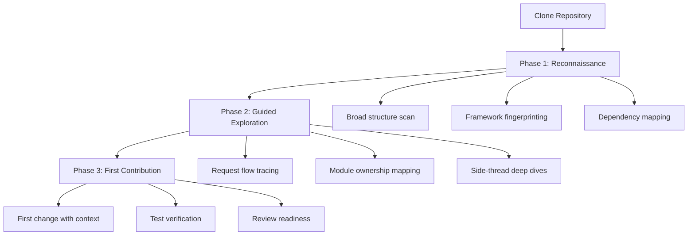
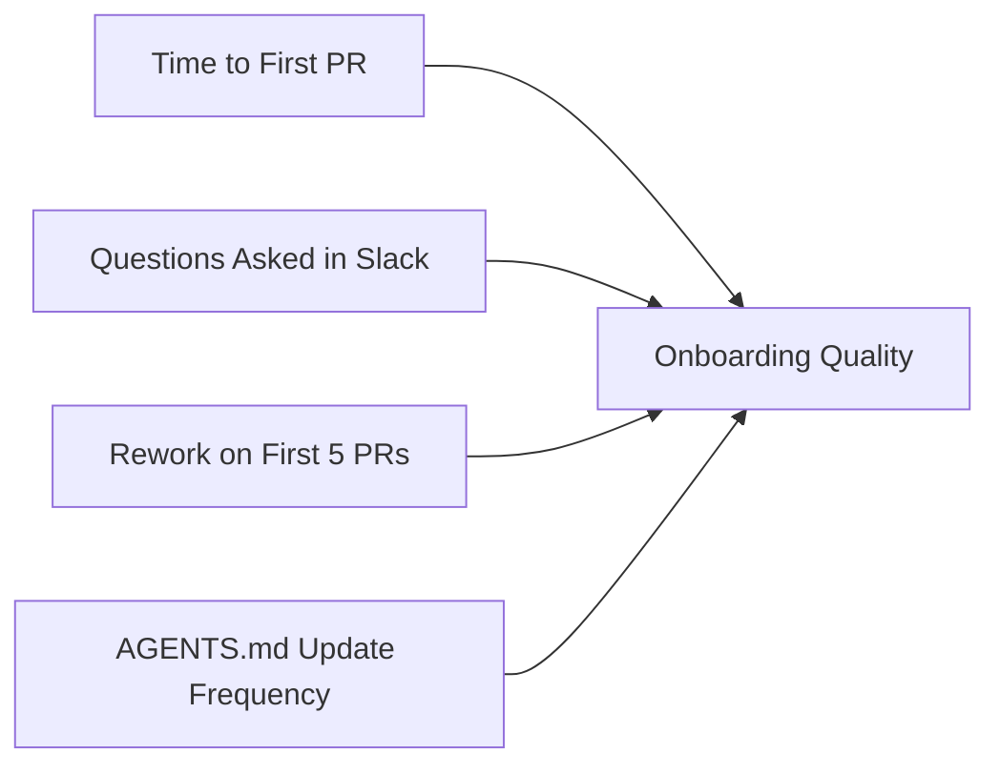

# Codebase Onboarding with Codex CLI: Using AI Agents to Ramp Up on Unfamiliar Projects


---

Every developer knows the feeling: you join a new team on Monday, clone a repository with 800 files across 40 directories, and spend the next fortnight piecing together how it all fits. Traditional onboarding — reading READMEs, grepping for entry points, asking colleagues — works, but it scales poorly and relies on tribal knowledge that may not be documented at all.

Codex CLI turns codebase onboarding from a passive reading exercise into an interactive, agent-assisted exploration. Instead of scanning files top-to-bottom, you ask targeted questions, trace request flows, and build mental models in minutes rather than days[^1]. This article covers the practical patterns, tools, and configuration that make that possible in April 2026.

## Why Agents Change the Onboarding Equation

The core bottleneck in onboarding is not reading speed — it is knowing *what* to read and *in what order*. A senior developer who already knows the codebase would tell you "start with `cmd/server/main.go`, then look at `internal/router/`, then check how middleware chains are composed." That guided tour is exactly what Codex CLI provides when pointed at a repository[^1].

GPT-5.5, Codex CLI's default model since April 2026, brings a 400K-token context window in Codex sessions[^2]. For most repositories, that is enough to hold the entire directory structure, key configuration files, and several critical source files simultaneously — enabling whole-codebase reasoning that was impractical with smaller context windows.

## The Three-Phase Onboarding Workflow



### Phase 1: Reconnaissance

Start with a broad sweep. The official Codex onboarding use case recommends opening with a simple, unconstrained prompt[^1]:

```bash
codex "Explain this repo to me"
```

This gives Codex freedom to scan the directory tree, read key files (package manifests, configuration, entry points), and produce a high-level summary. For a more structured output, use the four-part prompt pattern from OpenAI's best practices[^3]:

```bash
codex "I'm a new developer joining this project.
Goal: Understand the architecture and key modules.
Context: @README.md @package.json @src/
Constraints: Focus on runtime architecture, not build tooling.
Done: Produce a numbered list of the 10 most important files I should read, in order."
```

The `@`-mention syntax triggers Codex's fuzzy file search, pulling specific files into context[^4]. For monorepos, scope the exploration with `--cd`:

```bash
codex --cd ./services/payments "Explain this service's architecture"
```

### Phase 2: Guided Exploration

Once you have the lay of the land, dive deeper with targeted prompts. The official onboarding guide suggests tracing request flows[^1]:

```bash
codex "Trace how an HTTP request to POST /api/orders flows through the codebase.
Include: which modules own what, where data is validated,
where side effects happen, and top gotchas before making changes.
End with the files I should read next."
```

Use `/side` for tangential questions that should not pollute your main exploration thread[^5]:

```
/side What ORM does this project use and how are migrations managed?
```

The `/side` command spawns an ephemeral fork — Codex answers the question with full context from the current session but discards the side-thread afterwards, keeping your main thread focused[^5].

For deeper architectural dives, use `/fork` to create a persistent branch you can return to:

```
/fork Let me explore the authentication subsystem separately
```

### Phase 3: First Contribution

With a mental model in place, make your first change with Codex as a safety net:

```bash
codex "Add a rate limiter middleware to the /api/orders endpoint.
Before making any changes, explain which files will be affected
and what tests I should run to verify the change."
```

Codex will identify affected modules, propose the change, and — critically — tell you which existing tests cover the area and what new tests might be needed[^3].

## Encoding Onboarding Knowledge in AGENTS.md

The most impactful long-term investment is encoding onboarding guidance in AGENTS.md so that every new developer (and every Codex session) starts with the same context[^6]. A well-crafted AGENTS.md acts as the guided tour that a senior colleague would give:

```markdown
# AGENTS.md

## Architecture Overview
This is a Go microservice using Chi router with PostgreSQL via sqlc.
Entry point: `cmd/server/main.go` → `internal/server/server.go`.

## Key Directories
- `internal/handler/` — HTTP handlers, one file per resource
- `internal/service/` — Business logic layer, no HTTP imports allowed
- `internal/repository/` — Database access via sqlc-generated code
- `migrations/` — SQL migrations managed by golang-migrate

## Conventions
- All handlers return `(response, error)` tuples
- Tests live alongside source files as `*_test.go`
- Integration tests require `TEST_DB_URL` environment variable

## Build & Test
- `make build` — compile
- `make test` — unit tests
- `make test-integration` — requires running PostgreSQL

## Common Gotchas
- The `internal/auth/` middleware caches JWKs for 5 minutes
- sqlc regeneration: run `make generate` after changing `query.sql`
- The `internal/events/` package uses a fan-out pattern; adding
  subscribers requires updating `events/registry.go`
```

OpenAI's best practices are clear: "a short, accurate AGENTS.md is more useful than a long file full of vague rules"[^3]. Keep it under 500 lines and update it when Codex makes the same mistake twice — ask for a retrospective and fold the lesson back into the file[^3].

For monorepos, use hierarchical AGENTS.md files. Codex reads the nearest file in the directory tree, so each subdirectory can carry its own context[^6]:

```
repo/
├── AGENTS.md              # Global conventions
├── services/
│   ├── payments/
│   │   └── AGENTS.md      # Payment-specific guidance
│   └── notifications/
│       └── AGENTS.md      # Notification-specific guidance
```

## Onboarding Skills and MCP Tools

### The codebase-onboarding Skill

The community `codebase-onboarding` skill automates the reconnaissance phase[^7]. Install it via the built-in skill installer:

```
$skill-installer install codebase-onboarding
```

Once installed, invoke it with:

```
$codebase-onboarding
```

The skill runs a fast recon phase — scanning package manifests, framework fingerprints, entry points, directory structure, configuration, and test layout — then produces a structured onboarding document with an architecture map, key entry points, conventions, and a prioritised reading checklist[^7].

### GitNexus: Knowledge Graph for Structural Awareness

For larger codebases where understanding dependency relationships is critical, GitNexus provides an MCP-native knowledge graph that indexes the entire repository[^8]. It maps every function call, import, class inheritance, and execution flow, then exposes that graph to Codex through seven MCP tools[^8].

Configure GitNexus in your `config.toml`:

```toml
[mcp_servers.gitnexus]
command = "npx"
args = ["-y", "gitnexus", "--mcp"]
```

Key tools for onboarding:

| Tool | Purpose |
|------|---------|
| `generate_map` | Auto-generates Mermaid architecture diagrams from the knowledge graph[^8] |
| `detect_changes` | Pre-commit risk analysis showing blast radius of proposed changes[^8] |
| `rename` | Coordinated multi-file symbol renames with dependency awareness[^8] |

With GitNexus active, you can ask Codex questions like:

```
What functions depend on UserRepository.findById()
and what would break if I changed its return type?
```

GitNexus returns a confidence-scored blast radius in a single tool call, rather than requiring Codex to chain multiple file reads[^8].

### Understand-Anything: Interactive Dashboards

The Understand-Anything skill takes a different approach — it analyses your codebase with a multi-agent pipeline, builds a JSON knowledge graph, and serves an interactive React dashboard where you can visually explore the architecture[^9]. The `/understand-onboard` command generates a guided onboarding tour that can be handed directly to new team members[^9].

## Configuration for Onboarding Sessions

Onboarding sessions are read-heavy and exploration-focused. Configure Codex accordingly:

```toml
# ~/.codex/config.toml — onboarding profile

model = "gpt-5.5"
approval_policy = "unless-allow-listed"

[history]
persistence = "across-sessions"

[reasoning]
effort = "medium"
```

Use `medium` reasoning effort for exploration — it provides good analysis without the token overhead of `high` or `xhigh`, keeping costs manageable during the learning phase[^10]. Reserve `high` effort for when you are tracing subtle bugs or complex state transitions.

For read-only exploration where you want zero risk of accidental changes:

```bash
codex --sandbox read-only "Explain the authentication flow in this repo"
```

The `read-only` sandbox mode prevents Codex from writing files or executing commands, making it safe to explore freely[^11].

## Onboarding Workflow Patterns

### The Architecture Decision Record (ADR) Extraction

Many projects have architectural decisions buried in pull request discussions and commit messages. Use Codex to surface them:

```bash
codex "Scan the git log for the last 6 months. Identify architectural
decisions — framework choices, pattern changes, library migrations.
Produce a summary in ADR format (Context, Decision, Consequences)."
```

### The Dependency Audit

Before writing any code, understand what you are building on:

```bash
codex "Audit the project's dependencies. For each major dependency,
explain: what it does, why it was likely chosen, whether it's actively
maintained, and any known security advisories."
```

### The Test Coverage Map

Understanding what is tested — and what is not — tells you where to be cautious:

```bash
codex "Run the test suite and analyse coverage. Identify the three
least-tested areas of the codebase and explain what risks that creates."
```

### The Multi-Service Exploration

For microservice architectures, use `--add-dir` to explore across service boundaries[^4]:

```bash
codex --cd ./services/api-gateway \
      --add-dir ./services/user-service \
      --add-dir ./services/order-service \
      "How does user authentication flow across these three services?"
```

## Measuring Onboarding Effectiveness

Track onboarding quality with concrete metrics:



Teams using agent-assisted onboarding typically report halving time-to-first-PR compared to traditional approaches[^12]. The key insight is that Codex does not replace human onboarding — it handles the mechanical exploration so that conversations with colleagues focus on *why* decisions were made rather than *where* things are.

## Anti-Patterns to Avoid

**Trusting summaries blindly.** Codex may occasionally miss nuance in complex codebases. Verify architectural claims by reading the actual files it references. Use `@` mentions to pull specific files into context and cross-check[^3].

**Skipping AGENTS.md.** Without project-specific guidance, Codex falls back to generic patterns. Even a 20-line AGENTS.md dramatically improves onboarding quality for subsequent developers[^6].

**Over-scoping exploration prompts.** "Explain everything about this repo" produces vague output. Scope prompts to specific features, flows, or subsystems for actionable results[^1].

**Ignoring the token budget.** Even with GPT-5.5's 400K-token Codex context, large monorepos can exceed it. Use `--cd` and `@` mentions to focus context on the relevant subsystem rather than loading everything[^2].

## Putting It All Together

A practical first-day onboarding script:

```bash
#!/usr/bin/env bash
# onboard.sh — AI-assisted developer onboarding

REPO_DIR="${1:-.}"

echo "=== Phase 1: Reconnaissance ==="
codex --cd "$REPO_DIR" --sandbox read-only \
  "Analyse this repository and produce:
   1. Technology stack summary
   2. Architecture diagram (Mermaid)
   3. Top 10 files to read, in order
   4. Build and test commands
   5. Common gotchas for new developers"

echo "=== Phase 2: Generate AGENTS.md (if missing) ==="
if [ ! -f "$REPO_DIR/AGENTS.md" ]; then
  codex --cd "$REPO_DIR" \
    "Generate an AGENTS.md for this repository following OpenAI's
     recommended format. Include architecture overview, key directories,
     conventions, build/test commands, and common gotchas."
fi
```

Run this on day one, then spend the rest of the week deepening your understanding through targeted `/side` explorations and `/fork` branches for each major subsystem. By the end of the first week, you will have a mental model that would traditionally take a month to build — and an AGENTS.md that makes the next person's onboarding even faster.

## Citations

[^1]: OpenAI, "Understand large codebases — Codex use cases," [https://developers.openai.com/codex/use-cases/codebase-onboarding](https://developers.openai.com/codex/use-cases/codebase-onboarding)

[^2]: OpenAI, "GPT-5.5's Million-Token Context Window: Practical Strategies for Codex CLI Long-Context Workflows," April 2026. GPT-5.5 provides 400K tokens in Codex sessions and 1M via direct API.

[^3]: OpenAI, "Best practices — Codex," [https://developers.openai.com/codex/learn/best-practices](https://developers.openai.com/codex/learn/best-practices)

[^4]: OpenAI, "Features — Codex CLI," [https://developers.openai.com/codex/cli/features](https://developers.openai.com/codex/cli/features)

[^5]: OpenAI, "Codex CLI Conversation Branching: /side, /fork, and Plan Mode Workflows," documented in Codex CLI v0.122+ slash commands. See [https://developers.openai.com/codex/cli/slash-commands](https://developers.openai.com/codex/cli/slash-commands)

[^6]: OpenAI, "Custom instructions with AGENTS.md — Codex," [https://developers.openai.com/codex/guides/agents-md](https://developers.openai.com/codex/guides/agents-md)

[^7]: Community codebase-onboarding skill. Available via Codex skill marketplace and GitHub. See [https://lobehub.com/skills/sehoon787-my-codex-codebase-onboarding](https://lobehub.com/skills/sehoon787-my-codex-codebase-onboarding)

[^8]: Abhigyan Patwari, "GitNexus: The Zero-Server Code Intelligence Engine," [https://github.com/abhigyanpatwari/GitNexus](https://github.com/abhigyanpatwari/GitNexus). 28K+ GitHub stars as of April 2026.

[^9]: Lum1104, "Understand-Anything," [https://github.com/Lum1104/Understand-Anything](https://github.com/Lum1104/Understand-Anything)

[^10]: OpenAI, "Codex CLI Speed Stack: Fast Mode, Reasoning Effort, Spark, and Performance Tuning," April 2026. Medium effort provides good analysis for exploration at lower token cost.

[^11]: OpenAI, "Agent approvals & security — Codex," [https://developers.openai.com/codex/agent-approvals-security](https://developers.openai.com/codex/agent-approvals-security)

[^12]: ⚠️ Anecdotal reports from community discussions and enterprise case studies. No peer-reviewed study quantifying agent-assisted onboarding speedup exists as of April 2026.
