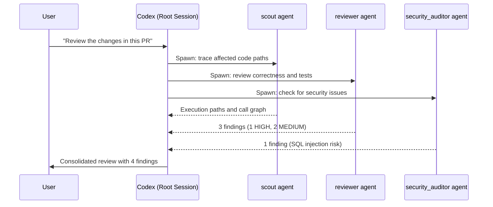
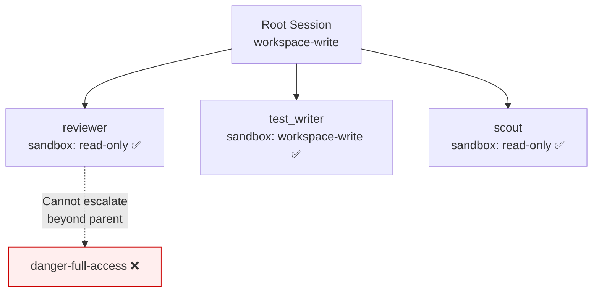

# Codex CLI Custom Agent Definitions: Building Specialised Subagents with TOML Configuration


---

Codex CLI ships with three built-in agent types — `default`, `worker`, and `explorer` — but the real power emerges when you define your own [^1]. Custom agent definitions let you encode team-specific roles (reviewer, security auditor, documentation researcher, test writer) as standalone TOML files, each with its own model, sandbox policy, MCP servers, and behavioural instructions. This article is a practitioner's reference for building, configuring, and orchestrating custom agents in Codex CLI v0.125.

## Why Custom Agent Definitions Matter

The built-in agents are deliberately generic. A `worker` agent will happily write code, run tests, and explore the filesystem, but it has no opinion about _how_ your team reviews pull requests or which MCP servers your documentation pipeline requires. Custom agents solve this by letting you:

- **Constrain scope** — a read-only `reviewer` agent cannot accidentally modify files during code review [^2].
- **Optimise cost** — assign `gpt-5.3-codex-spark` to high-volume, low-complexity tasks whilst reserving `gpt-5.5` for deep analysis [^3].
- **Attach tooling** — bind specific MCP servers to agents that need them, keeping the tool surface minimal for everyone else [^1].
- **Standardise behaviour** — `developer_instructions` act as per-agent system prompts, enforcing team conventions without polluting the root AGENTS.md [^2].

## File Layout and Discovery

Codex discovers custom agent definitions from two locations [^1]:

| Scope | Directory | Use case |
|-------|-----------|----------|
| Personal | `~/.codex/agents/` | Cross-project agents (your personal reviewer, your preferred explorer) |
| Project | `.codex/agents/` | Team-shared agents committed to version control |

Each `.toml` file defines exactly one agent. The `name` field is the source of truth for identity — Codex matches on it when spawning — though matching the filename to the name is the recommended convention [^1].

```
.codex/
├── config.toml
└── agents/
    ├── reviewer.toml
    ├── security-auditor.toml
    ├── test-writer.toml
    └── docs-researcher.toml
```

Project-scoped agent files only load when the project is trusted. Untrusted projects skip the `.codex/` layer entirely, preventing supply-chain injection of malicious agent definitions [^4].

## Anatomy of a Custom Agent File

Every agent TOML file supports the following keys [^1] [^5]:

### Required Fields

| Key | Type | Purpose |
|-----|------|---------|
| `name` | string | Unique identifier used to spawn the agent |
| `description` | string | Guidance shown to Codex when choosing which agent to spawn |
| `developer_instructions` | string | Behavioural rules — the agent's "system prompt" |

### Optional Fields

| Key | Type | Default | Purpose |
|-----|------|---------|---------|
| `model` | string | parent model | Override the model for this agent |
| `model_reasoning_effort` | string | parent setting | `"low"`, `"medium"`, or `"high"` |
| `sandbox_mode` | string | parent policy | `"read-only"`, `"workspace-write"`, or `"danger-full-access"` |
| `nickname_candidates` | array of strings | none | Display names for spawned instances |
| `mcp_servers` | table | none | Agent-specific MCP server bindings |
| `skills.config` | table | none | Skill overrides for this agent |

## Practical Examples

### Code Reviewer

A read-only reviewer that prioritises correctness, security, and test coverage:

```toml
name = "reviewer"
description = "PR reviewer focused on correctness, security, and missing tests."
model = "gpt-5.4"
model_reasoning_effort = "high"
sandbox_mode = "read-only"
nickname_candidates = ["Athena", "Ada"]

developer_instructions = """
Review code like an owner.
Prioritise correctness, security regressions, and test coverage gaps.
Lead with concrete findings including file paths and line numbers.
Never modify files — your job is analysis, not implementation.
If you find no issues, say so explicitly rather than inventing nitpicks.
"""
```

### Security Auditor

A specialist that uses a vulnerability database MCP server:

```toml
name = "security_auditor"
description = "Scans code changes for security vulnerabilities and dependency risks."
model = "gpt-5.5"
model_reasoning_effort = "high"
sandbox_mode = "read-only"

developer_instructions = """
Focus exclusively on security concerns:
- Injection vulnerabilities (SQL, XSS, command injection)
- Authentication and authorisation flaws
- Secrets or credentials in code or configuration
- Dependency vulnerabilities via the security MCP server
- Insecure defaults and missing input validation

Rate each finding: CRITICAL, HIGH, MEDIUM, or LOW.
Include CWE identifiers where applicable.
"""

[mcp_servers.security-advisory]
command = "npx"
args = ["-y", "@security-tools/advisory-mcp-server"]
```

### Lightweight Explorer

A fast, cheap agent for codebase reconnaissance:

```toml
name = "scout"
description = "Fast read-only explorer for tracing execution paths and gathering evidence."
model = "gpt-5.3-codex-spark"
model_reasoning_effort = "medium"
sandbox_mode = "read-only"

developer_instructions = """
Stay in exploration mode.
Trace execution paths, cite files and symbols with exact paths.
Prefer targeted search over broad directory scans.
Summarise findings concisely — the orchestrator will synthesise.
"""
```

### Test Writer

An agent with write access, scoped to test files:

```toml
name = "test_writer"
description = "Generates and runs tests for specified modules."
model = "gpt-5.4"
model_reasoning_effort = "medium"
sandbox_mode = "workspace-write"

developer_instructions = """
Write tests for the specified module or function.
Follow existing test patterns in the repository.
Run tests after writing them to verify they pass.
Aim for edge cases and boundary conditions, not just happy paths.
Never modify production code — only test files.
"""
```

## Registering Agents in config.toml

While Codex auto-discovers `.toml` files in the agents directory, you can also register agents explicitly in `config.toml` for additional metadata [^5] [^6]:

```toml
[agents]
max_threads = 6
max_depth = 1
job_max_runtime_seconds = 1800

[agents.reviewer]
description = "Find correctness, security, and test risks in code."
config_file = "./agents/reviewer.toml"
nickname_candidates = ["Athena", "Ada"]

[agents.security_auditor]
description = "Scan for vulnerabilities and dependency risks."
config_file = "./agents/security-auditor.toml"
nickname_candidates = ["Sentinel", "Shield"]
```

The `config_file` path resolves relative to the `config.toml` that declares it [^6].

## Orchestration Flow

Once custom agents are defined, you orchestrate them conversationally. The spawning, result collection, and thread management are handled by Codex's runtime [^1].



### Key Orchestration Settings

| Setting | Default | Impact |
|---------|---------|--------|
| `agents.max_threads` | 6 | Maximum concurrent agent threads [^6] |
| `agents.max_depth` | 1 | Nesting depth — child agents can spawn, but grandchildren cannot by default [^6] |
| `agents.job_max_runtime_seconds` | 1800 | Timeout per worker in CSV batch jobs [^6] |

> **Warning:** Increasing `max_depth` beyond 1 risks exponential token consumption and latency spirals. Only do so for well-understood, bounded workflows [^1].

## Sandbox Inheritance and Overrides

Subagents inherit the parent session's sandbox policy by default, but custom agents can override this explicitly [^1]. The runtime also reapplies the parent turn's live overrides (approval modifications, sandbox choices) when spawning a child agent.



A custom agent can _restrict_ its own sandbox below the parent level (a reviewer declaring `read-only` under a `workspace-write` parent), but it cannot _escalate_ beyond what the parent session permits [^1].

## CSV Batch Processing with Custom Agents

For repetitive tasks at scale, `spawn_agents_on_csv` processes one row per worker agent [^1]. This is experimental but powerful for tasks like batch migrations, multi-file reviews, or test generation across modules.

```toml
# In your prompt or automation script:
# "Use spawn_agents_on_csv with csv_path='modules.csv',
#  instruction='Write unit tests for the module at {path}',
#  id_column='module_name',
#  output_schema={\"tests_written\": \"number\", \"coverage\": \"string\"},
#  output_csv_path='results.csv'"
```

Each worker must call `report_agent_job_result` exactly once. Workers that exit without reporting are marked as errors in the output CSV [^1].

## Design Principles for Effective Custom Agents

Drawing from the official documentation and community patterns [^1] [^7] [^8]:

1. **Narrow scope** — the best agents do one thing well. A "reviewer" that also fixes bugs will drift.
2. **Explicit completion criteria** — include "done when" conditions in `developer_instructions` so the agent knows when to stop.
3. **Minimal tool surface** — only attach the MCP servers an agent genuinely needs. Extra tools waste context tokens and invite off-task behaviour [^9].
4. **Match model to task** — use Spark for high-volume exploration, GPT-5.4 for balanced work, and GPT-5.5 for deep reasoning tasks [^3].
5. **Read-only by default** — unless an agent must write files, lock it to `read-only`. This prevents accidental side effects during analysis phases [^2].

## Inspecting Active Agents

During a session, use `/agent` in the TUI to switch between active agent threads [^1]. Approval requests from inactive threads surface with source labels, so you always know which agent is asking for permission.

## Comparison with AGENTS.md Instructions

Custom agent definitions and AGENTS.md serve complementary purposes:

| Aspect | AGENTS.md | Custom Agent TOML |
|--------|-----------|-------------------|
| Scope | Project-wide rules and context | Per-role behaviour and configuration |
| Loaded by | All agents in the project | Only the named agent |
| Can set model | No | Yes |
| Can set sandbox | No | Yes |
| Can bind MCP servers | No | Yes |
| Version controlled | Yes | Yes (project-scoped) |

Use AGENTS.md for _what the project is_ and custom agents for _how each role operates within it_ [^2] [^7].

## Putting It All Together

A mature project structure might look like this:

```
my-project/
├── AGENTS.md                          # Project context, conventions, architecture
├── .codex/
│   ├── config.toml                    # Agent registry, max_threads, global settings
│   └── agents/
│       ├── reviewer.toml              # Code review specialist
│       ├── security-auditor.toml      # Security-focused analysis
│       ├── test-writer.toml           # Test generation and execution
│       ├── docs-researcher.toml       # Documentation lookup via MCP
│       └── scout.toml                 # Fast codebase exploration
└── .agents/
    └── skills/
        ├── review-checklist/SKILL.md  # Reusable review skill
        └── test-patterns/SKILL.md     # Testing patterns skill
```

This separation keeps project knowledge (AGENTS.md), runtime configuration (config.toml), role definitions (agents/), and reusable procedures (skills/) cleanly layered.

## Citations

[^1]: [Subagents – Codex CLI Documentation](https://developers.openai.com/codex/subagents) — Official documentation for subagent workflows, custom agent definitions, and orchestration patterns.

[^2]: [Custom instructions with AGENTS.md – Codex Documentation](https://developers.openai.com/codex/guides/agents-md) — Guide to project-level instructions and their relationship to agent configurations.

[^3]: [Features – Codex CLI Documentation](https://developers.openai.com/codex/cli/features) — Model selection capabilities including mid-session switching and model assignment per agent.

[^4]: [Advanced Configuration – Codex Documentation](https://developers.openai.com/codex/config-advanced) — Project trust model and configuration layer loading behaviour.

[^5]: [Configuration Reference – Codex Documentation](https://developers.openai.com/codex/config-reference) — Complete reference for all configuration keys including agent-related settings.

[^6]: [Sample Configuration – Codex Documentation](https://developers.openai.com/codex/config-sample) — Annotated sample config.toml with agent table examples.

[^7]: [Multi-agent and sub-agent patterns in Codex — a practical guide (Frank's Wiki)](https://liviaerxin.github.io/blog/multi-agent-and-sub-agent-patterns-in-codex-practical-guide) — Community guide covering multiple agent patterns and per-agent AGENTS.md hierarchy.

[^8]: [Use subagents and custom agents in Codex (Simon Willison)](https://simonwillison.net/2026/Mar/16/codex-subagents/) — Overview of custom agent TOML files and industry adoption of the subagent pattern.

[^9]: [Codex CLI Changelog v0.124–v0.125](https://developers.openai.com/codex/changelog) — April 2026 changelog entries covering stable hooks, permission profile persistence, and multi-environment support.
