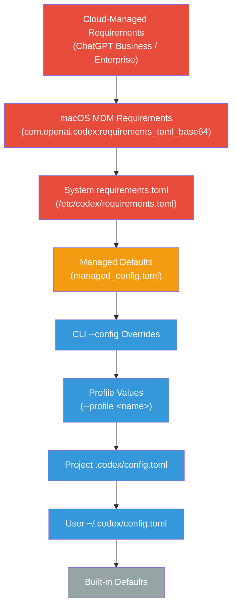
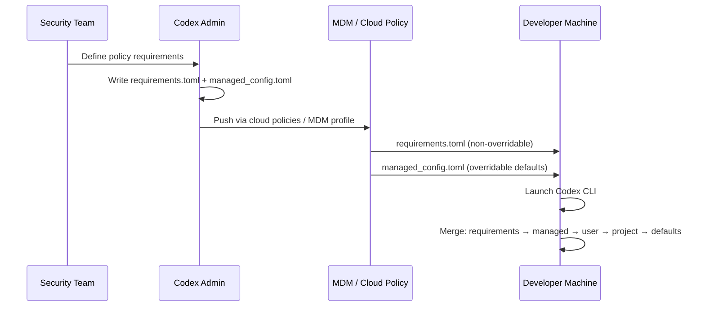

# Codex CLI Enterprise Managed Configuration: requirements.toml, managed\_config.toml, and Admin-Enforced Policies


---

Deploying Codex CLI to a team of five developers is straightforward — everyone edits their own `config.toml` and moves on. Deploying it to five hundred (or five thousand) developers across regulated business units is an entirely different problem. OpenAI's **managed configuration** system addresses this with two admin-controlled files — `requirements.toml` for hard constraints and `managed_config.toml` for soft defaults — delivered through cloud policies, macOS MDM, or the filesystem [^1]. This article is the practitioner's reference for both.

## The Two-File Model

The managed configuration system separates **intent** from **enforcement**:

| File | Purpose | User can override? |
|---|---|---|
| `requirements.toml` | Admin-enforced constraints on security-sensitive settings | No — hard ceiling |
| `managed_config.toml` | Organisation defaults applied at session startup | Yes — during the session, reset on next launch |

This split means security teams get non-negotiable guardrails while developers retain day-to-day flexibility within those bounds [^1].

## Configuration Precedence

Understanding precedence is critical. Codex resolves configuration through a layered stack where **higher layers win per field**:



**Red** = admin-enforced (cannot be overridden); **Orange** = managed defaults (overridable during session); **Blue** = developer-controlled [^2].

A crucial detail: across requirements layers, Codex merges **per field** — if an earlier layer sets a field (including an empty list), later layers do not override it, but lower layers can still fill fields that remain unset [^1].

## Delivering requirements.toml

Admins have three delivery mechanisms, applied in precedence order:

### 1. Cloud-Managed Requirements (ChatGPT Business/Enterprise)

Configure directly from the [ChatGPT Codex Policies page](https://chatgpt.com/codex/settings/managed-configs). This is the preferred approach for organisations already on ChatGPT Enterprise [^3]:

- Assign different requirements to **user groups** with fallback defaults
- If a user matches more than one group-specific rule, the **first match** applies — Codex does not fill unset fields from later group rules [^1]
- Changes propagate without touching developer machines

### 2. macOS MDM

For organisations using Jamf, Kandji, or Mosyle, push a base64-encoded TOML payload as a managed preference [^1]:

- **Preference domain:** `com.openai.codex`
- **Key:** `requirements_toml_base64`

```bash
# Encode your requirements file
base64 -i requirements.toml | tr -d '\n' > requirements_b64.txt
```

Insert the resulting string into your MDM configuration profile under the `com.openai.codex` domain. Users restart Codex to pick up changes [^1].

### 3. System Filesystem

Drop the file at the system-wide path:

| Platform | Path |
|---|---|
| Linux / macOS | `/etc/codex/requirements.toml` |
| Windows | `%ProgramData%\OpenAI\Codex\requirements.toml` |

This works well for containerised developer environments, devcontainers, and CDEs where you bake the file into the image [^4].

## Writing requirements.toml: The Complete Field Reference

### Approval and Sandbox Policies

These are the most common constraints. Restrict which approval policies and sandbox modes developers can select [^1]:

```toml
# Only allow supervised modes — block "never" (full autonomy)
allowed_approval_policies = ["untrusted", "on-request"]

# Prevent danger-full-access sandbox mode
allowed_sandbox_modes = ["read-only", "workspace-write"]

# Restrict web search to cached results only
allowed_web_search_modes = ["cached"]
```

### Automatic Review Enforcement

Force all tool executions through the automatic reviewer agent before they run, reducing approval fatigue while maintaining oversight [^5]:

```toml
allowed_approval_policies = ["on-request"]
allowed_approvals_reviewers = ["auto_review"]

guardian_policy_config = """
## Environment Profile
- Trusted internal destinations: github.com/my-org, artifacts.example.com
- Escalate any write to production branches to human review
"""
```

### Filesystem Deny-Read Policies

Prevent the agent from reading sensitive files, even in full-auto mode. These policies enforce at the sandbox level and cannot be overridden [^6]:

```toml
[permissions.filesystem]
deny_read = [
  "/Users/*/.ssh",
  "/Users/*/.aws/credentials",
  "./.env",
  "./.env.*",
  "./private/**/*.pem",
]
```

### Feature Flags and Kill Switches

Pin or disable specific features across the organisation [^1]:

```toml
[features]
personality = true
unified_exec = false

[feature_requirements]
browser_use = false
in_app_browser = false
computer_use = false
```

### Command Rule Enforcement

Block or gate dangerous commands organisation-wide [^3]:

```toml
[rules]
prefix_rules = [
  # Block rm entirely — enforce git clean instead
  { pattern = [{ token = "rm" }], decision = "forbidden", justification = "Use git clean -fd instead." },

  # Require human approval for git push and commit
  { pattern = [{ token = "git" }, { any_of = ["push", "commit"] }], decision = "prompt" },

  # Block force-push
  { pattern = [{ token = "git" }, { token = "push" }, { token = "--force" }], decision = "forbidden" },
]
```

⚠️ Requirements rules must specify `decision` as `"prompt"` or `"forbidden"` — `"allow"` is not permitted in requirements context [^1].

### MCP Server Allowlists

Restrict which MCP servers developers can connect. Only servers matching a listed identity are permitted [^1]:

```toml
[mcp_servers.docs]
identity = { command = "codex-mcp" }

[mcp_servers.internal-api]
identity = { url = "https://mcp.internal.example.com/v1" }
```

### Managed Hooks

Since v0.124, hooks are stable and can be enforced via `requirements.toml` [^7]:

```toml
[features]
codex_hooks = true

[hooks]
managed_dir = "/enterprise/hooks"

[[hooks.PreToolUse]]
matcher = "^Bash$"

[[hooks.PreToolUse.hooks]]
type = "command"
command = "python3 /enterprise/hooks/pre_tool_use_policy.py"
timeout = 30
```

⚠️ Codex enforces the hook configuration but does **not** distribute the scripts referenced by `managed_dir`. Deliver those separately through MDM or container images [^1].

## Writing managed\_config.toml: Soft Defaults

Managed defaults set the starting configuration for every session but let developers override values as needed. They merge on top of local `config.toml` and override CLI `--config` flags [^1].

### File Locations

| Platform | Path |
|---|---|
| Linux / macOS | `/etc/codex/managed_config.toml` |
| Windows | `~/.codex/managed_config.toml` |
| macOS MDM | `com.openai.codex:config_toml_base64` |

### Example: Standard Enterprise Defaults

```toml
# Sensible starting point — developers can adjust mid-session
model = "gpt-5.5"
approval_policy = "on-request"
sandbox_mode = "workspace-write"
model_reasoning_effort = "medium"

[sandbox_workspace_write]
network_access = false

# Standardise OTEL export for cost attribution
[otel]
environment = "prod"
exporter = "otlp-http"
log_user_prompt = false

# Default model provider for air-gapped or regulated environments
[model_providers.azure-internal]
openai_base_url = "https://codex.openai.azure.com/v1"
env_key = "AZURE_OPENAI_API_KEY"
wire_api = "openai"
```

## The Deployment Flow



## Governance: Analytics and Compliance APIs

Managed configuration is only half the story — you also need visibility into what developers are actually doing.

### Analytics and Compliance APIs

Create dedicated API keys scoped to `codex.enterprise.analytics.read` and `codex.enterprise.compliance.read` respectively [^8]. The Analytics API surfaces daily usage metrics (threads, turns, credits) with client-surface breakdowns, whilst the Compliance API exports full audit logs — prompts, responses, user IDs, timestamps, and token metadata — retained for 30 days. Use the `delete` scope for GDPR erasure workflows [^8].

### OpenTelemetry Integration

Pin OTEL settings in `managed_config.toml` to ensure every session exports traces [^9]:

```toml
[otel]
environment = "prod"
exporter = "otlp-http"
endpoint = "https://otel-collector.internal.example.com:4318"
log_user_prompt = false
```

Keep `log_user_prompt = false` unless your data handling policy explicitly permits prompt storage [^1].

## Practical Recommendations

1. **Start with requirements.toml, not managed\_config.toml.** Hard constraints are more important than comfortable defaults. Lock down `allowed_sandbox_modes`, `allowed_approval_policies`, and `deny_read` paths before worrying about model selection defaults.

2. **Version-control your TOML files.** Treat them like any other infrastructure-as-code artefact. Store them in a dedicated `codex-policy` repository with PR review requirements.

3. **Test in a canary group first.** Use cloud-managed requirements with group assignment to roll out new policies to a small team before organisation-wide deployment.

4. **Audit configuration drift.** Compare the effective configuration (`codex --dump-config`) against your intended policy periodically. The Analytics API can surface users whose sessions deviate from expected patterns.

5. **Deliver hook scripts separately.** Requirements.toml references hooks but does not distribute them. Use your MDM, container images, or a configuration management tool (Ansible, Chef, Puppet) to ensure scripts exist at `managed_dir` before Codex needs them [^1].

6. **Pin `log_user_prompt = false` in production** unless your legal and compliance teams have explicitly approved prompt retention. The Compliance API provides audit trails without storing prompts in OTEL spans [^1].

## Citations

[^1]: OpenAI, "Managed configuration – Codex," [https://developers.openai.com/codex/enterprise/managed-configuration](https://developers.openai.com/codex/enterprise/managed-configuration)

[^2]: OpenAI, "Config basics – Codex," [https://developers.openai.com/codex/config-basic](https://developers.openai.com/codex/config-basic)

[^3]: OpenAI, "Admin Setup – Codex," [https://developers.openai.com/codex/enterprise/admin-setup](https://developers.openai.com/codex/enterprise/admin-setup)

[^4]: OpenAI, "Configuration Reference – Codex," [https://developers.openai.com/codex/config-reference](https://developers.openai.com/codex/config-reference)

[^5]: OpenAI, "Agent approvals & security – Codex," [https://developers.openai.com/codex/agent-approvals-security](https://developers.openai.com/codex/agent-approvals-security)

[^6]: OpenAI, "Codex CLI Filesystem Security: Deny-Read Policies, Glob Patterns, and Credential Protection," Codex Blog, 2026-04-25, [https://codex.danielvaughan.com/2026/04/25/codex-cli-filesystem-security-deny-read-policies-credential-protection/](https://codex.danielvaughan.com/2026/04/25/codex-cli-filesystem-security-deny-read-policies-credential-protection/)

[^7]: OpenAI, "Codex CLI Hooks Graduate to Stable," Codex Changelog v0.124.0, [https://developers.openai.com/codex/changelog](https://developers.openai.com/codex/changelog)

[^8]: OpenAI, "Governance – Codex," [https://developers.openai.com/codex/enterprise/governance](https://developers.openai.com/codex/enterprise/governance)

[^9]: OpenAI, "Advanced Configuration – Codex," [https://developers.openai.com/codex/config-advanced](https://developers.openai.com/codex/config-advanced)
