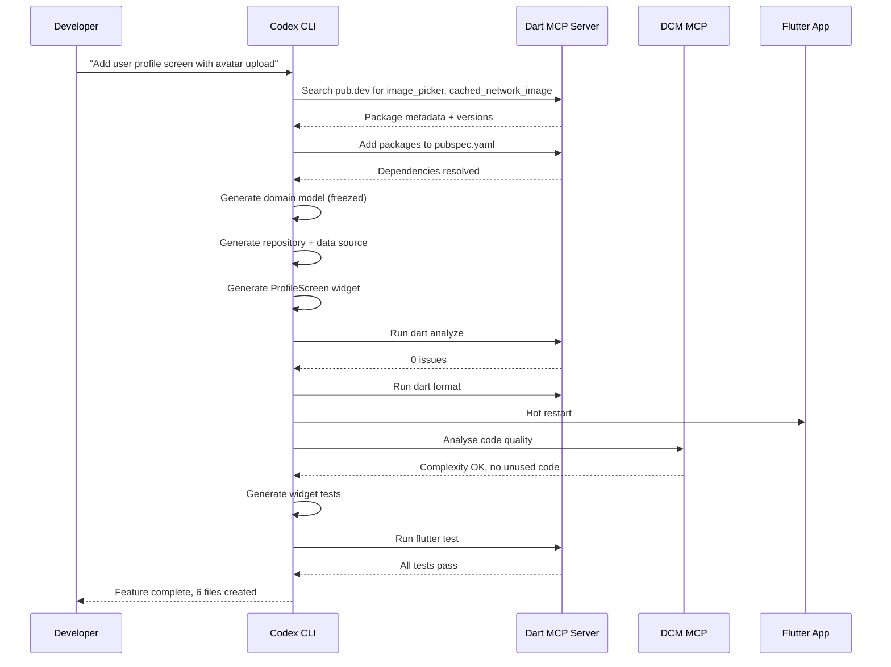

# Codex CLI for Flutter and Dart Teams: MCP Server, DCM, and Agent-Driven Cross-Platform Development


Flutter's widget-based architecture, Dart's strong type system, and the framework's rapid feedback loop (hot reload, hot restart) make it unusually well-suited for agentic development. The Dart and Flutter MCP server — shipping with Dart 3.9+ — gives Codex CLI direct access to the analyser, formatter, test runner, pub.dev search, and runtime introspection, closing the gap between what the model generates and what actually runs on-device [^1]. This article covers the full setup for Flutter teams adopting Codex CLI, from MCP configuration through testing workflows to CI integration.

---

## Why Flutter Is Agent-Friendly

Flutter shares several properties with frameworks that already perform well under AI coding agents:

1. **Deterministic compiler feedback.** `dart analyze` and `dart format` return structured, machine-parseable output on every save [^2].
2. **Hot reload as a verification loop.** The agent can modify widget code and see the result reflected in a running app within seconds, matching the tight feedback cycles that reduce hallucination-driven drift [^3].
3. **Convention-heavy structure.** Flutter projects follow predictable directory layouts (`lib/`, `test/`, `pubspec.yaml`), and widget composition follows a tree structure the model can reason about reliably [^4].
4. **First-party MCP support.** The official `dart mcp-server` exposes analyser, formatter, test runner, and runtime introspection tools — no third-party wrappers required [^1].

---

## AGENTS.md Template for Flutter Projects

Place this at the repository root:

```markdown
# AGENTS.md — Flutter/Dart Project

## Language & Framework
- Dart 3.11+ / Flutter 3.41+
- State management: Riverpod 3.x (prefer `@riverpod` code generation)
- Navigation: GoRouter
- Networking: dio + retrofit

## Architecture
- Feature-first directory structure: `lib/features/<name>/{data,domain,presentation}/`
- Domain layer uses freezed classes for immutable models
- Presentation layer uses ConsumerWidget / ConsumerStatefulWidget

## Conventions
- ALL widget classes in dedicated files — one public widget per file
- Use `const` constructors wherever possible
- Prefer composition over inheritance for widgets
- Named parameters for all widget constructors with >2 parameters
- Barrel files (`index.dart`) per feature, never at `lib/` root

## Testing
- Unit tests in `test/unit/`, widget tests in `test/widget/`, integration in `integration_test/`
- Run `flutter test` after every code change
- Widget tests MUST use `pumpWidget` with `MaterialApp` wrapper
- Golden tests for complex custom widgets — update with `--update-goldens` flag

## Code Quality
- Run `dart analyze` before committing — zero warnings policy
- Run `dart format .` — enforced line length 80
- DCM rules: no unused code, no unused files, cyclomatic complexity <10

## Do NOT
- Import `dart:mirrors` (not supported in AOT)
- Use `dynamic` types unless interfacing with raw JSON
- Add platform-specific code outside `lib/platform/`
- Modify generated files (`*.g.dart`, `*.freezed.dart`) manually
```

## config.toml Setup

### Sandbox Configuration

Flutter builds need network access for pub dependency resolution and device communication. Configure two profiles — a tight default and a build-capable variant:

```toml
[profiles.flutter]
model = "gpt-5.5"
approval_mode = "auto-edit"

[profiles.flutter.sandbox]
allow_network = true        # pub get, device communication
allow_read = [
  ".",
  "$HOME/.pub-cache",
  "$HOME/.config/flutter",
  "$FLUTTER_ROOT"
]
deny_read = [
  ".env",
  "*.jks",                  # Android keystore
  "ios/Runner/*.p12",       # iOS signing
  "android/key.properties"
]

[profiles.flutter-review]
model = "gpt-5.3-codex-spark"
approval_mode = "suggest"
```

### Dart and Flutter MCP Server

```toml
[profiles.flutter.mcp_servers.dart]
command = "dart"
args = ["mcp-server", "--force-roots-fallback"]
```

The `--force-roots-fallback` flag is recommended for Codex CLI because it enables root management tools even when the client does not properly advertise roots support [^1]. Without it, the MCP server may not discover your project's `pubspec.yaml` and analysis options correctly.

### DCM MCP Server (Optional)

For teams using Dart Code Metrics, add a second MCP server:

```toml
[profiles.flutter.mcp_servers.dcm]
command = "dcm"
args = ["start-mcp-server"]
```

DCM provides code quality tools covering unused code detection, file-level metrics, cyclomatic complexity analysis, and widget structure auditing [^5]. The combination of the official Dart MCP server (for analysis, formatting, and testing) and DCM (for quality metrics) gives the agent comprehensive feedback without manual intervention.

---

## The Agent-Driven Feature Development Workflow



The key insight is that the Dart MCP server lets Codex **search pub.dev and add packages programmatically** rather than hallucinating package names or versions [^1]. This eliminates one of the most common failure modes in AI-generated Flutter code.

---

## PostToolUse Hooks for Flutter

Hooks provide automatic quality gates after every file write:

```toml
[profiles.flutter.hooks.post_tool_use.analyse]
event = "post_tool_use"
tool = "apply_patch"
command = "dart analyze --fatal-infos lib/"
on_fail = "report_to_agent"

[profiles.flutter.hooks.post_tool_use.format]
event = "post_tool_use"
tool = "apply_patch"
command = "dart format --set-exit-if-changed lib/ test/"
on_fail = "report_to_agent"

[profiles.flutter.hooks.post_tool_use.build_runner]
event = "post_tool_use"
tool = "apply_patch"
command = "dart run build_runner build --delete-conflicting-outputs"
on_fail = "report_to_agent"
```

The `build_runner` hook is particularly important for Flutter projects using code generation (freezed, json_serializable, riverpod_generator). Without it, the agent may generate code that references `*.g.dart` or `*.freezed.dart` files that do not exist yet, causing cascade analysis failures [^6].

---

## Widget Testing Patterns

Widget tests in Flutter present a specific challenge for coding agents: they require a `WidgetsApp` or `MaterialApp` ancestor, proper `pump` cycles, and finder-based assertions. Encode these patterns in AGENTS.md and let the agent follow them consistently.

### The Test Template Pattern

```dart
import 'package:flutter/material.dart';
import 'package:flutter_test/flutter_test.dart';
import 'package:flutter_riverpod/flutter_riverpod.dart';

void main() {
  testWidgets('ProfileScreen displays user name', (tester) async {
    await tester.pumpWidget(
      ProviderScope(
        overrides: [
          userProvider.overrideWithValue(
            AsyncData(User(name: 'Alice', email: 'alice@example.com')),
          ),
        ],
        child: const MaterialApp(home: ProfileScreen()),
      ),
    );

    await tester.pumpAndSettle();
    expect(find.text('Alice'), findsOneWidget);
  });
}
```

Add this to your AGENTS.md testing section:

```markdown
## Widget Test Rules
- ALWAYS wrap test widgets in `ProviderScope` + `MaterialApp`
- ALWAYS call `pumpAndSettle()` after navigation or async operations
- Use `find.byType()` for structural assertions, `find.text()` for content
- Mock providers via `overrideWithValue`, never mock the widget tree itself
- Golden file tests: place reference images in `test/goldens/`
```

---

## Integration Testing with Patrol

For end-to-end tests on real devices or simulators, **Patrol** (the successor to integration_test's raw API) provides a cleaner interface [^7]. Combined with the **iOS Simulator MCP** server, Codex can orchestrate the full cycle:

```toml
[profiles.flutter.mcp_servers.ios_simulator]
command = "npx"
args = ["-y", "@anthropic/ios-simulator-mcp"]
```

This enables the agent to create simulators, capture screenshots for visual verification, and mock GPS locations for location-dependent features — all without leaving the Codex session.

---

## Model Selection by Flutter Task

| Task | Recommended Model | Reasoning Effort | Rationale |
|---|---|---|---|
| Widget scaffolding | GPT-5.3-Codex-Spark | Low | Boilerplate-heavy, pattern-matching |
| State management refactor | GPT-5.5 | High | Cross-file reasoning, provider graph |
| Platform channel code | GPT-5.5 | High | Kotlin/Swift interop requires precision |
| Test generation | GPT-5.5 | Medium | Mock setup needs architectural awareness |
| Localisation (ARB files) | GPT-5.3-Codex-Spark | Low | Mechanical translation, structured format |
| Animation/CustomPainter | GPT-5.5 | High | Mathematical reasoning for curves/paths |
| pub.dev package evaluation | GPT-5.5 | Medium | Needs to weigh compatibility and maintenance |

Use `Alt+,` and `Alt+.` in the TUI to adjust reasoning effort mid-session as you move between task types [^8].

---

## The codex_cli_sdk Dart Package

For teams embedding Codex into Dart tooling (CLI tools, build scripts, or backend services), the `codex_cli_sdk` package on pub.dev provides a native Dart interface [^9]:

```dart
import 'package:codex_cli_sdk/codex_cli_sdk.dart';

final codex = Codex(apiKey: Platform.environment['OPENAI_API_KEY']!);
final chat = codex.createNewChat();

final result = await chat.sendMessage([
  PromptContent.text('Generate a freezed model for UserProfile with '
      'name, email, avatarUrl, and createdAt fields'),
]);

print(result.response);
await chat.dispose();
```

The SDK supports streaming responses, structured output via JSON schema, file attachments, and session resumption [^9]. However, note that this is a **community package** (unverified publisher) — evaluate it against your security requirements before using it in production pipelines. ⚠️

---

## Headless CI Pipeline


```yaml
# .github/workflows/codex-flutter-review.yml
name: Codex Flutter PR Review
on:
  pull_request:
    paths: ['lib/**', 'test/**', 'pubspec.yaml']

jobs:
  review:
    runs-on: ubuntu-latest
    steps:
      - uses: actions/checkout@v4
      - uses: subosito/flutter-action@v2
        with:
          flutter-version: '3.41.5'
      - run: flutter pub get
      - uses: openai/codex-action@v1
        with:
          openai_api_key: ${{ secrets.OPENAI_API_KEY }}
          codex-args: >-
            --profile flutter-review
            --approval-mode suggest
          prompt: |
            Review this PR for Flutter best practices:
            1. Check widget composition (prefer small, focused widgets)
            2. Verify const constructors are used where possible
            3. Check for missing null safety patterns
            4. Verify test coverage for new widgets
            5. Flag any platform-specific code outside lib/platform/
```


---

## Common Pitfalls

| Pitfall | Symptom | Mitigation |
|---|---|---|
| Agent edits `*.g.dart` files | Build runner overwrites changes | Add `*.g.dart`, `*.freezed.dart` to AGENTS.md "Do NOT modify" list |
| Missing `MaterialApp` wrapper in tests | `No MediaQuery widget ancestor` error | Enforce wrapper pattern in AGENTS.md test rules |
| Agent adds packages not on pub.dev | `pub get` fails with 404 | Dart MCP server's pub.dev search prevents this [^1] |
| Platform channel code hallucinated | Runtime `MissingPluginException` | Require agent to check plugin registration in `MainActivity.kt`/`AppDelegate.swift` |
| Hot reload breaks state | Widget tree mismatch after major refactor | Use hot restart instead; add note to AGENTS.md |
| `dynamic` type proliferation | Lost type safety, runtime crashes | AGENTS.md rule: zero `dynamic` except JSON deserialization |
| Code generation not triggered | References to non-existent `.g.dart` | PostToolUse hook runs `build_runner` after every patch [^6] |

---

## Citations

[^1]: [Dart and Flutter MCP Server — Official Documentation](https://docs.flutter.dev/ai/mcp-server)
[^2]: [Dart Analyzer — dart.dev](https://dart.dev/tools/dart-analyze)
[^3]: [OpenAI Codex Best Practices — Tight Feedback Loops](https://developers.openai.com/codex/learn/best-practices)
[^4]: [Flutter Project Structure — docs.flutter.dev](https://docs.flutter.dev/resources/architectural-overview)
[^5]: [DCM MCP Server — IDE Integrations](https://dcm.dev/docs/ide-integrations/mcp-server/)
[^6]: [build_runner — Dart Package](https://pub.dev/packages/build_runner)
[^7]: [Patrol — Flutter Integration Testing](https://patrol.leancode.co/)
[^8]: [Codex CLI v0.124 Changelog — Quick Reasoning Controls](https://developers.openai.com/codex/changelog)
[^9]: [codex_cli_sdk — Dart Package on pub.dev](https://pub.dev/packages/codex_cli_sdk)
