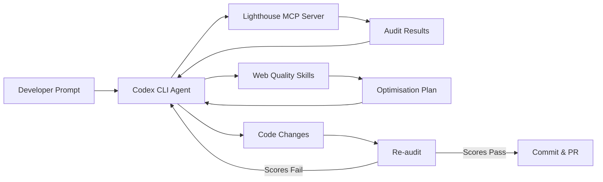
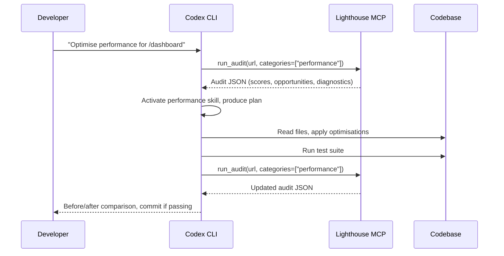

# Codex CLI for Frontend Performance Optimisation: Lighthouse MCP, Core Web Vitals Skills, and Agent-Driven Performance Budgets


---

Only 47% of websites reach Google's "good" Core Web Vitals thresholds in 2026[^1]. INP remains the most commonly failed metric, with 43% of sites exceeding the 200 ms ceiling[^1]. Fixing these issues manually is tedious: you run Lighthouse, read the report, find the offending code, patch it, re-run the audit, and repeat. Codex CLI can collapse that cycle into a single agent loop — measure, diagnose, fix, verify — using a Lighthouse MCP server for data and web-quality skills for domain expertise.

This article walks through the toolchain: installing a Lighthouse MCP server, adding Addy Osmani's web-quality skills, wiring both into a measure-fix-verify loop, and gating deployments with performance budgets in CI.

## The Toolchain at a Glance



Three components work together:

| Component | Role | Installation |
|---|---|---|
| **Lighthouse MCP server** | Runs Lighthouse audits from within the agent loop | `config.toml` MCP entry |
| **Web-quality skills** | Encode 150+ Lighthouse audit patterns as agent instructions | `npx add-skill` |
| **Performance budget hook** | Gates commits on score thresholds | `config.toml` hook |

## Installing the Lighthouse MCP Server

Two community Lighthouse MCP servers are actively maintained. The `danielsogl/lighthouse-mcp-server` exposes 13+ tools covering performance, accessibility, SEO, and security audits[^2]. The `priyankark/lighthouse-mcp` provides a simpler two-tool interface — `run_audit` and `get_performance_score` — that suits most performance workflows[^3].

Add either to your project's `.codex/config.toml`:

```toml
[mcp_servers.lighthouse]
command = "npx"
args = ["-y", "@danielsogl/lighthouse-mcp"]
```

Or for the lighter alternative:

```toml
[mcp_servers.lighthouse]
command = "npx"
args = ["-y", "lighthouse-mcp"]
```

Verify the server starts correctly:

```bash
codex --model gpt-5.5
# Then in the TUI:
/mcp verbose
```

The `/mcp verbose` command (added in v0.123.0[^4]) prints tool listings for each connected MCP server, confirming your Lighthouse tools are available.

## Installing Web-Quality Skills

Addy Osmani's `web-quality-skills` package provides six agent skills covering the full spectrum of web quality optimisation[^5]:

| Skill | Trigger Phrases | Coverage |
|---|---|---|
| `web-quality-audit` | "Run a full quality audit" | All categories |
| `performance` | "Optimise performance", "Speed up" | 50+ performance patterns |
| `core-web-vitals` | "Fix CWV", "Improve INP" | LCP, INP, CLS |
| `accessibility` | "Fix a11y", "WCAG compliance" | 40+ a11y rules |
| `seo` | "Improve SEO" | 30+ SEO requirements |
| `best-practices` | "Security headers", "Modern APIs" | Security + code quality |

Install into your Codex skills directory:

```bash
npx add-skill addyosmani/web-quality-skills
```

The skills activate automatically based on natural language triggers[^5]. When you say "optimise performance for this page," Codex loads the `performance` skill instructions, which encode concrete thresholds (e.g. JS bundle < 300 KB, images < 500 KB above the fold) and framework-specific patterns for React, Vue, Angular, Svelte, Next.js, Nuxt, and Astro[^5].

## Core Web Vitals Thresholds in 2026

Google's March 2026 core update strengthened the weight of performance in the ranking algorithm[^1]. The current thresholds remain:

| Metric | Good | Needs Improvement | Poor |
|---|---|---|---|
| **LCP** (Largest Contentful Paint) | ≤ 2.5 s | 2.5–4.0 s | > 4.0 s |
| **INP** (Interaction to Next Paint) | ≤ 200 ms | 200–500 ms | > 500 ms |
| **CLS** (Cumulative Layout Shift) | ≤ 0.1 | 0.1–0.25 | > 0.25 |

Google evaluates at the 75th percentile (p75) of real user data — 75% of page visits must score "good" for the page to pass[^6]. INP, which replaced FID in March 2024, measures the 95th percentile of all interactions on a page, making it considerably harder to pass than its predecessor[^6].

## The Measure-Fix-Verify Loop

### Step 1: Baseline Audit

Open a Codex CLI session in your project root:

```bash
codex --model gpt-5.5
```

Then prompt:

```
Run a Lighthouse performance audit on http://localhost:3000 using the
lighthouse MCP. Show me the Core Web Vitals scores and the top 5
performance opportunities by estimated savings.
```

Codex calls the MCP server's `run_audit` tool, parses the JSON response, and presents a summary. The agent can run both mobile and desktop audits in a single turn, comparing results across device profiles.

### Step 2: Diagnose and Plan

With audit data in context, Codex activates the `performance` or `core-web-vitals` skill (depending on the dominant issue) and produces a prioritised remediation plan. A typical plan for an INP failure might include:

1. Identify long-running event handlers in the interaction trace
2. Break up monolithic `onClick` handlers with `requestIdleCallback` or `scheduler.yield()`
3. Defer non-critical third-party scripts
4. Add `content-visibility: auto` to below-the-fold sections

### Step 3: Apply Fixes

Codex reads the relevant source files, applies the changes, and runs your test suite. Because the web-quality skills encode framework-specific patterns, the agent knows to use React's `startTransition` for React projects, Vue's `nextTick` for Vue projects, or Svelte's `tick()` for Svelte projects[^5].

### Step 4: Re-audit and Verify

```
Run the Lighthouse audit again on http://localhost:3000 and compare the
scores with the baseline. Show a before/after table.
```

The agent re-runs the MCP tool, diffs the results, and presents a comparison. If scores pass your thresholds, it commits the changes. If not, it loops back to diagnose the remaining issues.



## AGENTS.md Template for Performance Projects

Place this in your repository's `AGENTS.md` to encode performance standards that every Codex session follows:

```markdown
## Performance Standards

- Target Lighthouse Performance score: ≥ 90
- Core Web Vitals targets: LCP ≤ 2.5s, INP ≤ 200ms, CLS ≤ 0.1
- JavaScript budget: ≤ 300 KB compressed (main bundle)
- Image budget: ≤ 500 KB above the fold, WebP/AVIF preferred
- No render-blocking resources in the critical path
- All images must have explicit width/height or aspect-ratio

## Review Guidelines

When modifying frontend code, always consider performance impact.
Flag any new dependency > 50 KB gzipped. Prefer native browser APIs
over library abstractions where support is ≥ 95% on caniuse.
```

This integrates with Codex's automatic AGENTS.md scanning — every review and generation pass checks these constraints[^7].

## Performance Budgets in CI with codex-action

Combine Lighthouse CI with Codex's self-healing CI pattern to not only detect performance regressions but automatically fix them:

```yaml
name: Performance Gate
on: [pull_request]

jobs:
  lighthouse-audit:
    runs-on: ubuntu-latest
    steps:
      - uses: actions/checkout@v4
      - uses: actions/setup-node@v4
        with:
          node-version: 22

      - name: Build and serve
        run: |
          npm ci
          npm run build
          npx serve -s dist -l 3000 &
          sleep 5

      - name: Run Lighthouse CI
        uses: treosh/lighthouse-ci-action@v12
        with:
          urls: http://localhost:3000
          budgetPath: ./budget.json
          uploadArtifacts: true

      - name: Auto-fix regressions with Codex
        if: failure()
        uses: openai/codex-action@v1
        with:
          model: gpt-5.5
          approval_policy: auto-edit
          prompt: |
            The Lighthouse CI budget check failed on this PR.
            Read the Lighthouse report in the artifacts directory.
            Identify the top 3 performance regressions and fix them.
            Run `npx lhci autorun` to verify the fixes pass.
        env:
          OPENAI_API_KEY: ${{ secrets.OPENAI_API_KEY }}
```

The `budget.json` file defines your performance budgets[^8]:

```json
[
  {
    "path": "/*",
    "timings": [
      { "metric": "largest-contentful-paint", "budget": 2500 },
      { "metric": "interactive", "budget": 3500 },
      { "metric": "cumulative-layout-shift", "budget": 0.1 }
    ],
    "resourceSizes": [
      { "resourceType": "script", "budget": 300 },
      { "resourceType": "image", "budget": 500 },
      { "resourceType": "total", "budget": 1500 }
    ]
  }
]
```

## Codex Hooks for Local Performance Gates

Use a `PostToolUse` hook to block commits when performance scores drop below your thresholds. Since hooks graduated to stable in v0.124.0[^4], you can configure them inline:

```toml
[[hooks]]
event = "PostToolUse"
match_tool = "shell"
match_command = "git commit"
command = "npx lhci autorun --config=.lighthouserc.json"
timeout_ms = 120000
on_failure = "block"
```

This fires after every `git commit` command the agent executes, running Lighthouse CI locally and blocking if budgets are exceeded.

## Model Selection for Performance Work

| Task | Recommended Model | Reasoning |
|---|---|---|
| Full audit + multi-file fix | `gpt-5.5` | Needs long-context reasoning across audit data and code[^9] |
| Single-component INP fix | `o4-mini` | Focused task, lower cost |
| CI auto-fix | `o4-mini` | Budget-conscious, runs on every PR |
| Performance review | `codex-auto-review` | Purpose-built for code review[^10] |

Adjust reasoning effort with `Alt+,` and `Alt+.` in the TUI for quick calibration — lower effort for straightforward image optimisation, higher effort for complex INP debugging involving event delegation chains[^4].

## Common Pitfalls

**Running audits against production URLs from CI.** Lighthouse scores vary with network conditions and server load. Always audit a local build for deterministic results.

**Ignoring INP because "our site is mostly static."** Even static sites with a hamburger menu, accordion, or modal trigger INP measurements. If JavaScript handles any user interaction, INP applies[^6].

**Over-fitting to Lighthouse lab scores.** Lab scores use simulated throttling. Field data (CrUX) reflects real user experience. Use `pagespeed.web.dev` to cross-reference lab results with field data[^6].

**Bundling the Lighthouse MCP server globally.** Keep it in the project's `.codex/config.toml` so every team member uses the same version. ⚠️ Lighthouse MCP servers are community-maintained and may lag behind Lighthouse core releases — verify the Lighthouse version bundled in the MCP matches your expectations.

## Conclusion

The combination of a Lighthouse MCP server for measurement, web-quality skills for domain expertise, and Codex hooks for enforcement creates a closed loop: measure, diagnose, fix, verify, gate. The agent handles the tedious cycle of running audits and tracing opportunities back to source code, whilst the developer retains control through AGENTS.md thresholds and CI budget files.

For teams where every millisecond of INP matters, this workflow replaces ad-hoc Lighthouse runs with a systematic, repeatable pipeline that improves with every skill update and model generation.

## Citations

[^1]: Core Web Vitals 2026: INP, LCP & CLS Optimization — Digital Applied, April 2026. <https://www.digitalapplied.com/blog/core-web-vitals-2026-inp-lcp-cls-optimization-guide>
[^2]: danielsogl/lighthouse-mcp-server — GitHub, 2026. <https://github.com/danielsogl/lighthouse-mcp-server>
[^3]: priyankark/lighthouse-mcp — GitHub, 2026. <https://github.com/priyankark/lighthouse-mcp>
[^4]: Codex CLI Changelog — OpenAI Developers, April 2026. <https://developers.openai.com/codex/changelog>
[^5]: addyosmani/web-quality-skills — GitHub, 2026. <https://github.com/addyosmani/web-quality-skills>
[^6]: Understanding Core Web Vitals and Google search results — Google Search Central, 2026. <https://developers.google.com/search/docs/appearance/core-web-vitals>
[^7]: Best practices — Codex, OpenAI Developers, 2026. <https://developers.openai.com/codex/learn/best-practices>
[^8]: Lighthouse CI: Complete Guide to @lhci/cli in 2026 — Unlighthouse. <https://unlighthouse.dev/learn-lighthouse/lighthouse-ci>
[^9]: GPT-5.5 — OpenAI, April 2026. <https://openai.com/index/introducing-gpt-5-5/>
[^10]: Purpose-Built Agent Models: What codex-auto-review Tells Us — Codex Blog, April 2026. <https://codex.danielvaughan.com/2026/04/17/purpose-built-agent-models-codex-auto-review/>
