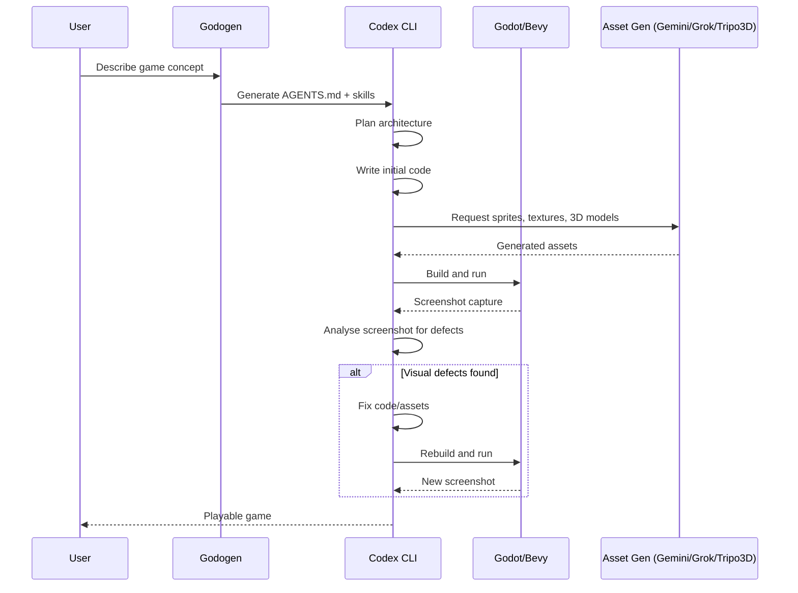

# Codex CLI for Game Development Teams: Unity MCP, Godot MCP, and Agent-Driven Game Workflows


---

Game development sits at an interesting intersection for AI coding agents. The codebase is highly structured (scenes, components, shaders, scripts), the feedback loop is inherently visual, and the toolchain sprawls across editors, asset pipelines, and build systems that don't fit neatly into a text-only terminal. Despite this, Codex CLI has become a surprisingly effective game development companion—provided you wire it into the right MCP servers and give it the right AGENTS.md guidance.

This article covers practical integration patterns for Unity and Godot teams, the emerging MCP server ecosystem for game engines, and an autonomous game generation workflow that uses frame-grounded self-repair to fix visual defects iteratively.

## The MCP Server Landscape for Game Engines

The Model Context Protocol bridges the gap between Codex CLI's terminal-native workflow and the GUI-heavy world of game editors [^1]. Two engines now have mature MCP server implementations.

### Unity MCP Servers

The Unity MCP ecosystem has consolidated around several implementations, each with different scope:

| Server | Tools | Transport | Key Strength |
|--------|-------|-----------|-------------|
| **mcp-unity** (CoderGamester) | 30+ | WebSocket | Broadest IDE compatibility, PackedCache auto-indexing [^2] |
| **unity-mcp-server** (AnkleBreaker Studio) | 268 | WebSocket | Comprehensive: Shader Graph, NavMesh, terrain, profiling [^3] |
| **Unity-MCP** (IvanMurzak) | Extensible | CLI | Zero external runtime, any C# method as tool via attribute [^4] |

For Codex CLI, configure the MCP server in `~/.codex/config.toml` or your project-scoped `.codex/config.toml`:

```toml
[mcp_servers.mcp-unity]
command = "node"
args = ["/path/to/mcp-unity/Server~/build/index.js"]
```

The server connects to Unity Editor over WebSocket (default port 8090) and exposes tools for scene management (`create_scene`, `load_scene`), GameObject operations (`create`, `update`, `duplicate`, `delete`, `move`, `rotate`, `scale`), component management, material creation, test execution, and batch operations [^2].

### Godot MCP Servers

Godot's MCP ecosystem is equally active:

| Server | Tools | Key Feature |
|--------|-------|-------------|
| **godot-mcp** (Coding-Solo) | Core set | Launch editor, run projects, capture debug output [^5] |
| **GodotIQ** | Spatial tools | Screenshot capture, camera control, UI testing [^6] |
| **Godot MCP Pro** | 163 | Full editor control, asset library integration [^7] |
| **GDAI MCP** | End-to-end | Error reading, script updates, screenshot verification [^8] |

A minimal Codex CLI configuration for Godot:

```toml
[mcp_servers.godot-mcp]
command = "npx"
args = ["-y", "godot-mcp"]
```

## The Agent Client Protocol Bridge

For teams wanting deeper Unity integration, **UnityAgentClient** takes a different approach entirely. Rather than MCP alone, it implements the Agent Client Protocol (ACP)—a JSON-RPC protocol proposed by Zed that connects AI agents directly to code editors [^9].

Since Codex CLI doesn't natively support ACP, you need the `codex-acp` adapter:

```bash
# Install the adapter from Zed's repository
npm install -g codex-acp
```

In UnityAgentClient's settings, configure:

- **Command:** `codex-acp`
- **Arguments:** `-`

This gives Codex CLI access to the full Unity project context—assets, scene hierarchy, component data—as a document the agent can reason over. The agent can drag-and-drop assets, execute tools with permission gates, and work alongside other agents (Gemini CLI, Claude Code) simultaneously [^9].

## AGENTS.md for Game Projects

Game projects need AGENTS.md files that account for engine-specific conventions, asset pipelines, and the visual nature of the work. Here's a template for a Unity project:

```markdown
# AGENTS.md — Unity Project

## Project Structure
- `Assets/Scripts/` — C# game logic (Assembly Definitions per feature)
- `Assets/Prefabs/` — Reusable GameObjects
- `Assets/Scenes/` — Scene files (never merge .unity files manually)
- `Assets/Shaders/` — HLSL/ShaderLab files
- `Packages/` — UPM package manifest

## Build & Test
- Build: Unity CLI `unity -batchmode -buildTarget StandaloneWindows64`
- Tests: `unity -batchmode -runTests -testPlatform EditMode`
- Lint: `dotnet format Assets/Scripts/`

## Conventions
- One MonoBehaviour per file, filename matches class name
- Use [SerializeField] for inspector fields, never public fields
- Composition over inheritance for game systems
- ScriptableObjects for shared configuration data
- Assembly Definitions required for each feature folder

## Constraints
- NEVER modify .unity scene files by hand — use MCP tools
- NEVER commit Library/ or Temp/ directories
- Shader changes require visual verification via screenshot
- Physics values must be tested in Play mode before committing
```

For Godot, adjust for GDScript conventions:

```markdown
# AGENTS.md — Godot 4 Project

## Project Structure
- `scenes/` — .tscn scene files
- `scripts/` — GDScript (.gd) files
- `assets/` — Textures, audio, models
- `addons/` — Editor plugins

## Build & Test
- Run: `godot --path . --headless --script run_tests.gd`
- Export: `godot --export-release "Linux" build/game.x86_64`

## Conventions
- Typed GDScript: always declare variable types
- Signals over direct references between nodes
- @export for inspector properties
- snake_case for everything except class_name (PascalCase)
- Resource files (.tres) for shared data

## Constraints
- Use the Godot MCP server to manipulate scene trees
- Verify visual output via screenshot capture after scene changes
- Never edit .import files directly
```

## GodotPrompter: Domain-Specific Agent Skills

**GodotPrompter** provides 44 specialised skills for Godot 4.3+ covering the full game development surface: project setup, architecture patterns, gameplay systems, input handling, physics, 2D/3D rendering, animation, shaders, audio, UI, multiplayer, localisation, procedural generation, XR/VR, optimisation, and C# patterns [^10].

Install skills into your project:

```bash
git clone https://github.com/jame581/GodotPrompter.git
cp -r GodotPrompter/.agents/skills/ .agents/skills/
```

Codex CLI auto-discovers skills in `.agents/skills/` and can invoke them contextually. For example, the shader skill guides the agent through writing Godot visual shaders with correct uniform declarations and render mode settings.

## Autonomous Game Generation: The Godogen Pattern

**Godogen** demonstrates the most ambitious use of Codex CLI for game development: fully autonomous game generation with frame-grounded self-repair [^11].



The critical insight is **frame-grounded self-repair**: the agent judges progress from captured screenshots rather than code compilation alone [^11]. A game that compiles but renders a black screen, has clipping artefacts, or shows frozen animations gets caught and fixed iteratively.

Generate a project targeting Codex CLI:

```bash
./publish.sh --engine godot --agent codex --out ~/my-game
cd ~/my-game
codex  # Agent picks up AGENTS.md and .agents/skills/ automatically
```

For Bevy (Rust), the same pattern applies:

```bash
./publish.sh --engine bevy --agent codex --out ~/my-bevy-game
```

Bevy output produces Rust projects with code-first scenes, local documentation lookup, and deterministic capture guidance [^11].

## Config Profiles for Game Development

Game development benefits from task-specific Codex profiles:

```toml
# .codex/config.toml

[profiles.gameplay]
model = "gpt-5.5"
model_reasoning_effort = "high"
sandbox_mode = "workspace-write"

[profiles.shader]
model = "gpt-5.5"
model_reasoning_effort = "high"
sandbox_mode = "read-only"  # Shaders need visual verification

[profiles.asset-gen]
model = "gpt-5.3-codex-spark"
model_reasoning_effort = "medium"
sandbox_mode = "workspace-write"
```

Switch profiles mid-session with `/profile gameplay` or pass at launch: `codex --profile shader`.

## Custom Agents for Game Specialisation

Define narrow, opinionated agents for specific game development roles [^12]:

```toml
# .codex/agents/gameplay-reviewer.toml
name = "gameplay-reviewer"
description = "Reviews gameplay code for performance, correctness, and engine best practices."
model = "gpt-5.5"
model_reasoning_effort = "high"
sandbox_mode = "read-only"
developer_instructions = """
Review gameplay code like a senior engine programmer.
Focus on:
- Update loop performance (avoid allocations in _Process/_Update)
- Physics interactions (FixedUpdate/physics_process correctness)
- Memory management (object pooling, resource lifecycle)
- Input handling patterns
- State machine correctness
Flag any code that would cause frame drops on target hardware.
"""
```

```toml
# .codex/agents/level-builder.toml
name = "level-builder"
description = "Generates and modifies game levels using engine MCP tools."
model = "gpt-5.3-codex-spark"
model_reasoning_effort = "medium"
sandbox_mode = "workspace-write"
nickname_candidates = ["Atlas", "Forge", "Mason", "Quarry"]
developer_instructions = """
Create and modify game levels using MCP server tools.
Always verify changes visually via screenshot capture.
Follow the project's scene organisation conventions.
Use prefabs/packed scenes for repeated elements.
"""
```

Spawn them from the main session: "Spawn the gameplay-reviewer to audit `Scripts/Combat/` while I work on the UI."

## PostToolUse Hooks for Game Builds

Wire up automatic build verification after code changes [^13]:

```toml
# Unity
[[hooks]]
event = "post_tool_use"
tool_name = "apply_patch"
match_paths = ["Assets/Scripts/**/*.cs"]
command = "dotnet build Assets/Scripts/Game.csproj --no-restore -v quiet"

# Godot
[[hooks]]
event = "post_tool_use"
tool_name = "apply_patch"
match_paths = ["scripts/**/*.gd"]
command = "godot --headless --check-only --script scripts/validate.gd"
```

## Model Selection for Game Tasks

| Task | Recommended Model | Reasoning | Why |
|------|------------------|-----------|-----|
| Gameplay logic | gpt-5.5 | High | Complex state machines, physics interactions |
| Shader writing | gpt-5.5 | High | HLSL/GLSL requires precision |
| Level scripting | gpt-5.3-codex-spark | Medium | Repetitive patterns, speed matters |
| Asset metadata | gpt-5.3-codex-spark | Low | Structured data, fast iteration |
| Code review | gpt-5.4 | High | Broad engine knowledge needed |
| Test generation | gpt-5.5 | Medium | Coverage analysis requires understanding |

## Common Pitfalls

| Pitfall | Symptom | Fix |
|---------|---------|-----|
| Editing .unity/.tscn by hand | Merge conflicts, corrupted scenes | Use MCP tools exclusively for scene changes |
| Missing visual verification | Code compiles but renders incorrectly | Add screenshot capture to verification loop |
| Allocations in hot loops | Frame drops, GC spikes | Add AGENTS.md rule: "No `new` in Update/Process" |
| Ignoring asset import settings | Wrong texture filtering, compression | Include import conventions in AGENTS.md |
| Shader edits without Play mode test | Visual artefacts ship to build | Use read-only sandbox + manual visual check |
| Over-scoped agent prompts | Agent tries to refactor entire codebase | One system per prompt; use subagents for parallel work |

## What's Next

The game development + AI agent space is moving fast. Unity's discussions around native CLI + MCP workflow automation suggest tighter first-party support is coming [^14]. Godot's community-driven MCP ecosystem already offers more tools per engine than any other domain. The frame-grounded self-repair pattern from Godogen points toward a future where agents don't just write game code—they play the game and fix what they see.

For now, the practical setup is: pick an MCP server for your engine, write a game-aware AGENTS.md, use domain-specific skills where available, and always close the loop with visual verification.

---

## Citations

[^1]: [Model Context Protocol – Codex | OpenAI Developers](https://developers.openai.com/codex/mcp)
[^2]: [mcp-unity – CoderGamester/mcp-unity on GitHub](https://github.com/CoderGamester/mcp-unity)
[^3]: [unity-mcp-server – AnkleBreaker Studio on GitHub](https://github.com/AnkleBreaker-Studio/unity-mcp-server) — 268 tools for AI-assisted game development
[^4]: [Unity-MCP – IvanMurzak on GitHub](https://github.com/IvanMurzak/Unity-MCP) — Any C# method as tool via attribute
[^5]: [godot-mcp – Coding-Solo on GitHub](https://github.com/Coding-Solo/godot-mcp)
[^6]: [GodotIQ – MCP server for spatial intelligence in Godot](https://forum.godotengine.org/t/godotiq-mcp-server-that-gives-ai-agents-spatial-intelligence-for-godot/135304)
[^7]: [Godot MCP Pro – Godot Asset Library](https://godotengine.org/asset-library/asset/4961) — 163 MCP tools
[^8]: [GDAI MCP Server – End-to-end Godot MCP](https://gdaimcp.com/)
[^9]: [UnityAgentClient – nuskey8 on GitHub](https://github.com/nuskey8/UnityAgentClient) — Agent Client Protocol integration for Unity
[^10]: [GodotPrompter – 44 domain-specific skills for Godot 4.x](https://github.com/jame581/GodotPrompter)
[^11]: [Godogen – Autonomous game development for Godot and Bevy](https://github.com/htdt/godogen)
[^12]: [Subagents and Custom Agents – Codex | OpenAI Developers](https://developers.openai.com/codex/subagents)
[^13]: [Hooks – Codex | OpenAI Developers](https://developers.openai.com/codex/cli/features) — PostToolUse hooks for build verification
[^14]: [Unity Discussions – CLI + MCP + AI IDE workflow automation](https://discussions.unity.com/t/cli-mcp-ai-ide-chatgpt-codex-cursor-antigravity-claude-code-windsurf-next-steps-for-unity-workflow-automation/1705679)
