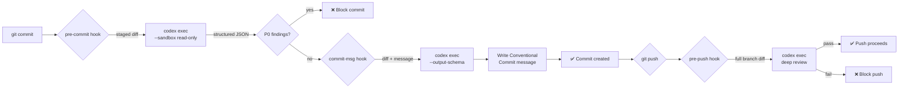

# Git Hooks Powered by Codex CLI: Pre-Commit Review, Commit Message Generation, and Pre-Push Validation


---

Git hooks are the last line of defence before code leaves your machine. Most teams wire them up to linters, formatters, and type-checkers — fast, deterministic tools that catch surface-level issues. But what about logic errors, security anti-patterns, or commit messages that say "fix stuff"? This is where `codex exec` transforms Git hooks from syntax police into semantic reviewers.

This article walks through three concrete Git hook implementations powered by Codex CLI's non-interactive mode: a **pre-commit** review gate, a **commit-msg** generator that enforces Conventional Commits, and a **pre-push** validation sweep. Each hook ships as a working script you can drop into any repository today.

## Why Use Codex CLI Inside Git Hooks?

Traditional linters catch what violates a rule. An LLM-powered hook catches what *looks wrong to a senior reviewer* — the kind of feedback that usually only surfaces in pull request review, hours or days later [^1]. Running `codex exec` inside a hook pulls that feedback forward to the moment of commit.

Key advantages:

- **Semantic analysis** — catches logic bugs, SQL injection, hardcoded secrets, and architectural violations that no linter rule covers [^2]
- **Structured output** — the `--output-schema` flag returns machine-parseable JSON, so your hook can make binary pass/fail decisions programmatically [^3]
- **Read-only safety** — `--sandbox read-only` ensures the hook never modifies your working tree [^4]
- **Speed control** — use `-c model=codex-spark` for sub-3-second hooks on small diffs, or `-c reasoning_effort=low` to keep latency tight [^5]



## Prerequisites

You need Codex CLI v0.122.0 or later (for `--ignore-user-config` isolation) and a valid `CODEX_API_KEY` or ChatGPT session [^6]. All examples use Bash and assume a Unix-like environment; Windows users should run these under WSL2.

```bash
# Verify codex is available
codex --version
# Should print 0.125.x or later
```

## Hook 1: Pre-Commit Semantic Review

This hook pipes the staged diff into `codex exec`, asks it to review for critical issues only, and blocks the commit if any P0 findings are returned.

### The JSON Schema

Create `.codex/schemas/pre-commit-review.json`:

```json
{
  "$schema": "https://json-schema.org/draft/2020-12/schema",
  "type": "object",
  "properties": {
    "findings": {
      "type": "array",
      "items": {
        "type": "object",
        "properties": {
          "priority": {
            "type": "integer",
            "minimum": 0,
            "maximum": 3,
            "description": "0=critical, 1=important, 2=suggestion, 3=nit"
          },
          "title": { "type": "string" },
          "file": { "type": "string" },
          "line": { "type": "integer" },
          "body": { "type": "string" }
        },
        "required": ["priority", "title", "file", "body"]
      }
    },
    "summary": { "type": "string" }
  },
  "required": ["findings", "summary"]
}
```

### The Hook Script

Create `.git/hooks/pre-commit` (or use Lefthook — covered below):

```bash
#!/usr/bin/env bash
set -euo pipefail

DIFF=$(git diff --cached --diff-algorithm=minimal)

# Skip if nothing staged or diff is trivial
if [ -z "$DIFF" ] || [ "$(echo "$DIFF" | wc -l)" -lt 5 ]; then
  exit 0
fi

SCHEMA="$(git rev-parse --show-toplevel)/.codex/schemas/pre-commit-review.json"

# Fall back gracefully if codex is not installed
if ! command -v codex &>/dev/null; then
  echo "⚠️  codex not found — skipping AI review"
  exit 0
fi

RESULT=$(echo "$DIFF" | codex exec \
  --sandbox read-only \
  --ephemeral \
  -c model=codex-spark \
  -c reasoning_effort=low \
  --output-schema "$SCHEMA" \
  -o /dev/stdout \
  "Review this staged diff. Report ONLY P0 (security, data loss, crash) and P1 (correctness) issues. Ignore style, naming, and formatting." \
  2>/dev/null) || {
    echo "⚠️  codex exec failed — allowing commit"
    exit 0
  }

# Parse findings with jq
P0_COUNT=$(echo "$RESULT" | jq '[.findings[] | select(.priority == 0)] | length')

if [ "$P0_COUNT" -gt 0 ]; then
  echo "❌ Codex found $P0_COUNT critical issue(s):"
  echo "$RESULT" | jq -r '.findings[] | select(.priority == 0) | "  \(.file): \(.title) — \(.body)"'
  exit 1
fi

P1_COUNT=$(echo "$RESULT" | jq '[.findings[] | select(.priority == 1)] | length')
if [ "$P1_COUNT" -gt 0 ]; then
  echo "⚠️  Codex flagged $P1_COUNT important issue(s) (non-blocking):"
  echo "$RESULT" | jq -r '.findings[] | select(.priority == 1) | "  \(.file): \(.title)"'
fi

exit 0
```

Make it executable: `chmod +x .git/hooks/pre-commit`.

### Key Design Decisions

| Decision | Rationale |
|----------|-----------|
| `codex-spark` model | Sub-2-second latency for typical diffs; adequate for pattern-matching security issues [^5] |
| `--ephemeral` | No session files persisted — hooks should be stateless [^3] |
| `--sandbox read-only` | Prevents the agent from modifying files during review [^4] |
| Graceful fallback on failure | A broken hook should never block a developer's workflow |
| P0-only blocking | Reduces false positive friction; P1 issues are informational |

## Hook 2: Commit Message Generation

A `commit-msg` hook that rewrites a placeholder message into a Conventional Commits [^7] format, using the staged diff as context.

Create `.git/hooks/commit-msg`:

```bash
#!/usr/bin/env bash
set -euo pipefail

MSG_FILE="$1"
CURRENT_MSG=$(cat "$MSG_FILE")

# Skip if message already looks like a conventional commit
if echo "$CURRENT_MSG" | grep -qE '^(feat|fix|docs|style|refactor|perf|test|build|ci|chore|revert)(\(.+\))?!?:'; then
  exit 0
fi

# Skip merge commits and fixup commits
if echo "$CURRENT_MSG" | grep -qE '^(Merge|fixup!|squash!|amend!)'; then
  exit 0
fi

if ! command -v codex &>/dev/null; then
  exit 0
fi

DIFF=$(git diff --cached --diff-algorithm=minimal)

GENERATED=$(echo "$DIFF" | codex exec \
  --sandbox read-only \
  --ephemeral \
  -c model=codex-spark \
  -c reasoning_effort=low \
  "Generate a Conventional Commits message for this diff.
Format: <type>(<scope>): <description>

<optional body>

Rules:
- type: feat|fix|docs|refactor|test|perf|build|ci|chore
- scope: the primary module or directory affected
- description: imperative mood, lowercase, no period, max 72 chars
- body: wrap at 72 chars, explain WHY not WHAT
- If the original message '$CURRENT_MSG' contains useful context, incorporate it
- Output ONLY the commit message, nothing else" \
  2>/dev/null) || {
    exit 0
  }

# Only overwrite if we got a non-empty result
if [ -n "$GENERATED" ] && [ "$(echo "$GENERATED" | wc -l)" -le 20 ]; then
  echo "$GENERATED" > "$MSG_FILE"
fi

exit 0
```

This hook is **non-blocking** — if `codex exec` fails or returns empty, the original message is preserved.

## Hook 3: Pre-Push Validation

The pre-push hook runs a deeper review across all commits being pushed, using the full-capability model. Because this runs less frequently and latency is more acceptable, we can afford a thorough analysis.

Create `.git/hooks/pre-push`:

```bash
#!/usr/bin/env bash
set -euo pipefail

REMOTE="$1"

# Read refs from stdin (git sends them)
while read -r LOCAL_REF LOCAL_SHA REMOTE_REF REMOTE_SHA; do
  # Skip deletions
  if [ "$LOCAL_SHA" = "0000000000000000000000000000000000000000" ]; then
    continue
  fi

  # Determine diff range
  if [ "$REMOTE_SHA" = "0000000000000000000000000000000000000000" ]; then
    # New branch — diff against main
    RANGE="origin/main...$LOCAL_SHA"
  else
    RANGE="$REMOTE_SHA...$LOCAL_SHA"
  fi

  DIFF=$(git diff "$RANGE" --diff-algorithm=minimal 2>/dev/null || true)

  if [ -z "$DIFF" ] || [ "$(echo "$DIFF" | wc -l)" -lt 10 ]; then
    continue
  fi

  if ! command -v codex &>/dev/null; then
    exit 0
  fi

  SCHEMA="$(git rev-parse --show-toplevel)/.codex/schemas/pre-commit-review.json"

  echo "🔍 Running Codex pre-push review on $(echo "$DIFF" | wc -l) lines..."

  RESULT=$(echo "$DIFF" | codex exec \
    --sandbox read-only \
    --ephemeral \
    -c reasoning_effort=medium \
    --output-schema "$SCHEMA" \
    -o /dev/stdout \
    "Deep review of all changes being pushed. Check for:
1. Security vulnerabilities (injection, auth bypass, secret exposure)
2. Data integrity risks (race conditions, missing transactions, unsafe deletes)
3. Breaking API changes without version bumps
4. Missing error handling on network/IO operations
Report only P0 and P1 issues." \
    2>/dev/null) || {
      echo "⚠️  Codex review failed — allowing push"
      exit 0
    }

  P0_COUNT=$(echo "$RESULT" | jq '[.findings[] | select(.priority == 0)] | length')

  if [ "$P0_COUNT" -gt 0 ]; then
    echo "❌ Codex blocked push — $P0_COUNT critical issue(s):"
    echo "$RESULT" | jq -r '.findings[] | select(.priority == 0) | "  \(.file):\(.line // "?") \(.title)\n    \(.body)\n"'
    echo "Fix these issues or use 'git push --no-verify' to bypass."
    exit 1
  fi
done

exit 0
```

## Integration with Lefthook

Raw `.git/hooks/` scripts are not version-controlled by default. **Lefthook** [^8] solves this with a single `lefthook.yml` that lives in your repository:

```yaml
# lefthook.yml
pre-commit:
  commands:
    codex-review:
      glob: "*.{ts,tsx,js,jsx,py,go,rs,rb,java,kt}"
      run: |
        git diff --cached --diff-algorithm=minimal | codex exec \
          --sandbox read-only --ephemeral \
          -c model=codex-spark -c reasoning_effort=low \
          --output-schema .codex/schemas/pre-commit-review.json \
          -o /dev/stdout \
          "Review staged diff. Report P0 issues only." 2>/dev/null \
        | jq -e '[.findings[] | select(.priority == 0)] | length == 0'
    lint:
      glob: "*.{ts,tsx}"
      run: npx eslint --max-warnings=0 {staged_files}
    format:
      glob: "*.{ts,tsx,json,md}"
      run: npx prettier --check {staged_files}

commit-msg:
  commands:
    conventional:
      run: |
        if ! grep -qE '^(feat|fix|docs|refactor|test|perf|build|ci|chore)' "$1"; then
          git diff --cached | codex exec --sandbox read-only --ephemeral \
            -c model=codex-spark "Generate conventional commit msg for this diff" \
            2>/dev/null > "$1" || true
        fi

pre-push:
  commands:
    codex-deep-review:
      run: |
        DIFF=$(git diff origin/main...HEAD)
        [ -z "$DIFF" ] && exit 0
        echo "$DIFF" | codex exec --sandbox read-only --ephemeral \
          -c reasoning_effort=medium \
          --output-schema .codex/schemas/pre-commit-review.json \
          -o /dev/stdout \
          "Deep security and correctness review." 2>/dev/null \
        | jq -e '[.findings[] | select(.priority == 0)] | length == 0'
```

Install with:

```bash
npm install --save-dev lefthook
npx lefthook install
```

Lefthook runs hooks in parallel, respects glob filters so only relevant files trigger the Codex review, and the configuration is committed alongside your code [^8].

## Preventing Agents from Bypassing Hooks

If you use Codex CLI *itself* for development, the agent might attempt `git commit --no-verify` to skip slow hooks. Block this with a Codex internal hook (distinct from Git hooks):

```toml
# .codex/config.toml
[features]
codex_hooks = true

[[hooks.PreToolUse]]
matcher = "^Bash$"

[[hooks.PreToolUse.hooks]]
type = "command"
command = 'node .codex/hooks/block-no-verify.mjs'
timeout = 5
statusMessage = "Checking for --no-verify bypass"
```

The blocking script (from Steve Kinney's self-testing agents course [^9]):

```javascript
// .codex/hooks/block-no-verify.mjs
import fs from 'node:fs';

const input = JSON.parse(fs.readFileSync(0, 'utf8'));
const command = input.tool_input?.command ?? '';

if (/(^|\s)--no-verify(\s|$)/.test(command)) {
  process.stdout.write(JSON.stringify({
    hookSpecificOutput: {
      hookEventName: 'PreToolUse',
      permissionDecision: 'deny',
      permissionDecisionReason:
        'Do not use --no-verify. Fix the failing hook instead.',
    },
  }));
}
process.exit(0);
```

Add the corresponding rule to your `AGENTS.md`:

```markdown
## Git Workflow Rules
- Never use `--no-verify` when committing or pushing
- If a Git hook fails, fix the underlying issue rather than bypassing the hook
- All commit messages must follow Conventional Commits format
```

## Performance Tuning

Hook latency is the primary adoption barrier. Here is a decision matrix:

| Hook | Target Latency | Model | Reasoning Effort | Notes |
|------|---------------|-------|-----------------|-------|
| pre-commit | < 3s | `codex-spark` | `low` | Only P0 findings; small staged diffs |
| commit-msg | < 2s | `codex-spark` | `low` | Single-shot generation, no schema |
| pre-push | < 15s | `gpt-5.4` or default | `medium` | Full branch diff; deeper analysis acceptable |

For monorepos with large diffs, truncate the input:

```bash
# Cap diff at 8000 lines to stay within token budget
DIFF=$(git diff --cached --diff-algorithm=minimal | head -8000)
```

Prompt caching [^10] helps when the same AGENTS.md and schema are used repeatedly — the stable prefix (system instructions + schema) gets cached server-side, reducing latency by up to 80% on subsequent runs.

## Cost Considerations

At current pricing (April 2026), `codex-spark` input tokens cost approximately \$0.15 per million [^5]. A typical staged diff of 200 lines (~2,000 tokens input) costs roughly **\$0.0003 per commit** — negligible even at high commit frequency. The pre-push hook with `gpt-5.4` costs more but runs far less frequently.

⚠️ Exact pricing depends on your plan tier and whether you are using API credits or a ChatGPT subscription. Check the [Codex pricing page](https://openai.com/codex/) for current rates.

## Troubleshooting

| Symptom | Cause | Fix |
|---------|-------|-----|
| Hook hangs indefinitely | Network timeout or auth failure | Add `timeout 30` wrapper; ensure `CODEX_API_KEY` is set |
| `codex: command not found` | Not on `$PATH` in hook context | Use full path: `$(npm root -g)/@openai/codex/bin/codex` |
| Empty JSON output | Diff too small for schema enforcement | Add minimum line-count guard before calling codex |
| False positives blocking commits | Model hallucinating issues | Restrict to P0 only; add `--ephemeral` to prevent context leakage |
| Slow pre-commit (>5s) | Large diff or wrong model | Switch to `codex-spark`; truncate diff; check prompt caching |

## Citations

[^1]: OpenAI, "Best practices — Codex," [https://developers.openai.com/codex/learn/best-practices](https://developers.openai.com/codex/learn/best-practices)
[^2]: OpenAI, "Codex CLI Automatic Code Review: PR Integration and Pre-Commit Workflows," [https://codex.danielvaughan.com/2026/03/27/codex-cli-code-review-pr-integration/](https://codex.danielvaughan.com/2026/03/27/codex-cli-code-review-pr-integration/)
[^3]: OpenAI, "Non-interactive mode — Codex," [https://developers.openai.com/codex/noninteractive](https://developers.openai.com/codex/noninteractive)
[^4]: OpenAI, "Command line options — Codex CLI," [https://developers.openai.com/codex/cli/reference](https://developers.openai.com/codex/cli/reference)
[^5]: OpenAI, "Codex CLI Speed Stack article — codex-spark model and pricing," [https://developers.openai.com/codex/changelog](https://developers.openai.com/codex/changelog)
[^6]: OpenAI, "Codex CLI — Getting Started," [https://developers.openai.com/codex/cli](https://developers.openai.com/codex/cli)
[^7]: Conventional Commits, "Specification v1.0.0," [https://www.conventionalcommits.org/en/v1.0.0/](https://www.conventionalcommits.org/en/v1.0.0/)
[^8]: Lefthook, "Git hooks manager," [https://github.com/evilmartians/lefthook](https://github.com/evilmartians/lefthook); Steve Kinney, "Git Hooks with Lefthook," [https://stevekinney.com/courses/self-testing-ai-agents/git-hooks-with-lefthook](https://stevekinney.com/courses/self-testing-ai-agents/git-hooks-with-lefthook)
[^9]: Steve Kinney, "Self-Testing AI Agents — Blocking --no-verify," [https://stevekinney.com/courses/self-testing-ai-agents/git-hooks-with-lefthook](https://stevekinney.com/courses/self-testing-ai-agents/git-hooks-with-lefthook)
[^10]: OpenAI, "Prompt Caching 201," [https://developers.openai.com/cookbook/examples/prompt_caching_201](https://developers.openai.com/cookbook/examples/prompt_caching_201)
