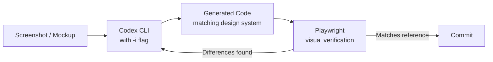
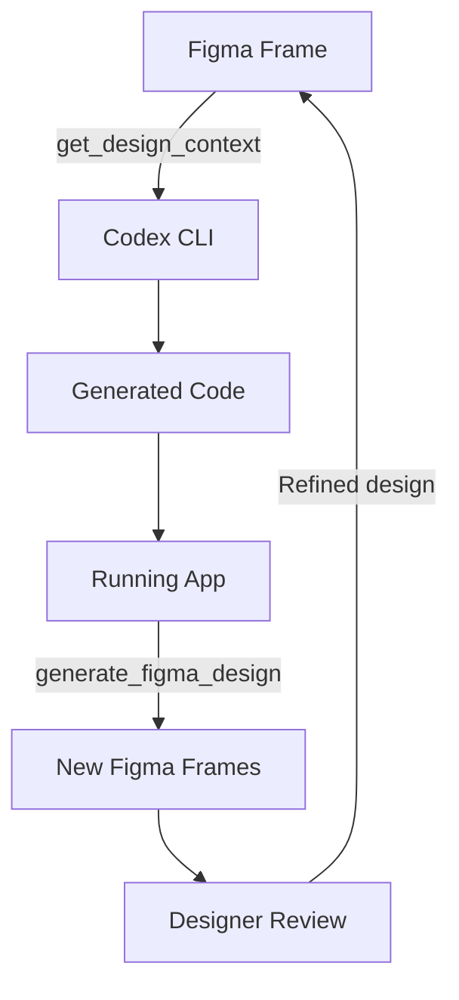

# Image generation in Codex CLI: gpt-image-2, the $imagegen skill, and visual development workflows


On 21 April 2026 OpenAI launched **gpt-image-2**, a purpose-built image generation model that replaced the earlier gpt-image-1.5 as Codex CLI's default[^2][^3]. Five weeks later, DALL-E 2 and DALL-E 3 were retired from the API entirely (12 May 2026)[^10]. Codex CLI's image story is now gpt-image-2 or nothing.

The earlier multimodal additions across v0.115 to v0.117 (March 2026) gave Codex CLI basic image input, attaching screenshots, inspecting visual output, and rudimentary generation[^1]. gpt-image-2 turned those features into something production-useful: a complete design-to-code-to-asset loop inside the terminal, backed by the built-in `$imagegen` skill, Figma MCP integration, and Playwright-based visual verification.

This article covers the architecture, configuration and practical workflows that make image generation useful for senior developers, not as a toy, but as a prototyping tool with real cost implications.

## What changed with gpt-image-2

gpt-image-1.5 capped at 1,536 x 1,024 resolution and lacked reasoning capabilities[^4]. gpt-image-2 closes several gaps:

| Capability | gpt-image-1.5 | gpt-image-2 |
|---|---|---|
| Maximum resolution | 1,536 x 1,024 | 2K stable, 4K in beta[^5][^10] |
| Text rendering accuracy | ~90 to 95 per cent | >99 per cent across Latin, CJK, Arabic[^2] |
| Reasoning mode | No | Yes (composition planning before rendering)[^2] |
| Aspect ratio flexibility | Limited | 3:1 to 1:3[^5] |
| Batch generation | Single | Up to 10 images per call[^4] |
| Inpainting/outpainting | Basic | Mask-based precision editing[^5] |
| Transparent background | Supported | Not supported (chroma-key workaround)[^11] |

The reasoning mode matters most for developer workflows. Before rendering, gpt-image-2 analyses the prompt, plans composition and reasons through layout constraints[^2]. For UI mockups and diagram generation, this translates to fewer iterations to reach a usable result.

**Resolution note:** 4K output (up to 3,840 x 2,160) is available through the API in beta. OpenAI flags anything above 2,560 x 1,440 as experimental[^10]. If stability matters, generate at 2K and upscale externally.

## The $imagegen skill

Codex CLI ships a built-in skill at `codex-rs/skills/src/assets/samples/imagegen/SKILL.md` that wraps image generation into a structured workflow[^6]. You invoke it in three ways:

```bash
# Explicit skill mention
codex "Create a dark-mode dashboard header banner $imagegen"

# Natural language (implicit skill selection)
codex "Generate a set of SVG-style icons for a settings page"

# Via the /skills command in interactive mode
/skills
# Select imagegen from the list
```

Generated images save to `$CODEX_HOME/generated_images/`, typically `~/.codex/generated_images/`. The skill instructs Codex to move project-bound assets into your workspace directory rather than leaving them at the default path[^6].

### Two modes

The `$imagegen` skill operates in two modes[^6]:

1. **Built-in tool (default).** Uses the native `image_gen` tool. No API key required. Preferred for normal generation, editing and simple transparent requests.
2. **CLI fallback.** Uses `scripts/image_gen.py`. Requires `OPENAI_API_KEY`. Offers `generate`, `edit` and `generate-batch` subcommands. Use when the built-in tool cannot meet your needs or you need fine-grained control over parameters.

The skill will never silently downgrade from gpt-image-2 to gpt-image-1.5. If a request needs the older model (typically for transparency), it asks first[^6].

### Transparent images: the chroma-key workaround

gpt-image-2 does not support `background=transparent`[^11]. The skill works around this with a two-step process[^6]:

1. Generate the image on a flat chroma-key background (default `#00ff00`, or `#ff00ff` for green subjects).
2. Run the bundled removal script:

```bash
python "${CODEX_HOME:-$HOME/.codex}/skills/.system/imagegen/scripts/remove_chroma_key.py" \
  --input source.png \
  --out final.png \
  --auto-key border \
  --soft-matte \
  --transparent-threshold 12 \
  --opaque-threshold 220 \
  --despill
```

This produces a proper alpha-channel PNG. The quality is good for prototyping and placeholder assets, though not pixel-perfect for production icon sets where you would still use a vector workflow.

### Cost awareness

Image generation turns consume Codex usage limits **three to five times faster** than equivalent text-only turns[^3]. For larger batches or CI pipelines, set `OPENAI_API_KEY` in your environment to switch to API pricing instead of consuming your ChatGPT plan allocation.

API pricing for gpt-image-2 is token-based[^5]:

| Input type | Rate per million tokens |
|---|---|
| Text input | \$5.00 |
| Image input | \$8.00 |
| Cached image input | \$2.00 |
| Output | \$30.00 |

Per-image estimates at common resolutions:

| Quality | 1,024 x 1,024 | 1,024 x 1,536 |
|---|---|---|
| Low | ~\$0.006 | ~\$0.017 |
| Medium | ~\$0.042 | ~\$0.063 |
| High | ~\$0.211 | ~\$0.165 |

Rate limits cap at 250 images per minute for standard accounts. New accounts start at five images per minute[^5].

## Image input: the other half of the loop

Image generation is useful only when paired with image *input*, feeding screenshots, mockups and design references back into Codex for comparison and iteration.

```bash
# Single image attachment
codex -i screenshot.png "Explain this layout and suggest improvements"

# Multiple images for comparison
codex --image current.png,reference.png "Compare these two layouts and list the differences"
```

Supported formats include PNG and JPEG[^3]. In interactive mode, paste or drag images into the terminal composer. Codex processes attached images at full resolution, enabling pixel-level analysis of UI discrepancies.

## Workflow 1: screenshot-to-code prototyping

The most practical workflow combines image input with code generation. OpenAI's official frontend design guide documents a three-phase approach[^7]:



**Phase 1: reference collection.** Gather desktop and mobile layouts, interaction states (hover, loading, empty, error) and edge cases. The references need not be polished Figma deliverables. Annotated screenshots work.

**Phase 2: design-system-aware generation.** Point Codex at your existing component library:

```bash
codex -i mockup-desktop.png -i mockup-mobile.png \
  "Implement this design using our existing Tailwind tokens in tailwind.config.ts \
   and the component primitives in src/components/ui/. \
   Make it responsive. Use the project's data-fetching patterns."
```

Codex reads your design tokens, existing components and routing conventions before generating code. This avoids the common failure mode where AI-generated UI creates a parallel styling system that drifts from the existing codebase[^7].

**Phase 3: visual verification with Playwright.** The Playwright skill opens the application in a real browser, screenshots the result at multiple viewport widths and compares against your reference images:

```bash
codex "Open the app at localhost:3000/dashboard, screenshot it at 1440px and 375px \
       widths, and compare with the reference mockups. List layout differences."
```

Iterate until the implementation matches. Each round costs one image-input turn plus one text turn, materially cheaper than manual back-and-forth with a separate design tool.

## Workflow 2: asset generation for frontend projects

For projects that need placeholder art, icons or illustrations, the `$imagegen` skill eliminates the Figma-to-export-to-commit cycle:

```bash
codex "$imagegen Generate a set of 6 monochrome line icons at 64x64: \
       home, settings, profile, notifications, search, logout. \
       White stroke on transparent background. 2px stroke width."
```

gpt-image-2 handles dense text rendering at greater than 99 per cent accuracy[^2], making it viable for generating labelled diagrams, annotated architecture visuals and placeholder marketing banners with real copy.

### Batch generation pattern

For larger asset sets, use `codex exec` to script generation without interactive mode:

```bash
codex exec "Generate the following icons as individual PNGs at 128x128, \
  save each to ./public/icons/<name>.png: \
  dashboard, analytics, users, billing, support, integrations"
```

Set `OPENAI_API_KEY` when running batch generation to avoid exhausting included plan limits[^3]. Note the 250 IPM rate limit; large batches may need pacing.

## Workflow 3: Figma round-trip with MCP

The Figma MCP server exposes two tools to Codex: `get_design_context` (design-to-code) and `generate_figma_design` (code-to-canvas)[^8]. Configure it in your MCP servers:

```json
// .codex/config.json
{
  "mcpServers": {
    "figma": {
      "type": "url",
      "url": "https://figma-mcp.example.com/mcp"
    }
  }
}
```

The round-trip workflow:



1. Copy a Figma frame URL and paste it into Codex: 'Implement this Figma design in code'.
2. Codex calls `get_design_context` to extract layout, styles and component structure[^8].
3. After implementation, ask Codex to capture the running app back into Figma for designer review.
4. Designers refine in Figma; the loop continues.

This eliminates the manual re-creation step that traditionally breaks the design-to-code feedback loop[^8]. Note that only clients listed in the Figma MCP Catalogue can connect to the Figma MCP Server; check the Figma developer documentation for access.

## Configuration reference

Key `config.toml` entries for image workflows:

```toml
# Disable image generation if not needed
[[skills.config]]
path = "imagegen"
enabled = false

# Configure Playwright for visual verification
# (add to .codex/config.json mcpServers instead)
```

```json
// .codex/config.json
{
  "mcpServers": {
    "playwright": {
      "command": "npx",
      "args": ["-y", "@anthropic-ai/playwright-mcp"]
    }
  }
}
```

To disable the `$imagegen` skill without deleting it, add the `[[skills.config]]` entry and restart Codex[^6].

## Limitations and caveats

**No transparent PNG from gpt-image-2.** The `background=transparent` parameter returns an error for gpt-image-2[^11]. Use the chroma-key workaround described above, or route transparency requests to gpt-image-1.5 (the skill asks before downgrading)[^6].

**Rate limits.** Standard accounts cap at 250 images per minute. New accounts start at five IPM[^5]. Batch generation workflows need pacing.

**Resolution stability.** 4K output is available in beta but results become variable above 2,560 x 1,440[^5][^10]. For production assets, generate at 2K and upscale externally.

**Cost multiplication.** Image turns consume plan limits three to five times faster than text[^3]. Teams running frequent visual iterations should budget accordingly or switch to API pricing.

**DALL-E 3 is gone.** Both DALL-E 2 and DALL-E 3 were deprecated on 12 May 2026[^10]. Any existing workflows that reference `dall-e-3` as a model ID will fail.

**CLI vs desktop app.** The Codex desktop app offers an in-app browser for direct visual annotation[^9]. The CLI workflow requires the Playwright MCP bridge for equivalent browser-based verification, functional but less fluid for purely visual iteration.

## When to use this

Image generation in Codex CLI is most valuable when:

- You need rapid UI prototypes from sketches or screenshots and want to stay in the terminal
- Your team generates placeholder assets (icons, banners, diagrams) as part of the development workflow
- You run a Figma round-trip process and want to automate the code-to-canvas step
- You need text-heavy generated images (diagrams, infographics) where gpt-image-2's greater than 99 per cent text accuracy matters

It is not a replacement for professional graphic design tools for brand-critical assets, nor for pixel-perfect production art at resolutions above 2K. For transparent PNGs, the chroma-key workaround works for prototyping but a vector workflow remains cleaner for production icon sets.

## Citations

[^1]: D. Vaughan, 'Working with Images in Codex CLI: Attaching, Inspecting and Generating Visual Assets,' *Codex Blog*, 28 March 2026. [https://codex.danielvaughan.com/2026/03/28/codex-cli-image-workflows/](https://codex.danielvaughan.com/2026/03/28/codex-cli-image-workflows/)

[^2]: OpenAI, 'Introducing gpt-image-2, available today in the API and Codex,' *OpenAI Developer Community*, 21 April 2026. [https://community.openai.com/t/introducing-gpt-image-2-available-today-in-the-api-and-codex/1379479](https://community.openai.com/t/introducing-gpt-image-2-available-today-in-the-api-and-codex/1379479)

[^3]: OpenAI, 'Features, Codex CLI,' *OpenAI Developers*, accessed 27 April 2026. [https://developers.openai.com/codex/cli/features](https://developers.openai.com/codex/cli/features)

[^4]: AI Free Forever, 'GPT-Image 2 vs GPT Image 1.5 full comparison 2026,' accessed 27 April 2026. [https://aifreeforever.com/blog/gpt-image-2-vs-gpt-image-1-5](https://aifreeforever.com/blog/gpt-image-2-vs-gpt-image-1-5)

[^5]: OpenAI, 'GPT Image 2 Model,' *OpenAI API Docs*, accessed 27 April 2026. [https://developers.openai.com/api/docs/models/gpt-image-2](https://developers.openai.com/api/docs/models/gpt-image-2)

[^6]: OpenAI, 'Agent Skills, Codex,' *OpenAI Developers*, accessed 27 April 2026. [https://developers.openai.com/codex/skills](https://developers.openai.com/codex/skills). See also the full skill source: [https://github.com/openai/codex/blob/main/codex-rs/skills/src/assets/samples/imagegen/SKILL.md](https://github.com/openai/codex/blob/main/codex-rs/skills/src/assets/samples/imagegen/SKILL.md)

[^7]: OpenAI, 'Build responsive front-end designs,' *Codex Use Cases*, accessed 27 April 2026. [https://developers.openai.com/codex/use-cases/frontend-designs](https://developers.openai.com/codex/use-cases/frontend-designs)

[^8]: OpenAI, 'Building Frontend UIs with Codex and Figma,' *OpenAI Developer Blog*, April 2026. [https://developers.openai.com/blog/building-frontend-uis-with-codex-and-figma](https://developers.openai.com/blog/building-frontend-uis-with-codex-and-figma). See also Figma MCP server documentation: [https://developers.figma.com/docs/figma-mcp-server/](https://developers.figma.com/docs/figma-mcp-server/)

[^9]: OpenAI, 'Codex for (almost) everything,' *OpenAI Blog*, 16 April 2026. [https://openai.com/index/codex-for-almost-everything/](https://openai.com/index/codex-for-almost-everything/)

[^10]: MindWired AI, 'GPT Image 2: Complete Guide, API Live, DALL-E 3 Retired, 4K Added,' updated May 2026. [https://mindwiredai.com/2026/04/22/what-is-gpt-image-2-the-complete-breakdown-features-pricing-and-who-gets-access/](https://mindwiredai.com/2026/04/22/what-is-gpt-image-2-the-complete-breakdown-features-pricing-and-who-gets-access/)

[^11]: Apiyi.com, 'In-depth test: GPT-Image-2 transparent background failure: alternatives and root causes,' 2026. [https://help.apiyi.com/en/gpt-image-2-transparent-background-not-supported-en.html](https://help.apiyi.com/en/gpt-image-2-transparent-background-not-supported-en.html)
