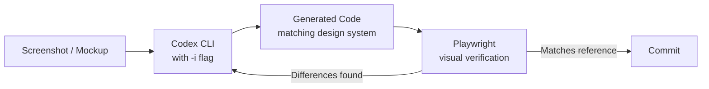
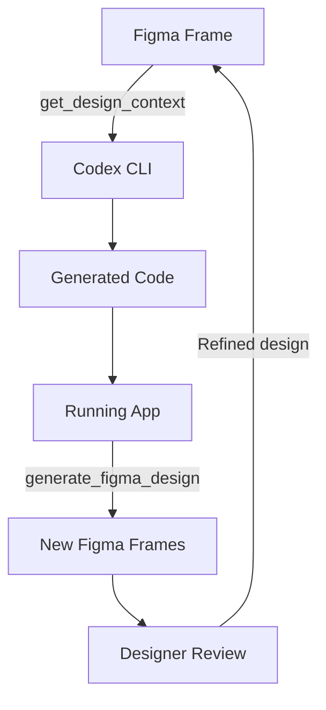

# Image Generation in Codex CLI: gpt-image-2, the $imagegen Skill, and Visual Development Workflows


---

Codex CLI started as a text-only terminal agent. The image capabilities that shipped across March 2026 (v0.115–v0.117) added basic multimodal input — attaching screenshots, inspecting visual output, and rudimentary image generation[^1]. The landscape changed materially on 21 April 2026 when OpenAI launched **gpt-image-2**, a purpose-built image generation model that now ships as Codex CLI's default[^2][^3]. Combined with the built-in `$imagegen` skill, Figma MCP integration, and Playwright-based visual verification, Codex CLI now supports a complete design-to-code-to-asset loop without leaving the terminal.

This article covers the architecture, configuration, and practical workflows that make image generation useful for senior developers — not as a toy, but as a production prototyping tool.

## What Changed: gpt-image-2 vs the Previous Pipeline

The earlier image generation in Codex CLI relied on gpt-image-1.5, which capped at 1536 × 1024 resolution and lacked reasoning capabilities[^4]. gpt-image-2 introduces several improvements relevant to developer workflows:

| Capability | gpt-image-1.5 | gpt-image-2 |
|---|---|---|
| Maximum resolution | 1536 × 1024 | 4K (2K stable)[^4] |
| Text rendering accuracy | ~90–95% | >99% across Latin, CJK, Arabic[^2] |
| Reasoning mode | No | Yes (O-series thinking)[^2] |
| Aspect ratio flexibility | Limited | 3:1 to 1:3[^5] |
| Batch generation | Single | Up to 10 images per call[^4] |
| Inpainting/outpainting | Basic | Mask-based precision editing[^5] |

The reasoning mode is the most consequential change for developer use. Before rendering, gpt-image-2 analyses the prompt's meaning, plans composition, and reasons through layout constraints[^2]. For UI mockups and diagram generation, this translates to significantly fewer iterations to reach a usable result.

## The $imagegen Skill

Codex CLI ships a built-in skill at `codex-rs/skills/src/assets/samples/imagegen/SKILL.md` that wraps image generation into a structured workflow[^6]. You invoke it in three ways:

```bash
# Explicit skill mention
codex "Create a dark-mode dashboard header banner $imagegen"

# Natural language (implicit skill selection)
codex "Generate a set of SVG-style icons for a settings page"

# Via the /skills command in interactive mode
/skills
# Select imagegen from the list
```

The skill instructs Codex to use the built-in `image_gen` tool by default[^6]. Generated images land in `$CODEX_HOME/generated_images/` — typically `~/.codex/generated_images/` — and can be moved to your project directory as a follow-up step.

### Cost Awareness

Image generation turns consume included Codex usage limits **3–5× faster** than equivalent text-only turns[^3]. For larger batches or CI pipelines, set `OPENAI_API_KEY` in your environment to switch to API pricing instead of consuming your ChatGPT plan allocation[^3].

API pricing for gpt-image-2 at the time of writing[^5]:

| Quality | 1024 × 1024 | 1024 × 1536 |
|---|---|---|
| Low | ~$0.011 | ~$0.017 |
| Medium | ~$0.042 | ~$0.063 |
| High | ~$0.211 | ~$0.165 |

## Image Input: The Other Half of the Loop

Image generation is only useful when paired with image *input* — feeding screenshots, mockups, and design references back into Codex for comparison and iteration.

```bash
# Single image attachment
codex -i screenshot.png "Explain this layout and suggest improvements"

# Multiple images for comparison
codex --image current.png,reference.png "Compare these two layouts and list the differences"
```

Supported formats include PNG and JPEG[^3]. In interactive mode, paste or drag images directly into the terminal composer. Codex processes attached images at full resolution, enabling pixel-level analysis of UI discrepancies.

## Workflow 1: Screenshot-to-Code Prototyping

The most immediately practical workflow combines image input with code generation. OpenAI's official frontend design use case documents a three-phase approach[^7]:



**Phase 1 — Reference collection.** Gather desktop and mobile layouts, interaction states (hover, loading, empty, error), and edge cases. The references need not be polished Figma deliverables — annotated screenshots suffice[^7].

**Phase 2 — Design-system-aware generation.** Point Codex at your existing component library:

```bash
codex -i mockup-desktop.png -i mockup-mobile.png \
  "Implement this design using our existing Tailwind tokens in tailwind.config.ts \
   and the component primitives in src/components/ui/. \
   Make it responsive. Use the project's data-fetching patterns."
```

Codex reads your design tokens, existing components, and routing conventions before generating code. This avoids the common failure mode where AI-generated UI creates a parallel styling system that drifts from the existing codebase[^7].

**Phase 3 — Visual verification with Playwright.** The Playwright skill opens the application in a real browser, screenshots the result at multiple viewport widths, and compares against your reference images:

```bash
codex "Open the app at localhost:3000/dashboard, screenshot it at 1440px and 375px \
       widths, and compare with the reference mockups. List layout differences."
```

Iterate until the implementation matches. Each round costs one image-input turn plus one text turn — materially cheaper than manual back-and-forth with a separate design tool.

## Workflow 2: Asset Generation for Frontend Projects

For projects that need placeholder art, icons, or illustrations, the `$imagegen` skill eliminates the Figma-to-export-to-commit cycle:

```bash
codex "$imagegen Generate a set of 6 monochrome line icons at 64x64: \
       home, settings, profile, notifications, search, logout. \
       White stroke on transparent background. 2px stroke width."
```

gpt-image-2 handles dense text rendering at >99% accuracy[^2], making it viable for generating labelled diagrams, annotated architecture visuals, and even placeholder marketing banners with real copy.

### Batch Generation Pattern

For larger asset sets, use `codex exec` to script generation:

```bash
codex exec "Generate the following icons as individual PNGs at 128x128, \
  save each to ./public/icons/<name>.png: \
  dashboard, analytics, users, billing, support, integrations" \
  --image-dir ./public/icons
```

Set `OPENAI_API_KEY` when running batch generation to avoid exhausting included plan limits[^3].

## Workflow 3: Figma Round-Trip with MCP

The Figma MCP server exposes two tools to Codex: `get_design_context` (design-to-code) and `generate_figma_design` (code-to-canvas)[^8]. Configure it in `~/.codex/config.toml`:

```toml
[mcp_servers.figma]
transport = "streamable_http"
url = "https://figma-mcp.example.com/mcp"
```

The round-trip workflow:



1. Copy a Figma frame URL and paste it into Codex: `"Implement this Figma design in code"`.
2. Codex calls `get_design_context` to extract layout, styles, and component structure[^8].
3. After implementation, ask Codex to capture the running app back into Figma for designer review.
4. Designers refine in Figma; the loop continues.

This eliminates the manual re-creation step that traditionally breaks the design-to-code feedback loop[^8].

## Configuration Reference

Key `config.toml` entries for image workflows:

```toml
# Disable image generation entirely if not needed
[[skills.config]]
path = "imagegen"
enabled = false

# Switch to API pricing for image generation
# (set OPENAI_API_KEY in environment instead)

# Configure Playwright for visual verification
[mcp_servers.playwright]
command = "npx"
args = ["-y", "@anthropic-ai/playwright-mcp"]
```

To disable the imagegen skill without deleting it, add the `[[skills.config]]` entry and restart Codex[^6].

## Limitations and Caveats

**Rate limits.** gpt-image-2 is capped at 250 images per minute (IPM) on the API, significantly lower than text model throughput[^5]. Batch generation workflows need pacing.

**Resolution stability.** Outputs above 2560 × 1440 (2K) are supported but results become more variable[^5]. For production assets, generate at 2K and upscale externally if 4K is required.

**Cost multiplication.** Image turns consume plan limits 3–5× faster than text[^3]. Teams running frequent visual iterations should budget accordingly or switch to API pricing.

**No transparent PNG from gpt-image-2.** Transparent background support remains exclusive to gpt-image-1.5[^4]. If you need transparent PNGs (e.g. for icon overlays), you will need to configure the older model or post-process with background removal.

**Codex CLI vs Codex App.** The desktop app offers an in-app browser for direct visual annotation[^9]. The CLI workflow requires the Playwright MCP bridge for equivalent browser-based verification — functional but less fluid for purely visual iteration.

## When to Use This

Image generation in Codex CLI is most valuable when:

- You need rapid UI prototypes from sketches or screenshots and want to stay in the terminal
- Your team generates placeholder assets (icons, banners, diagrams) as part of the development workflow
- You run a Figma round-trip process and want to automate the code-to-canvas step
- You need text-heavy generated images (diagrams, infographics) where gpt-image-2's >99% text accuracy matters

It is *not* a replacement for professional graphic design tools for brand-critical assets, nor for pixel-perfect production art at resolutions above 2K.

## Citations

[^1]: D. Vaughan, "Working with Images in Codex CLI: Attaching, Inspecting and Generating Visual Assets," *Codex Blog*, 28 March 2026. [https://codex.danielvaughan.com/2026/03/28/codex-cli-image-workflows/](https://codex.danielvaughan.com/2026/03/28/codex-cli-image-workflows/)

[^2]: OpenAI, "Introducing gpt-image-2 — available today in the API and Codex," *OpenAI Developer Community*, 21 April 2026. [https://community.openai.com/t/introducing-gpt-image-2-available-today-in-the-api-and-codex/1379479](https://community.openai.com/t/introducing-gpt-image-2-available-today-in-the-api-and-codex/1379479)

[^3]: OpenAI, "Features — Codex CLI," *OpenAI Developers*, accessed 27 April 2026. [https://developers.openai.com/codex/cli/features](https://developers.openai.com/codex/cli/features)

[^4]: AI Free Forever, "GPT-Image 2 vs GPT Image 1.5 full comparison 2026," accessed 27 April 2026. [https://aifreeforever.com/blog/gpt-image-2-vs-gpt-image-1-5](https://aifreeforever.com/blog/gpt-image-2-vs-gpt-image-1-5)

[^5]: OpenAI, "GPT Image 2 Model," *OpenAI API Docs*, accessed 27 April 2026. [https://developers.openai.com/api/docs/models/gpt-image-2](https://developers.openai.com/api/docs/models/gpt-image-2)

[^6]: OpenAI, "Agent Skills — Codex," *OpenAI Developers*, accessed 27 April 2026. [https://developers.openai.com/codex/skills](https://developers.openai.com/codex/skills)

[^7]: OpenAI, "Build responsive front-end designs," *Codex Use Cases*, accessed 27 April 2026. [https://developers.openai.com/codex/use-cases/frontend-designs](https://developers.openai.com/codex/use-cases/frontend-designs)

[^8]: OpenAI, "Building Frontend UIs with Codex and Figma," *OpenAI Developer Blog*, April 2026. [https://developers.openai.com/blog/building-frontend-uis-with-codex-and-figma](https://developers.openai.com/blog/building-frontend-uis-with-codex-and-figma)

[^9]: OpenAI, "Codex for (almost) everything," *OpenAI Blog*, 16 April 2026. [https://openai.com/index/codex-for-almost-everything/](https://openai.com/index/codex-for-almost-everything/)
