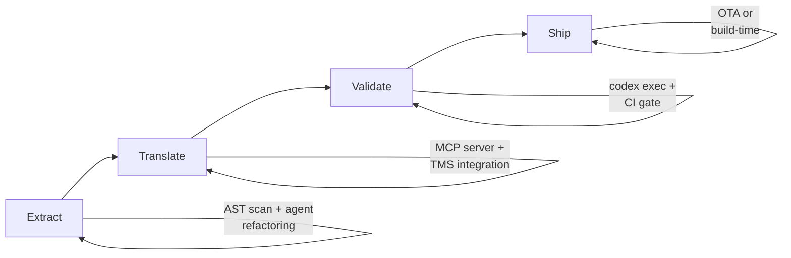
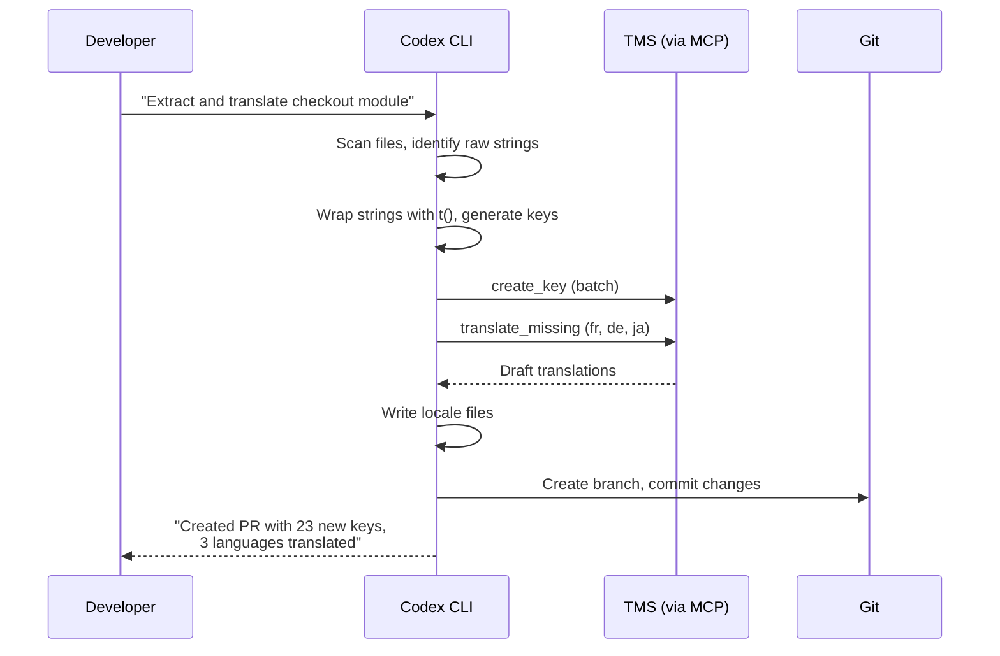

# Codex CLI for Internationalization: Automated String Extraction, Translation MCP Servers, and i18n Workflow Patterns


---

Internationalisation remains one of the most tedious yet business-critical engineering tasks. Hard-coded strings slip through reviews, translation files drift out of sync, and coverage gaps surface only when a Japanese customer files a bug. In 2026, the convergence of coding agents, MCP-based translation management, and AST-driven string extraction finally makes it possible to automate the entire i18n pipeline — from string discovery to translated pull request — using Codex CLI[^1].

This article covers how to wire Codex CLI into a practical i18n workflow: extracting untranslated strings, connecting to translation management systems via MCP, batching translations with `codex exec`, and enforcing coverage in CI.

---

## The i18n Problem Space for Coding Agents

Internationalisation work decomposes into four distinct phases, each suited to different levels of agent automation:



| Phase | Manual effort (traditional) | Agent-assisted effort |
|-------|---------------------------|----------------------|
| **Extract** — find hard-coded strings, wrap in `t()` | Hours per module | Minutes with guided refactoring |
| **Translate** — produce locale files | Days (external vendor) | Seconds for draft + human review |
| **Validate** — check coverage, plurals, interpolation | Manual spot-checks | Automated CI gate |
| **Ship** — deploy translations | Build pipeline | OTA or build pipeline (unchanged) |

The key insight is that Codex CLI handles Phases 1 and 3 particularly well — code transformation and validation — whilst MCP servers bridge Phase 2 by connecting directly to translation management platforms[^2].

---

## Phase 1: Automated String Extraction and Wrapping

### The AGENTS.md i18n Policy

Before extracting strings, encode your i18n conventions in `AGENTS.md` so every Codex session follows the same rules:


```markdown
## i18n Policy

- All user-facing strings MUST use the `t()` function from `react-i18next`
- Translation keys follow dot-notation: `<feature>.<component>.<element>`
  - Example: `checkout.summary.totalLabel`
- Default values go in `public/locales/en/translation.json`
- Never hard-code strings in JSX — always wrap with `t()` or `<Trans>`
- Plurals use i18next plural suffixes: `_one`, `_other`, `_zero`
- Interpolation uses `{{variable}}` syntax, never template literals
- ICU MessageFormat is NOT used — stick to i18next native syntax
- Run `npx i18next-parser` after any string changes
```


### Interactive String Extraction

For a focused extraction session, prompt Codex with a specific module:


```
Scan src/features/checkout/ for any hard-coded user-facing strings
(JSX text content, placeholder attributes, aria-labels, error messages,
toast notifications). For each string found:
1. Wrap it with t() using our key convention
2. Add the English default to public/locales/en/translation.json
3. Preserve any dynamic values as {{interpolation}} parameters
Do NOT touch strings that are already wrapped in t() or <Trans>.
```


Codex reads the files, identifies raw strings using its understanding of JSX structure, and produces diffs that wrap each string whilst maintaining the component's behaviour[^3].

### Batch Extraction with `codex exec`

For repository-wide extraction across many modules, use `codex exec` with `--output-schema` to first produce a structured audit:

```bash
codex exec \
  --profile fast \
  --sandbox read-only \
  --output-schema i18n-audit-schema.json \
  "Scan all .tsx and .jsx files under src/ for hard-coded user-facing
   strings that are not wrapped in t() or <Trans>. For each string,
   report the file path, line number, the raw string, and a suggested
   translation key following our AGENTS.md convention." \
  -o i18n-audit.json
```

Where `i18n-audit-schema.json` defines the expected output:

```json
{
  "type": "object",
  "properties": {
    "total_files_scanned": { "type": "integer" },
    "total_unwrapped_strings": { "type": "integer" },
    "findings": {
      "type": "array",
      "items": {
        "type": "object",
        "properties": {
          "file": { "type": "string" },
          "line": { "type": "integer" },
          "raw_string": { "type": "string" },
          "suggested_key": { "type": "string" },
          "context": { "type": "string" }
        },
        "required": ["file", "line", "raw_string", "suggested_key"]
      }
    }
  },
  "required": ["total_files_scanned", "total_unwrapped_strings", "findings"]
}
```

This produces a machine-readable audit that downstream scripts can consume — for instance, to open a tracking issue per module or to feed into Phase 2[^4].

---

## Phase 2: Translation via MCP Servers

### Better i18n MCP Server

The Better i18n MCP server connects Codex CLI directly to a translation management system, enabling the agent to create keys, check translation status, and trigger translations without leaving the terminal[^5].

**Installation:**

```bash
codex mcp add better-i18n \
  --env BETTER_I18N_API_KEY=your-api-key \
  -- npx -y @better-i18n/mcp@latest
```

Or configure manually in `~/.codex/config.toml`:

```toml
[mcp_servers.better-i18n]
command = "npx"
args = ["-y", "@better-i18n/mcp@latest"]

[mcp_servers.better-i18n.env]
BETTER_I18N_API_KEY = "${BETTER_I18N_API_KEY}"
```

Once connected, Codex can query project translation status, create new keys, and check coverage — all through natural language:

```
Show me the translation status for the checkout feature.
Which languages are below 90% coverage?
```

### IntlPull MCP Server

IntlPull offers a more comprehensive tool surface with 15+ operations covering the full translation lifecycle[^6]:

```bash
npm install -g @intlpullhq/mcp-server
```

```toml
[mcp_servers.intlpull]
command = "npx"
args = ["-y", "@intlpullhq/mcp-server"]

[mcp_servers.intlpull.env]
INTLPULL_API_KEY = "${INTLPULL_API_KEY}"
```

Key operations available through the MCP server:

| Category | Operations |
|----------|-----------|
| **Key management** | `list_keys`, `create_key`, `update_key`, `delete_key`, `search_keys` |
| **Translation** | `get_translations`, `update_translation`, `translate_missing`, `bulk_translate` |
| **Status** | `get_status`, `get_missing`, `get_needs_review` |
| **Translation memory** | `search_tm`, `add_to_tm` |

### The dalisys i18n MCP Server

For teams preferring a lightweight, self-hosted option, the dalisys i18n MCP server works directly with local JSON/YAML translation files without requiring a cloud TMS[^7]:

```toml
[mcp_servers.i18n]
command = "npx"
args = ["-y", "@dalisys/i18n-mcp"]
```

This is particularly useful for smaller projects or teams that manage translations in-repo rather than through an external platform.

---

## Phase 3: Translation Workflow Patterns

### Pattern 1: Extract-Translate-PR (Interactive)

The simplest workflow runs in a single Codex session:



### Pattern 2: Headless CI Translation Audit

Run a nightly `codex exec` job that detects translation drift and opens issues:


```yaml
# .github/workflows/i18n-audit.yml
name: i18n Coverage Audit
on:
  schedule:
    - cron: '0 6 * * 1'  # Monday 06:00 UTC
  workflow_dispatch:

jobs:
  audit:
    runs-on: ubuntu-latest
    steps:
      - uses: actions/checkout@v4
      - uses: openai/codex-action@v1
        with:
          codex-args: |
            exec --sandbox read-only --profile ci
            "Audit i18n coverage: check all locale files under
             public/locales/ against the English source.
             Report missing keys per language, unused keys,
             and keys with mismatched interpolation variables.
             Format as a markdown table."
          safety-strategy: drop-sudo
        env:
          OPENAI_API_KEY: ${{ secrets.OPENAI_API_KEY }}
```


### Pattern 3: Pre-Release Translation Gate

Add a `post_tool_use` hook that validates i18n coverage whenever files change:

```toml
[[hooks]]
event = "post_tool_use"
tool_name = "apply_patch"
command = """
#!/bin/bash
CHANGED=$(echo "$CODEX_TOOL_INPUT" | grep -c '\.tsx\|\.jsx\|\.ts')
if [ "$CHANGED" -gt 0 ]; then
  npx i18next-parser --fail-on-update 2>&1 | tail -5
fi
"""
timeout_ms = 15000
```

This hook runs `i18next-parser` after every code edit, catching any new hard-coded strings before they reach a commit[^8].

---

## Phase 4: Framework-Specific Patterns

### React with react-i18next

The most common i18n library for React projects, react-i18next has 3.5 million weekly npm downloads[^9]. Configure your AGENTS.md with framework-specific guidance:

```markdown
## react-i18next Conventions

- Import: `import { useTranslation } from 'react-i18next'`
- Hook pattern: `const { t } = useTranslation('namespace')`
- Component pattern: `<Trans i18nKey="key">fallback</Trans>`
- Namespace per feature: checkout, profile, settings, common
- Locale files: `public/locales/{lang}/{namespace}.json`
```

### Next.js with next-intl

For Next.js App Router projects, next-intl provides native Server Component support with a ~2 KB bundle[^10]:

```markdown
## next-intl Conventions

- Import: `import { useTranslations } from 'next-intl'`
- Server components: `const t = await getTranslations('namespace')`
- Messages directory: `messages/{locale}.json`
- Middleware handles locale detection and routing
- Use `{variable}` interpolation syntax (ICU-like)
```

### Backend Services (Node.js/Python)

For API error messages and server-rendered content:

```markdown
## Backend i18n Conventions

- Node.js: use `i18next` with `i18next-fs-backend`
- Python: use `gettext` with `.po/.mo` files
- Error codes map to translation keys: `errors.{code}`
- API responses include `message_key` for client-side translation
```

---

## Config Profile for i18n Work

Create a dedicated profile that enables the translation MCP server and sets appropriate permissions:

```toml
[profiles.i18n]
model = "gpt-5.5"
model_reasoning_effort = "medium"
approval_policy = "on-request"

[profiles.i18n.sandbox_workspace_write]
network_access = true  # Required for TMS API calls

[profiles.i18n.mcp_servers.better-i18n]
command = "npx"
args = ["-y", "@better-i18n/mcp@latest"]
env = { BETTER_I18N_API_KEY = "${BETTER_I18N_API_KEY}" }
```

Invoke with:

```bash
codex --profile i18n "Extract and translate all strings in src/features/onboarding/"
```

---

## Model Selection for i18n Tasks

| Task | Recommended model | Reasoning effort | Rationale |
|------|------------------|-----------------|-----------|
| String extraction and wrapping | GPT-5.5 | medium | Needs code understanding + refactoring |
| Translation key naming | GPT-5.5 | low | Convention-following, not complex reasoning |
| Draft translation generation | GPT-5.5 | medium | Needs cultural and contextual awareness |
| Translation validation | GPT-5.3-Codex-Spark | low | Pattern matching, fast turnaround |
| i18n audit (batch) | GPT-5.3-Codex-Spark | low | Read-only scanning, cost-sensitive |

GPT-5.5's million-token context window is particularly useful for i18n work across large codebases, as it can hold the entire locale file set in context alongside the source code being refactored[^11].

---

## Common Pitfalls

| Pitfall | Symptom | Fix |
|---------|---------|-----|
| **Agent translates directly** instead of using TMS | Translations in code but not in TMS | Encode "always use the MCP server for translations" in AGENTS.md |
| **Key naming inconsistency** | `btnSubmit` vs `submit_button` vs `checkout.submitBtn` | Provide explicit examples in AGENTS.md; use a linter |
| **Interpolation mismatch** | `Hello {{name}}` in English, `Bonjour {name}` in French | Validate with `codex exec` that all interpolation variables match across locales |
| **Plural form gaps** | Works in English, crashes in Arabic (6 plural forms) | Include plural rules in AGENTS.md; test with `i18next-parser --fail-on-update` |
| **Context loss in batch translation** | "Spring" translated as season not software release | Pass component context to the translation prompt; use translation memory |
| **Stale keys accumulate** | Locale files grow indefinitely | Run periodic unused-key audits via `codex exec --sandbox read-only` |

---

## Measuring i18n Health

Use `codex exec` with `--output-schema` to produce a structured health report:

```bash
codex exec --profile fast --sandbox read-only \
  --output-schema i18n-health-schema.json \
  "Analyse i18n health for this repository:
   1. Count total keys per namespace
   2. Calculate coverage percentage per language
   3. Find unused keys (defined but never referenced in source)
   4. Find missing plural forms
   5. Detect interpolation variable mismatches across locales" \
  -o i18n-health.json
```

This report can feed into a dashboard or trigger alerts when coverage drops below a threshold — a practical application of the structured output pattern documented in the Codex CLI non-interactive mode guide[^12].

---

## Limitations and Caveats

- **Translation quality**: Agent-generated translations are drafts, not production-ready. Always route through human review or a professional TMS for customer-facing content[^13]. ⚠️
- **MCP server maturity**: The i18n MCP server ecosystem is still maturing. Better i18n and IntlPull are the most established options as of April 2026, but expect API changes[^5][^6]. ⚠️
- **Cultural nuance**: Codex can handle straightforward translations well but struggles with idiomatic expressions, humour, and culturally sensitive content. Flag these for human translators.
- **Right-to-left (RTL) layouts**: String extraction and translation are only half the story. RTL layout adjustments still require manual CSS review and visual verification.
- **ICU MessageFormat complexity**: Deeply nested ICU messages with selectors and nested plurals can confuse the agent. Keep message complexity low or use explicit examples in AGENTS.md.

---

## Citations

[^1]: [OpenAI Codex CLI Features Documentation](https://developers.openai.com/codex/cli/features) — Official feature reference for Codex CLI capabilities including MCP integration and codex exec.

[^2]: [MCP Model Context Protocol for Translation 2026: i18n Automation Guide](https://intlpull.com/blog/mcp-model-context-protocol-i18n-guide-2026) — IntlPull's comprehensive guide to using MCP for translation management automation.

[^3]: [OpenAI Codex Best Practices](https://developers.openai.com/codex/learn/best-practices) — Official best practices for structuring Codex prompts and using AGENTS.md for durable guidance.

[^4]: [OpenAI Codex Non-Interactive Mode Documentation](https://developers.openai.com/codex/noninteractive) — Official reference for `codex exec` with `--output-schema` structured output.

[^5]: [Better i18n MCP Server — Getting Started](https://docs.better-i18n.com/mcp/getting-started) — Installation and configuration guide for the Better i18n MCP server with Codex CLI.

[^6]: [IntlPull MCP Server Documentation](https://intlpull.com/blog/mcp-model-context-protocol-i18n-guide-2026) — IntlPull's MCP server with 15+ translation management operations.

[^7]: [dalisys i18n MCP Server](https://lobehub.com/mcp/dalisys-i18n-mcp) — Lightweight, self-hosted i18n MCP server for local JSON/YAML translation files.

[^8]: [OpenAI Codex Hooks Documentation](https://developers.openai.com/codex/cli/features) — PostToolUse hooks for automated validation after code changes.

[^9]: [react-i18next GitHub Repository](https://github.com/i18next/react-i18next) — The most popular React internationalisation library with 3.5M+ weekly npm downloads.

[^10]: [next-intl Complete Guide 2026](https://intlpull.com/blog/next-intl-complete-guide-2026) — Definitive guide to next-intl for Next.js App Router with Server Component support.

[^11]: [OpenAI GPT-5.5 Announcement](https://openai.com/index/introducing-upgrades-to-codex/) — GPT-5.5 model capabilities including the million-token context window.

[^12]: [OpenAI Codex GitHub Action](https://developers.openai.com/codex/github-action) — Official `codex-action@v1` for running Codex in CI/CD workflows.

[^13]: [AI Localization: Automating Content Workflows in 2026 — Crowdin](https://crowdin.com/blog/ai-localization) — Industry perspective on AI translation quality and human-in-the-loop review requirements.
